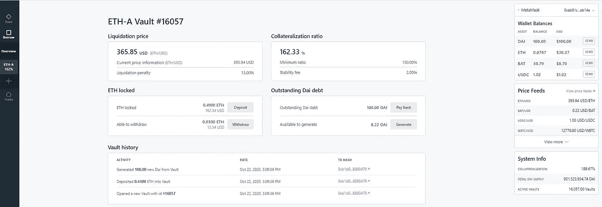
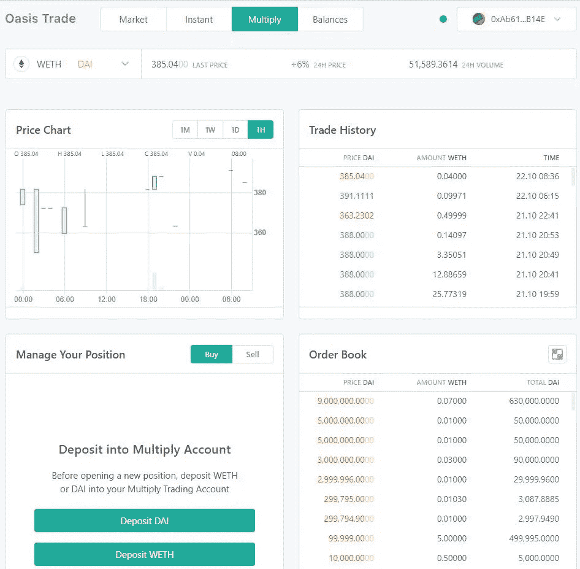

# 如何使用 MakerDAO 借款

> 原文：<https://medium.com/coinmonks/how-to-borrow-using-makerdao-22a7329dbc1a?source=collection_archive---------1----------------------->

*出票人协议允许用户通过将抵押品存入出票人金库来生成 DAI。在本文中，我们将解释如何通过存放抵押品来创建 Maker Vaults 和生成 DAI。*

MakerDAO 是一个基于以太坊的去中心化组织，允许用户在没有第三方参与的情况下借出和借入加密货币。

MakerDAO 平台支持两种本地货币:

*   【戴】——稳定的、软钉住美元的货币。
*   **MKR** —治理令牌。

MakerDAO 社区管理 Maker 协议。该协议由一组智能合同组成，允许用户通过使用附属资产来生成 DAI。该协议由持有 MKR 平台治理令牌的用户管理。机构群体还监控 DAI 的不同风险参数，以确保其稳定性和透明度。

用户可以通过在 Maker 保管库中存放抵押品来生成 DAI。生成的 DAI 可用于其他加密交易。

**绿洲 App**

Oasis 接口支持 MakerDao 借入和借出特性。Oasis 应用程序允许用户与 Maker 协议进行交互。该应用程序提供了三个主要功能:

*   **交易—** 支持通过交易所生成或买入的代币交易。
*   **借—** 允许用户通过将担保品存入票据库来生成 DAI。
*   **节省—** 帮助用户在锁定戴进入时获得节省

**借**

在本文中，我们将主要关注 Oasis 应用程序支持的 MakerDAO borrow 特性。

进入绿洲[页面](https://oasis.app/)。

点击借书，它会将你重定向到 Oasis 界面中的 MakerDAO 借书[页面](https://oasis.app/borrow)。

Oasis 支持多个钱包，包括 Ledger 和 Trezor 这样的硬件钱包。根据您的需求选择。

连接您的 MetaMask 钱包。

您的 Oasis 登录页面如下所示。

**打开金库**

首先，用户将打开一个保险库。它包括几个步骤。

**选择担保品**

一旦您点击**开始**，它将显示担保品类型列表以及各种参数，如稳定费、流动性比率、流动性费用、您的可用余额以及该特定担保品类型可用的 DAI 余额。

我们选择了 ETH-A。

**金库管理**

点击**设置**并在 MetaMask 中确认保险库创建交易。

**生成戴**

一旦保险库创建批准完成，您现在可以选择您想要提供多少抵押品(在我们的例子中是 ETH)来生成 DAI。

**重要** : MakerDao 允许我们生成最少 100 DAI。

该应用程序向您显示了使用给定的 ETH 可以生成的 DAI 的最大数量。你也可以检查你的抵押率。(始终努力保持你的抵押率高于阈值，即在 MakerDAO 高于 150%的情况下。)建议不要生成应用程序显示的最大 DAI 金额，否则，您的金库将面临清算风险。

**重要提示:**清算比率是用户为防止清算而需要维护的每个金库的 DAI 对 ETH 的抵押比率。Maker protocol 的 Oracle 跟踪担保品价格，并在比率超过阈值时通知系统，并使金库可用于清算。

**确认**

提供创建保险库所需的所有详细信息后，点击**打开保险库**按钮。

您现在将会收到这样的确认消息。

**用户保险库**

您的保管库已创建。你可以看到保险库的详细信息，如保险库 ID、你的抵押率、DAI 余额、存款 ETH 等。)从**概述**选项卡。

从 **ETH-A** 选项卡**中可以看到更详细的保险库属性视图。**

**查看戴在 MetaMask 钱包里的**

您将在 MetaMask 钱包中收到生成的 DAI。

**贸易**

Oasis 交易选项为用户提供了交易代币的灵活性，交易范围从简单的掉期交易到市场交易。用户需要在开始任何交易活动之前解锁这些令牌。

**市场**

Oasis Market 选项卡包含各种与交易相关的详细信息，如订单簿、价格图表、交易历史等。您可以在此创建买入/卖出限价单。

用户需要选择交易类型，即购买或出售，以及他们想要交易的令牌。提交订单请求。查看页面底部的订单历史记录。

**瞬间**

通过此选项，您可以轻松地购买/出售代币，而无需提供太多详细信息。您只需要填写输入令牌类型、输入令牌值和输出令牌，然后应用程序会自动计算输出令牌的值。

点击**开始交易**并在 MetaMask 中确认交易。一旦交易成功，您将在钱包中看到令牌。

**乘**

用乘，用 ETH 作抵押借戴。使用生成的 DAI 购买更多的 ETH，以此类推，创造高达 2 倍的倍数。通过这种方式，它允许用户创建多头倍增头寸，而无需从交易对手处借入资金。

**余额**

用户可以通过“余额”选项卡解锁令牌。在使用任何令牌之前，每个令牌都需要解锁。解锁过程将触发 MetaMask 中的交易，确认后，您将能够使用令牌。

**偿还债务**

用户可以检查他们的未偿债务，并轻松偿还。

请注意，您的戴债务将永远大于未偿债务。

批准元掩码中的交易记录。现在你可以在你的金库里查看**零未偿债务**。

**撤回 ETH**

偿还债务后提取锁定的 ETH。

只需点击**取款**按钮，填写您想要提取的金额并确认您的交易。

你的 MetaMask 钱包现在会有 ETH 金额。

**结论**

Maker 是首批获得广泛采用的分散财务(Defi)应用程序之一。戴是最受欢迎的分散稳定的硬币。该项目多年来赢得了信任，并产生了显著的 TVL。然而，随着 Synthetix 和 Linear Finance 等竞争对手的引入，MakerDAO 手头的任务是在未来几天跟上潮流。

**来源:**马克尔道官方[网站](https://makerdao.com/)

***注:*** *本帖首发* [*这里*](https://www.altcoinbuzz.io/bitcoin-and-crypto-guide/exploring-the-borrow-feature-of-makerdao/) *上*[***altcoinbuzz . io***](http://www.altcoinbuzz.io/)*。*

**通过我的推荐加入**

[Crypto.com](https://binance.com/en/register?ref=E8PCD3AF)——[币安](https://platinum.crypto.com/r/sut3pd9bzn)

**跟我来**

**👉** [推特](https://twitter.com/rumadas123)

**👉**[**Linkedin**](https://www.linkedin.com/in/ruma-das-a1439320/)