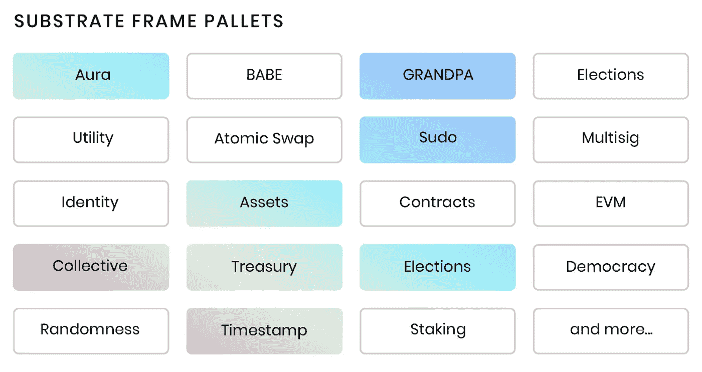
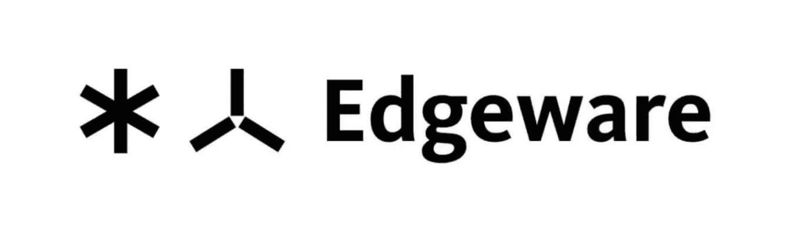

# 如何快速建造一个区块链

> 原文：<https://medium.com/coinmonks/how-to-build-a-blockchain-rapidly-e12bccc46a93?source=collection_archive---------3----------------------->

## **简短、非技术性的基板介绍**

Substrate, by Parity Technologies

# **什么是基质，它是如何形成的？**

奇偶校验(由加文·伍德创建的 Substrate 背后的公司)在建设区块链方面有着丰富的经验。作为一个例子，奇偶校验在实现波尔卡多区块链上发挥了作用。

和大多数事情一样，当你多次做一件事情的时候，你会发现你所做的事情的不同迭代之间的相似之处。你会发现构建它们更容易、更有效的方法——批处理、自动化等等。

有了代码，如果你在重复构建区块链，你会发现区块链的某些部分变化很小，它们从区块链到区块链不断重复。(即共识算法、数据库等。).这可以从过去(大约 2019 年及之前)的多个项目中看出，开发人员会复制粘贴一些代码，在某些情况下，会分叉现有的链，对代码进行微小的更改，以满足他们的需求。这是一个解决方案，但是正如您所想象的，这不是一个好主意，因为您仍然需要花费时间和资源来理解代码以及它如何与所编写的其他区块链交互。

因此，当奇偶性团队在建造波尔卡多特时，他们意识到这一点，并决定区块链某些部分的可重复性可以成为未来创作的模板或模型。因此，随着带有可重用库的开源库的创建，Substrate 诞生了，以创建构建区块链所需的模块化和可扩展的框架。

## 那么…区块链中有什么？

典型的区块链节点需要:

1.  **数据库层** —存储后端，用于存储网络上已经创作的所有块；存储区块链的状态)
2.  **网络层**—P2P 网络层，因此节点可以与其他网络参与者就发生的事务进行通信，并保持同步。
3.  **共识引擎**——一种通过工作证明(比特币)、利害关系证明(以太坊)、提名利害关系证明(Polkadot)等对链条状态达成一致的方式。
4.  **交易处理** — 处理任何可能进入区块链处理的余额转移或任意交易。
5.  **运行时逻辑—** 无论你的链做了什么，它都是特别的。比特币的运行时间是加密货币。在以太坊中，运行时是 EVM。

要写一篇区块链，你通常需要认识一个专家，或者你自己就是上述五个要素中的每一个方面的专家。然而，根据您的区块链所专注的应用，这将涉及到所需的各种专业知识，有些部分可能比其他领域更复杂。

尽管如此，所有这些因素通常意味着区块链项目的开发可能需要很长时间，也可能非常昂贵，因为你需要资金来聘请所有你需要的专家。

## 底物能有什么帮助？

Substrate 的目标是简化创建区块链的开发过程，因此您可以专注于构建您想要做的任何事情。

Substrate 的主要目标是允许一个类似乐高的系统，从盒子里取出砖块来创建一个区块链。

因此，如果您想要创建一个利害关系验证区块链，您可以取出所需的模块，并通过编写自己的代码和添加自己的“收尾工作”来构建您自己的项目，从而在底层之上或之内构建该区块链。

Substrate FRAME pallets define the Runtime

区块链的运行时逻辑定义了它的行为和功能。这使得区块链独一无二。

核心底层代码库随 FRAME 一起提供，FRAME 是开发运行时的系统。FRAME 提供了一个框架，可以通过组合模块(称为“托盘”)来轻松构建运行时。这些托盘中的每一个都包含服务于其所需功能/目的的可执行逻辑。

因此，举例来说，如果你想你的区块链有证据的赌注功能，你可以选择赌注托盘。或者，如果你希望你的连锁店有一笔资金，可以用来开发额外的功能和升级或维护链，你可以选择国库托盘。如果你想要某种链上治理，你可以选择民主托盘。全套托盘可在[这里](https://substrate.dev/docs/en/knowledgebase/runtime/frame#prebuilt-pallets)找到。

你现在明白了。这是一个非常即插即用的系统，是所有代码定制中最好的。

为了证明你能多快地建造一个区块链，你可以观看天才的首席 Gavin Wood 在不到 60 分钟内使用 Substrate(在他去 Web3 峰会的路上得到的一个全新的 MacBook 上)，而不是通常需要的几天或几周。

The embodiment of building a blockchain in quick time.

## 在衬底上开发的项目

基板是波尔卡多特区块链让[这么多项目拔地而起](https://polkaproject.com/)的主要原因之一。开发人员创建新区块链的易用性鼓励了快速原型化环境以极快的速度制造和破坏东西。

当然，在所有建立在基板*之上的项目中，最强大的是* Polkadot，以及它的金丝雀网络草间弥生。

在 Substrate 上开发的一些比较著名的项目有 Chainlink(非中心化 oracle 网络)、Ocean Protocol(非中心化数据交换协议)、Moonbeam(非中心化应用互操作性)和 Edgeware(智能合同平台)。

作为 Edgeware 的一个例子，几乎所有的代码都是使用 Substrate 启动一个工作的区块链来实现的。创建 Edgeware 的工程工作主要限于构建治理系统，并为现有的以太坊虚拟机(EVM)智能合约移植一个管道，以便在以太坊 WebAssembly (Ewasm)上运行。

您可以在下面的链接中找到更多关于 Substrate 的信息。

[https://www.substrate.io/](https://www.substrate.io/)

[https://substrate.dev](https://substrate.dev) /

[https://polkadot . network/chain link-reaches-milestone-with-polkadot/](https://polkadot.network/chainlink-reaches-milestone-with-polkadot/)

> 加入 Coinmonks [Telegram group](https://t.me/joinchat/EPmjKpNYwRMsBI4p) 学习加密交易和投资

## 另外，阅读

*   什么是[闪贷](https://blog.coincodecap.com/what-are-flash-loans-on-ethereum)？
*   最好的[密码交易机器人](/coinmonks/crypto-trading-bot-c2ffce8acb2a) | [网格交易](https://blog.coincodecap.com/grid-trading)
*   [3 商业评论](/coinmonks/3commas-review-an-excellent-crypto-trading-bot-2020-1313a58bec92) | [Pionex 评论](/coinmonks/pionex-review-exchange-with-crypto-trading-bot-1e459d0191ea) | [Coinrule 评论](https://blog.coincodecap.com/coinrule-review-a-perfect-trading-bot)
*   [AAX 交易所评论](/coinmonks/aax-exchange-review-2021-67c5ea09330c) | [德里比特评论](/coinmonks/deribit-review-options-fees-apis-and-testnet-2ca16c4bbdb2) | [FTX 交易所评论](/coinmonks/ftx-crypto-exchange-review-53664ac1198f)
*   [n 零复习](/coinmonks/ngrave-zero-review-c465cf8307fc) | [Phemex 复习](/coinmonks/phemex-review-4cfba0b49e28) | [PrimeXBT 复习](/coinmonks/primexbt-review-88e0815be858)
*   [Bybit Exchange 审查](/coinmonks/bybit-exchange-review-dbd570019b71) | [Bityard 审查](https://blog.coincodecap.com/bityard-reivew) | [CoinSpot 审查](https://blog.coincodecap.com/coinspot-review)
*   [3 commas vs Cryptohopper](/coinmonks/3commas-vs-pionex-vs-cryptohopper-best-crypto-bot-6a98d2baa203)|[赚取加密利息](/coinmonks/earn-crypto-interest-b10b810fdda3)
*   最好的比特币[硬件钱包](/coinmonks/the-best-cryptocurrency-hardware-wallets-of-2020-e28b1c124069?source=friends_link&sk=324dd9ff8556ab578d71e7ad7658ad7c) | [BitBox02 回顾](/coinmonks/bitbox02-review-your-swiss-bitcoin-hardware-wallet-c36c88fff29)
*   [总账 vs n 平均](https://blog.coincodecap.com/ngrave-vs-ledger) | [总账 nano s vs x](https://blog.coincodecap.com/ledger-nano-s-vs-x)
*   [密码拷贝交易平台](/coinmonks/top-10-crypto-copy-trading-platforms-for-beginners-d0c37c7d698c) | [比特码拷贝交易](https://blog.coincodecap.com/bityard-copy-trading)
*   [Vauld Review](https://blog.coincodecap.com/vauld-review)|[you hodler Review](/coinmonks/youhodler-4-easy-ways-to-make-money-98969b9689f2)|[BlockFi Review](/coinmonks/blockfi-review-53096053c097)
*   最好的[加密税务软件](/coinmonks/best-crypto-tax-tool-for-my-money-72d4b430816b) | [硬币追踪评论](/coinmonks/cointracking-review-a-reliable-cryptocurrency-tax-software-5114e3eb5737)
*   最佳[加密借贷平台](/coinmonks/top-5-crypto-lending-platforms-in-2020-that-you-need-to-know-a1b675cec3fa) | [杠杆代币](/coinmonks/leveraged-token-3f5257808b22)
*   [莱杰 Nano S vs 特雷佐 one vs 特雷佐 T vs 莱杰 Nano X](https://blog.coincodecap.com/ledger-nano-s-vs-trezor-one-ledger-nano-x-trezor-t)
*   [block fi vs Celsius](/coinmonks/blockfi-vs-celsius-vs-hodlnaut-8a1cc8c26630)|[Hodlnaut Review](https://blog.coincodecap.com/hodlnaut-review)
*   [Bitsgap 审查](/coinmonks/bitsgap-review-a-crypto-trading-bot-that-makes-easy-money-a5d88a336df2) | [Quadency 审查](/coinmonks/quadency-review-a-crypto-trading-automation-platform-3068eaa374e1)
*   [埃利帕尔泰坦评论](/coinmonks/ellipal-titan-review-85e9071dd029) | [赛克斯斯通评论](https://blog.coincodecap.com/secux-stone-hardware-wallet-review)
*   [DEX 探索者](https://explorer.bitquery.io/ethereum/dex) | [w](https://explorer.bitquery.io/graphql) | [本地比特币评论](https://blog.coincodecap.com/localbitcoins-review)
*   最佳[区块链分析](https://bitquery.io/blog/best-blockchain-analysis-tools-and-software)工具| [赚比特币](https://blog.coincodecap.com/earn-bitcoin)
*   [加密套利](/coinmonks/crypto-arbitrage-guide-how-to-make-money-as-a-beginner-62bfe5c868f6)指南:新手如何赚钱
*   最佳[加密制图工具](/coinmonks/what-are-the-best-charting-platforms-for-cryptocurrency-trading-85aade584d80) | [最佳加密交易所](/coinmonks/crypto-exchange-dd2f9d6f3769)
*   [如何在印度购买比特币](https://blog.coincodecap.com/buy-bitcoin-app-india)？
*   [印度比特币交易所](/coinmonks/bitcoin-exchange-in-india-7f1fe79715c9)
*   了解比特币的[最佳书籍有哪些？](/coinmonks/what-are-the-best-books-to-learn-bitcoin-409aeb9aff4b)

> [直接在您的收件箱中获得最佳软件交易](/coinmonks/newsletters/coinmonks)

