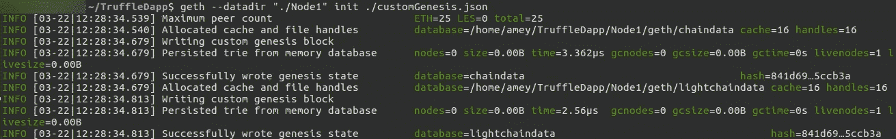

# 如何在私有以太网上构建 dapp:第 3 部分

> 原文：<https://medium.com/coinmonks/how-to-build-a-dapp-on-a-private-ethereum-network-part-3-31066fedf7a1?source=collection_archive---------0----------------------->

> 这是一个由 5 篇文章组成的系列，介绍如何在 2 个私有以太坊节点的网络上开发一个去中心化的应用程序(dapp ),而无需使用任何第三方 API 或应用程序(如 Infura、MetaMask 等)。).本教程涵盖了我在 CSIR-CEERI 的研究项目中所学到的基本要素。
> 
> 我已经在第 1 部分和第 2 部分中介绍了第 1-4 节。如果你感到失落，你可以通读前 2 部分，它们的链接在本文底部的**所有系列链接**部分提到。

> 最近发布—“[第 5 部分:第 VIII-IX 节](/@themadhackerOI/how-to-build-a-dapp-on-a-private-ethereum-network-part-5-84177d5717be)

# 目录

在这里，您可以找到我将本教程分成的部分和子部分的列表:

一.创建项目

二。安装先决条件

三。配置网络

四。设计智能合同

**→五、松露项目立项**

**→六。启动网络**

七。构建 web 应用程序

八。测试 dapp

九。修改 dapp

如果您想跳到某一部分，您可以向下滚动到本文末尾的**所有系列链接**部分。

这一部分将涵盖第 V-VI 节，向您介绍 Truffle 并展示如何配置一个包含两个节点的私有以太网。这是 dapp 开发中极其重要的部分，在这里许多人犹豫不决并倾向于放弃。和我在一起，对你来说会很容易。

# 动词 （verb 的缩写）建立松露项目

Truffle 是以太坊[以太坊](https://blog.coincodecap.com/tag/ethereum/)以太坊 [dapps](https://blog.coincodecap.com/tag/dapps/) 的开发环境和测试框架，可以轻松集成 dapp 的所有组件。它充当包装器，负责后台进程。这使得开发人员可以专注于用例的实现。

*   离开我们从第 1 部分开始就一直在使用的`TruffleDapp`存储库。要导航到主页，打开一个终端并运行`$ cd ~`，或者导航到父目录，运行`$ cd ./..`
*   `truffle init`命令要求在运行该命令之前，存储库必须完全清空。要创建一个 Truffle 项目，运行:

```
$ mkdir Temp
$ cd Temp
$ truffle init
```

*   将`Temp`中的所有文件和文件夹移动并粘贴到`TruffleDapp`。现在可以删除`Temp`目录了。
*   在`TruffeDapp`目录中，运行:

```
$ truffle create contract helloworld
```

*   这将在`contracts`文件夹中创建一个[智能合同](https://blog.coincodecap.com/tag/smart-contact/) `helloworld.sol`(在运行`truffle init`后创建)。用在 RemixIDE 中创建的合同代码替换其中的代码`helloworld.sol`。
*   若要编译协定，请运行以下命令。默认情况下，这个过程的输出是`build/contracts/helloworld.json`文件:

```
$ truffle compile
```

*   使用以下命令创建迁移文件:

```
$ truffle create migration HelloWorld
```

这将在`migrations`文件夹中添加`xx_helloworld.js`文件(`xx`是某个整数)。将该文件重命名为`2_helloworld.js`。然后，打开该文件并更新以下内容:

```
var hw = artifacts.require("HelloWorld");
module.exports = function(deployer) {
  deployer.deploy(hw);
};
```


是的，你的项目代表了你。它们是你工作的鲜活记忆

> “一个被放弃的项目只是一个失去的机会”

你已经走了很远。相信我，只要你坚持下去，你就会攀上许多人未能到达的顶峰。

# 不及物动词启动网络

本节说明了构成网络的节点，dapp 在该网络上执行。可以使用以下 3 种模式之一启动网络:

1.  默认块菌构造
2.  改良的松露装置
3.  手动配置的专用网络*(此处使用)*

你可以直接跳到第三部分。我已经为好奇的头脑提供了前两个。

## 1.默认块菌构造

Truffle 提供了一个选项，可以通过一个命令使用内置的开发区块链。这可以通过在终端中键入以下命令来实现:

```
$ truffle develop
```

这将在 [http://127.0.0.1:9545](http://127.0.0.1:9545/) 上运行客户端。它将显示前 10 个帐户和用于创建这些帐户的助记符。

## 2.改良的松露装置

*   要在 truffle 环境中本地测试契约，编辑`TruffleDapp/truffle-config.js`文件以包含:

```
module.exports = {
  networks: {
    "development": {
      network_id: "*",
      host: "127.0.0.1",
      port: 9545
    },
  }
};
```

这为 Truffle 网络(运行在沙盒环境中)配置了主机和端口。它可用于测试契约是否已被正确部署。

*   当契约被部署到 Truffle“开发”网络时，`1_initial_migration.js`首先被迁移，然后是`2_helloworld.js`。打开一个新的终端，在`TruffleDapp`目录下运行:

```
$ truffle migrate
```

*   要测试合约，请打开一个控制台与 Truffle 网络进行交互(通过部署的智能合约),并在新的终端中运行:

```
$ truffle console
```

现在，您可以在这个控制台中运行命令，与 Truffle 网络进行交互。


Pikachu saves the day!

## 3.手动配置的专用网络

这是我将在本系列教程中使用的模式。

**1a)创建节点-1**

这些说明仅用于创建 ***的第一个节点*** 。创建其他节点(在多节点网络中)的步骤类似，但有一些关键区别。

*   需要一个存储库来存储节点和链数据的公钥和私钥。该节点由`./customGenesis.json`初始化。在新的终端窗口中运行(T1):

```
$ geth --datadir "./Node1" init ./customGenesis.json
```



*   要将该节点连接到该节点所属网络的各种参数，请在 T1 中运行:

```
$ geth --datadir "./Node1" --networkid 1999 --identity "testNet" --rpc --rpcvhosts "*" --rpcport "8081" --rpccorsdomain "*" --rpcaddr 127.0.0.1 --rpcapi "db,eth,net,web3,personal,miner,admin" --port "30301"
```


***注:*** 这个剥离一个节点，在 T1 中显示节点信息。显示的一个这样的属性是`self`。`self`的字符串值稍后用于连接 Node-1。

*   在一个新的终端(T2)，运行`$ geth attach [http://127.0.0.1:8081](http://127.0.0.1:8081)`打开一个端口连接到 Node-1。
*   任何节点(用户)在以太坊环境中访问和操作，都要求它们包含一定量的以太来支付 gas 作为交易成本。因此，有必要在网络上创建一个帐户来存储以太网。要创建密码为“seed 1”的帐户，请在 T2 运行:

```
> personal.newAccount("seed 1")
```

*   存放采矿奖励(以太)的以太坊账户称为`eth.coinbase`，默认值为`eth.accounts[0]`


`"ACCOUNT_ADDRESS" is the hexadecimal string highlighted by the red rectangle`

***注:*** 这个返回一个账户地址`ACCOUNT_ADDRESS`，后来复制到`truffle-config.js`。

*   要使用之前创建的帐户，需要使用创建时输入的相同密码解锁*(见下图)*。

```
> personal.unlockAccount(web3.eth.accounts[0], "seed 1", 15000)
> eth.defaultAccount = eth.accounts[0]
```

当您发送交易时，`eth.defaultAccount`是`from`字段的默认账户输入，即如果您发送交易且未指定`from`字段，将使用`eth.defaultAccount`的值(如果之前已设置)。


*   这里，`eth.coinbase`被设置，并且挖掘过程在单个线程上启动。单线程挖掘是最安全的选择，因为否则会有系统冻结的风险。我们可能会在一个计算能力更高的系统中使用> 1 线程*(见上图)*。

```
> miner.setEtherbase(eth.accounts[0])
> miner.start(1)
```

*   当消息`Commit new mining work`在 T1 显示时，暗示挖掘已经在节点-1 启动。

***注意:*** 这 3 条指令对这里创建的所有节点都是通用的:

*   要在节点 1 停止挖掘过程，请在 T2 控制台中键入`> miner.stop()`
*   要退出 T2 的控制台，请在此控制台中键入`> exit`
*   要退出 T1 中的控制台，导航到 T1 的选项卡并按下`Ctrl + C`

**1b)重启节点-1**

创建后，执行以下命令重新启动节点 1:

*   打开一个新的终端窗口(T1)并运行:

```
$ geth --datadir "./Node1" --networkid 1999 --identity "testNet" --rpc --rpcvhosts "*" --rpcport "8081" --rpccorsdomain "*" --rpcaddr 127.0.0.1 --rpcapi "db,eth,net,web3,personal,miner,admin" --port "30301"
```

*   在另一个终端窗口(T2)中，运行:

```
$ geth attach [http://127.0.0.1:8081](http://127.0.0.1:8081)
```

*   在 T2 打开的控制台中，键入:

```
> personal.unlockAccount(web3.eth.coinbase, "seed 1", 15000)
> eth.defaultAccount = eth.accounts[0]
> miner.start(1)
```

**2a)创建节点-2**

要创建节点 2，请按照给定的步骤操作:

*   打开一个新的终端窗口(T1)并运行:

```
$ geth --datadir "./Node2" init ./customGenesis.json$ geth --datadir "./Node2" --networkid 1999 --identity "testNet" --rpc --rpcvhosts "*" --rpcport "8082" --rpccorsdomain "*" --rpcaddr 127.0.0.1 --rpcapi "db,eth,net,web3,personal,miner,admin" --port "30302"
```

*   在另一个终端窗口(T2)中，运行:

```
$ geth attach [http://127.0.0.1:8082](http://127.0.0.1:8082)
```

*   在 T2 打开的控制台中，键入:

```
> personal.newAccount("seed 2")
> personal.unlockAccount(web3.eth.coinbase, "seed 2", 15000)
> eth.defaultAccount = eth.accounts[0]
>
> miner.setEtherbase(eth.accounts[0])
> miner.start(1)
```

*   到目前为止，已经创建了一个节点(Node-2 ),其网络配置与 Node-1 相同，但是这两个节点之间尚未建立连接。除非这样做，否则该设置将仅由 2 个*独立节点*组成，而不是所需的*网络*。

```
> admin.addPeer("self of Node-1")
```


“self of Node-1” refers to the string displayed next to the “self” property in T1

`"self of Node-1"`是 Node-1 的`self`属性的字符串值，在执行 T1 中的两个命令后(创建/重启 Node-1 时)显示在控制台中。将此`self`值复制粘贴到此处。

**2b)重新启动节点-2**

一旦创建了 Node-2，重启它的步骤实际上与 Node-1 的步骤相同，只是做了一些小的编辑。

*   打开一个新的终端窗口(T1)并运行:

```
$ geth --datadir "./Node2" --networkid 1999 --identity "testNet" --rpc --rpcvhosts "*" --rpcport "8082" --rpccorsdomain "*" --rpcaddr 127.0.0.1 --rpcapi "db,eth,net,web3,personal,miner,admin" --port "30302"
```

*   在另一个终端窗口(T2)中，运行:

```
$ geth attach [http://127.0.0.1:8082](http://127.0.0.1:8082)
```

*   在 T2 打开的控制台中，运行:

```
> personal.unlockAccount(web3.eth.coinbase, "seed 2", 15000)
> eth.defaultAccount = eth.accounts[0]
> miner.start(1)
```

***Pro-tip :*** 要创建/重启 Node-n，在执行给定步骤后，执行 2a/2b 中提到的相同命令:

*   用`--rpcport "808n"`和`--port "3030n"`替换`--rpcport "8082"`和`--port "30302"`，即对于 Node-n 是唯一的 RPC 端口号。
*   用相应的`http://127.0.0.1:808n`替换`http://127.0.0.1:8082`，其中`808n`是传递给`--rpcport`标志的值(在上一步中)。
*   将`"seed 2"`替换为`"seed n"`，即在 Node-n 创建的账户所特有的短语。
*   对于 Node-n，`admin.addPeer("self of Node-i")`每个 Node-i 对应的命令需要在 Node-n 控制台中单独执行，其中 i = 1，2，3，...，n-1

**然而，由于我们的网络只有 2 个节点，这里使用的方法更简单。**

**3)与网络连接**

要将 Truffle dapp 链接到已启动的网络及其节点，请在编辑器中打开`truffle-config.js`并将其修改为以下代码，该代码列出了与网络节点(在本例中为 Node-1)建立连接所需的配置:

```
module.exports = {
  rpc: {
    host: "127.0.0.1",
    port: 8081
  },networks: {
    development: {
      host: "127.0.0.1",
      port: 8081,
      network_id: "1999",
      from: "ACCOUNT_ADDRESS",
      gas: 20000000
    },
  }
}
```


This is the ***default*** "`ACCOUNT_ADDRESS" that is used to deploy the smart contract or execute any transaction, unless the user specifies a "from" field in the transaction object`

***注:*** 此处粘贴的`ACCOUNT_ADDRESS`是 1a)创建 NODE-1 步骤中的十六进制值。

**4)部署智能合约**

当私有以太网启动后，需要将智能合同部署到网络上。打开一个新的终端，在`TruffleDapp`目录下运行:

```
$ truffle migrate
```

首先迁移文件`1_initial_migration.js`，然后是`2_helloworld.js`。

至此，我们结束了本教程的一个主要部分，即启动一个由 2 个节点组成的私有以太网，并在该网络上部署我们的`helloworld.sol`智能合约。

*附:如果你喜欢这篇文章，请鼓掌 10 次！请在下面评论，让我知道你的想法，或者如果你想分享一些技巧。*

我很快会发表更多这样有趣的文章。在 [*上关注我中*](/@themadhackerOI) *或在* [*上跟踪我推特*](https://twitter.com/TheMadHacker01) *敬请关注。*

# 所有系列链接

如果你想跳过某一部分，你可以参考下面的链接。请参考下面的**目录**，将一节与其对应的主题进行匹配。

[第一部分:第一至第三节](/coinmonks/dapp-on-a-private-ethereum-network-1-c8b80695e049)

[第二部分:第四节](/coinmonks/dapp-on-a-private-ethereum-network-2-a0b282586558)

[第三部分:第五至第六节](/@themadhackerOI/how-to-build-a-dapp-on-a-private-ethereum-network-part-3-31066fedf7a1)

[第 4 部分:第七节](/@themadhackerOI/how-to-build-a-dapp-on-a-private-ethereum-network-part-4-ea28b6de5cf8)

[第 5 部分:第八章至第九章](/@themadhackerOI/how-to-build-a-dapp-on-a-private-ethereum-network-part-5-84177d5717be)

> [在您的收件箱中直接获得最佳软件交易](https://coincodecap.com/?utm_source=coinmonks)

[](https://coincodecap.com/?utm_source=coinmonks)