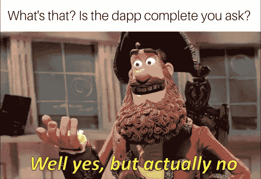
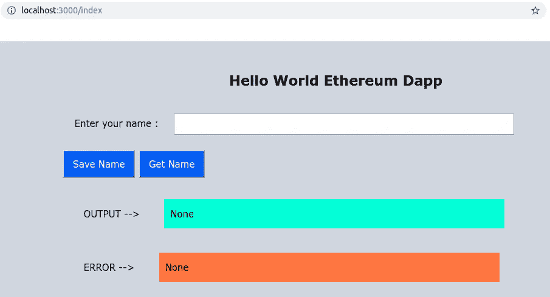

# 如何在私有以太网上构建 dapp:第 4 部分

> 原文：<https://medium.com/coinmonks/how-to-build-a-dapp-on-a-private-ethereum-network-part-4-ea28b6de5cf8?source=collection_archive---------1----------------------->

> 这是一个由 5 篇文章组成的系列，介绍如何在 2 个私有以太坊节点的网络上开发一个去中心化的应用程序(dapp ),而无需使用任何第三方 API 或应用程序(如 Infura、MetaMask 等)。).本教程涵盖了我在 CSIR-CEERI 的研究项目中所学到的基本要素。
> 
> 我已经介绍了第 1-3 部分中的第 [I-VI](/coinmonks/how-to-build-a-dapp-on-a-private-ethereum-network-part-3-31066fedf7a1) 节。如果你感到失落，你可以通读前 3 部分，它们的链接在本文底部的**所有系列链接**部分提到。

> 最近发布—“[第 5 部分:第 VIII-IX 节](/@themadhackerOI/how-to-build-a-dapp-on-a-private-ethereum-network-part-5-84177d5717be)

# 目录

在这里，您可以找到我将本教程分成的部分和子部分的列表:

一.创建项目

二。安装先决条件

三。配置网络

四。设计智能合同

动词 （verb 的缩写）建立松露项目

不及物动词启动网络

**→七。构建网络应用**

八。测试 dapp

九。修改 dapp

如果您想跳到某一部分，您可以向下滚动到本文末尾的**所有系列链接**部分。



一道菜的风味完全在于它的味道和感觉。一道精心烹制的菜肴真正得益于它的上菜方式。一点装饰会给它带来有益健康的吸引力。不过没什么特别的，只是一些新鲜的芫荽和一勺奶油。

到目前为止，您已经启动了一个至少包含 2 个节点的私有以太网，并在网络上部署了`helloworld.sol`智能合约。可以通过命令行终端与该系统进行交互。然而，为了使 dapp 对用户友好，你需要一个 GUI。

为此，我们将借助本文开发前端并与后端链接(第七节)。

# 七。构建 web 应用程序

这里，重点不是网页的设计，而是如何将 GUI 与私有以太网集成。然而，如果项目有一个好的界面，它确实有帮助。这是网页的样子:



It’s not pretty, but it gets the job done. Now hurry up, we got code to write!!

## 1.前端:客户端界面

这需要`web3`和`truffle-contract`包，它们又需要`build-essential`来设置。在`TruffleDapp`文件夹中打开一个终端，运行:

```
$ sudo apt-get install build-essential
$ npm init
$ npm install truffle-contract@4.0.0-beta.2 --save-dev
$ npm install web3@1.0.0-beta.36 --save-dev
```

安装好先决条件后，在`TruffleDapp`目录下创建一个名为`client`的文件夹，并按照给出的步骤操作。

**A .创建索引页面**

在`TruffleDapp/client`存储库中创建一个包含以下内容的`index.html`文件:

```
<!DOCTYPE html>
<html lang="en">
 <head>
  <meta charset="UTF-8">
  <meta name="viewport" content="width=device-width, initial-scale=1.0">
  <meta http-equiv="X-UA-Compatible" content="ie=edge">
  <title>Sample Dapp</title>
  <link rel="stylesheet" type="text/css" href="main.css">
 </head>
 <h2>Hello World Ethereum Dapp</h2>
 <body>
  <div>
   <div class="container">
    <label for="username" class="col-lg-2 control-label">Enter your name :</label>
    <input id="username" type="text"/>
   </div>
   <div>
    <button id="setName">Save Name</button>   
    <button id="getName">Get Name</button>
   </div>
  </div><div class="container">
   <div><label class="center-label" for="output">OUTPUT --> </label>
   <div id="output">None</div></div>
  </div><div class="container">
   <div><label class="center-label" for="errorHolder">ERROR --> </label>
   <div id="errorHolder">None</div></div>
  </div><script src="[https://ajax.googleapis.com/ajax/libs/jquery/1.12.4/jquery.min.js](https://ajax.googleapis.com/ajax/libs/jquery/1.12.4/jquery.min.js)"></script>
  <script src="dist/bundle.js"></script>
 </body>
</html>
```

**B .添加 CSS**

HTML 文件只定义了网页的基本框架。为了让它们更吸引人，在`client`存储库中创建一个`main.css`文件，并键入:

```
h2 {
  text-align: center;
  padding-bottom: 10px;
}body {
  background-color: rgba(203, 209, 218, 0.877);
  padding: 2em;
  font-family: 'Verdana';
  width: 900px;
  margin: auto;
  font-size: 15px;
}div.Hontainer {
  width: 100%;
  margin: 0 auto;
}label {
  display: inline-block;
  padding: 20px;
  clear: both;
}#output{
  display: inline-block;
  background-color: aquamarine;
  padding: 1em 10px;
  width: 60%;
}#errorHolder{
  display: inline-block;
  background-color: coral;
  padding: 1em 10px;
  width: 60%;
}.center-label {
  margin: 1em 1em;
}input {
  padding:8px;
  width: 60%;
  margin-bottom: 0.5em;
}button {
  font-family: 'Verdana';
  margin: 1em auto;
  padding: 12px 1em;
  background-color: #1479F5;
  color: white;
  font-size: 15px;
}button:hover {
  background-color: rgb(1, 146, 20);
}
```

这个 CSS 模板是从一个不同的项目中借用的，所以它不是为适应这个项目而定制的。

**4。添加 JS 功能**

上面使用的 HTML 组件需要与在 web 浏览器中执行的相应功能相链接，以执行所需的功能。

这里，本地私有以太坊区块链被用作`web3Provider`，来自`truffle-contract`包的`TruffleContract`被用于访问智能契约方法。在`client`存储库中，在编辑器中打开`app.js`文件并键入:

```
const Web3 = require('web3');
const TruffleContract = require('truffle-contract');
const request = require('request');App = {/*==================================================================
    DEFINE ESSENTIALS
==================================================================*/web3Provider: null,
  contracts: {},
 currentAccount:{},

 // Integrates web3 with our web app
  initWeb3 : async function (){
    if (process.env.MODE == 'development' || typeof window.web3 === 'undefined'){
      App.web3Provider = new Web3.providers.HttpProvider(process.env.LOCAL_NODE);
    }
    else{
     App.web3Provider = web3.currentProvider;
    }
    web3 = new Web3(App.web3Provider);
    return  await App.initContract(); 
 },

 // Initialises a variable with IDManagement contract JSON
  initContract : async function (){
    await $.getJSON('HelloWorld.json', function(data){
      var hwArtifact = data;
      App.contracts.helloworld = TruffleContract(hwArtifact);
      App.contracts.helloworld.setProvider(App.web3Provider);     
    })
    return App.bindEvents();
 },

 // Binds button clicks to the repective functions
   bindEvents: function() { 
  $('#setName').click(App.ExeInputUser);
  $('#getName').click(App.CallDispUser);
 },// Defines functionality for OUTPUT label
    showMessage: function (msg){
    $('#output').html(msg.toString());
  $('#output').show();
  $('#errorHolder').hide();
 },

 // Defines functionality for ERROR label
    showError: function(err){
    $('#errorHolder').html(err.toString());
  $('#errorHolder').show();
  $('#output').hide();
 },/*==================================================================
    USERNAME SUBMISSION
==================================================================*/ExeInputUser: function (){var NAME = $('#username').val();
  console.log("In app.js ExeInputUser", NAME);

  if(NAME) {
   // Retrieves user account to perform operations
   web3.eth.getAccounts(function (error,accounts){
    if (error){
     console.log("ERROR getAccounts ExeInputUser");
     App.showError(error);
    }
    App.currentAccount = accounts[0];

    // Submits name to the blockchain network
    App.contracts.helloworld.deployed().then(function(obj){
     return obj.inputUser.sendTransaction(NAME, {from:App.currentAccount});
    }).then(function(result){
     console.log(result);
     App.showMessage("Name submitted as a txn");
    }).catch(function (error){
     console.log("ERROR ExeInputUser");
     App.showError(error);
    });
   });
  }
  else {
   App.showError("Valid name is required !");
  }
 },/*==================================================================
 USERNAME RETRIEVAL
==================================================================*/CallDispUser : function (){var NAME = $('#username').val();if(NAME) {
   console.log("In app.js CallDispUser");
   web3.eth.getAccounts(function (error,accounts){
    if (error){
     console.log("ERROR getAccounts CallDispUser");
     App.showError(error);
    }
    App.currentAccount = accounts[0];

    App.contracts.helloworld.deployed().then(function(instance){
     return instance.dispUser.call({from:App.currentAccount});
    }).then(function(result) {
      console.log("CallDispUser returns : ", result);
      App.showMessage(result);
    }).catch(function (error){
      console.log("ERROR CallRegStatus");
      App.showError(error);
    })
   })
  }
  else {
   App.showError("No output as no name is entered");
  }
 },/*==================================================================
 INITIALISATION : Intialises web3 when webpage is loaded onto browser
==================================================================*/init : async function (){
  await App.initWeb3();
  console.log("In app.js init, initiated App");
  }
}

$(function() {
  $(window).load(function() {         
   App.init();
  });
});
```

## 2.设置中间件:Express.js

Express.js 是一个轻量级的 web 应用程序框架，它帮助在服务器端组织 web 应用程序，并支持对 web 应用程序的所有方面进行管理，从路由到处理请求和网页。第一步是设置一个环境。

*   要安装 Express.js，请在`TruffleDapp`文件夹(T1)中打开一个终端并运行:

```
$ npm install express --save
```

*   为了定义环境变量，通过在同一个终端窗口中执行来安装`dotenv`包:

```
$ npm install dotenv --save
```

*   接着，在`TruffleDapp`中创建一个`.env`文件，并输入:

```
IP = "127.0.0.1"
PORT = 3000
MODE = "development"
LOCAL_NODE  = "http://127.0.0.1:8081"
```

这里，`PORT`是我们运行 Node.js 服务器的端口，`MODE`是`truffle-config.js`中提到的网络变量，`LOCAL_NODE`是本地私有区块链的 URL。

*   接下来，在`TruffleDapp`中创建一个`server`存储库。在`server`文件夹中创建一个`main.js`文件，在编辑器中打开并输入:

```
require('dotenv').config();const express = require('express');
const app = express();const PORT = process.env.PORT || 3000;
const IP = process.env.IP || '127.0.0.1';// Enter the path of YOUR project directory
const proj_dir = `/home/amey/Projects/medium-tutorial`;app.use(express.static('client'));
app.use(express.static('build/contracts'));// Serves the home page of the project
app.get('/index', (req, res) => {
  res.sendFile(`${proj_dir}/client/index.html`);
});app.get('*', (req, res) => {
 res.status(404);
 res.send('Oops... this URL does not exist');
});app.listen(PORT, IP, () => {
 console.log(`HelloWorld Dapp running on port ${PORT}...`);
});
```

*   在`package.json`文件的`"scripts"`下增加以下声明:

```
"start": "node server/main.js"
```

*   为了测试 web 页面是否如预期加载，在 T1 中运行`$ npm run start`并在 web 浏览器中打开 URL[http://localhost:3000/index](http://localhost:3000/index)。但是，请注意，正如在`.env`文件中提到的，由于在`LOCAL_NODE = "http://127.0.0.1:8081"`没有运行`geth`节点，所以网页将不起作用。

***注意:*** 在`app.js`中，`require`导入的包和外部库无法被浏览器理解。因此，`webpack`被用作模块的捆绑器。它的主要目的是捆绑 JavaScript 文件，以便在浏览器中使用。

*   首先，安装必要的模块。在 T1 运行:

```
$ npm install webpack@4.41.4 webpack-cli --save-dev
```

*   不能在客户端直接访问`.env`中声明的环境变量。因此，在`DefinePlugin`中对它们进行了定义。`node`和`externals`配置用于修复构建时的 webpack 错误。添加一个具有以下 webpack 配置的`webpack.config.js`文件:

```
require('dotenv').config();
const webpack = require('webpack');
const path = require('path');

module.exports = {
  entry: './client/app.js',
  mode: process.env.MODE,
  output: {
    filename: 'bundle.js',
    path: path.resolve(__dirname, 'client/dist')
  },
  plugins: [
    new webpack.DefinePlugin({
      'process.env': {
        'LOCAL_NODE': JSON.stringify(process.env.LOCAL_NODE),
        'MODE':JSON.stringify(process.env.MODE),
      }
    })
  ],
  node: {
    net: 'empty',
    tls: 'empty',
    dns: 'empty'
  },
  externals:[{
    xmlhttprequest: '{XMLHttpRequest:XMLHttpRequest}'
  }]
};
```

*   在`package.json`的`"scripts"`部分增加以下内容:

```
"dev" : "node_modules/.bin/webpack && node server/main.js",
"webpack": "node_modules/.bin/webpack --watch"
```

*   在 T1 中运行`$ npm run webpack`来检查任何 webpack 构建错误。如果没有错误，可以通过在 T1 中运行`$ npm run dev`然后在 web 浏览器中打开 URL[http://localhost:3000/index](http://localhost:3000/index)来开始测试 dapp。

因此，我们构建了一个简单的分散式应用程序，并配有一个交互式 GUI 组件。我们将以一篇关于测试 dapp 的文章和一个关于如何修改这个 dapp 的非常有用的部分来结束这个教程系列。

如果你喜欢这篇文章，请鼓掌 10 次！请在下面评论，让我知道你的想法，或者如果你想分享一些技巧。

我很快会发表更多这样有趣的文章。梗我上 [*推特*](https://twitter.com/TheMadHacker01) *敬请关注。*

# 所有系列链接

如果你想跳过某一部分，你可以参考下面的链接。请参考下面的**目录**，将一节与其对应的主题进行匹配。

[第一部分:第一至第三节](/coinmonks/dapp-on-a-private-ethereum-network-1-c8b80695e049)

[第二部分:第四节](/coinmonks/dapp-on-a-private-ethereum-network-2-a0b282586558)

[第三部分:第五至第六节](/@themadhackerOI/how-to-build-a-dapp-on-a-private-ethereum-network-part-3-31066fedf7a1)

[第四部分:第七节](/@themadhackerOI/how-to-build-a-dapp-on-a-private-ethereum-network-part-4-ea28b6de5cf8)

[第 5 部分:第八章至第九章](/@themadhackerOI/how-to-build-a-dapp-on-a-private-ethereum-network-part-5-84177d5717be)

> [直接在您的收件箱中获得最佳软件交易](https://coincodecap.com/?utm_source=coinmonks)

[](https://coincodecap.com/?utm_source=coinmonks)