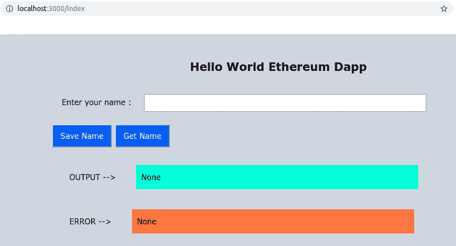

# 如何在私有以太网上构建 dapp:第 5 部分

> 原文：<https://medium.com/coinmonks/how-to-build-a-dapp-on-a-private-ethereum-network-part-5-84177d5717be?source=collection_archive---------2----------------------->

> 这是一个由 5 篇文章组成的系列，介绍如何在一个由 2 个私有以太坊节点组成的网络上开发一个去中心化的应用程序( [dapp](https://blog.coincodecap.com/what-are-dapps-an-ultimate-guide/) )，而无需使用任何第三方 API 或应用程序(比如 Infura、MetaMask 等)。).本教程涵盖了我在 CSIR-CEERI 的研究项目中所学到的基本要素。
> 
> 我已经在第 1-3 部分中介绍了第 1-8 节。如果你感到失落，你可以通读前 3 部分，它们的链接在本文底部的**所有系列链接**部分提到。

> 最近发布—“[第五部分:第八至九节](/@themadhackerOI/how-to-build-a-dapp-on-a-private-ethereum-network-part-5-84177d5717be)”

# 目录

在这里，您可以找到我将本教程分成的部分和子部分的列表:

一.创建项目

二。安装先决条件

三。配置网络

四。设计智能合同

动词 （verb 的缩写）建立松露项目

不及物动词启动网络

七。构建 web 应用程序

→ **八。测试 dapp**

→ **九。修改 dapp**

如果您想跳到某一部分，您可以向下滚动到本文末尾的**所有系列链接**部分。

菜上齐了。不用说，令人垂涎三尺。你是厨师，你需要先品尝它——以确保一切都恰到好处。此外，一个好厨师不害怕尝试。品完之后，我们会快速浏览几个要点，方便你玩转。

在这里，我们将测试我们开发的 dapp，并讨论如果您想要调整 dapp 应该遵循的步骤。

# 八。测试 dapp

现在是测试 dapp 的时候了。下面给出的是 dapp 可能持续的情况。本节解释了成功演示流程的正确执行方法。

*   使用[重启节点-1](/coinmonks/how-to-build-a-dapp-on-a-private-ethereum-network-part-3-31066fedf7a1) (第六节，第 3 点，第 1b 子部分)中提到的命令重启在`TruffleDapp` (T1)中打开的终端中的节点，此处为节点-1。
*   在`TruffleDapp` (T2)的新终端窗口中，运行`$ npm run dev`启动服务器。
*   在网络浏览器中打开链接[http://localhost:3000/index](http://localhost:3000/index)。它看起来应该类似于下图。



## 1.正确的执行流程

*   在文本字段中输入您的姓名，然后单击“保存姓名”按钮。在 5-10 秒内，您将收到一条确认输出。这意味着你的名字已经被提交给网络，存储在你的智能合约的`string name`变量中。


***提示:*** 我们在`app.js`文件中使用了多个`console.log()`语句。因此，您可以按 Ctrl + Shift + I 打开检查窗口，在这里您将收到关于这个 dapp 执行状态的进一步提示。

*   接下来，点击“获取姓名”按钮，从智能合同`name`变量中获取您的姓名，并将其显示在输出字段中。


## 2.错误处理

我们的代码中已经考虑了一些基本的不利情况。例如:

*   如果您将文本字段留空(即不输入有效字符串)并点击“保存名称”按钮，错误字段将显示“需要有效名称！”
*   然后，如果你点击“获取名称”，一条消息显示“没有输出，因为没有输入名称”作为一个错误(因为`name`变量存储 null，一个无效的字符串)

# 九。修改 Dapp

下面解释了如果要对 dapp 进行一些更改时要采取的步骤。

***注意:*** 如果 NodeJS 服务器和/或 go-ethereum 节点正在运行，中止它们，然后按照给出的指导方针进行操作。

## A)绑定系统 IP

NodeJS 服务器和 go-ethereum 节点仍然运行在`localhost`或`127.0.0.1`上。在计算机网络中，`localhost`是指这台计算机的主机名，这是描述本地计算机地址的默认名称。当设置 web 服务器或 web 服务器上的软件时，`127.0.0.1`用于指向本地机器上的软件。

验证 NodeJS 服务器和 go-ethereum 节点在绑定到一个 IP 地址时是否能正常工作是很重要的。要将主机设置为您的 IP 地址，请遵循以下步骤:

1.  找出你的 IP 地址。对于 Ubuntu，点击顶栏上的“网络”图标，然后选择“连接信息”选项，并复制标有“IP 地址”的字段的值。
2.  在`.env`、`main.js`、`app.js`和`truffle-config.js`文件中用该 IP 地址替换`localhost`或`127.0.0.1`的所有实例。
3.  另外，用您的 IP 地址(这里称为`IP_ADDRESS`)替换`geth`命令中的`127.0.0.1`。例如，对于节点 1，修改后的命令将是:

```
$ geth --datadir "./Node1" --networkid 1999 --identity "testNet" --rpc --rpcvhosts "*" --rpcport "8081" --rpccorsdomain "*" --rpcaddr IP_ADDRESS --rpcapi "db,eth,net,web3,personal,miner,admin" --port "30301"

$ geth attach [http://IP_ADDRESS:8081](http://IP_ADDRESS:8081)
```

## b)修改 HTML、CSS

对网页设计的任何更改都是通过编辑相应的 HTML 和 CSS 文件来实现的。要预览修改，保存文件，通过在`TruffleDapp`中打开的终端中执行`$ npm run start`或`$ npm run dev`来运行 NodeJS 服务器，并在 web 浏览器中打开相应的 URL。

## c)添加新的 JS 函数

为了扩展 dapp 功能，可能需要添加 HTML 组件(在 [B 中解释)、更改 HTML、CSS](https://github.com/amey-github/ceeri/blob/master/IDMTruffle) 和实现 JS 功能。为此，请遵循给定的步骤:

*   在编辑器中打开`app.js`(或相关的 JS 文件)并添加所需的功能。
*   在`TruffleDapp`中打开一个端子，运行`$ npm run dev`。测试 dapp，如果遇到任何问题，进行调试。

## d)修改智能合同

如果需要修改在私有以太网上运行的智能合约的模块，请执行以下操作:

*   打开`contracts`文件夹中的`IDManagement.sol`文件(或添加一个新的`.sol`文件，如有必要)并进行所需的更改。
*   在`TruffleDapp` (T1)中的一个端子打开时，连续运行命令`$ truffle compile`和`$ truffle migrate`
*   在 T1 中运行`$ npm run dev`。测试 dapp，如果遇到任何问题，进行调试


巴-达姆-茨斯！！dapp 已经准备好被玩弄了。通过这 5 篇文章，我们已经介绍了一个简单的分散式应用程序的开发。此外，它不依赖于任何第三方 API，这使您不必依赖它们。我相信你脑子里有很多想法。前进...编码并创建！

*我会发表更多这样有趣的文章，我一定会把它们贴在* [*推特*](https://twitter.com/TheMadHacker01) *上。请关注我，了解最新动态，或者您也可以进入我的 DMs，与我分享您的想法。*

如果你喜欢这篇文章，请鼓掌 10 次！请在下面评论，让我知道你的想法，或者如果你想分享一些技巧。

# 所有系列链接

如果你想跳过某一部分，你可以参考下面的链接。请参考下面的**目录**，将一节与其对应的主题对应起来。

[第一部分:第一至第三节](/coinmonks/dapp-on-a-private-ethereum-network-1-c8b80695e049)

[第二部:第四节](/coinmonks/dapp-on-a-private-ethereum-network-2-a0b282586558)

[第三部分:第五章至第六章](/@themadhackerOI/how-to-build-a-dapp-on-a-private-ethereum-network-part-3-31066fedf7a1)

[第四部分:第七节](/@themadhackerOI/how-to-build-a-dapp-on-a-private-ethereum-network-part-4-ea28b6de5cf8)

[第 5 部分:第 VIII-IX 节](/@themadhackerOI/how-to-build-a-dapp-on-a-private-ethereum-network-part-5-84177d5717be)

> [直接在您的收件箱中获得最佳软件交易](https://coincodecap.com/?utm_source=coinmonks)

[](https://coincodecap.com/?utm_source=coinmonks)