# 如何在区块链上建立信誉体系？Bitconch 白皮书给出了一个很好的答案。

> 原文：<https://medium.com/coinmonks/how-to-build-a-reputation-system-on-blockchain-957bd9ec1ab2?source=collection_archive---------1----------------------->

**基于创新的信誉证明(PoR)共识算法和生态系统的新型分布式网络协议**

## 摘要

Bitconch chain 提出了一种创新的 POR(信誉证明)信誉共识算法，它提供了一种新的解决方案，利用区块链技术来保持高吞吐量和分散性。根据社交图，Bitconch 区块链对社交网络、时间和贡献活动进行数学建模，以建立一个去中心化的声誉系统，这提供了一个将上述项目转化为每个用户的声誉值的机会。用户信誉越高，交易成本越低(甚至免费)，也有更多的机会被选为信任节点参与共识，赢得更好的利益。高信誉的用户被定义为“互信节点”，他们可以通过微交易启动高速线下交易的“支付通道”。

信誉体系和激励体系将有效促进商业开发者和用户的持续参与，这也有助于商业生态系统的构建。产生流量的业务开发者更有可能获得高信誉值，更有机会当选可信满节点。通过积极参与社交互动或其他商业活动(通过区块链上的 DApp)，用户可以增加他们成为可信光节点的机会，这将给予用户共享系统奖励的特权。

Bitconch 区块链使用了几种技术来保持系统的分散性，同时增加了可扩展性:DAG(有向无环图)数据结构、零知识证明、分布式数据存储、后量子加密算法和 BVM(Bitconch 虚拟机，它是智能合约的增强虚拟机)。所有这些创新使 Bitconch chain 成为一个更可靠、对开发者更友好的平台。DApp 和侧链开发人员可以创建令人敬畏的 dapp，支持大文件存储，低交易成本，用户信息保护，侧链和智能合同迭代，以及容易的错误修复。Bitconch chain 是一个无块无链的去中心化网络，解决了区块链应用中的两个难点:可扩展性和去中心化。Bitconch chain，是区块链高频微交易及相关应用最可行的区块链生态系统，可应用于超过 1000 万用户的商业应用。

## 背景

比特币的诞生让区块链科技从纯理论研究一跃成为世界创新科技的焦点。区块链技术开创了理解安全和信息使用的新途径，现在被广泛认为肯定会极大地改变世界。以太坊及其 Solidity 语言的成功允许创建图灵完全智能契约，并允许开发人员创建任何类型的应用程序在区块链上运行。然而，以太坊、比特币和其他货币所使用的 Merkle-tree 架构受到了一些限制，这些限制阻碍了它们的大规模商业应用。这些是:

在一个架构中同时支持可扩展性、分散性和安全性。对于 Merkle-tree 架构，只有两种可能

有限的文件存储

低交易成本与有效激励相结合

可升级智能合同

可用性

## 2.区块链在应用中的挑战

**2.1 高并发、高吞吐量和可扩展性**

商业竞争的核心是量的竞争。一个成功的商业项目会有超过 1000 万的注册用户和超过 100 万的活跃用户。基于 Merkle 树的区块链架构在可处理的事务的速度和数量方面受到严重限制。如果不牺牲它们的去中心化或安全特性，它们本质上是不可扩展的。最近对这一点的认识导致了这些类型的架构(最著名的是以太坊)试图克服这些问题的活动的爆发。同时，寻找支持 Merkle-tree 体系结构的去中心化、不可否认性和安全性特征的替代体系结构是巨大的技术活动和创新的来源。在商业领域，任何潜在的替代技术都需要支持每秒数万笔交易的系统吞吐量(目前的 Visa/MasterCard 支持量和速度)。

**2.2 声誉和用户隐私**

区块链技术因其匿名性而受到欢迎。通过隐藏用户的身份，区块链可以保护对等用户的隐私。但在现实的商业应用中，纯匿名可能会带来欺诈、违约、维权难等问题。用户在选择服务商时，有权知道服务商是否诚实守信。

**2.3 激励机制和交易成本**

业务应用场景主要是针对一系列中小用户的高频小微交易，所以交易成本会成为重要考虑因素。比特币的交易成本已经超过 1 美元/交易，以太坊的交易成本为 0.01 ~ 0.02 eth/交易，约合 5~10 美元/交易。过高的交易成本显然无法满足高频微交易的商业需求。

消费者可能希望免费或低价使用区块链平台上的资源，但分散式系统有一个明显的难题:没有中央权威机构来维持系统上的交易成本，因此必须有一个有效的激励机制，让对等点(执行交易的节点)参与到保持系统整体工作的活动中。因此，同行需要足够的激励来支付运营成本，包括设备和公用事业费。同行的参与以及激励的类型和程度是运行一个真正自我维持的分散系统的关键。如何有效平衡系统运行的激励需求和安全、真正的权力下放是可持续平台的关键。

**2.4 安全和权力下放**

为了保证交易安全，客户端需要下载并备份整个网络的所有交易数据，这些客户端被称为“全节点”。但是，大多数情况下运行一个完整的节点是极其昂贵和缓慢的，而且商业应用中的大多数用户都是在处理小微交易，没有能力或需求购买大型计算机并承担相应的运营成本。因此，中小型用户被有效地阻止参与系统计算过程(共识过程等)。)且无法获得系统奖励，从而形成少数富裕用户对计算能力的垄断，并潜在地损害支持安全性的共识机制。

**2.5 可升级智能合约**

在区块链上开发的应用需要有一个有效的机制来支持应用升级。所有应用程序都可能受到 bug 的影响。当侧链或 DApp 遇到错误时，它需要能够修复错误。

**2.6 储存限制**

许多商业应用程序的大多数开发都涉及大型文件存储和传输。比如媒体、社交软件、电商平台、视频直播、游戏等应用。需要大文件存储功能。现有的区块链不支持大文件的存储，无法满足现实应用的需求。

## 3 信誉一致性算法的证明

POR 信誉一致性算法是 Bitconch 提出的一种基于社会图的新算法。使用建立在区块链上的分布式分散信誉量化系统，POR 可以显示每个对等体对整个网络的贡献，包括增长、安全性和稳定性。通过引入在数学上代表每个对等体信誉的“R”向量，POR 可以维护一个可信任对等体的列表，这被称为事务验证器。通过提供计算能力或存储能力，这些交易验证者将因其对系统的贡献而得到奖励。

POR 利用有向无环图作为社交图的基础。POR 可以容忍拜占庭式的失败。总线是支持 Bitconch 区块链的底层令牌，作为 Bitconch 协议的一部分，POR 可以帮助总线扩展:对等体的数量越多，每秒的事务数量(TPS)就越大。POR 是高频小微交易和面向社交的 DApps 的完美候选。POR 采用权力平衡的理念，设计了一种具有反马太效应的去中心化激励体系，可以保证新的同行和现有的同行、小用户和大用户有同等的机会获得系统奖励。POR 可以防止系统因设计不良的激励机制而变得集中化。

**3.1 声誉和共识**

正如塞弗朋克、HashCash 和 B-Money 等区块链先驱所倡导的，理想的区块链是一个分散的系统，一个没有中央权威的系统。一个理想的分权系统消除了由于控制权集中而导致的腐败和滥用权力的潜在威胁。大多数区块链技术的核心是一致性算法。一致性算法的本质是在分布式网络中，在各节点互不信任的情况下，通过资源稀缺的证据形成纳什均衡，赢得各方的信任，从而节点之间达成一致，允许任务同步完成。

对于 POW(工作证明)，矿工消耗的时间和电力将被视为证据。对于 POS(股份证明)或 DPOS，价值向量(硬币或硬币时代)将被视为证据。共识过程是关于找到可以被证明拥有稀缺资源的人作为证据，从而被信任参与共识过程，从而贡献计算能力，并获得奖励。

Bitconch 提出，可以通过证明名誉的方式达成共识。

**3.2 声誉作为稀缺资源**

商业团体依靠信誉和信誉标记来帮助评估许多潜在交易方的可信度和信用度，例如抵押申请人和其他贷款交易、交易融资等。在区块链上，声誉可以帮助对等体决定谁值得信任来参与共识，以及谁应该获得维护系统的奖励。在现有商业环境中的声誉可以通过按时还钱来获得。在区块链，可以通过诚实地维护分布式账本并限制恶意活动来赢得声誉。

声誉可以认为是一种稀缺资源，在现实生活中，声誉是可以量化的。在淘宝或亚马逊等许多电子商务平台上，用户依靠来自平台的集中评级(亚马逊的星级或淘宝的钻石/皇冠)来决定购买哪种产品。在投资市场，用户依赖于标准普尔和穆迪等知名机构的集中评级。在选择大学的时候，学生们利用学校的声誉和排名来决定自己应该申请哪所大学。信誉的积累需要时间和努力，信誉的高低和经济价值也有天然的联系。著名投资家沃伦·巴菲特有一句名言，“建立一个声誉需要 20 年，毁掉它只需要 5 分钟。如果你考虑到这一点，你会以不同的方式做事。”由于信誉的稀缺性和高价值，使用信誉值作为有效性的证据可以有效地减少和管理恶意节点的可能性。

Bitconch 链使用商业活动构建的社交图和数学抽象来构建可量化的声誉系统。它对任何人或组织都是公平的，难以伪造，并且可以量化。任何人或组织都可以建立和维护自己的声誉。

**3.3 声誉数学模型**

可以对社交网络进行数学抽象和建模，构建社交图。网络中的参与者可以抽象为点(顶点/节点)，参与者之间的关系可以抽象为图的边。我们可以用数学描述来描述人与人之间的社会关系、亲密度和个人可信度。

*社会关系*

假设 a 和 b 是两个人，在图中可以表示为两个顶点 Va 和 Vb。如果交易发生在 a 和 b 之间，可以在顶点 a 和 b 之间画一条线，作为 E(a，b ),这意味着方向是从 a 到 b。此外，我们定义 E(a，b)的权重，以及可以影响权重值的交易的数量和数目。

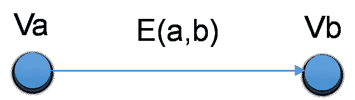

*互信节点*

对于小微交易，互信节点(MTN)可以开通“交易通道”进行高频线下交易。MTN 可以以两种方式形成:亲戚/朋友之间和高声誉的同龄人之间。

如果在两个节点之间发生了大量的交易，则可以推断出这两个节点(节点后面的人)会有频繁的社交互动，这意味着它们是社交深度相关的。如下图所示，Jenny 和 Alice 是朋友，两人经常通过社交 app 进行互动，比如:通过加密微信聊天、照片分享、转账(Rd 包或转账)、留言评论等。对于像珍妮和爱丽丝这样的人，他们在现实生活中关系密切，具有深厚的社会关系，我们将他们定义为“朋友或亲戚节点”(FRN)。对于 FRN 来说，赋予了初始化高频线下交易的特权。

通常，没有预先交互的 2 个节点不能打开支付通道。但是对于高信誉节点，即使没有预先交互也可以打开支付通道。对于高信誉节点，因为它们在自己的社交网络中具有良好的信誉表现。对于小微交易来说，成为恶意节点在经济上是不可行的，因为信誉损失的成本远大于可能的收益。

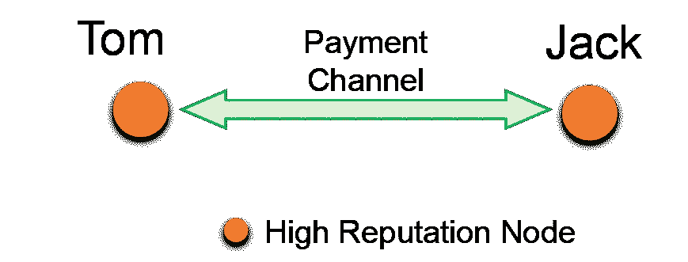

*信誉值量化*

我们定义 R，它可以代表特定社会群体(或社会网络)的接受程度。在区块链网络上，我们从三个维度构建声誉 R:社会活动 D、时间活动 T 和贡献活动 c。因此，我们有以下等式:

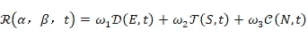

其中 w_n 为权重，在一定时间 T 内，D(α，T)为节点的社会活跃度，T(β，T)为各节点的时间活跃度，C(γ，T)为贡献活跃度。为了保持用户持续活跃，让后来者更公平地参与系统，同时避免先动者优势(FMA)带来的马太效应，我们指定 R 会随时间衰减。R 的衰减率定义为μ，如公式(2)所示:

社交活跃度 D:由社交网络中好友数量、与好友互动频率(即活跃度)、好友信誉值、交易金额等多项因素决定。公式如下:

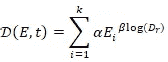

其中 Ei 是每个交易的权重函数。Ei 与交易金额正相关。Dr 是交易对手。Log(Dr)是 Dr 信誉值的对数函数。日志(Dr)用于防止信任节点通过与大量假冒用户进行交易而产生高信誉。

如图:汤姆的朋友很少，他几乎不与他们交流。另一方面，杰克人缘很好，不仅人脉很广，沟通也很频繁，而且他的一些朋友都是高信誉节点，他和他的几个朋友形成了互信节点。杰克可以通过离线和即时的支付渠道与朋友交易。那么杰克的 D 值就比汤姆的 D 值高很多。

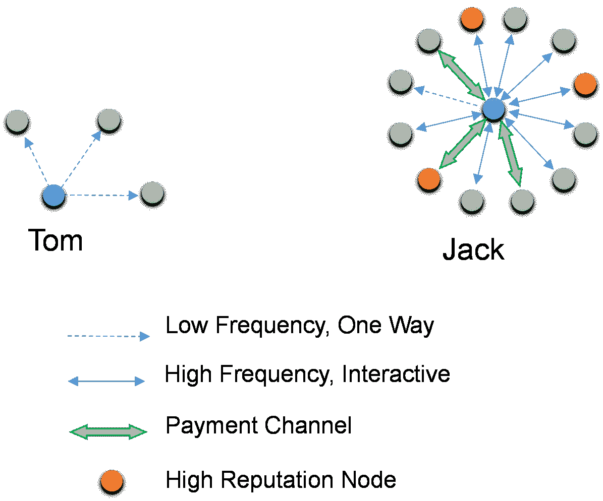

时间活跃度 T:该指标主要由用户所持公交车的币龄决定。我们认为，公交车的长期持有者比非持有者更可信，更不可能实施恶意行为。但与 PoS 共识不同的是，金钱并不是衡量一个节点是否值得信任的唯一标准。如图所示，T(β，T)的对数公式为广大普通用户获得高可信度提供了更好的机会。公式如下:

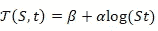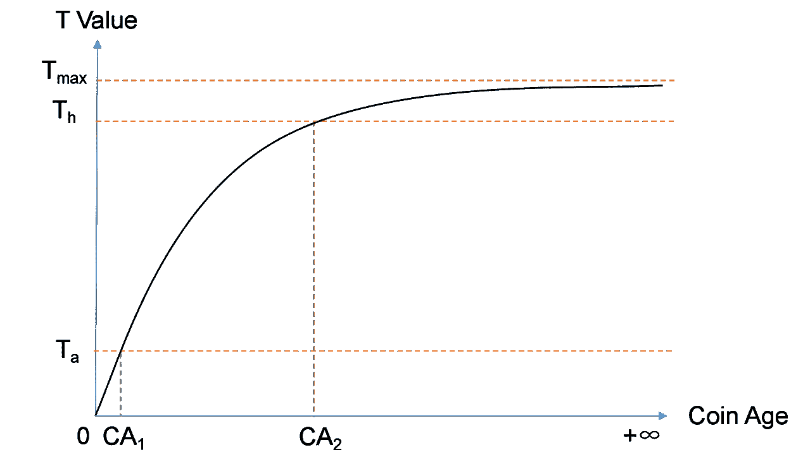

贡献活跃度 C:这个指标 C(γ，t)描述了一个特定的用户对系统所做的贡献的水平，表示当时间为 t 时，节点对系统贡献了多少，N 是账户 Nonce 的值，用来记录用户贡献(存储或计算)的频率。系统将按时间间隔检查文件的有效性。

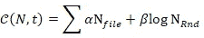

**3.4 共识流程**

POR 的共识过程分为两个部分:

(1)定义交易验证者的列表

(2)通过拜占庭容错过程验证交易

定义交易验证器，在区块链网络中，有 N 个用户，每个用户有一个信誉值 R，根据每个节点的信誉 R，会选出 N 个 R 高的节点作为列表 l

有两种事务验证器:完全节点候选和轻节点候选。

全节点用户可能来自商业开发者或 Bitconch 生态系统的其他社区。由于光节点可以在智能手机和家用电脑等设备上运行，几乎所有用户都可以成为光节点的候选对象。所有节点和轻节点共同贡献的方式不仅可以激发商业开发者和普通用户的热情，还可以抑制可能出现的集中化趋势。

L 中的事务验证器通过拜占庭容错过程来验证网络中的新事务。成功验证的交易记录在系统的分布式账本中，同时增加相应节点的信誉值。当有限的恶意节点存在时，拜占庭容错过程仍然可以为系统提供安全性和活动性保证。

**3.5 交易验证器**

L 列表中的事务验证器轮流参与验证过程。每轮运行一个拜占庭容错协议来验证新生成的事务。如果 L 中的所有节点都同意，则交易被确认。

根据每个节点的当前 R 值和一个分布函数 d 来选择 l，对于节点 x，他的 Rx 越高，越容易被记录在 l 中。

节点被 P 选入 L 的概率如下:

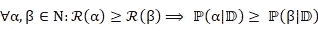

选择方法如下:

根据 R 按降序对所有节点进行排序。基于 D，在[0，N]中产生 m 个随机数，然后取所有这些随机数的底，我们得到选定的节点。为了避免双重选择，我们选择最接近但未被选择的具有较高信誉的节点。如果这样的 noa de 不存在，那么我们对较低评价的节点进行同样的处理。

分布函数 D 将是一个指数函数，因为指数函数根据其方差给予高评价节点优先权，并且可以强烈抑制排名较低的节点。

**3.6 拜占庭容错过程**

获得 L 后，POR 验证交易的正确性，并通过拜占庭容错过程更新分类帐。我们做出如下定义:

**非故障节点**:

遵守规则，正确无误地运行的节点。

**故障节点:**

出现错误的节点，包括超时、数据损坏和恶意行为(拜占庭错误)。

我们设定了以下初步条件:

*   节点用 1 或 0 表示交易验证结果。0 表示验证成功，1 表示验证失败。
*   所有诚实的节点在有限的时间内做出决定。
*   所有诚实的节点做出相同的决定。

信誉证明共识分为几个循环，每个循环有几轮，每轮会验证几个交易数据，所以 L(k)可以定义为第 k 轮的交易验证者列表。

共识过程:

*   最后几轮结束
*   有几笔未确认的交易 Tx0
*   这一轮产生了几个新的交易 Tx1。
*   Tx0 和 Tx1 被组合成待验证的事务列表 Tx。
*   Tx 会广播到 L(k)中的所有节点，L(k)中的节点会对交易进行验证，如果交易得到足够的节点验证，则交易会更新到分类帐。
*   如果 L(k)的恶意节点数小于 m/3，则该轮被定义为成功。L(k)中节点的贡献活跃度增加，对应节点的事务活跃度增加。

**3.7 数据结构和交易关系**

BITCONCH 使用 DAG 有向无环图。如图 1(a)所示，Tx0 是 Genesis 事务，即整个网络的第一个事务，初始用户由一个特殊的地址分配给 BITCONCH。Tx1、Tx2、Tx3、Tx4、Tx5、Tx6、…、Txn 是后续事务。因为每个事务都有一个时间(time)和一个顺序(order)，所以整个事务历史可以表示为一个有向无环图。

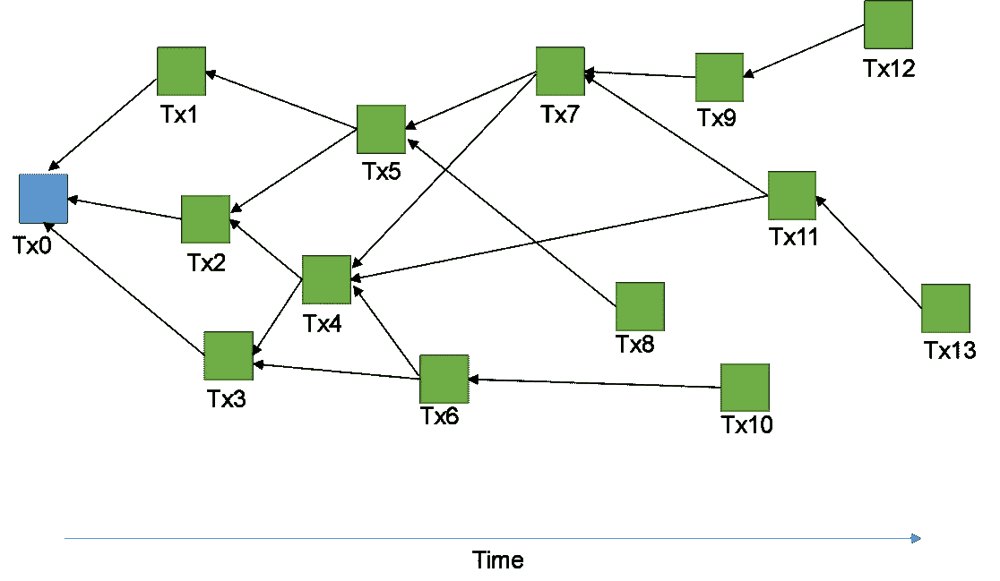

Figure 1（a）DAG Data Structure

Tx0 是充值节点 N1 的交易记录，对应于图 1(b)中的第一用户 N1。Tx1 是第二笔交易 N1àN2，即 N1 将部分 BITCONCHs 转到 N2，社交图中用户 N1 到 N2 会增加一条边，即 N1 和 N2 开始建立社交关系。随着交易 Tx 数量的增加，社交图中节点之间的边会越来越多，社交网络趋于成熟。

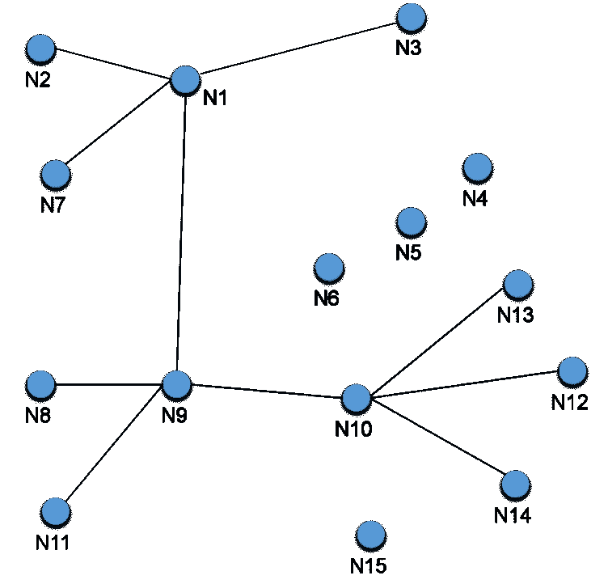

Figure 1（b）Social Graph

图 1(a)和 1(b)显示了 DAG 数据结构和社交图之间的交互。15 个用户从 Tx0、Tx1 到 Tx13 产生了 14 笔交易，建立了如(b)所示的社交关系。

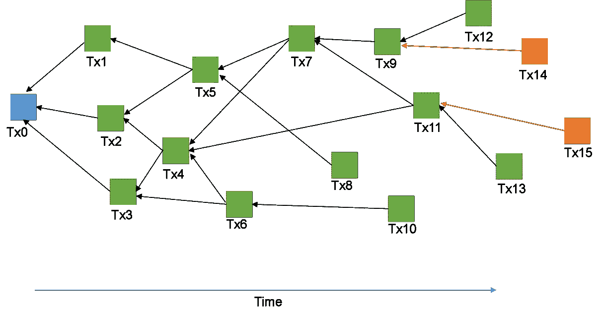

Figure 2（a）New Transaction and Verification

如图 2(a)所示，生成了新的事务 Tx14 和 Tx15。其中 Tx14 表示 N1 向 N4 传送 n 个比特大陆，Tx15 表示 N5 向 N1 传送 n 个比特大陆。如果 m>n，根据公式(3)，交易金额与 E 值正相关，对于信誉贡献，Tx14 的权重大于 Tx15。随着交易的不断增加，社交图中各个节点之间的链接也在不断增加，从而提供了更多的社交数据来提供信誉值。

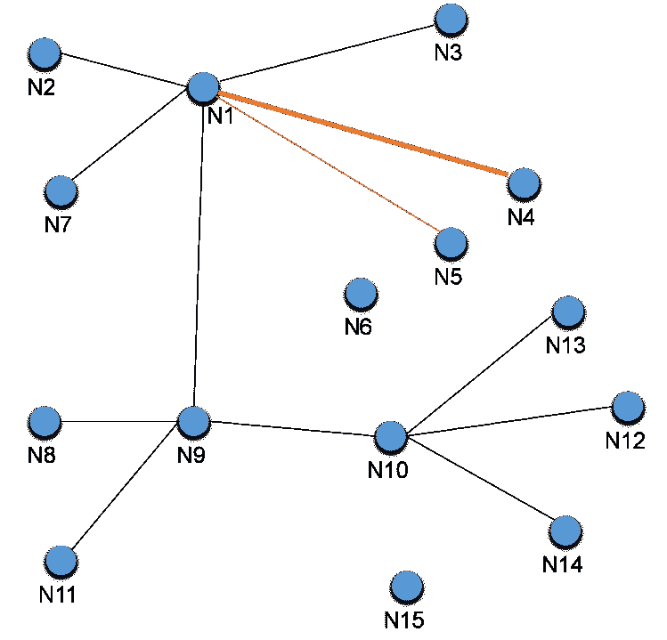

Figure 2（b）New Transaction and Social Graph

图 2(a)还展示了系统处理并发事务的能力。当 Tx14 和 Tx15 同时生成时，系统可以并发生成多个拜占庭容错进程，提高交易验证的效率。

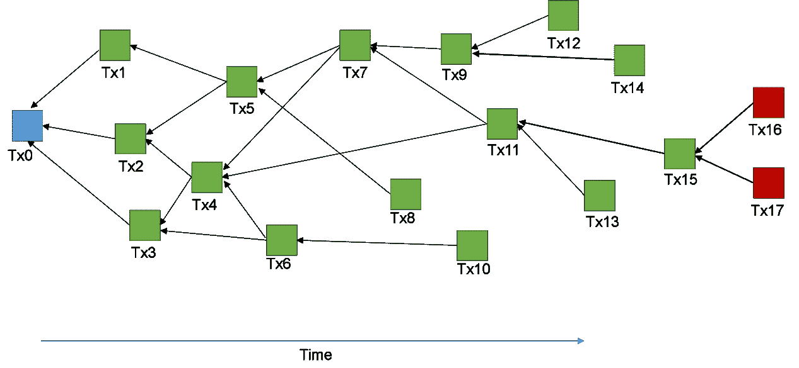

Figure 3 Double Spending

如图 3 所示，如果系统有双支出交易 Tx16 和 Tx17 (N1 是恶意节点)，由于拜占庭容错过程的确定性，即使 Tx16 和 Tx17 同时被确认，当其中一个更新到账本时，另一个也会因余额不足而被丢弃，从而避免了双支出攻击的发生。恶意 N1 节点将被追溯并受到惩罚，信誉值将被降低，并且交易验证者的资格将被取消。因为 N1 的成本远远高于潜在的利益，N1 成为恶意节点的可能性极低。

**3.8 POR 系统激励**

所有 500 亿比特海螺币都将在没有开采的情况下产生。20%(100 亿比特币)将作为 POR 信誉共识的初始奖励池。所有节点(全节点和轻节点)将有相同的机会被选中参与共识并获得奖励。

除了 100 亿初始 BITCONCHs，奖励池还将不断得到商业生态系统的收益补充，如交易费、应用开发费、推广收入等。可持续的奖励池保持了节点的积极性，有助于生态系统的持续健康发展。

BITCONCH 链由全节点和轻节点组成，由用户根据自己的装备和兴趣选择。全节点和轻节点将按 3:2 的比例分享系统奖励。

一旦 mainnet 上线，持有 ERC20 BITCONCH 令牌(总共发行了 10 亿个)的用户可以通过 1:50 的交换比率迁移到 mainnet。

**3.9 POR 共识规则概要:**

1.BITCONCH 链采用类似以太坊的账户结构。每个用户都有一个账号，账号记录了每个用户的 BITCONCH 余额和信誉值。

2.互信节点(MTN)用户可开通小微交易支付通道，初始化线下高速交易。

3.具有可信度的诚实节点由 R 动态选择以形成交易验证者的列表 L。

4.诚实节点可以通过贡献计算能力来维持系统的完整性，从而获得系统奖励。

5.相互信任的节点之间的大量交易以及不相互信任的节点之间的交易由交易验证器来验证。

**3.10 POR 与各种共识机制的比较**

从下表的对比可以看出，POR 信誉共识机制不仅在支持高吞吐量和高并发方面表现出色，而且具有正的可扩展性，用户越多，事务处理速度越快。在保持低使用费的同时，通过信用激励保持整个社区的参与积极性，保持整个网络的去中心化。

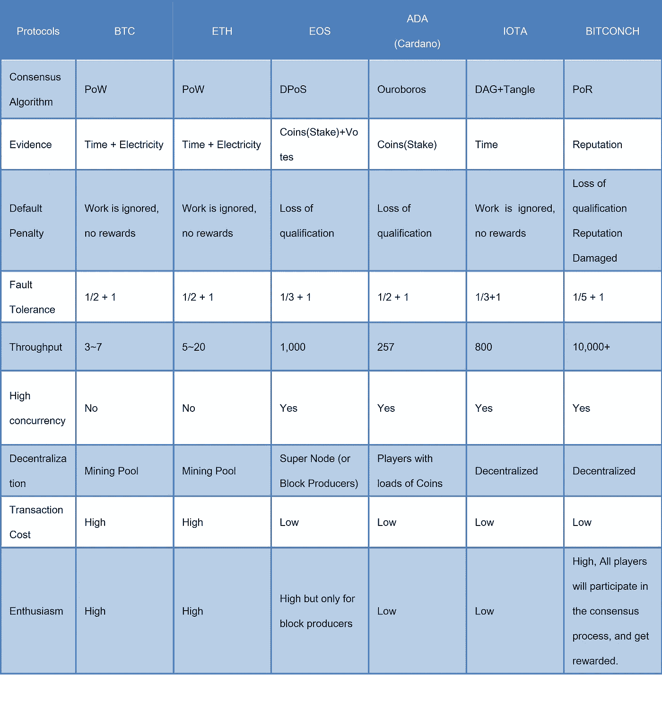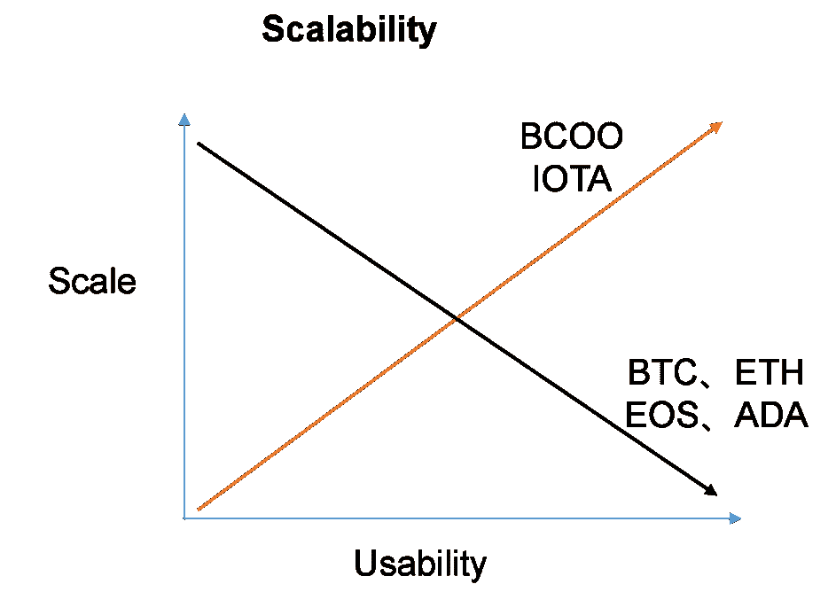

## **4。其他突破**

**4.1 零知识证明**

BitConch 通过零知识证明技术加密交易细节来保护用户隐私。现有的区块链，如比特币和以太坊，将大规模的账本数据分布在不受信任的网络节点上，链上存储的信息是完全公开的。即使用户每次都使用了新地址，攻击者仍然可以通过分析用户的习惯、消费金额、交易时间等信息来确定用户的真实身份。

零知识证明通过加密交易细节保护用户隐私。零知识验证使用 ZKP 体系结构，在该体系结构中，证明者可以向验证者证明他或她拥有某种信息(例如加密密钥中的私钥),而无需透露信息的内容。

**4.2 瘦客户机**

现有区块链(比特币或以太坊)的客户端会随着网络节点数量的增加、速度的减慢、成本的提高而变得越来越大，超出了普通用户的承受能力。不可避免的是，大部分普通人难以参与到系统过程中，资源和计算能力更加集中在少数参与者手中，形成马太效应。

BitConch 链通过快照和分布式哈希表(DHT)实现轻型节点。简化的光节点可以在低配置设备上运行，包括智能手机、家用电脑等。，参与系统计费。几千万的光节点有利于对抗中心化，保证系统的去中心化。

**4.3 智能合约和分叉管理**

BitConch 将提供开发工具包，这将允许社区开发人员生成可修改的智能合同模板。基于 BitConch 提供的模板和规则，用户可以开发易于升级和管理的智能合约。

由于区块链数据不可更改的理念，任何修改都将导致潜在的分歧，因此对于智能合约或类似的重大股权变更，BitConch 使用投票方案。利益相关者将在某个时间用自己的股份进行投票，以确保社区之间达成共识。

**4.4 防量子加密算法**

非对称加密算法(Asymmetric)，如 ECC256、SHA256、SHA3 等。，用于传统的区块链，如比特币和以太坊。这些加密算法可以被量子计算机破解。

目前认为抗量子攻击的密码系统包括:哈希密码系统、编码密码系统、格密码系统、多元二级密码系统、密钥密码系统。当密钥长度足够长时，上述密码系统可以抵抗经典攻击和量子攻击。为了应对量子计算机时代的到来，BitConch 将采用密码算法对抗量子攻击。

**4.5 BVM 和编程语言**

Bitconch Chain 通过提供各种工具使开发人员能够构建自己的分布式应用程序，丰富了 Bitconch 生态系统。Bitconch 链提供了基于 solidity 的编程语言 BO 和对应的虚拟机 BVM，如下图所示。在 Bitconch 链条上，开发者通过编程语言将业务逻辑翻译成智能合约，智能合约会被编译成机器可以通过虚拟机运行的字节码。

与 EVM 相比，BVM 有三大优势:

1.  使用 BVM 可以更容易地开发强大的智能合约。

相比以太坊的 65 个操作码，Bitconch Chain 将提供更多可选的操作码和标准库，供开发者开发更多高质量的 DApps，扩展更多社交和落地应用的功能。由于智能合约中通常会有大量的令牌，一旦出现错误，会给开发者和用户都造成巨大的损失，所以 BVM 会提供智能工具来检测交易顺序、时间戳、事故处理和重入漏洞(Reentrancy)等常见的 bug。为了提高开发速度并使开发人员更容易编写智能合同，BVM 将是一个基于注册的虚拟机。

2.BVM 提供了一个接口，使智能合约能够与外界通信。

相对于 EVM 的沙盒环境和外界隔离(无法使用网络、文件或其他进程的权限)，BVM 通过数字签名建立传输通道，解决智能合约与外界的通信问题。

3.支持多语言开发

为了让更多开发者加入 BitConch 社区，BVM 未来将支持 Python、Java、C++等开发语言。

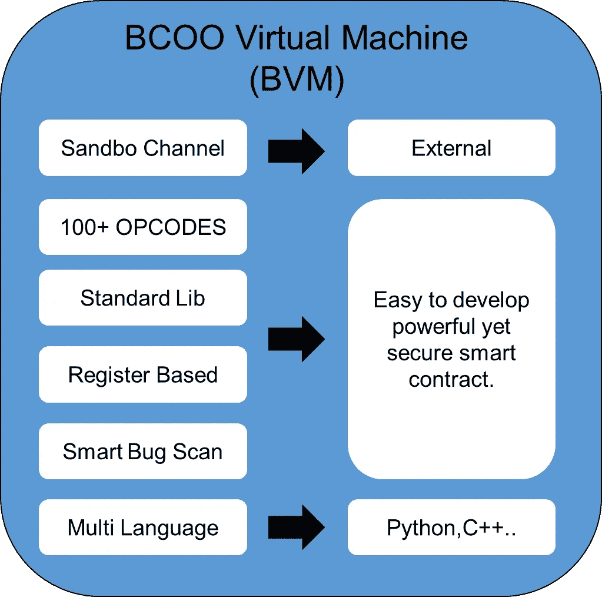

**4.6 侧链**

Bitconch 支持不同的挂钩机制(双向挂钩)来实现主链和侧链的联合。Bitconch 将为开发者提供侧链开发模板。在未来的应用场景中，作为主链的 Bitconch 将主要提供可信记账和信誉管理，更多多样丰富多彩的商业功能将开放给社区在自己的侧链上开发。比如 Bitconch 会提供分布式存储能力，开发者可以在自己的侧链上实现文件存储、多媒体等功能。

## **5。系统架构图**

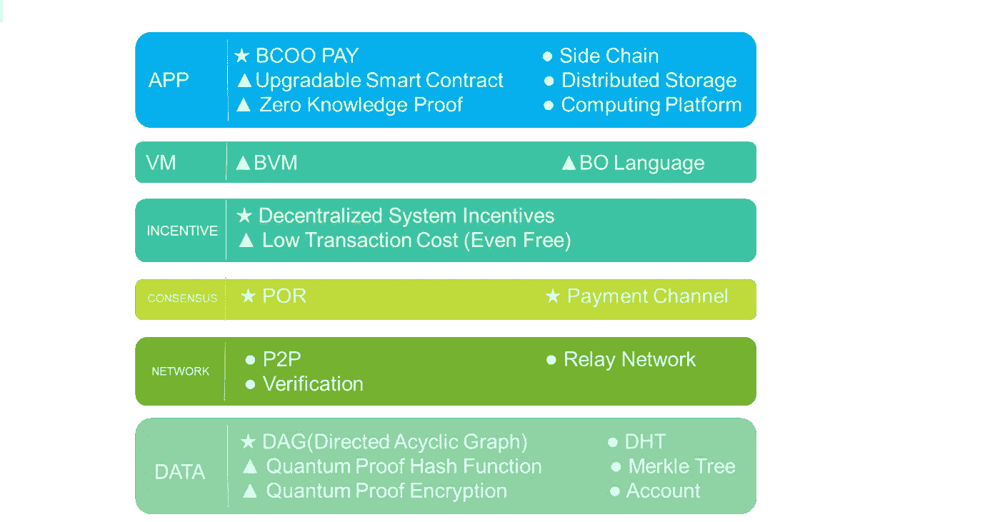

注意:

▲项基于目前使用的最先进的技术或算法；

★该项为具有自主知识创新和核心竞争力的技术或算法。

## **6。真实世界应用场景展望**

**6.1 比特海螺付**

目前，Bitconch PAY 由 Bitconch R&D 团队开发和运营，并已在 IOS 和 Android 上推出。Bitconch PAY 集成了关键功能，如密钥管理、智能支付以及本地商业应用程序或其他商业应用程序的入口点。未来，Bitconch 主网上线后，Bitconch PAY 将成为 Bitconch 轻节点客户端。

**6.2 其他可能的应用和技术支持**

Bitconch Chain 为开发者提供了友好的侧链和 DApp 开发环境。Bitconch 基金会还将为重要的社交应用提供技术支持和项目孵化服务，帮助用户通过更多的应用产品快速建立社交图谱和个人口碑。下表列出了一些可预见和可预测的应用，并对产品本身的技术要求和 Bitconch 能够提供的技术支持进行了分析和比较。

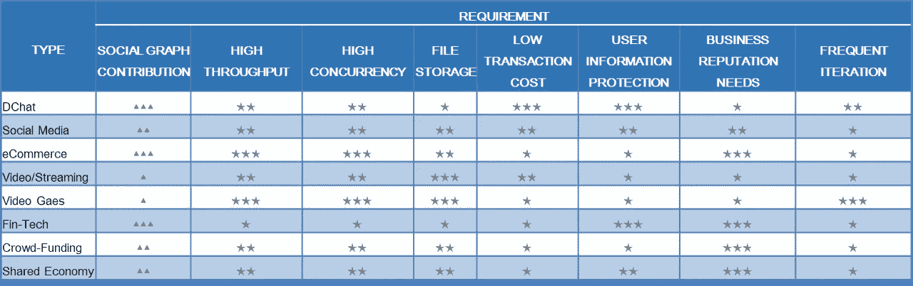

▲:表示应用程序在 Bitconch 链 POR 共识中的贡献程度。三角形数量越多，贡献越大。

★:代表应用对特定需求的重要性，五角星越多，需求越高。

Bitconch 主网络和侧链之间的交互如图 4 所示。大部分商业应用可能运行在侧链上，交易信息记录在主网上，信誉数据反馈给主网。虽然每个应用都有自己的流量，但用户之间不可避免地存在交互(见图 5)，这勾勒出了更丰富的社交图和生态系统。商业应用开发者因为有更多的社会关系和频繁的交易，可以积累更高的信誉。信誉越高，被选为“交易验证者”的概率越高，获得的系统奖励就越多。

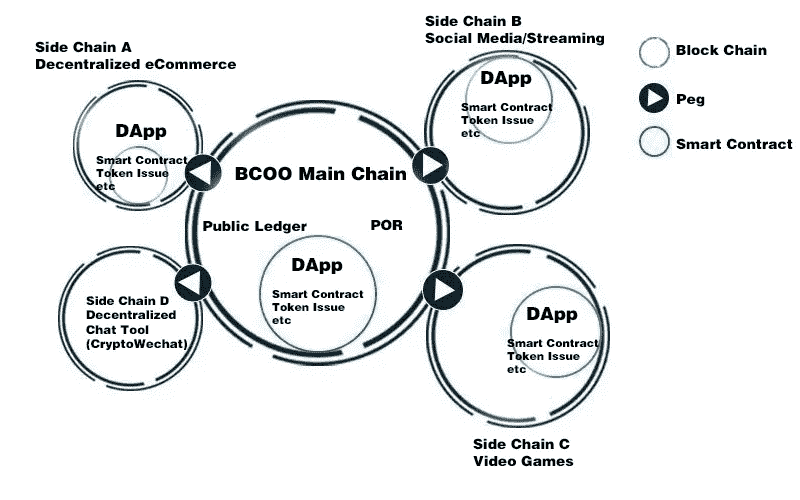

Figure 4\. Interaction diagram between BitConch main network and side chain

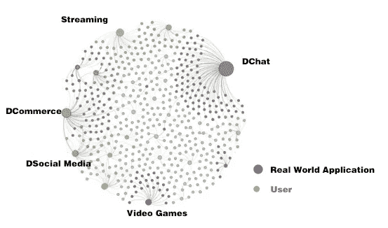

Figure 5\. Traffic sharing that may exist between applications

## 结论

Bitconch 提出了 POR 信誉共识算法的创新，基于社会图的分散信誉体系和激励机制。这项创新通过应用以下列举的技术、特征和工艺，满足了大规模商业应用的要求。该平台的解决方案集特别支持高频微交易和社交网络，并确保可扩展性、安全性和去中心化。

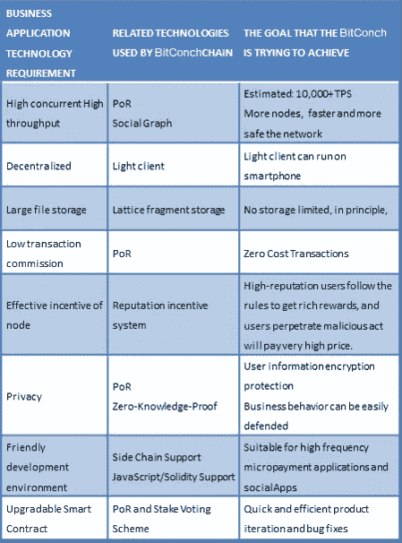

## 8.参考

1.尼克·萨伯。公共网络上关系的形式化和安全化。1997 年 2 月 9 日第一个星期一

2.回过头来，“Hashcash —拒绝服务对策”，[http://www.hashcash.org/papers/hashcash.pdf.](http://www.hashcash.org/papers/hashcash.pdf.)2002 年

3.维塔利科·布特林。以太坊:下一代智能合约和分散应用平台。2013

4.加文·伍德。以太坊:一个安全的分散通用交易分类账。2018

5.戴，《b-money》，【http://www.weidai.com/bmoney.txt.】1998 年

6.安德烈亚斯安东诺普洛斯:掌握比特币:解锁数字加密货币。2014

7.谢尔顿·m·罗斯。概率的第一课。2009

8.纳什·约翰。《非合作博弈》数学年鉴。1951

9.施莱格尔:声誉货币。客户体验研究所。

10.Marko Vukoli:寻求可扩展的区块链结构:工作证明与 BFT 复制。2016

11.亚当·贝克，马特·科拉罗:用挂钩侧链实现区块链创新

12.维塔利克·布特林:Zk-SNARKs:引擎盖下

13.伊莱·本·萨松:零现金:来自比特币的分散匿名支付

14.Petar Maymounkov : Kademlia:一个基于异或度量的对等信息系统

15.VM:以太坊虚拟机的完整语义

16.L. LamPoRt，从单向函数构造数字签名，SRI-CSL-98 技术报告，SRI 国际计算机科学实验室，1979 年 10 月。

17.“温特尼茨一次性签名方案”[https://gist.github.com/karlgluck/8412807#comment-1258433](https://gist.github.com/karlgluck/8412807#comment-1258433)

了解更多关于 Bitconch Chain 的信息:

推特:【https://twitter.com/bitconch 

电报:【https://t.me/BitconchOfficial 

[脸书](https://www.facebook.com/2133375926945893)

github:[https://github.com/BitConch/BUS](https://github.com/BitConch/BUS)