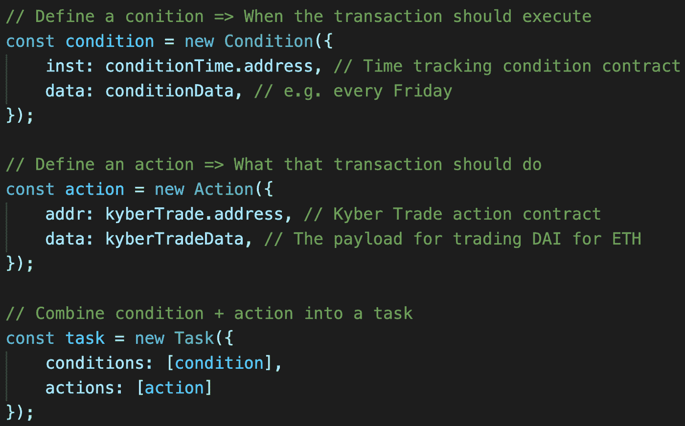

# 如何通过意式冰淇淋用 4 个步骤构建自动化 dApp

> 原文：<https://medium.com/coinmonks/how-to-build-an-automated-dapp-in-4-steps-with-gelato-633f12206a8e?source=collection_archive---------2----------------------->

意式冰淇淋使开发人员能够快速构建自动化的 dapps，而不必担心构建、部署和运行必要的 bot 基础设施来支持它。

[意式冰淇淋网络](https://gelato.network/)是一个机器人基础设施，带有一个简单的、经过审核的链上 API，允许开发人员构建几乎任何类型的自动化 dapp **。**

Dapp automation 包含任何类型的自动智能合约功能执行，例如每周购买 ETH、自动化产量养殖或在 Uniswap 等 DEX 上下达简单的限价买入或卖出订单。哪些任务应该自动化完全取决于开发人员的想象力。

使用意式冰淇淋来自动化你的 dapp 不仅仅意味着你可以使用它的基础设施，它还带来了很多经过审核的代码可重用性，这取决于你的用例需要的定制程度。请[联系我们](https://t.me/joinchat/HcTaO)了解您的具体需求，我们将确保帮助您为您的具体自动化用例准备好智能合同。

在任何情况下，为了利用意式冰淇淋为您自动完成任务，您需要做 4 件事情。为了让您了解它们，我们将从一个开发者的角度出发，他想要构建一个 [dapp](https://blog.coincodecap.com/what-are-dapps-an-ultimate-guide) 来为其用户提供 [DAI-Cost Averaging](https://www.investopedia.com/terms/d/dollarcostaveraging.asp) ，这是一种在更长的时间范围内投资 ETH 的流行投资策略。换句话说，这个 dapp 允许用户在 Uniswap 这样的分散交易平台上通过 DAI 定期自动购买 ETH，以平衡 ETH 波动的影响。关于本演示的详细**技术** **演练**，请访问我们在 Github 上的[教程](https://github.com/gelatodigital/gelato-uniswap)。

要创建如上所述的自动化 dapp，只需按照以下 4 个步骤完成提交意式冰淇淋任务:

## **第一步:定义要自动化的任务**

一个意式冰淇淋任务就是**条件**——何时执行交易——和**动作** —交易应该执行什么——智能合约的组合。意式冰淇淋已经为你编写和部署了许多条件和行动，但你也可以创造自己的条件或[请求我们](https://t.me/joinchat/HcTaO)来帮助你。对于这个例子，任务是每周五在 Kyber 上为 WETH 销售 DAI，并且在 Javascript 中看起来像这样:

## **步骤 2:为您的用户部署代理智能合约**

为了让您的用户能够向意式冰淇淋提交他们的自动化任务，您必须确保您的用户由代理智能合同链代表。你可以重复使用流行的智能合同钱包，比如 Gnosis Safe、DappHub 的 DSProxy 或意式冰淇淋自己的审计代理合同。在这种情况下，您只需通过他们的一个工厂，为您的每个用户部署一个代理契约。从技术上来说，每个用户只需做一次，您可以重用已部署的用户代理实例，用于以后的任务自动化。或者，您的 dapp 可能是所有与意式冰淇淋交互的代理，在这种情况下，您只需在您的 dapp 中包含一个向意式冰淇淋本地提交任务的功能。

这个代理要求允许用户不必在线执行任务。取而代之的是，他们批准他们的代理来执行他们想要自动化的任何操作，例如，从用户的钱包中交换资金。当他们指定的条件被满足时，机器人将通过他们的代理执行动作。在执行时，代理将允许用户移动资金，并且由于它们是智能合约，将能够执行任何 dapp 逻辑。这是自动化的关键，因为这意味着用户不需要在任务执行时手动签名或发送事务。请注意，这也意味着用户在技术上永远不必放弃对其资金的托管，以便在自动化操作中使用它们。意式冰淇淋不实行监禁。

## **第三步:让用户通过代理在意式冰淇淋上存放 ETH**

意式冰淇淋的 bot 基础设施以现收现付的方式执行任务。用户支付机器人产生的天然气费用，外加少量奖励和协议费。[意式冰淇淋使用 Chainlink 的快速天然气价格 oracle，](https://twitter.com/chainlink/status/1279040177973927936?s=20)确定在执行时要支付的公平天然气价格。因此，你的用户将不得不在意式冰淇淋上保持一个 ETH 平衡，以补偿机器人的自动任务执行。一个很好的比喻是，用户必须在冰淇淋上加满他们的“油箱”余额。请记住，与 gelato 的所有互动都必须通过智能合同进行。因此，用户必须以其代理合同作为*消息发送方*存放资金

或者，如果你不想让你的用户自己负责油箱管理，其他人，比如道或者开发团队也可以选择为他们付费。反过来，他们可以得到补偿，比如从每笔自动交易中赚取佣金。这将在我们的 [Github 教程](https://github.com/gelatodigital/gelato-kyber#demo-part-2-pay-for-you-users-transactions-by-becoming-an-external-gelato-provider)的第二部分进一步解释。

**步骤 4:让用户通过他们的代理合同向意式冰淇淋提交任务**

最后一步，您只需要让您的用户通过他们的代理向意式冰淇淋提交他们的任务。Javascript 看起来会像这样。

就是这样！现在，gelato 的机器人网络将自动执行行动——每次指定的条件允许时——每个星期五——在 Kyber **用戴交换 ETH:**

## **开始构建您自己的用例！**

如果你是一名开发者，想要自动化 dapp 的某个方面，请通过 [Telegram](https://t.me/joinchat/HcTaO) 或 [Discord](https://discord.com/invite/Avmrfg7) 联系我们。我们的开发者文档还没有完成——很抱歉——但同时我们会用实际操作的方法帮助你。有利的一面是，我们将投入大量时间来帮助您构建您的特定用例，当然是免费的。另外，请务必查看我们的[教程](https://github.com/gelatodigital/gelato-kyber)，了解更多关于 gelato 的知识。

> [*在您的收件箱中直接获得最佳软件交易*](https://coincodecap.com/?utm_source=coinmonks)

