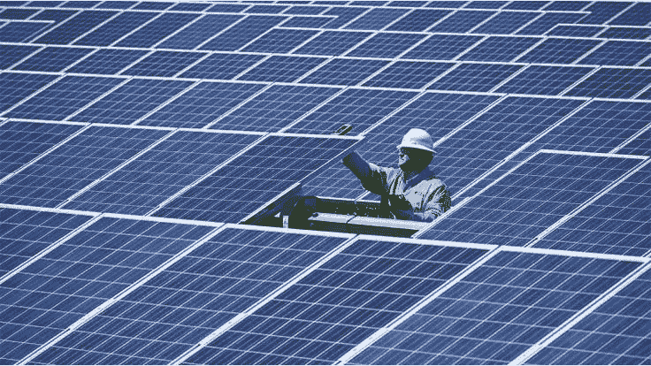

# 如何在区块链上建立能源市场

> 原文：<https://medium.com/coinmonks/how-to-build-an-energy-market-on-a-blockchain-c43b0cfc2d12?source=collection_archive---------1----------------------->

包括 Solidity smart 合同[让你开始](https://github.com/HQ20/contracts/tree/dev/contracts/examples/energy)。

> 人们总是害怕改变。当电被发明的时候，人们害怕它，不是吗？人们害怕煤，他们害怕燃气发动机……永远会有无知，无知导致恐惧。但随着时间的推移，人们会逐渐接受他们的硅主。—比尔·盖茨

# 介绍