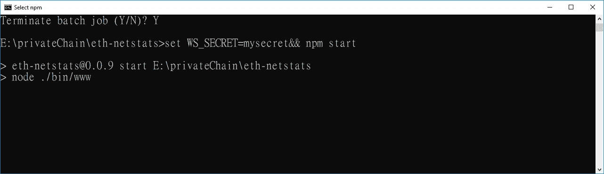

# 如何建立以太坊仪表板并监控您的以太坊网络状态

> 原文：<https://medium.com/coinmonks/how-to-build-ethereum-dashboard-and-to-monitor-your-ethereum-network-status-9f1941beac08?source=collection_archive---------0----------------------->

让我们建立一个可视化界面来跟踪以太坊网络状态，并报告任何关于私有/公共以太坊网络的信息。

# 仪表盘


# 体系结构

*   **eth-netstats :** 这是一个跟踪以太坊网络状态的可视化界面。它使用 WebSockets 从运行的节点接收统计数据，并通过一个角度接口输出它们。
*   **eth-net-intelligence-API:**这是一个后端服务，它与以太坊一起运行并跟踪网络状态，通过 JSON-RPC 获取信息，并通过 WebSockets 连接到 [eth-netstats](https://github.com/cubedro/eth-netstats) 以提供信息。有关完整的安装说明，请阅读 [wiki](https://github.com/ethereum/wiki/wiki/Network-Status) 。
*   **以太坊节点(可以是私有节点，也可以是公共节点)**

> [发现并回顾最佳区块链分析软件](https://coincodecap.com/category/blockchain-analytics)


# 先决条件

*   eth、geth 或 pyethapp—[https://geth.ethereum.org/downloads/](https://geth.ethereum.org/downloads/)
*   节点—[https://nodejs.org/en/](https://nodejs.org/en/)
*   npm
*   https://git-scm.com/ T21


***下面是步骤:***

1.  执行以太坊私有/公共节点
2.  下载并安装工具
3.  配置节点监控应用程序
4.  启动节点应用程序
5.  启动前端

# 文件夹结构


# 1.执行以太坊私有/公共节点

如果你不熟悉如何做到这一点，请参考我以前的文章，一步一步的指导。要执行以太坊私有节点以下命令:

```
geth --networkid 4224  --datadir "E:\privateChain\GethPrivateChain" --nodiscover --rpc --rpcport "8545" --port "30303" --rpccorsdomain "*" --nat "any" --rpcapi eth,web3,personal,net --unlock 0 --password password.sec
```


# 2.下载并安装工具

要克隆和安装 [eth-netsates](https://github.com/cubedro/eth-netstats) 运行以下命令:

```
C:\> git clone [https://github.com/cubedro/eth-netstats](https://github.com/cubedro/eth-netstats) 
C:\> cd eth-netstats 
C:\eth-netstats> npm install 
C:\eth-netstats> npm install -g grunt-cli
C:\eth-netstats> grunt
```


要克隆并安装[eth-net-intelligence-API](https://github.com/cubedro/eth-net-intelligence-api)，请运行以下命令:

```
C:\> git clone [https://github.com/cubedro/eth-net-intelligence-api](https://github.com/cubedro/eth-net-intelligence-api) 
C:\> cd eth-net-intelligence-api 
C:\eth-net-intelligence-api> npm install 
C:\eth-net-intelligence-api> npm install -g pm2
```

# 3.配置节点监控应用程序

我们需要修改位于`eth-net-intelligence-api`目录中的`app.json`文件:

该文件中需要更改的配置很少。

*   `"name"`:将出现在`pm2`流程管理器中的节点应用程序的名称(参见下一节关于`pm2`的更多细节)
*   `"RPC_HOST"`:运行`geth`实例的机器的 IP 地址
*   `"RPC_PORT"`:您的`geth`实例正在其上运行的 RPC 端口
*   `"LISTENING_PORT"`:您的`geth`实例的网络监听端口
*   `"INSTANCE_NAME"`:该特定节点将出现在浏览器仪表板上的名称
*   `"WS_SERVER"`:后台运行的前端 UI(即`eth-netstats`)的服务器地址
*   `"WS_SECRET"`:用于允许前端连接`eth-net-intelligence-api`的秘密。你可以选择任何值放在这里。

在 app.json 中，我们需要修改三个参数，分别是`**INSTANCE_NAME**, **WS_SERVER**` 和`**WS_SECRET**.`

可以得到`**INSTANCE_NAME** from private chain information.`


`**WS_SERVER** will point **eth-netstats** so we use **eth-netstats'** default url **:**` [http://localhost:3000](http://localhost:3000)

`We set **WS_SECRET = "**`我的秘密`**"**`

最后 app.json

## 4.启动节点应用程序

4.1 我们执行后端工具(**eth-net-intelligence-API**)运行以下命令:

```
C:\eth-net-intelligence-api> pm2 start app.json
```

结果


4.2 执行前端工具(eth-netstats)运行以下命令:

```
C:\eth-netstats> set WS_SECRET=mysecret&& npm start
```


## 4.3 问题:

你可能会遇到两个问题- **无动作**和**错误授权**

**4.3.1 无动作**



## 解决方案:

我的解决方案是再次重启 eth-net-intelligence-api

```
C:\eth-net-intelligence-api> pm2 start app.json
or  C:\eth-net-intelligence-api> pm2 restart <App name>
```


**4.3.2 错误 auth 如下图。**


## 解决方案:

我的解决方案是检查我的命令和 ws_secret，重启**eth-net-intelligence-API**，然后再次运行我的 **eth-netstats** 命令。

```
C:\eth-netstats> set WS_SECRET=mysecret&& npm start
```

# 5.启动前端

在您的网络浏览器中访问 [http://localhost:3000](http://localhost:3000/) 。如果您注意到监控仪表板中没有列出任何节点。这是因为当前没有运行 geth 的实例，或者您的 eth-net-intelligence-api 没有连接到该节点。


# 有问题吗？？

观看我的视频—[https://www.youtube.com/watch?v=xgf3zQNqYVM](https://www.youtube.com/watch?v=xgf3zQNqYVM)

*我这样做是因为我喜欢，但如果你想让我给自己买杯咖啡，我不会说不*

# 捐赠:

XEM:ncwzsuf 4 fpx jy 3 l3y 7657 qnvbiuz 5d 54 F4 tnj 64s

乙醚:0 xf 2d 15 deaf 62 b 8 C4 AFC 0343006579 e8e 662 c 120d 9

比特币:332 uiyafsxyvhqcygdgbknlfsf 25 ccnv 9 I

*   *** ***做拍手，评论，分享！我也欢迎任何出现的商机*****

[](http://bit.ly/2G71Sp7)

[**Click to read today’s top story**](http://bit.ly/2G71Sp7)