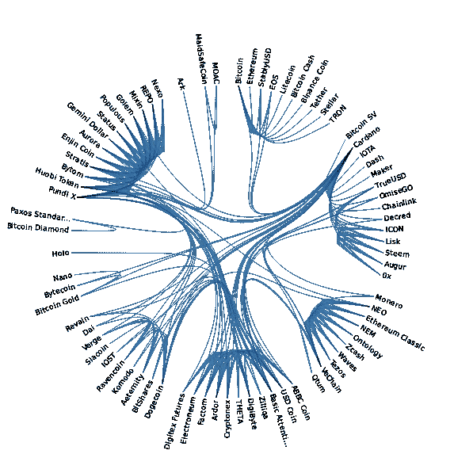

# 如何使用 Oraclize 基于原子交换构建自己的分散式交换

> 原文：<https://medium.com/coinmonks/how-to-build-your-own-decentralized-exchange-based-on-atomic-swaps-using-oraclize-3ee4858f128d?source=collection_archive---------1----------------------->

A depiction of how currencies could be swapped directly with Etherswaps, created with this [Observable](https://observablehq.com/@mbostock/d3-hierarchical-edge-bundling-ii)

几个月前，我有了一个想法，如何在不同的区块链之间交换加密货币，将验证留给智能合约而不是第三方。我受到了宇宙网络和他们如何在不同的区块链之间进行原子交换的启发。(因此可视化)。

有多个可靠的区块链浏览器 API 可供查询，以检查交易的有效性。然而，像 API 请求或随机数生成这样的非确定性计算在区块链世界是不可能的。事实上，如果两个节点计算“现实”的不同版本，区块链就会分叉，所以我必须找到一个变通办法，我做到了…

[Oraclize](http://www.oraclize.it/) 使得在智能合约中执行 API 请求成为可能。我将在最后解释他们的服务到底是如何工作的，但是现在，你应该记住，他们提供了一种值得信赖的从外部世界获取数据的方法。有了这个伟大的技术在我的口袋里，我已经建立了一个功能性的概念验证 Dapp，让你用比特币和恒星流明交换以太，你可以在 Etherswaps.co 的[找到。我将积极地引导你完成以太兑换比特币的过程，但在此之前，让我给你一个它是如何工作的概述。](http://etherswaps.co/)

Overview

如您所见，分散式交换机上的令牌交换通过三个简单的步骤完成。

1.  鲍勃在一份智能合约中锁定了他的以太，该合约定义了他想要兑换多少比特币。
2.  Alice 在市场上看到了该提议，并向 Bob 的比特币地址支付了等量的金额。然后，她使用[以太交换](http://etherswaps.co) Dapp 将交易散列提交给智能合约。
3.  之后，她将交易散列提交给智能合约，智能合约执行一个 [Oraclize](http://www.oraclize.it/) API 请求来检查交易是否有效。如果提交的金额是> = Bob 请求的金额(1 BTC)，智能合约会将资金发送到 Alice 的以太坊地址。

非常原则是**用户可以向智能合同**证明他们已经进行了正确的支付形式，这使他们有权接收锁定的以太网。

理论上，只要验证数据是公开的，人们甚至可以使用这个系统用以太或任何其他 ERC20 令牌交换法定货币。虽然它不能被认为是完全安全的，而且**不应该**用于生产，而只能用于测试网络，但它确实有一些有趣的特性。因此，让我带你经历一下用以太交换比特币的过程，并向你展示如何建立你自己的去中心化的交易所，在此基础上支持不同的货币。

# 如何使用它

让我向您展示在[以太交换 Dapp](https://etherswaps.co) 中执行令牌交换的 3 个步骤。我们将在智能合约中创建一个报价，并用以太网换取比特币。

**第一步**

转到[http://etherswaps.co](http://etherswaps.co)并用[元掩码](http://metamask.io)连接到 Dapp。然后在[http:**//**blockchain.etherswaps.co](http://bockchain.etherswaps.co)添加我的本地区块链实例作为定制 RPC。您也可以使用 Ropsten Testnet，但是在这一点上进行验证要慢得多。

如果您使用我的区块链实例，请导入以下存储有 100 以太的私钥之一，但请节约；)

*   *0x 7a 7 ce 0 fa 57 cf 26 a6e 5064 a 61 B1 ba 9135680 e 776956 BF 19d 26 f 6964 f 185 fcb 9 c 7*
*   *0 x7 fa 4 f 9979 b 728 b 9 a 58 C2 DC 7 ab 70 f 42e 735 a3 cef 135 ea 572 f 83 E8 a2 d 908 b 7289d*
*   *0x1bc 2129 af 5929d 2772 c 5599d 3 a9 da 8329 E1 C1 a 020980 e 3028710 CD 6a D2 f 55327*

Connect to the Dapp, import the Private Key and connect to the Custom RPC http://blockchain.etherswaps.co

**第二步**

继续[创建报价](http://etherswaps.co/#/createOffer)并输入所需的**比特币地址**、**比特币金额(Satoshi 中的**)和**乙醚金额**(Wei 中的)该报价对您来说是值得的。标签会自动显示最新价格。使用这个比特币地址*1 mfjvqrgryfvngsqjvt 3 xcahdwmcwairyq*并定义你要锁定的 *2 以太*为 *0.08876 BTC。*

因此，您应该键入以下内容:

*   **比特币地址**:*1 mfjvqrgryfvngsqjvt 3 xcahdwmcwairyq*
*   **比特币金额(以 Satoshi 计)** : *70 万*
*   **乙醚量(单位为微)**:*20000000000000*

将弹出一个元掩码页面，您可以确认交易的详细信息。

**重要的是**要提到的是，你应该只使用没有任何先前交易的“新”比特币地址，因为否则恶意方可能会发送错误的交易哈希，并免费索取你的以太网！(稍后将详细介绍安全性)。幸运的是，网站会进行自动检查，如果该地址收到了任何以前的交易，就会抛出一个错误(不过目前已被停用进行测试)。

The Dapp will update the live prices of Ether, Bitcoin and Lumens accordingly

**第三步**

接下来，我们将 0.007 BTC 发送到该地址，并提交事务哈希来声明以太网。幸运的是，我已经这样做了，你可以看到交易[在这里](https://www.blockchain.com/de/btc/tx/014ed2e6f875da84648fb38f5b39077f8d54466aecef371a4fe5f9f754088c46)发送 0.007 BTC 到我们的地址。

转到[市场页面](http://etherswaps.co/#/createOffer)并选择您刚刚创建了一个报价。理想情况下，您应该已经被重定向，正确的报价应该突出显示。当你点击它时，会弹出一个更详细的模式，允许你输入比特币交易的交易哈希。

*   **比特币交易哈希**:*014 ed 2 e 6 f 875 da 84648 FB 38 F5 b 39077 f8d 54466 aecef 371 a 4 Fe 5 f 9 f 754088 c 46*

然后用元掩码确认交易。在后台，发送底层智能合约的事务。它使用 [Oraclize](http://www.oraclize.it/) 执行一个 API 请求，以检查交易是否向相关联的比特币地址发送了正确的金额。如果是这种情况，智能合约会将存放的以太支付到您的以太坊地址，大约 30 秒后，您会收到一个通知，告知您金额已支付。

The Ether was payed out correctly!

# 技术堆栈

为了构建 Etherswaps 分散式交换机；我使用了以下技术:

*   **撰写智能合同**
*   **[**松露**](https://truffleframework.com/)[**加纳切**](https://truffleframework.com/ganache)[**混合 IDE**](https://remix.ethereum.org/) 和 [**Oraclize** **以太坊-桥**](https://github.com/oraclize/ethereum-bridge) 用于本地测试和开发**
*   **[**Web3Js**](https://web3js.readthedocs.io/en/1.0/) 和 [**MetaMask**](https://metamask.io/) 用 JavaScript 与区块链交互**
*   **[**React**](https://reactjs.org/) 和 [**物化 Css**](https://materializecss.com/) 为前端**
*   **[**Express**](https://expressjs.com/)[**Nginx**](https://www.nginx.com/)和 [**MongoDB**](https://www.mongodb.com) 用于服务网站和存储二级数据(不过我打算把 [**MongoDB**](https://www.mongodb.com) 换成 [**IPFS**](https://ipfs.io/)**

**让我更深入地介绍智能合约是如何工作的，Dapp 是如何与之交互的，以及存在哪些安全漏洞。**

****智能合约深潜****

**让我向您展示一个没有安全机制的**过于简化的**版本的智能合约，让您对它的工作原理有一个很好的了解。你可以在这里找到完整的合同代码。正如我提到的，它还没有被完全审计，不应该以任何方式用于生产。**

**Code example can not be compiled**

**很简单，对吧？**

**1.Ether 存储在契约中，表示要约的结构存储在 Map 中，以便以后可以引用(注意,`_bitcoinAddress` 变量 s 充当要约结构的标识符)**

**2.当用户提交他的事务散列时，调用`getTransaction`函数，事务散列又通过`oraclize_query`函数执行 Oraclize API 请求。发送者地址和`oraclizeID`与`bitcoinAddress`值对都存储在地图中。**

**3.在幕后，Oraclize 对该 [Blockchain.info API 端点](https://blockchain.info/q/txresult/014ed2e6f875da84648fb38f5b39077f8d54466aecef371a4fe5f9f754088c46/1MfJVqRgryFvnGSQjVt3xCAhdwmcwairYQ)执行 API 请求，该端点的形式为`https://blockchain.info/q/txresult/<txHash>/<address>`返回带有转账金额的单个字符串。Oraclize 确实允许您事先执行某种形式的 JSON 解析，因为在 Solidity 中解析 JSON 非常昂贵。事实上，在 Solidity 中进行任何管柱作业都会消耗大量气体，正如您在此处所见。Oraclize 收到数据后，将其发送至`__callback`功能。如果金额高于或等于预定义的`bitcoinWithdrawAmount`金额，被锁定的 Ether 会被支付到提交交易哈希的 Ethereum 地址。请注意它是如何从地图中将报价结构键`exists`设置为 false 来获得正确的`recipientAddress` 的，这样它就不能再次付款了。有点棘手，但完全管用！🙂**

**有了这个概念，人们可以集成**任何其他货币**只要有一个值得信赖的公共 API 来查找交易。要完全理解最后一部分以及如何整合其他货币，我们需要了解 Oraclize 在后台是如何工作的。**

****

**Oraclize ([Source](https://blog.oraclize.it/new-blockchain-integrations-and-beyond-e1a6d92bda85))**

**从他们的网站上:**

> **Oraclize 开发的解决方案是证明从原始数据源获取的数据是真实的，没有篡改。这是通过将返回的数据与一个称为真实性证明的文档一起提供来实现的。真实性证明可以基于不同的技术，例如可审计虚拟机和可信执行环境。**

**本质上，Oraclize 运行一个监控特殊智能契约的节点，该契约接收对 API 请求的查询。当另一个智能契约使用 API 查询调用特定函数时，Oraclize 节点会注意到它并执行 API 请求。创建一个真实性证明，然后他们调用您的智能合同中的`__callback`函数，将 API 请求的返回结果作为输入传递给它。您可以在这个[站点](http://app.oraclize.it/home/test_query)预先测试您的 Oraclize 查询。**

**总而言之，Oraclize 提供了一种值得信赖和可靠的方法来从外部世界获取数据。我的 Github 库的 [README 深入介绍了如何测试它，以及如何在您的本地机器上使用 Oraclize，我强烈建议您亲自尝试一下。](https://github.com/markusait/ethereumSwap)**

****

****React 和 Web3 上的一些文字****

**我曾经用 React 构建客户端前端，用 Express 构建后端。使用 JavaScript Web3 库，前端能够与合同交互，允许用户使用元掩码并在交易完成后获得通知。对于测试，我推荐使用 Ganache 的 web3 提供者。我还**高度**推荐经常检查你是否使用了正确版本的 Web3。1.0 版本中有一些突破性的变化，使用错误的版本会导致一些非常奇怪的错误。**

**总的来说，Web3 是一个相当新的库，完全依赖它来显示智能合同数据在这一点上仍然不是很直观和粗糙。因此，我结合使用 MongoDB 和 express API 来本地存储报价数据。**

**虽然这使得它更加集中，并留下了安全漏洞，但它仍然可以很容易地被分散的 [IPFS](https://ipfs.io/) 文件存储系统所取代。你可以在这里找到更多关于行星间文件系统和它如何以分散的方式存储数据[以及如何实现它](https://ipfs.io/)[这里](https://medium.com/coinmonks/ipfs/home)。**

****安全注意事项****

**当然，集中式数据存储并不是唯一的安全漏洞。除了双重支出攻击的常见问题之外，由于合同没有被完全审计，智能合同错误也可能发生。不过，我想指出三个安全方面。**

1.  **我留了一个后门，如果出价的原主人决定不再交换他的乙醚，我就付给他。因为这留下了一个额外的安全漏洞(如果数据更新得太晚，用户可能会试图兑换不存在的报价),所以我没有在 UI 中实现它，只是在智能合约代码中实现了它。**
2.  **你们中的一些人可能已经发现了另一个安全漏洞，它基于首先创建比特币交易，然后将其提交给智能合约的异步特性。恶意方可能会等待比特币地址的交易，并通过首先提交交易哈希来在您之前申请以太网。为了解决这个问题，用户必须在交易元数据中写下他的以太坊地址(l[ike that](https://chain.so/tx/BTC/6dfb16dd580698242bcfd8e433d557ed8c642272a368894de27292a8844a4e75))，这样智能合约就可以验证正确的地址是否试图要求以太。这也在智能契约中实现了，但是为了保持简单，还没有在 UI 中实现。**
3.  **出于测试目的，我留下的另一个安全漏洞是注释掉下面一行:**

****

**All offers are stored in the deposit map**

**这允许所有用户使用相同的地址创建多个报价。**

**最后，要提到的另一个重要方面是，块浏览器数据可能不准确，或者服务器可能停机。虽然不可用的服务器不是问题，因为事务哈希可以稍后提交，但是块浏览器服务仍然需要很大的信任，这就引出了我的最后一个主题:**

****你需要信任的人****

**与任何金融服务一样，在与它交互时，仍然需要信任。事实上，任何使用以太网交换的人都必须信任 4 方:**

**1.请更改服务以正确显示数据。然而，他们在公开验证方面做得很好。你可以在这里找到更多关于它的**

**2.Block Explorer API，合同目前使用的是 [Blockchain.info](https://blockchain.info/) 和官方的 [Horizon Stellar API](https://horizon.stellar.org/) ，其他大型交易所也依赖这些 API**

**3.智能合约本身。请注意，它没有经过安全审核，不应用于生产**

**4.运行网站的服务器，以正确显示数据。然而，任何人都可以自己主持。**

# ****结论****

**正如你所看到的，这种分散的交换并不是没有信任的。人们仍然必须相信不同的党派。然而，它有效地降低了中间人和交易成本，同时提供了一种简单而廉价的方式来交换区块链上的代币。通过智能合约异步进行验证，它比任何主要的交易所都更加分散，甚至比其他分散的交易所更加分散。交换硬币不需要注册或监管，任何人都可以提供这项服务，这不是很棒吗？**

**最后，我想提一下，这个项目对我来说是一次很好的学习经历，我想对 Oraclize 大呼一声，他们在他们的 [Gitter](https://gitter.im/oraclize/) 频道回答了各种问题，真的很有帮助。请注意，我是**而不是**与 Oraclize 有任何形式的关联，以上观点仅代表我个人。**

> **加入 Coinmonks [电报频道](https://t.me/coincodecap)和 [Youtube 频道](https://www.youtube.com/c/coinmonks/videos)获取每日[加密新闻](http://coincodecap.com/)**

## **另外，阅读**

*   **[复制交易](/coinmonks/top-10-crypto-copy-trading-platforms-for-beginners-d0c37c7d698c) | [加密税务软件](/coinmonks/crypto-tax-software-ed4b4810e338)**
*   **[网格交易](https://coincodecap.com/grid-trading) | [加密硬件钱包](/coinmonks/the-best-cryptocurrency-hardware-wallets-of-2020-e28b1c124069)**
*   **[密码电报信号](http://Top 4 Telegram Channels for Crypto Traders) | [密码交易机器人](/coinmonks/crypto-trading-bot-c2ffce8acb2a)**
*   **[最佳加密交易所](/coinmonks/crypto-exchange-dd2f9d6f3769) | [印度最佳加密交易所](/coinmonks/bitcoin-exchange-in-india-7f1fe79715c9)**
*   **[币安 vs 比特邮票](https://coincodecap.com/binance-vs-bitstamp) | [比特熊猫 vs 比特币基地 vs Coinsbit](https://coincodecap.com/bitpanda-coinbase-coinsbit)**
*   **[如何购买 Ripple (XRP)](https://coincodecap.com/buy-ripple-india) | [非洲最好的加密交易所](https://coincodecap.com/crypto-exchange-africa)**
*   **[非洲最佳密码交易所](https://coincodecap.com/crypto-exchange-africa) | [胡交易所评论](https://coincodecap.com/hoo-exchange-review)**
*   **[eToro vs robin hood](https://coincodecap.com/etoro-robinhood)|[MoonXBT vs Bybit vs Bityard](https://coincodecap.com/bybit-bityard-moonxbt)**
*   **[面向开发人员的最佳加密 API](/coinmonks/best-crypto-apis-for-developers-5efe3a597a9f)**
*   **最佳[密码借贷平台](/coinmonks/top-5-crypto-lending-platforms-in-2020-that-you-need-to-know-a1b675cec3fa)**
*   **[免费加密信号](/coinmonks/free-crypto-signals-48b25e61a8da) | [加密交易机器人](/coinmonks/crypto-trading-bot-c2ffce8acb2a)**
*   **杠杆代币的终极指南**