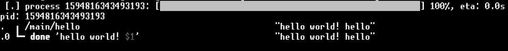

# 如何在 hybrix 上构建自己的 tradebot

> 原文：<https://medium.com/coinmonks/how-to-build-your-own-tradebot-on-hybrix-9c7906b539bb?source=collection_archive---------6----------------------->

# 介绍

*这篇文章是关于写一个运行在 hybrix 上的真实的* [*交易机器人*](https://blog.coincodecap.com/a-guide-to-cryptocurrency-trading-bots) *。这很简单，不超过 30 分钟就可以启动并运行。*

在开始之前，请确保您熟悉 hybrix，并且您正在自己的计算机上运行 hybrix 节点。了解一些 Linux 终端命令也很重要，这样您才能找到自己的路。

> 关于运行你自己的节点的信息可以在这里找到:[https://api.hybrix.io/helpgetting-started](https://api.hybrix.io/helpgetting-startedAlso)

[**亦作**](https://api.hybrix.io/helpgetting-startedAlso) **你必须明白，你正在建造一个实验性的机器人。当使用它进行实时交易时，这意味着您可能会失去加密货币。**

你还需要一个在 Biki 和几个 USDT 的交易账户来进行交易。在开发和测试期间，保持你的 Biki 账户上的 USDT 数额较低，将确保你的风险很小。

> 对于**比基**(英语)访问:[https://www.biki.cc/en_US](https://www.biki.cc/en_USThe)

# 第一步

在您的 hybrix 节点文件夹中，首先发出以下命令来查看您的节点是否正常运行。

> 。/hybrixd /command/exec


该节点应响应以下消息:

这意味着节点正在运行，并希望您提供一个文件来执行。现在您已经准备好开始编写您的第一个 Qrtz 脚本了！

# 你好世界

在您最喜欢的文本编辑器中，您现在应该创建一个名为 test.json 的文件，并将该文件保存在 hybrix 节点文件夹中。

现在将以下内容添加到文件中。

```
{
  “quartz” : {
    “main” : [
      “done ‘hello world!’”
    ]
  }
}
```

这个文件现在包含一个 JSON 对象。JSON 对象用大括号{}括起来，并以键/值对的形式编写。键必须是字符串，值必须是有效的 JSON 数据类型(字符串、数字、对象、数组、布尔值或 null)。

hybrix 的 Qrtz 脚本封装在一个对象中，实际的脚本在“quartz”键下，这个对象包含一个主程序“main”和可能的子例程。

保存文件，现在您就可以在命令行上运行您的第一个 Qrtz 程序了:

> 。/hybrixd/command/exec/test . JSON

或者更简单的运行脚本的方法是直接通过 Qrtz 解释器引擎:

> 。/qrtz test.json

在这两种情况下，您应该看到您的脚本返回文本“hello world”。

如果你想了解更多关于 Qrtz 编程的知识，可以去看看 https://api.hybrix.io/help/qrtz 的文档。


**祝贺你！您已经编写了您的第一个 Qrtz 脚本！**

# 查看订单簿

是时候使用 hybrix 首次查看 HY/USDT 订单簿了。

在 hybrix 节点文件夹的 recipes 目录中，您会发现许多 Qrtz 示例引擎。其中一个对我们的第一笔交易很有用。它叫做 engine.exchange_biki.json，你可以在你的下一个脚本中导入这个引擎的函数，用它们在 biki 上执行交易动作。

```
{
  “engine” : ”test”, 
  “name” : “Trading bot”,
  “import” : “exchange_biki”,
  “apiKey” : “your_Biki_API_key”,
  “secretKey” : “your_Biki_secret_key”,
  “quartz” : {
    “main” : [
      “call orderBook/hy/usdt” 
    ] 
  }
}
```

使用 Qrtz 命令调用你可以调用一个子程序。在本例中，您调用了从引擎 enchange_biki 导入的子例程，该引擎位于/recipes 目录中。您可以通过在文本编辑器中打开文件 engine.exchange_biki.json 来查看这个引擎的内容。

保存包含上面示例内容的文件，现在您可以在命令行上运行它了。

> 。/qrtz test.json


您将看到在命令行中返回的 HY/USDT 的订单簿，该订单簿位于包含交易对的买价和卖价的对象中。

# 你的第一笔交易

现在你已经准备好进行你的第一笔交易了。确保你有来自 Biki 的 API 密钥和秘密来尝试交易。

```
{ 
  “engine” : ”test”,
  “name” : “Trading bot”,
  “import” : “exchange_biki”,
  “apiKey” : “your_Biki_API_key”,
  ”secretKey” : “your_Biki_secret_key”,
  “token” : “hy”,
  “against” : “usdt”,
  “quartz” : { 
    “main” : [ 
      “call trade/$token/$against” 
    ],
    ”trade/symbol/base” : [
      “call orderBook/$symbol/$base”,
      “tran ‘.asks’ @getNearestOrder”,
      “fail ‘Cannot get orderbook data!’”,
      ”@getNearestOrder”,
      “pick”,
      “poke nearestOrder”,
      “with price [data,$nearestOrder] [pick]”,
      “with amount [data,$nearestOrder] [pick,-1]”,
      “@buyNearestOrder”,
      “call orderCreate/bid/$symbol/$amount/$base/$price”,
      “done ‘Created order to buy $amount $symbol for a price of 
             $price $base.’” 
    ] 
  }
}
```

这个例子使用了两个变量 token 和 against，它们可以在主脚本中被引用。它调用子例程 trade，该子例程有两个参数 ***符号*** 和 ***基址*** ，它们被传递给交换引擎的子例程。

像 **@getNearestOrder** 这样的标签可以用于根据命令的成功或失败跳转到 Qrtz 脚本中的某个位置。

最后，命令' ***done*** '结束脚本，并传递一个字符串作为结果，其中包含 HY 在 USDT 以什么价格买了多少东西的信息。

通过仔细观察命令和阅读文档，您可以掌握强大的 Qrtz 语言，并立即开始编写自己的交易机器人或多分类帐应用程序。

# **推进发展**

在 Qrtz 中开发时，能够快速调试代码是很有用的。如果您刚刚开始，调试对您来说可能有点太深了。然而，如果你是一个更有经验的开发人员，你可能会感激能够确切地看到你的代码在做什么，什么是正确的，什么是错误的。

使用调试模式运行程序是可能的。

> 。/hybrixd/command/exec/test . JSON-d

这将使您能够看到一个包含有关脚本执行的每一步的信息的树，以及数据缓冲区的样子。

除了调试，您还可以指定可以通过路由器(和命令行)传递的参数，如下所示。

```
{
  “quartz” : { 
    “main” : [
       “done ‘hello world! $1’”
    ]
  }
}
```

现在运行这个例子，给定路由路径 *main* 和参数‘hello’将返回一个更具交互性的结果。

> 。/hybrixd/command/exec/test . JSON/main/hello-d



Qrtz 脚本中的参数或自变量可以通过使用美元符号和数字来访问，例如$1、$2、$3 等。这使得您可以在运行脚本时动态添加数据。

# **包装完毕**

恭喜你！您已经完成了这篇文章的结尾。

概括地说，您现在已经学会了如何执行以下操作:

> -使用 hybrix
> 运行您自己的 Qrtz 脚本-编写您的第一个脚本并运行它
> -导入并调用外部 Qrtz 库函数
> -执行脚本化交易
> -使用调试器查看您的脚本如何运行

这些信息应该足够让你开始编写自己的交易机器人，或者任何其他与数字账本相关的解决方案。

*在*[***https://API . hybrix . io***](https://api.hybrix.io)*有很多文档，您可以在那里了解更多信息。但是，如果您缺少信息，我们欢迎您加入我们的社区，了解更多关于 hybrix 的信息！*

本文由 hybrix 创始人 Joachim de Koning 撰写。

> [直接在您的收件箱中获得最佳软件交易](https://coincodecap.com?utm_source=coinmonks)

[](https://coincodecap.com?utm_source=coinmonks)