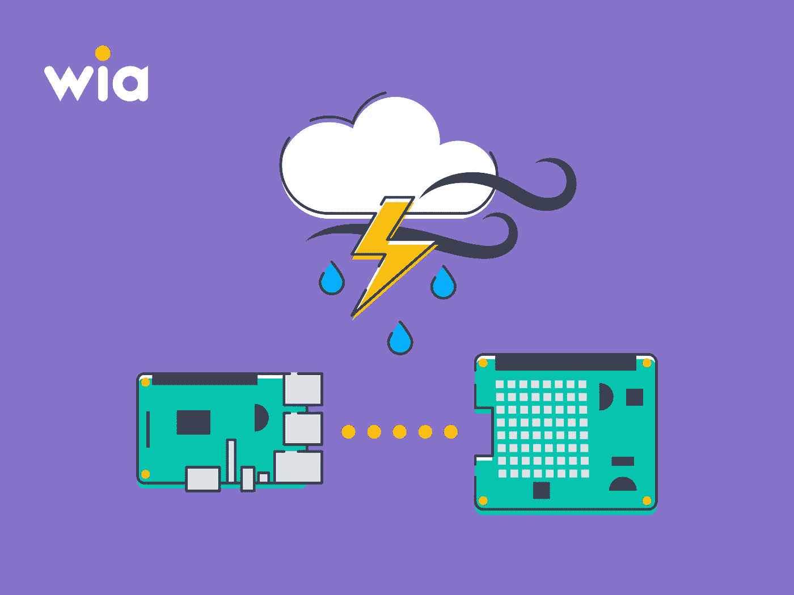
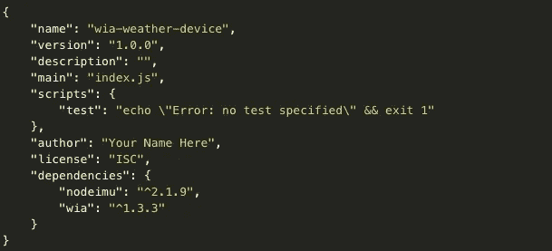
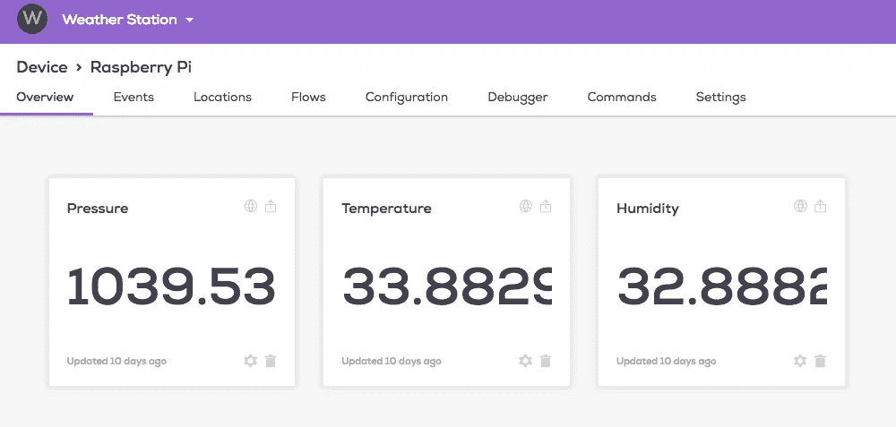
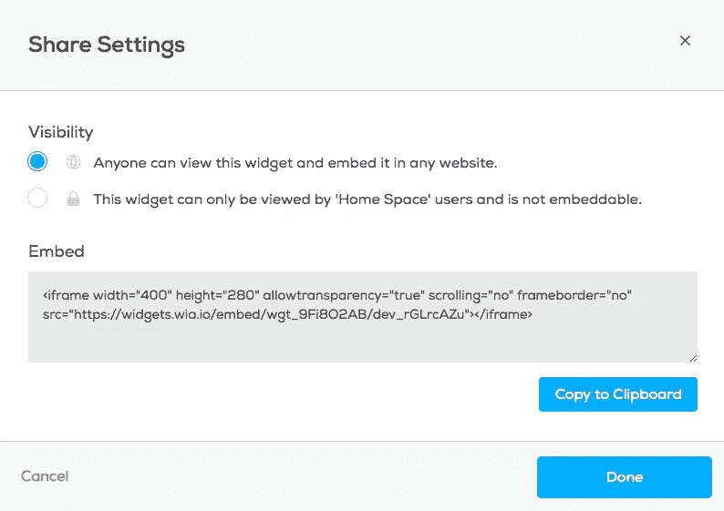

# 如何使用 Raspberry Pi 建立自己的气象站

> 原文：<https://medium.com/coinmonks/how-to-build-your-own-weather-station-using-a-raspberry-pi-9cb3aab0470a?source=collection_archive---------6----------------------->



在本教程中，我们将介绍如何使用 raspberry pi 创建气象站并将事件发送到 Wia。

这是我们旧教程的更新版本。自从我们上一个教程以来，Wia 仪表板和代码有了一些变化。

# 你需要什么

*   树莓 Pi 2 或型号 3 B+
*   树莓派感官帽
*   Node.js 和 NPM 都必须安装在 raspberry pi 上。

如果您还没有安装它，[在这里学习如何安装 node.js】。](https://community.wia.io/d/4-how-to-install-node-js-on-any-raspberry-pi)

# 设置树莓 Pi

首先，你必须设置树莓派。我们的教程将带你完成它！务必仔细遵循每一步。准备好之后，运行`ssh pi@('RASPBERRY-PI-IP-ADDRESS')`。这将允许您通过计算机开始在 raspberry pi 终端中工作。

# 设置 Wia Node.js SDK

首先，我们需要在 raspberry pi 上创建一个文件夹来存储我们的文件。创建一个名为`wia-wether-device`的新文件夹。

接下来，通过使用命令行`npm init`创建 packackge.json 文件来初始化这个包。对于每个提示，点击`enter`，现在它们并不重要。

一旦您完成了这些，您就可以将 Wia SDK 安装到 raspberry pi 上了。使用命令行`npm install --save wia`安装 Wia SDK。

# 对 Node.js 使用 Sense HAT

接下来，我们必须安装 nodeimu，以便我们可以使用传感器。使用命令`npm install --save nodeimu`。

现在，您的 package.json 文件应该如下所示:



# 创建您的天气设备

转到 [Wia 仪表板](https://dashboard.wia.io/)并选择`Create a New Space`然后选择`Devices`。添加一个设备并给它命名。现在，在您的设备的`Configuration`选项卡中，您会找到应该以`d_sk`开头的`device_secret_key`。这在以后会很重要。

# 代码

创建一个名为`index.js`的文件。然后，从下面的例子中复制代码并粘贴到`index.js`文件中。

用您设备的密钥替换`device_secret_key`。

```
'use strict';
**var** wia = require('wia')('device-secret-key');
**var** util = require('util')
**var** nodeimu  = require('nodeimu');
**var** IMU = **new** nodeimu.IMU();
**var** tic = **new** Date();
**var** callback = **function** (error, data) {
 **var** toc = **new** Date();
 **if** (error) {
   console.log(error);
   **return**;
 }
 // Send temperature data
 wia.events.publish({
   name: "temperature",
   data: data.temperature.toFixed(4) // data received from temperature sensor
 });
 // Send pressure data
 wia.events.publish({
   name: "pressure",
   data: data.pressure.toFixed(4) // data received from pressure sensor
 });
 // Send humidity data
 wia.events.publish({
   name: "humidity",
   data: data.humidity.toFixed(4) // data received from humidity sensor
 });
 setTimeout(**function**() { tic = **new** Date(); IMU.getValue(callback); } , 250 - (toc - tic));
}
// Using the MQTT stream
wia.stream.on('connect', **function**() {
 IMU.getValue(callback);
});
wia.stream.connect();
```

要测试您的程序，现在运行`node index.js`
，您应该会看到事件出现在 Wia 仪表板中您的设备的`Events`选项卡中。

# 该应用程序

接下来，我们将通过 Wia 制作一些小部件来呈现气象站收集的数据。登录 Wia 仪表板，导航到您的设备。选择`widgets`选项卡并创建一个新的小部件。命名为`Humidity`。对于`event`框，键入湿度，就像它出现在您之前复制和粘贴的 node.js 代码中一样。选择`done`，你会看到最新的更新！按照以下温度和压力步骤完成气象站项目。



# 网页

接下来，我们将创建一个网页并将其托管在 GitHub 上，这样我们就可以随时从我们的气象站查看天气了！

如果您还没有 github 帐户，[您可以在这里](https://github.com/)创建一个。

设置好 github 后，创建一个新的存储库，并将其命名为 your-username.github.io。

现在，导航到您的新存储库并创建一个新文件。它**必须**命名为`index.html`。复制并粘贴以下代码块:

```
<!DOCTYPE html>
<**html**>
  <**head**>
    <**meta** charset="UTF-8">
  </**head**>
  <**body**> <**h1**>Wia Weather Station</**h1**> </**body**>
</**html**>
```

到目前为止，我们的网页是相当空白的。导航回您的 Wia 仪表板。在设备的概览中，您可以看到您的 widgets。在小部件的右上角，应该有一个带箭头的框。单击该框。应该会弹出这样的屏幕。



更改设置，以便`Anyone can view this widget and embed it in any website`。您还应该看到`Embed`代码，它将以< iframe >开始，以< /iframe >结束。复制整个代码并粘贴在< h1 > Wia 气象站< /h1 >线下方和< /body >线上方。您的完整代码应该如下所示:

```
<!DOCTYPE html>
<**html**>
  <**head**>
    <**meta** charset="UTF-8">
  </**head**>
  <**body**> <**h1**>Wia Weather Station</**h1**> <**iframe**> YOUR WIDGET </**iframe**> </**body**>
</**html**>
```

对每个小部件重复此操作。

单击提交更改。现在，访问你在 https://github.com/username/username.github.io 的网站

现在，您应该可以在自己的网页上看到来自您的树莓派的天气了！