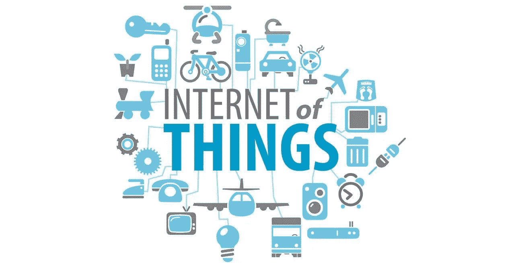
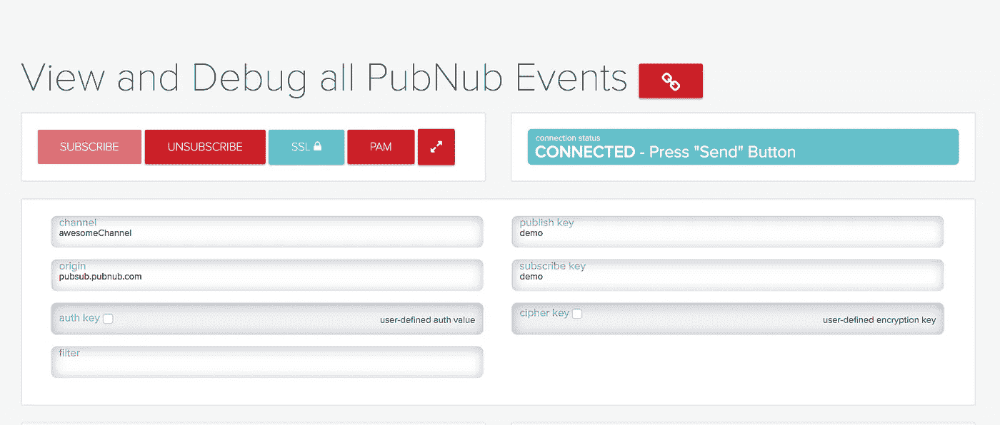
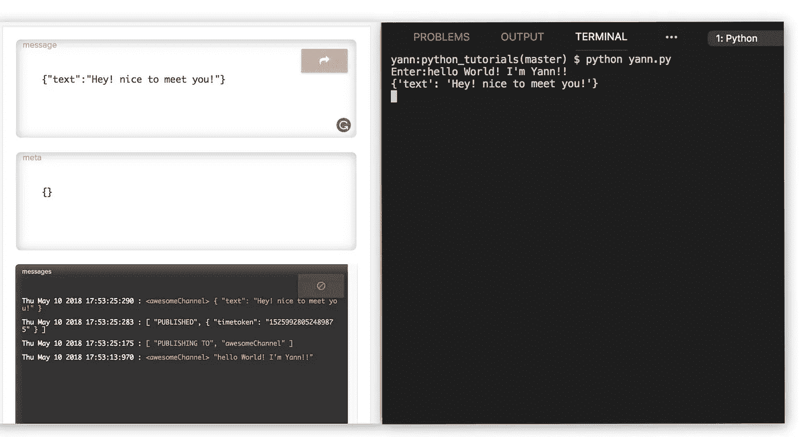
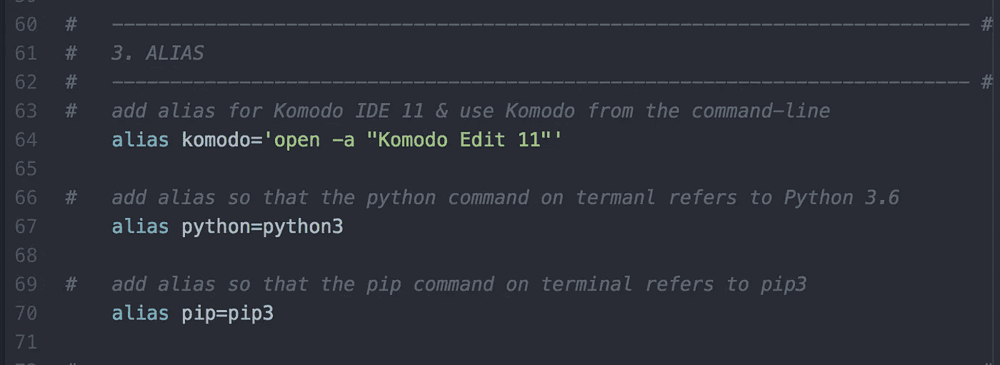
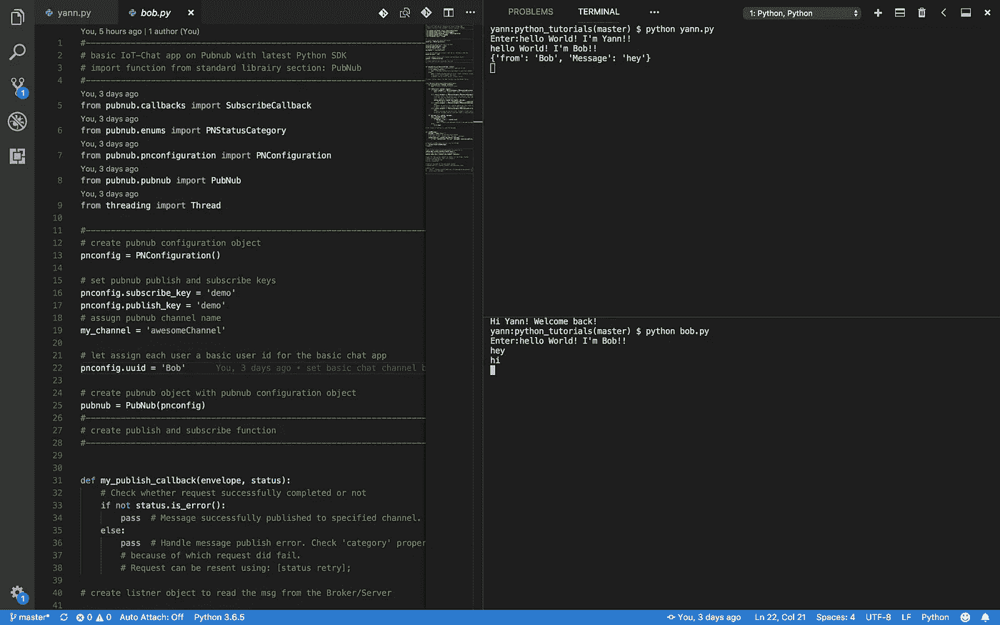

# 如何用 Python 搭建物联网/聊天的双向 app

> 原文：<https://medium.com/coinmonks/how-to-built-a-bidirectional-app-for-internet-of-thing-chat-with-python-fc926e605b0f?source=collection_archive---------0----------------------->



**IoT — Internet of Things**

> ***什么是物联网(IoT)“用简单的英语说”？***

如今，我们在日常活动中使用的大量对象都可以连接到互联网，如智能手表、汽车、智能锁门、恒温器、运动设备、家用电器(冰箱、烤箱等)，甚至鞋子。这种连通性允许这些对象拥有自己的身份以及接收和交流有价值信息的能力，使它们成为“ ***智能*** ”。这就是所谓的“ ***物联网*** ”。

举例来说，智能手表可以收集数据，如你走了多少步，你的体温，心率等；可以从智能手机或平板电脑等其他互联网连接设备上查看。智能手表收集的所有数据都可以进行分析，告诉你燃烧了多少卡路里，为你提供个性化的健身建议和其他相关的健康信息。

物联网不仅限于消费产品。还有更多例子延伸到医疗保健、制造业、农业和基础设施(桥梁和建筑物上的传感器，用于检查其结构的应力或损坏；装有传感器的城市垃圾桶，当它们需要清空时会发出警报)。

物联网带来了隐私和安全问题。例如，黑客可能能够远程解锁并启动您的汽车。所有这些设备都收集大量数据，捕捉你一天中的行动和位置，我们通常并不真正知道收集的所有数据或它们是如何使用的。我们知道的一件事是，物联网将在未来几年以更快的速度增长，带来新的好处和挑战。

> 在本文中，我们将探讨如何使用 PubNub 服务器发布和订阅物联网架构。


PubNub-IoT

[**PubNub**](https://www.pubnub.com/) 是一家全球数据流网络和实时基础设施即服务公司，为 web、移动和物联网开发者提供实时数据流网络。pubnub 的架构与 MQTT 协议非常相似，在 MQTT 协议中，用户订阅一个主题，并监听另一个用户在该主题上发布的数据。

出于本演示的目的，我们将使用 pubnub python SDK 来构建双向聊天应用程序。您需要在计算机上安装 python 3.65 或更高版本以及 pubnub。

现在，我们将继续按照[https://www.pubnub.com/docs/python/pubnub-python-sdk](https://www.pubnub.com/docs/python/pubnub-python-sdk)上的设置进行操作。

> 最简单的入门方法是通过 pypi 安装 PubNub Python SDK。Python 3.6 附带了 pip3，如果您确实将 pip 升级到了 pip3，请确保使用 Python 3 和 pip3 运行您的命令，而不是 Python 和 pip，后者将引用 python 2。mac 默认自带的版本。

我复制并修改了“hello world”python 文件，添加了更多注释来更好地解释每一部分和每一行代码的作用:

打开编辑器(我使用的是可视代码)并创建一个 python 文件，将上面的代码复制并粘贴到该文件中。我把我的命名为“yann.py”，你可以随意命名你的。

Pubnub 提供了一个在线控制台，您可以在上面测试您的应用程序。我们将使用 pubnub 控制台上设置的默认演示应用程序，方法是指定频道名称:“awesomeChannel”，发布和订阅键值:“demo”。



现在，根据您使用的编辑器，构建它或简单地打开终端或命令提示符；cd 放入您的文件目录，并运行以下命令行:

```
python3 your_file_name.py
```

我用的是 Visual Studio 代码编辑器。成功运行 python 文件后，从 pubnub 控制台发送一条消息，并在终端或命令提示符下查看结果，反之亦然:



在这种情况下，我使用 python，因为我在。bash_profile 将 python 命令提交给 python3，将 pip 提交给 pip3 以备将来使用:



现在，为第二个用户创建另一个 python 文件。我将 mine 命名为 bob.py，从前面的文件中复制相同的代码，并为第二个用户分配新的 uuid 名称:

```
# let assign each user a basic user id for the basic chat app
pnconfig.uuid = 'User_2_name'
```

运行这两个文件，用户 1 和用户 2 之间就有了一个聊天应用程序:



> 关于代码的更多细节，查看我的 [**GitHub**](https://github.com/YannMjl/IoT-basic-chat-app) 回购。
> 
> 如果你喜欢这篇文章，你可能也会喜欢“ [**Raspberry Pi 3 — Shell 脚本—门监控器(一个物联网设备)**](/coinmonks/raspberry-pi-3-model-b-shell-scripting-door-monitor-b44944f82d87) ”

> 加油！！