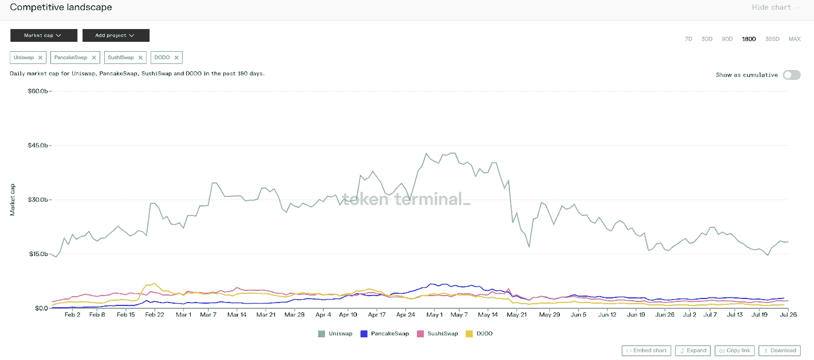

# 如何为您的 DeFi 仪表板选择分析平台

> 原文：<https://medium.com/coinmonks/how-to-choose-an-analytic-platform-for-your-defi-dashboard-149b44beb93e?source=collection_archive---------3----------------------->

随着 DeFi 的总锁定价值(TVL)不断增长，现在提供 DeFi 数据的链上分析平台的选项越来越多，所有这些都有望为区块链投资提供见解。

然而，在没有任何工具的情况下，将原始数据转化为有意义的见解是一个巨大的挑战。

这就是 DeFi 仪表板的用武之地。

大多数投资者和分析师使用数据来构建显示关键指标的仪表盘。当涉及更广泛的 DeFi 数据时(而不仅仅是加密货币交易，加密货币交易有自己的平台，如 Glassnode)，有两种类型的工具:

*   **固定格式仪表板。如**南森、Chainbeat、Token Terminal
*   **定制仪表板。例如**沙丘分析、足迹

那么，如何选择适合您需求的平台呢？

# **固定格式仪表盘**

固定形式的仪表板平台提供由专业分析师或平台创建的预制仪表板。由于您不必创建自己的数据或导入数据，这些类型的平台非常方便用户快速了解数据趋势。另一方面，这些类型的工具缺乏灵活性。

## **什么是** [**南森**](https://www.nansen.ai/) **？**

Nansen 是 DeFi 最知名的分析平台之一。对于初学者来说，这是一个简单的即插即用的解决方案，但是缺乏让用户发现宏观见解的跨链能力。

**如何使用南森**

1.  在南森，你可以用“令牌神模式”选择代表其协议的单个令牌然而，你无法获得整个 DEX 行业的概览，因为该平台的分析逻辑是通过供应、持有人和交易等数据，提供对单个令牌本身的深入见解。

2.您可以让图表显示选定的令牌，尽管您不能对多个令牌进行跨链比较。虽然 Nansen 提供了一个名为“Token Overlap”(仅比较两个令牌)的仪表板，但要比较的维度是有限的。此外，多边形和 BSC 的跨链数据尚不可用。

3.另一个有用的仪表板叫做“Dex Trades”，它通过不同的 Dex 提供两个标记地址之间的链上交易的实时更新。

4.Nansen 提供实时数据，它有各种各样的仪表板(目前提供 26 个仪表板)。但是，它的主要缺点是不能在一个类别下比较不同的协议。

## **什么是******？****

**Chainbeat 是另一个固定仪表板平台，在功能上与 Nansen 非常相似。不过，它的设计更轻。**

****如何使用 Chainbeat:****

1.  **除了预制的控制面板，您还可以为特定令牌构建自己的控制面板。只需提交令牌的地址(并等待大约 30 分钟来导入数据。**

****

**2.Chainbeat 控制面板由一个概览和三个独立的交易、用户和令牌报告组成。加载时间还有待改进，单令牌仪表板仍然不能满足制作 DEX 仪表板的需求。**

****

## ****什么是** [**令牌终端**](https://www.tokenterminal.com/) **？****

**令牌终端着重分析 DeFi 协议。它有各种市场选择(DeFi、贷款、交换)，是投资者的合适选择。**

****如何使用令牌终端:****

1.  **要查看十大指数的市值，请选择“市场”部分，然后单击“交易所”。这只是令牌终端有用数据的一个例子。其他指标包括 TVL 和交易量。令牌终端还提供收入指标，帮助用户更好地了解每个协议的增长。**

****

**2.使用令牌终端，您还可以用任何选定的指示器比较多个协议。该图表是交互式的，易于使用。**

****

**3.令牌终端通过一组漂亮的数据指示器提供了直观的用户体验。对于在一个页面上构建具有不同图表的仪表板，而不是每次都改变指示器，这比许多其他选项都好。**

# ****定制仪表板****

**与固定仪表板不同，定制仪表板允许用户挑选要比较的指标。这使得分析师可以发挥他们的创造力，挖掘见解，也让有经验的区块链专业人士对他们的数据进行极度细化。**

## ****什么是沙丘分析？****

**Dune 是一个自己动手的平台，提供链上数据和工具来构建自己的仪表板。您可以找到许多由 Dune 社区创建的成品仪表盘。**

****如何使用沙丘分析****

1.  **Dune 鼓励用户在任何仪表板中进行分叉查询，以简化为类似主题创建仪表板的过程。用户可以通过添加来自其他仪表板的不同查询来重组自己的仪表板。**

********

**2.为了进行新的查询，用户需要编写 SQL 来查询 Dune 数据库中的数据。一种不太复杂的方法是找到一个类似的查询并更改查询参数。例如，您可以通过简单地派生名为 Weekly DEX volume 的现有查询，然后将时间段从“week”更改为“month ”,来进行每月 DEX Volume 查询。**

********

**3.Dune Analytics 的一个主要缺点是，对于普通用户来说，派生和编写查询非常复杂。对于缺乏 SQL 知识的人来说，只能通过有限的修改来分叉类似的查询。深入链上数据寻找自己的见解需要专业技术知识。**

## ****什么是** [**足迹**](https://www.footprint.network/) **？****

**Footprint 是一款用于发现和可视化区块链数据的一体化分析工具。该产品旨在将用户放在第一位，无论您是分析师、数据科学家、开发人员、学生、教师、高管还是企业用户。它提供了一个直观的用户界面，像强大的数据查询工具一样，通过拖放进行交互式数据查询。**

****

****如何使用足迹****

1.  **Footprint 侧重于跨链数据，这意味着您可以对同一项目或部门进行跨链比较，以查看不同生态系统的增长趋势。**
2.  **Footprint 提供了一种类似的方法来复制您感兴趣的仪表板。您还可以在社交媒体上轻松分享您的见解，无论是作为整个仪表板的图像，还是作为实时仪表板的嵌入式 HTML。**

********

**3.与 Nansen 和 Dune 相比，Footprint 中的数据不是实时更新的，而是每天更新的。然而，这并没有对 TVL 等大多数指标的相关性产生很大影响。**

# ****总结****

**随着 DeFi 的增长，分析选项也在增加。**

**浏览各种平台似乎很困难。但是，每个平台评论都有自己的优势和明确的目标用户群。**

*   **如果你只想看到项目和部门或类别的基本统计指标，令牌终端是最简单和最完整的收入，市盈率和市净率的特殊指标。**
*   **对于分析一个简单的令牌或平台，Nansen 是一个不错的选择(至少你不需要等待)。**
*   **对于那些知道如何编写 SQL 并想玩数据的人，Dune 提供了原始数据和一个硬核 DIY 平台**
*   **对于那些想探索链上数据但不知道或者只是不想写代码的人来说，Footprint 是另一个容易入门的工具。**

> **加入 [Coinmonks 电报频道](https://t.me/coincodecap)，了解加密交易和投资**

## **另外，阅读**

*   **[网格交易机器人](https://blog.coincodecap.com/grid-trading) | [Cryptohopper 审查](/coinmonks/cryptohopper-review-a388ff5bae88) | [Bexplus 审查](https://blog.coincodecap.com/bexplus-review)**
*   **[加密复制交易平台](/coinmonks/top-10-crypto-copy-trading-platforms-for-beginners-d0c37c7d698c) | [如何在 WazirX 上购买比特币](/coinmonks/buy-bitcoin-on-wazirx-2d12b7989af1)**
*   **【Crypto.com 评论】|[|](/coinmonks/crypto-com-review-f143dca1f74c)|[信用交易](/coinmonks/huobi-margin-trading-b3b06cdc1519)**
*   **[OKEx vs KuCoin](https://blog.coincodecap.com/okex-kucoin) | [摄氏替代品](https://blog.coincodecap.com/celsius-alternatives) | [如何购买 VeChain](https://blog.coincodecap.com/buy-vechain)**
*   **[币安期货交易](https://blog.coincodecap.com/binance-futures-trading)|[3 comas vs Mudrex vs eToro](https://blog.coincodecap.com/mudrex-3commas-etoro)**
*   **[如何购买 Monero](https://blog.coincodecap.com/buy-monero) | [IDEX 评论](https://blog.coincodecap.com/idex-review) | [BitKan 交易机器人](https://blog.coincodecap.com/bitkan-trading-bot)**
*   **[尤霍德勒 vs 考尼洛 vs 霍德诺特](/coinmonks/youhodler-vs-coinloan-vs-hodlnaut-b1050acde55a) | [Cryptohopper vs 哈斯博特](https://blog.coincodecap.com/cryptohopper-vs-haasbot)**
*   **[顶级付费加密货币和区块链课程](https://blog.coincodecap.com/blockchain-courses) | [币安评论](/coinmonks/binance-review-ee10d3bf3b6e)**
*   **[MXC 交易所评论](/coinmonks/mxc-exchange-review-3af0ec1cba8c) | [Pionex vs 币安](https://blog.coincodecap.com/pionex-vs-binance) | [Pionex 套利机器人](https://blog.coincodecap.com/pionex-arbitrage-bot)**
*   **[如何在印度购买比特币？](/coinmonks/buy-bitcoin-in-india-feb50ddfef94) | [WazirX 评论](/coinmonks/wazirx-review-5c811b074f5b) | [BitMEX 评论](https://blog.coincodecap.com/bitmex-review)**
*   **[印度的加密交易所](/coinmonks/bitcoin-exchange-in-india-7f1fe79715c9) | [比特币储蓄账户](/coinmonks/bitcoin-savings-account-e65b13f92451) | [HitBTC 审查](/coinmonks/hitbtc-review-c5143c5d53c2)**
*   **[币安收费](/coinmonks/binance-fees-8588ec17965) | [Botcrypto 审查](/coinmonks/botcrypto-review-2021-build-your-own-trading-bot-coincodecap-6b8332d736c7) | [Hotbit 审查](/coinmonks/hotbit-review-cd5bec41dafb) | [KuCoin 审查](https://blog.coincodecap.com/kucoin-review)**
*   **[我的加密副本交易经历](/coinmonks/my-experience-with-crypto-copy-trading-d6feb2ce3ac5) | [AAX 交易所评论](/coinmonks/aax-exchange-review-2021-67c5ea09330c)**
*   **[Bybit 融资融券交易](/coinmonks/bybit-margin-trading-e5071676244e) | [币安融资融券交易](/coinmonks/binance-margin-trading-c9eb5e9d2116) | [Overbit 审核](/coinmonks/overbit-review-9446ed4f2188)**
*   **[加密货币储蓄账户](/coinmonks/cryptocurrency-savings-accounts-be3bc0feffbf) | [YoBit 审查](/coinmonks/yobit-review-175464162c62) | [Bitbns 审查](/coinmonks/bitbns-review-38256a07e161)**
*   **[Botsfolio vs nap bots vs Mudrex](/coinmonks/botsfolio-vs-napbots-vs-mudrex-c81344970c02)|[gate . io 交流回顾](/coinmonks/gate-io-exchange-review-61bf87b7078f)**
*   **[CoinFLEX 评论](https://blog.coincodecap.com/coinflex-review) | [AEX 交易所评论](https://blog.coincodecap.com/aex-exchange-review) | [UPbit 评论](https://blog.coincodecap.com/upbit-review)**
*   **[AscendEx 保证金交易](https://blog.coincodecap.com/ascendex-margin-trading) | [Bitfinex 赌注](https://blog.coincodecap.com/bitfinex-staking) | [bitFlyer 评论](https://blog.coincodecap.com/bitflyer-review)**
*   **[Bitget 回顾](https://blog.coincodecap.com/bitget-review) | [双子 vs 区块链](https://blog.coincodecap.com/gemini-vs-blockfi) | [OKEx 期货交易](https://blog.coincodecap.com/okex-futures-trading)**
*   **[AscendEx Staking](https://blog.coincodecap.com/ascendex-staking)|[Bot Ocean Review](https://blog.coincodecap.com/bot-ocean-review)|[最佳比特币钱包](https://blog.coincodecap.com/bitcoin-wallets-india)**
*   **[霍比审核](https://blog.coincodecap.com/huobi-review) | [OKEx 保证金交易](https://blog.coincodecap.com/okex-margin-trading) | [期货交易](https://blog.coincodecap.com/futures-trading)**
*   **[麻雀交易所评论](https://blog.coincodecap.com/sparrow-exchange-review) | [纳什交易所评论](https://blog.coincodecap.com/nash-exchange-review) | [菜鸟评论](https://blog.coincodecap.com/probit-review)**
*   **[Godex.io 评审](/coinmonks/godex-io-review-7366086519fb) | [邀请评审](/coinmonks/invity-review-70f3030c0502) | [BitForex 评审](https://blog.coincodecap.com/bitforex-review) | [北海巨妖评审](/coinmonks/kraken-review-6165fc1056ac)**
*   **[最佳比特币保证金交易](/coinmonks/bitcoin-margin-trading-exchange-bcbfcbf7b8e3) | [萝莉点评](/coinmonks/lolli-review-e6ddc7895ad8) | [比特币保证金交易](https://blog.coincodecap.com/bityard-margin-trading)**
*   **[创造并出售你的第一个 NFT](https://blog.coincodecap.com/create-nft) | [本地比特币评论](/coinmonks/localbitcoins-review-6cc001c6ed56) | [Prokey 评论](/coinmonks/prokey-review-26611173c13c)**
*   **[加密保证金交易交易所](/coinmonks/crypto-margin-trading-exchanges-428b1f7ad108) | [赚取比特币](/coinmonks/earn-bitcoin-6e8bd3c592d9) | [Mudrex 投资](https://blog.coincodecap.com/mudrex-invest-review-the-best-way-to-invest-in-crypto)**
*   **[WazirX vs coin dcx vs bit bns](/coinmonks/wazirx-vs-coindcx-vs-bitbns-149f4f19a2f1)|[block fi vs coin loan vs Nexo](/coinmonks/blockfi-vs-coinloan-vs-nexo-cb624635230d)**
*   **[杠杆代币](/coinmonks/leveraged-token-3f5257808b22) | [最佳密码交易所](/coinmonks/crypto-exchange-dd2f9d6f3769) | [Paxful 点评](/coinmonks/paxful-review-4daf2354ab70)**
*   **[加密套利](/coinmonks/crypto-arbitrage-guide-how-to-make-money-as-a-beginner-62bfe5c868f6)指南| [如何做空比特币](/coinmonks/how-to-short-bitcoin-568a2d0b4ae5) | [1xBit 回顾](https://blog.coincodecap.com/1xbit-review)**
*   **[如何在印度购买以太坊？](https://blog.coincodecap.com/buy-ethereum-in-india) | [如何在币安购买比特币](https://blog.coincodecap.com/buy-bitcoin-binance)**
*   **[在美国如何使用 BitMEX？](https://blog.coincodecap.com/use-bitmex-in-usa) | [BitMEX 评论](https://blog.coincodecap.com/bitmex-review) | [期货交易机器人](/coinmonks/futures-trading-bots-5a282ccee3f5)**
*   **[最佳加密交易信号电报](/coinmonks/best-crypto-signals-telegram-5785cdbc4b2b) | [MoonXBT 评论](/coinmonks/moonxbt-review-6e4ab26d037)**
*   **[OKEx 审查](/coinmonks/okex-review-6b369304110f) | [Coinswitch 俱吠罗审查](/coinmonks/coinswitch-kuber-review-1a8dc5c7a739) | [比特币基地费用](/coinmonks/coinbase-fees-831e77d4f2c5)**
*   **[AscendEX 审查](/coinmonks/ascendex-review-53e829cf75fa) | [OKEx 交易机器人](/coinmonks/okex-trading-bots-234920f61e60) | [OKEx 交易机器人](/coinmonks/okex-trading-bots-234920f61e60)**
*   **[火币交易机器人](https://blog.coincodecap.com/huobi-trading-bot) | [如何购买 ADA](https://blog.coincodecap.com/buy-ada-cardano) | [Geco。一次复习](https://blog.coincodecap.com/geco-one-review)**