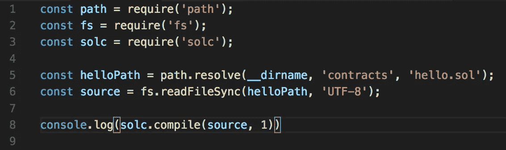

# 如何:使用 Node.js 编译 Solidity 智能协定

> 原文：<https://medium.com/coinmonks/how-to-compile-a-solidity-smart-contract-using-node-js-51ea7c6bf440?source=collection_archive---------1----------------------->

在[之前的博文](/coinmonks/how-to-write-a-simple-smart-contract-25f6d3c1d6db)中，我们使用 [Solidity](https://solidity.readthedocs.io/en/v0.4.23/) 编程语言编写了一份智能合同。

接下来，我们需要编译`hello.sol`文件，以便测试和部署我们的智能契约。

我们需要在编译后的文件上使用的属性是应用程序二进制接口(ABI)或`interface`和`bytecode`。`bytecode`实际上是将进入区块链以使智能合约工作的东西，`interface`将是 Javascript 层，其作用就像是`bytecode`的人性化地图。

我们开始吧！

在项目根目录下的终端中，键入:

`npm install --save solc`

`solc`是一个 Solidity 编译器。

接下来，在项目的根目录下创建一个名为`compile.js`的文件。它应该和你的`contracts`文件夹是兄弟姐妹。写`compile.js`文件，如下图。


compile.js

我们需要两个节点模块(`path`和`fs`)和我们的 Solidity 编译器(`solc`)。我们不能简单地要求我们的`hello.sol`文件的原因是因为 Node 将试图以 Javascript 的形式执行文件，并且会抛出一个带有`.sol`文件的错误。

`helloPath`变量找到当前工作目录(`__dirname`)并导航到其中的`hello.sol`文件。`source`变量由位于`helloPath`中的`hello.sol`的原始源代码填充。`UTF-8`字符串代表文件的编码。

在第 8 行，我们在源代码上调用`compile()`,并指定我们将编译多少个契约。在我们的例子中，是一个。

这可能有助于我们了解幕后发生了什么，所以让我们稍微修改一下第 8 行，并将我们的`contracts`对象记录到我们的控制台。



altered line 8

在项目根目录下的命令行中键入`node compile.js`,您应该会得到类似这样的结果:


weeeeeeeeeeee!!!!!!!

`compile()`的结果永远是一个对象。`contracts`是顶层对象，包含我们已经编译的所有合同。同样，在我们的情况下，它只是一个合同。让我们仔细看看我们真正关心的两个属性:`interface`和`bytecode`。

第一，`bytecode`。


bytecode

这是将被部署到区块链上并在以太坊虚拟机(EVM)上执行的代码。如你所见，它不是人类可读的。这就引出了我们的第二个重要属性`interface`。这是 ABI。


Application Binary Interface (ABI)

看起来有点眼熟吧？这些是我们在测试和部署合同时能够使用的 Javascript 方法。

一旦你彻底调查了`contracts`对象，继续按几次撤销键，使第 8 行回到就绪状态。


Ready!

编译文件写好了！

下次我们将使用 [Mocha](https://mochajs.org/) 测试框架测试合同代码时，请继续收听。

可复制/粘贴的`compile.js`文件:

```
const path = require('path');
const fs = require('fs');
const solc = require('solc');const helloPath = path.resolve(__dirname, 'contracts', 'hello.sol');
const source = fs.readFileSync(helloPath, 'UTF-8');module.exports = solc.compile(source, 1).contracts[':Hello'];
```

> 加入 Coinmonks [电报频道](https://t.me/coincodecap)和 [Youtube 频道](https://www.youtube.com/c/coinmonks/videos)获取每日[加密新闻](http://coincodecap.com/)

## 另外，阅读

*   [复制交易](/coinmonks/top-10-crypto-copy-trading-platforms-for-beginners-d0c37c7d698c) | [加密税务软件](/coinmonks/crypto-tax-software-ed4b4810e338)
*   [电网交易](https://coincodecap.com/grid-trading) | [加密硬件钱包](/coinmonks/the-best-cryptocurrency-hardware-wallets-of-2020-e28b1c124069)
*   [密码电报信号](http://Top 4 Telegram Channels for Crypto Traders) | [密码交易机器人](/coinmonks/crypto-trading-bot-c2ffce8acb2a)
*   [最佳网上赌场](https://coincodecap.com/best-online-casinos) | [期货交易机器人](/coinmonks/futures-trading-bots-5a282ccee3f5)
*   [分散交易所](https://coincodecap.com/what-are-decentralized-exchanges) | [比特 FIP](https://coincodecap.com/bitbns-fip)
*   [用信用卡购买密码的 10 个最佳地点](https://coincodecap.com/buy-crypto-with-credit-card)
*   [加拿大最好的加密交易机器人](https://coincodecap.com/5-best-crypto-trading-bots-in-canada) | [比特 vs 币安](https://coincodecap.com/bybit-binance-moonxbt)
*   [阿联酋 5 大最佳加密交易所](https://coincodecap.com/best-crypto-exchanges-in-uae) | [SimpleSwap 评论](https://coincodecap.com/simpleswap-review)
*   [最佳加密交易所](/coinmonks/crypto-exchange-dd2f9d6f3769) | [印度最佳加密交易所](/coinmonks/bitcoin-exchange-in-india-7f1fe79715c9)
*   [开发人员的最佳加密 API](/coinmonks/best-crypto-apis-for-developers-5efe3a597a9f)
*   最佳[密码借贷平台](/coinmonks/top-5-crypto-lending-platforms-in-2020-that-you-need-to-know-a1b675cec3fa)
*   杠杆代币的终极指南