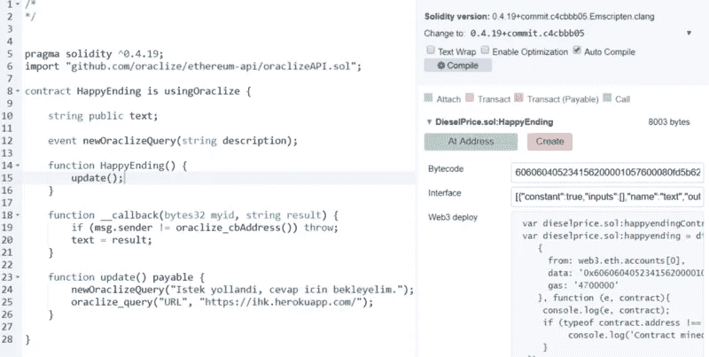
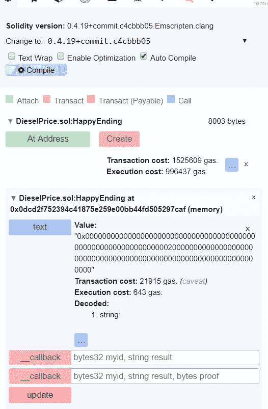

# 如何通过以太坊网络消费第三方 web 服务？

> 原文：<https://medium.com/coinmonks/how-to-consume-3rd-party-web-services-over-ethereum-network-3363d6ecd301?source=collection_archive---------3----------------------->

听起来可能令人困惑，但是相信我，这是一件容易的工作。那么我怎么想出这个教程呢？有成吨成百万的 Solidity 代码样本，给出一个简单的“Hello World”输出。这很酷，至少你用一门新的语言工作，但还不够，没用。

Web 开发时代，第三方 API 调用就像呼吸一样。所以我开始研究如何通过以太网进行可靠的 API 调用。我想出的解决方案是 [**Oraclize**](http://app.oraclize.it/home/features) **，***——去中心化 app 的数据载体。不幸的是，这是一项付费服务。幸运的是，我们将在 Ropsten Network 上工作，这是一个测试网络，我们为任何类型的交易支付假 eth。*

# 要求

*   将在 Ropsten 网络上工作的以太网地址
*   一些免费测试以太坊

为了得到免费的水龙头，有一些水龙头。如:[http://faucet.ropsten.be:3001/](http://faucet.ropsten.be:3001/)。只需粘贴您的以太网地址，测试以太网将在几分钟内加载到您的帐户。

# 路标

1 找一个 web 服务来消费。我刚刚用 Express 建立了一个，简单地返回一个字符串。你可以用它工作，随意使用。([https://ihk.herokuapp.com/](https://ihk.herokuapp.com/))

2 寻找最适合演示问题的环境。编译和运行我们的智能合约有两个选项: [**Remix**](http://remix.ethereum.org) 和 [**Oraclize IDE**](http://dapps.oraclize.it) 。我会选择 Oraclize IDE。

如果你要使用 Remix，你必须选择 **Injected Web3，**否则代码不会像预期的那样与 Javascript VM 一起工作。

# 我们来编码吧！

这就是最简单明了的可靠性代码。

所以还是一步一步来吧。

我们将使用 0.4.19 版本的编译器。因为 Oraclize 支持 **0.4.1** 和 **0.4.2** 之间的版本。为此，不要忘记更改编译器版本( *0.4.19+commit。####* )从设置选项卡。

让我们导入 Oraclize 存储库。

契约存储的唯一变量。API 调用的结果将被赋给这个变量。

**# 15–17**简单来说，我们智能合约的构造者。我们会谈到更新方法。它不是内置的，它是由我们的合同声明的，你可以在合同的最后几行看到。

**# 19–22**请求执行后触发的回调状态。我们可以在这里处理结果数据。但是对于这种情况，我们不需要任何操纵。

**# 24–27**这就是了。太阳永不落山的地方，我们发出请求的地方。基于服务响应的 MIME 类型来修改方法参数，这是一个非常重要的救命点。我们必须根据我们的服务重写第二个参数。JSON、XML 等..

> 如果是**JSON**；
> oraclize_query("URL "，"**JSON**(https://ihk . heroku app . com/)"；
> 
> 或者**XML**；
> oraclize_query("URL "，"**XML**(https://ihk . heroku app . com/)"；

我们的服务将返回一个没有特殊格式的文本，简单的 http/text，所以没有删除转换过程。

让我们编译我们的代码。结果屏幕应该类似于以下内容:

让我们点击“创建”按钮。合同运行，开采和完成。现在，应该有一个部分显示我们可以在合同中运行的方法列表。好像是这样的:

更新方法是我们消费服务、获取数据的方法。该请求将在 10-20 秒内完成。

让我们深呼吸。拿着它。拿着它。再多一点。现在，慢慢地，呼气。非常慢。完美。API 调用应该完成。

让我们跳到顶部的第 4 部分，名为“查询”。

就在那里。结果。上面写着，“伊玛目·哈蒂普勒·卡帕蒂尔辛”一个著名有趣的土耳其迷因。

回头见。

干杯。