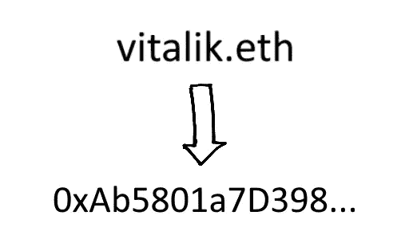

# 如何在 JS 中将 ENS 地址转换成 ETH 地址

> 原文：<https://medium.com/coinmonks/how-to-convert-ens-address-to-eth-address-in-js-251c6209c208?source=collection_archive---------5----------------------->

你好，在本教程中，我将向你展示一个我能想到的最简单的例子，如何在你的 web 应用中将 ENS 地址转换成 ETH 地址。

知道如何做到这一点是有价值的，因为大多数智能合同只接受 ETH 地址，而不接受 ENS 地址。

# 资源

*   [如果您喜欢本教程的视频版本，请点击此处](https://www.youtube.com/watch?v=nRVzkdBYT-8)