# 如何创建比特币发票——区块经济

> 原文：<https://medium.com/coinmonks/how-to-create-a-bitcoin-invoice-blockonomics-70270534c42e?source=collection_archive---------2----------------------->

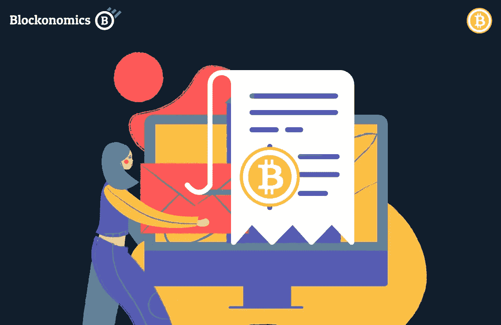

[**Blockonomics — Invoice**](https://www.blockonomics.co/invoicecreate/#)

对于企业和专业人士来说，比特币发票是一种很好的收款方式。这些发票很容易通过链接分享，它们会考虑比特币的价格波动，并允许你收到最新的 BTC 金额。

除此之外，这项服务是*完全匿名*和*分散*的，所以不需要经过 KYC 的要求，你总是完全控制你的 BTC。

要在 Blockonomics 上创建比特币发票，有两种方法。

1.  比特币地址[无需注册]
2.  xPub 密钥[需要注册]

# 方法一:比特币地址

这种方法是创建比特币发票最简单的方法。它不需要注册，你所需要的只是一个你希望接收付款的比特币地址。

为了让事情变得更好，使用这种方法只需要*一个简单的步骤*就可以创建发票，让我们看看如何…

## **第一步:**

前往 [Blockonomics 发票页面](https://www.blockonomics.co/invoicecreate/#)，填写发票描述、金额和到期时间等详细信息。

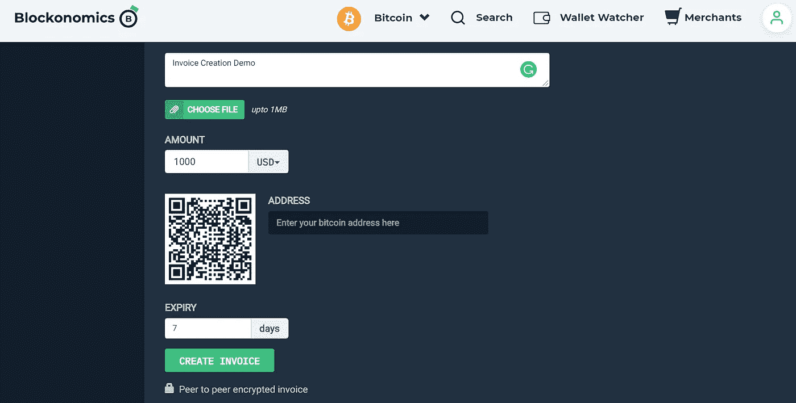

Blockonomics: Invoice Creation Page

复制您希望接收付款的比特币地址，并将其粘贴到**‘地址’**字段中。

填写完所有字段后，点击**“创建发票”**

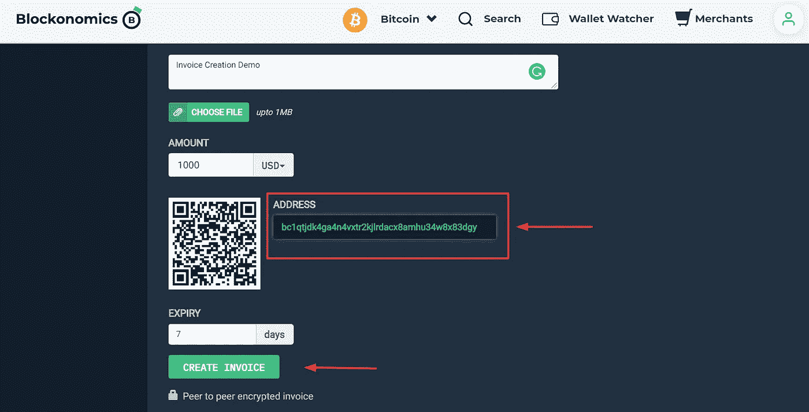

Blockonomics: Add Bitcoin Address

就是这样！你的发票准备好了…

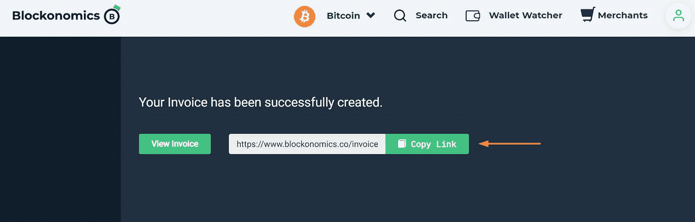

Blockonomics: Bitcoin Invoice Link

您的发票已准备好，可以通过在线链接轻松共享。

> 演示发票【点击链接查看发票页面】:[https://www.blockonomics.co/invoice/25834/#/?key=CMhgRaPQ](https://www.blockonomics.co/invoice/25834/#/?key=CMhgRaPQ)

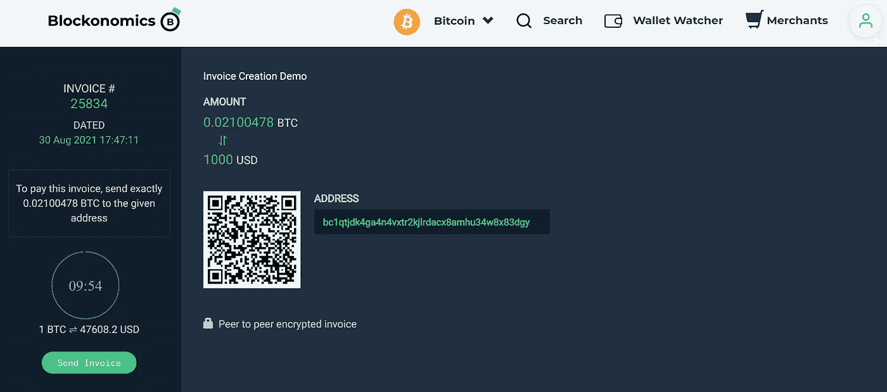

Blockonomics: Bitcoin Invoice Page Example

# 方法 2: xPub 键

通过自动设置，这种方法为您提供了更简单的发票创建体验。

初始设置完成后，您所要做的就是登录您的帐户，然后点击一个按钮来创建您的发票。无需在每次需要开具发票时手动粘贴新的比特币地址。

以下是使用 xPub 创建发票的步骤…

## 步骤 1:创建帐户

前往 [Blockonomics](https://www.blockonomics.co/register#/) 创建一个免费账户。

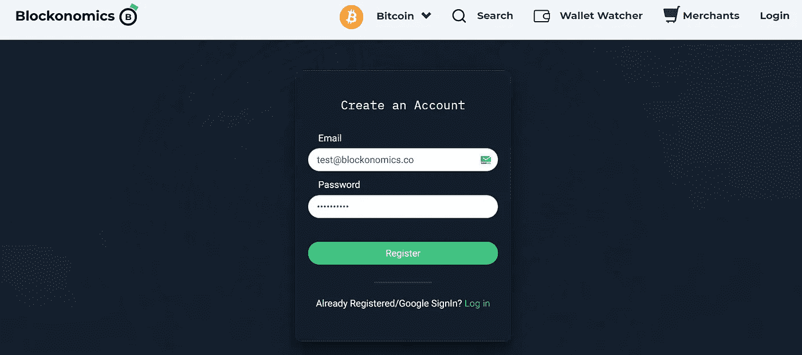

Blockonomics: Register Page

您将收到一个激活码来确认您的帐户。

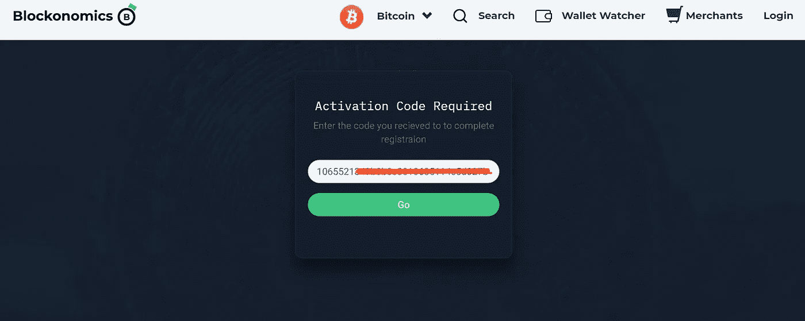

Blockonomics: Activation Code

## 步骤 2:添加 xPub 密钥

成功登录后，进入**‘地址观察器- >新地址’**

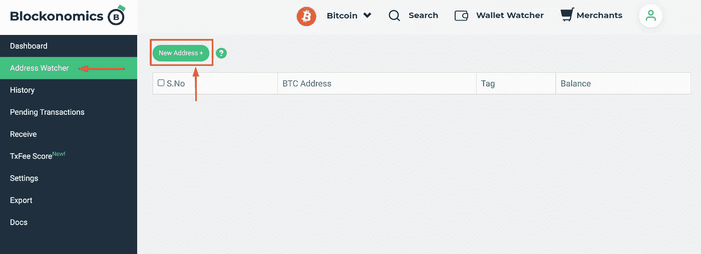

Blockonomics: Register Page

复制您希望接受您的比特币的比特币钱包的 xPub 密钥并粘贴到此处，然后点击**添加**。

要找到你比特币钱包的 xPub 密钥，可以[参考本文](https://blog.blockonomics.co/how-to-find-your-xpub-key-with-these-8-popular-bitcoin-wallets-ce8ea665ffdc)。

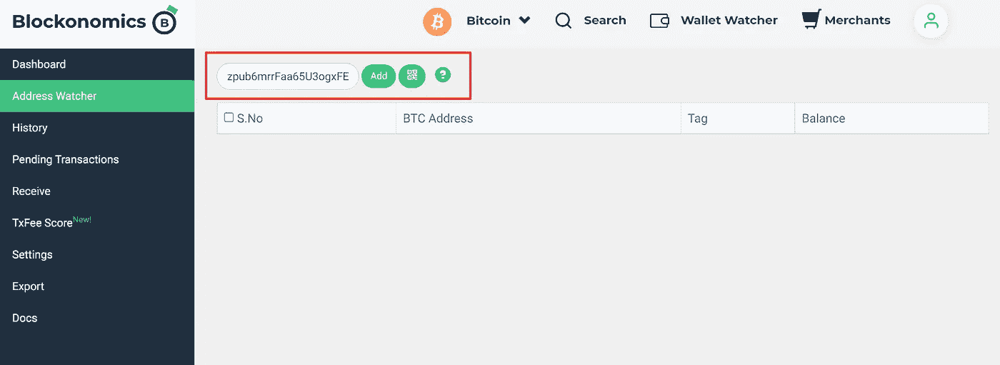

Blockonomics: Add xPub Key

*可选:*

您甚至可以在 xPub 密钥中添加标签来帮助您保持跟踪。如果您添加多个 xPub 键，这很方便。

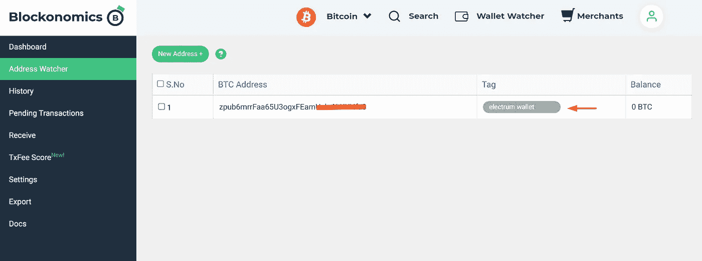

Blockonomics: Add Tags (Optional)

## 步骤 3:创建发票

现在，前往**“接收”**，点击**“创建发票”**

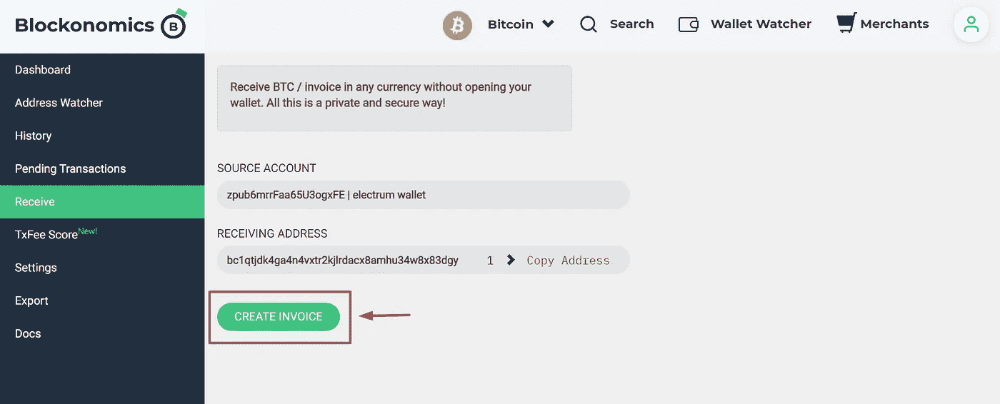

Blockonomics: Create Invoice

您的比特币地址将被自动添加，只需添加其余的详细信息，然后点击**“创建发票”。**

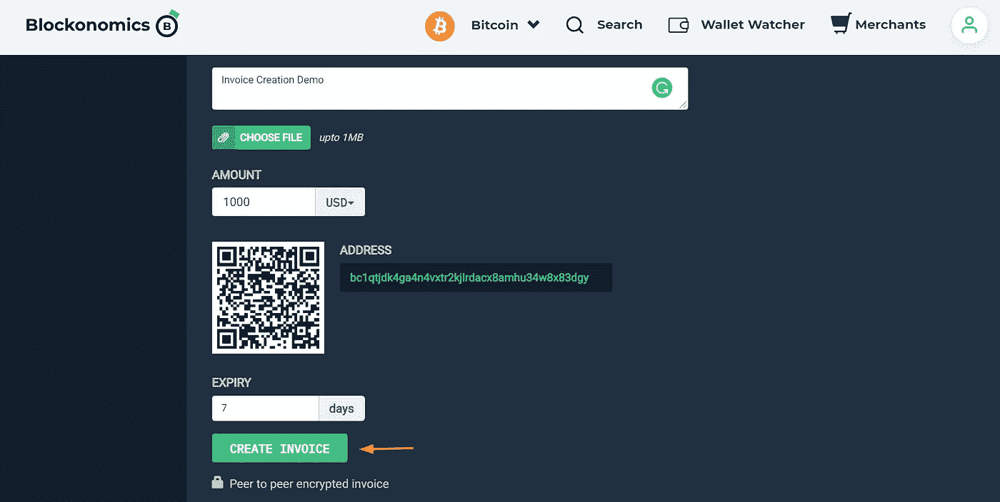

Blockonomics: Invoice Creation Page

您的发票已准备好，可以通过在线链接轻松共享。

> 演示发票【点击链接查看发票页面】:[https://www.blockonomics.co/invoice/25839/#/?key=h4O14hET](https://www.blockonomics.co/invoice/25839/#/?key=h4O14hET)

Blockonomics: Bitcoin Invoice Link

**注意:**每次您希望创建发票时，您只需登录您的帐户，前往**“接收- >创建发票”**。系统会自动为发票拉出一个新的唯一的比特币地址。

除此之外，你还可以*跟踪钱包的余额和交易*，所有这些都在一个仪表板上。

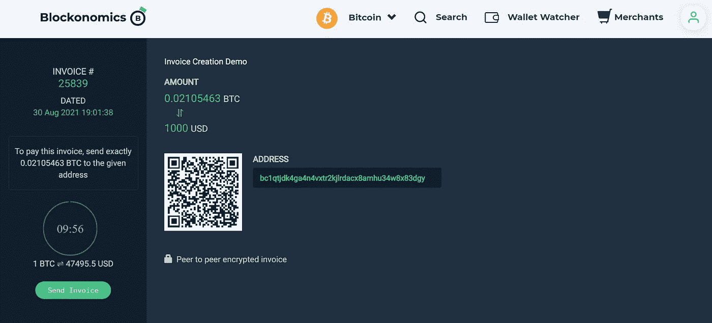

Blockonomics: Bitcoin Invoice Page Example

# 结论

如果你正在寻找创建比特币发票 [Blockonomics](https://www.blockonomics.co/invoicecreate/#) 提供了一个很好的选择，它让你有一个快速简单的解决方案，不需要很多技术设置或 KYC。

你会收到最新的比特币数量，最棒的是你不需要建立一个账户。

要快速、简单、无需登录，只需复制您的比特币地址，并在发票创建页面创建发票。

为了获得更自动化的体验，你可以选择第二种方法，插入你的 xPub 密钥，这将自动提取你的比特币地址，并帮助你跟踪你的交易和余额。

如果你想知道如何向支付比特币发票，[你可以在这里找到更多信息](https://blog.blockonomics.co/how-to-pay-a-bitcoin-invoice-abf4a04d041c) …

如果您有问题、疑问或评论，您可以通过实时聊天与 [Blockonomics 团队联系，他们以出色的客户支持而闻名。更多关于该公司的信息，你可以关注他们的推特。](https://www.blockonomics.co/)

> 加入 Coinmonks 电报频道，了解加密交易和投资

 [## 最佳加密交易所| 2021 年十大加密货币交易所

### 加密货币交易所的加密交易需要了解市场，这可以帮助你获得利润…

blog.coincodecap.com](https://blog.coincodecap.com/crypto-exchange)  [## 2021 年 9 大最佳加密借贷平台

### 当谈到加密货币贷款时，大量因素等同于良好的收入状况。此外，借款的一部分…

blog.coincodecap.com](https://blog.coincodecap.com/crypto-lending)