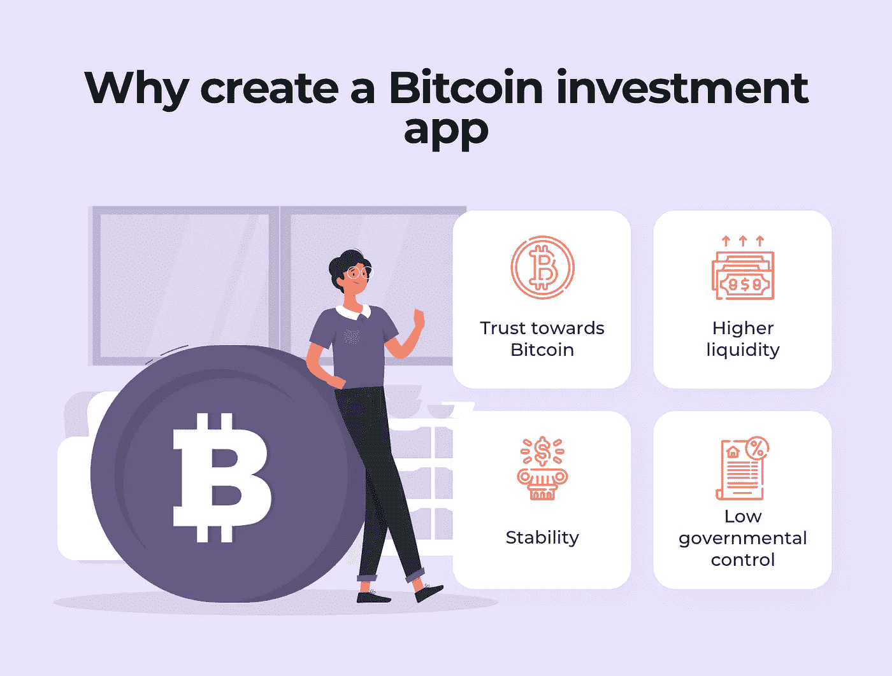
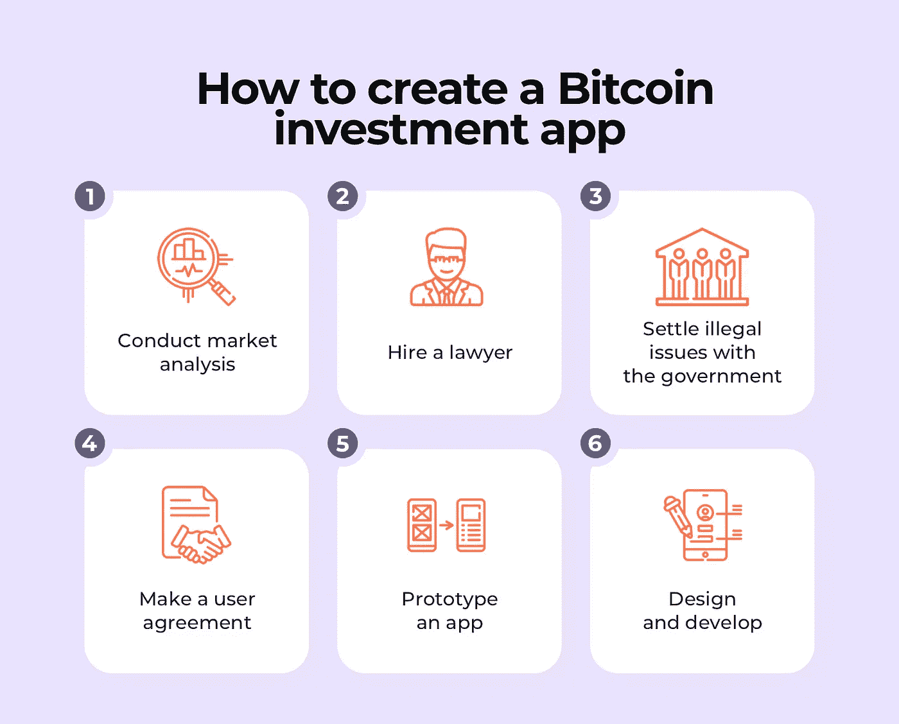

# 如何打造有竞争力的比特币投资 App

> 原文：<https://medium.com/coinmonks/how-to-create-a-competitive-bitcoin-investment-app-9ea9cae28b75?source=collection_archive---------4----------------------->

如今，我们面临着加密货币普及的增长。比特币被认为是最有前途的加密货币之一。因此，是时候创建数字解决方案来帮助投资比特币，并在不同的商业领域进行正确的[比特币](https://blog.coincodecap.com/a-candid-explanation-of-bitcoin)投资了。

在本指南中，我们将介绍比特币投资应用开发。

# 开发比特币投资应用的理由

首先，让我们把一切都搞清楚。为什么是比特币？相比其他加密货币，你应该投资比特币有几个原因。

*   **对比特币的信任**。让我们面对现实吧——与任何其他加密货币相比，人们对比特币的信任度更高。它可以防止比特币崩溃，并大幅降低成本。根据经验，比特币下跌后，恢复高价相当快。
*   **更高的流动性**。意味着客户有大量的机会买卖比特币。甚至有可能在[比特币自动取款机](https://blog.coincodecap.com/tag/bitcoin-atm)买到这种加密货币。市场上充斥着比特币解决方案。例如，有像 CoinBase，KeepKey 等[数字钱包](https://coincodecap.com/category/wallets)。
*   **稳定性**。由于目前的金融和政治不稳定，许多疲软的加密货币不利于储蓄。另一方面，比特币保持稳定和坚硬。
*   **政府控制低**。政府没有严格的限制，考虑到比特币[加密货币](https://blog.coincodecap.com/tag/cryptocurrency)。比特币是去中心化、假名化的。然而，谈到任何金融业务，你必须获得政府许可才能使用比特币。

# 如何制作一个比特币投资应用程序:应遵循的步骤

要创建一个投资应用程序，你应该拥有高科技专业知识或聘请专家。这需要复杂的方法和高超的技巧。
下面你可以找到开发一个比特币投资应用程序并使其成功的六个主要步骤:

*   第一步。进行市场分析。
*   第二步。请一个合格的律师。
*   第三步。与政府解决所有非法问题。
*   第四步。制定用户协议。
*   第五步。开发一个应用原型。
*   第六步。设计开发一款比特币投资 app。

让我们考虑一下每一步的细节。

## 第一步。做市场调查

在开始开发过程之前，您需要探索市场，发现加密货币的趋势。还有，最好考虑一下自己可能面临的挑战。

你应该比较所有现有的加密货币，考虑它们的优缺点。此外，你需要聘请专业的财务顾问。这样的专家可以帮助你区分你的新财务问题的所有方面。

## 第二步。雇佣一个有经验的律师

创业金融，需要和专业律师合作。有一堆法律问题需要你尽快解决。在这种情况下，合格的律师是你最好的助手。

## 第三步。考虑与政府的法律问题

所需文件的数量取决于您所在国家的法规。在大多数情况下，你需要获得**特殊许可**才能开始使用任何加密货币。

有了许可证，你可以确定你的加密货币兑换 app 是完全合法的。

## 第四步。创建用户协议

最好事先做好用户协议。他们需要在使用你的比特币投资应用之前看到它。你应该在此协议中包括你的应用程序提供的所有功能、应用程序的工作方式和许可。

用户应该在同意这些规则的地方打个勾。

## 第五步。原型你的应用

开始比特币应用开发，你应该准备好投资你的技术解决方案。为了避免额外的开销，您需要创建应用程序的原型。

原型可以让我们看到这些特性是如何工作的。因此，您可以改善用户体验。原型允许从经过验证的规格开始开发过程。

## 第六步。设计和开发应用程序

最后但同样重要的是，你需要开始开发过程。

你需要考虑应用程序的设计，因为现在用户都被宠坏了。设计必须是用户友好和有吸引力的。

至于比特币的 app 开发，需要聘请有资质的开发团队。他们创建项目的前端和后端部分。

开发过程中的一个重要步骤是测试。它允许查找和修复错误。它可以改善用户体验并赢得他们的信任。

# 集成到比特币投资应用程序中所需的功能

每个应用程序都包含两种类型的功能——基本和高级。

基本或 MVP 特性代表了倾向于满足用户需求和期望的功能。至于高级或复杂的功能，他们试图提高客户的性能。

给你一个提示，我们列出了比特币投资应用的 MVP 特性:

*   注册和登录
*   货币转换器
*   推送通知
*   用户概要
*   二维码扫描仪
*   身份验证
*   比特币买卖
*   自动取消
*   管理面板

还有，你需要考虑 app 的安全性。您可以集成以下解决方案:

*   双因素认证
*   SSL 加密
*   自动注销
*   身份验证

## 创建成功比特币投资应用的提示

有四个主要的技巧可以让你的比特币应用成功。

*   **低买高卖**。比特币应该在成本较低时买入，在价格变高时卖出。
*   **监控 BTC 市场**。这个技巧和上一个有联系。用户需要一个监控 BTC 市场的机会。因此，他们可以获得何时购买加密货币的建议。
*   **去哪里投资比特币**。您可以提供一个基金和股票交易所的列表，供用户投资。然而，你需要仔细考虑这个项目，因为加密货币市场充满了欺诈。
*   **评估风险**。当然，你需要投资比特币加密货币才能获得成功。但是考虑风险并做出明智的决定是必要的。

正如你所看到的，比特币投资应用程序开发往往既耗时又具有挑战性。你需要雇佣有资格和经验的开发人员来创造一个伟大的产品。此外，最好和一个好律师合作，他可以帮你解决一大堆法律问题。此外，你需要获得许可证来开始这种类型的金融业务。

**作者简介**

维塔利·库普连科是 Cleveroad 的作家。这是一家网络和移动应用开发公司，总部在乌克兰。他喜欢写关于技术和数字营销的文章。

## 另外，阅读

*   最好的[密码交易机器人](/coinmonks/crypto-trading-bot-c2ffce8acb2a)
*   [密码本交易平台](/coinmonks/top-10-crypto-copy-trading-platforms-for-beginners-d0c37c7d698c)
*   最好的[加密税务软件](/coinmonks/best-crypto-tax-tool-for-my-money-72d4b430816b)
*   [最佳加密交易平台](/coinmonks/the-best-crypto-trading-platforms-in-2020-the-definitive-guide-updated-c72f8b874555)
*   最佳加密贷款平台
*   [最佳区块链分析工具](https://bitquery.io/blog/best-blockchain-analysis-tools-and-software)
*   [加密套利](/coinmonks/crypto-arbitrage-guide-how-to-make-money-as-a-beginner-62bfe5c868f6)指南:新手如何赚钱
*   最佳[加密制图工具](/coinmonks/what-are-the-best-charting-platforms-for-cryptocurrency-trading-85aade584d80)
*   [莱杰 vs 特雷佐](/coinmonks/ledger-vs-trezor-best-hardware-wallet-to-secure-cryptocurrency-22c7a3fd391e)
*   了解比特币的[最佳书籍有哪些？](/coinmonks/what-are-the-best-books-to-learn-bitcoin-409aeb9aff4b)
*   [3 商业评论](/coinmonks/3commas-review-an-excellent-crypto-trading-bot-2020-1313a58bec92)
*   [AAX 交易所评论](/coinmonks/aax-exchange-review-2021-67c5ea09330c) |推荐代码、交易费用、利弊
*   [Deribit 审查](/coinmonks/deribit-review-options-fees-apis-and-testnet-2ca16c4bbdb2) |选项、费用、API 和 Testnet
*   [FTX 密码交易所评论](/coinmonks/ftx-crypto-exchange-review-53664ac1198f)
*   [n 零审核](/coinmonks/ngrave-zero-review-c465cf8307fc)
*   [Bybit 交换审查](/coinmonks/bybit-exchange-review-dbd570019b71)
*   [3Commas vs Cryptohopper](/coinmonks/cryptohopper-vs-3commas-vs-shrimpy-a2c16095b8fe)
*   最好的比特币[硬件钱包](/coinmonks/the-best-cryptocurrency-hardware-wallets-of-2020-e28b1c124069?source=friends_link&sk=324dd9ff8556ab578d71e7ad7658ad7c)
*   最佳 [monero 钱包](https://blog.coincodecap.com/best-monero-wallets)
*   [莱杰纳诺 s vs x](https://blog.coincodecap.com/ledger-nano-s-vs-x)
*   [bits gap vs 3 commas vs quad ency](https://blog.coincodecap.com/bitsgap-3commas-quadency)
*   [莱杰纳米 S vs 特雷佐 one vs 特雷佐 T vs 莱杰纳米 X](https://blog.coincodecap.com/ledger-nano-s-vs-trezor-one-ledger-nano-x-trezor-t)
*   [block fi vs Celsius](/coinmonks/blockfi-vs-celsius-vs-hodlnaut-8a1cc8c26630)vs Hodlnaut
*   Bitsgap 评论——一个轻松赚钱的加密交易机器人
*   为专业人士设计的加密交易机器人
*   [PrimeXBT 审查](/coinmonks/primexbt-review-88e0815be858) |杠杆交易、费用和交易
*   [埃利帕尔泰坦评论](/coinmonks/ellipal-titan-review-85e9071dd029)
*   [赛克斯·斯通评论](https://blog.coincodecap.com/secux-stone-hardware-wallet-review)
*   [BlockFi 评论](/coinmonks/blockfi-review-53096053c097) |从您的密码中赚取高达 8.6%的利息