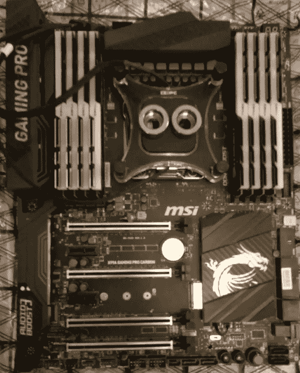

# 如何从其他世界创建一个加密矿工(一台电脑壁挂式 DIY)

> 原文：<https://medium.com/coinmonks/how-to-create-a-crypto-miner-from-other-world-a-pc-wall-mounted-diy-6c3136c8f3ab?source=collection_archive---------4----------------------->

在我们这个游戏玩家和矿工的世界里，这是我们所有人都必须完成的任务。

这是一个硬件安装指南，你可以看到和了解哪些是你的电脑液冷需要的组件，并从零开始制作和真棒艺术机。

故事如何开始:

我们一直喜欢游戏和硬件，但直到 3 年前，我们才开始用 ASICs 和 GPU 来使用我们的数据挖掘知识。我们开了一家公司，成为一家初创公司，有[矿池开发](http://pool.bitdharma.com)、[区块链相关开发](https://www.fiverr.com/bitdharma)、挖矿、交易 Clases、[更有](http://www.bitdharma.info)。

我们的目标是让任何与区块链相关的东西都易于使用，我们相信这对每个人来说都是一个巨大的金融工具优势。

考虑到这一事实，我们有兴趣建造一个尽可能接近艺术品的液冷采矿钻机。

组件:

**核心组件**

*   CPU:英特尔至强 E5–2630 v3 2.4 GhZ 8 核 20MB。[链接](https://www.amazon.com/gp/offer-listing/B00N0W3N54/ref=dp_olp_0?ie=UTF8&condition=all&qid=1533076232&sr=1-1) $918
*   主板:微星 X99A 游戏 PRO CARBON。[链接](https://www.amazon.com/gp/product/B01GIUYPHE/ref=oh_aui_detailpage_o01_s00?ie=UTF8&psc=1)350 美元
*   GPU(上):2 *微星 GTX 1070 海鹰 EK。[链接](https://www.amazon.com/MSI-GeForce-GTX-1070-HAWK/dp/B01JP5OQKA/ref=sr_1_1?s=electronics&ie=UTF8&qid=1533069045&sr=1-1&keywords=msi+gtx+1070+seahawk)500 美元
*   GPU: 2 *微星 GTX 1070 AEREO。[链接](https://www.amazon.com/MSI-GTX-1070-ITX-AERO/dp/B01GUAJMRU/ref=sr_1_1?s=electronics&ie=UTF8&qid=1533069111&sr=1-1&keywords=msi%2Bgtx%2B1070%2Baero&th=1)420 美元
*   内存:8 * G .技能 8GB TRIDENTZ RGB。[链接](https://www.amazon.com/G-SKILL-TridentZ-16GB-25600-F4-3200C16D-16GTZR/dp/B01MTDEYHU/ref=sr_1_3?s=electronics&ie=UTF8&qid=1533068883&sr=1-3&keywords=g.skill+tridentz+rgb)125 美元
*   固态硬盘:金典 240GB 固态硬盘。[链接](https://www.amazon.com/gp/product/B00XJCNPEY/ref=oh_aui_detailpage_o07_s00?ie=UTF8&psc=1)50 美元
*   PSU:P2 EVGA 1600 号。[链接](https://www.amazon.com/EVGA-SuperNOVA-PLATINUM-Crossfire-220-P2-1600-X1/dp/B00NJG61JQ/ref=sr_1_1?ie=UTF8&qid=1533068793&sr=8-1&keywords=evga+1600+p2)350 美元

**冷却组件**CPU 回路

*   防水块:XSPC RayStorm RGB V3。[链接](https://www.amazon.com/XSPC-RayStorm-RGB-WaterBlock-Intel/dp/B0735HP82N/)73 美元
*   水泵:SC1000 (18W — 1.5A — 264 GPH)。[链接](https://www.amazon.com/gp/product/B01GY8LV68/ref=oh_aui_detailpage_o00_s00?ie=UTF8&psc=1)40 美元
*   风扇(仅限背部):2 * Bit 静音纯翼 2。[链接](https://www.amazon.com/gp/product/B01JMELYJA/ref=oh_aui_detailpage_o03_s00?ie=UTF8&psc=1)22 美元
*   散热器和水库:Nhowe 最佳 DIY 240 水冷套件。[链接](https://www.amazon.com/gp/product/B0156F7UO2)200 美元

GPU 循环

*   GPU Water Block:2 * Thermaltake Pacific V-GTX。[链接](https://www.amazon.com/Thermaltake-Pacific-Nickel-Transparent-CL-W134-CU00TR/dp/B01K8KD242/ref=sr_1_1?ie=UTF8&keywords=thermaltake%201070%20liquid&language=en_US&qid=1533072936&s=electronics&sr=1-1)140 美元
*   蓄水池和水泵:2 * Enermax NEOChanger 300ml。[链接](https://www.amazon.com/gp/product/B0716TGQFY/ref=oh_aui_detailpage_o05_s00?ie=UTF8&psc=1) $111
*   散热器:2 * Artic 液体冷冻机。[链接](https://www.amazon.com/gp/product/B01KZTE0XS/ref=oh_aui_detailpage_o03_s00?ie=UTF8&psc=1) $100
    方案二散热器:2 * XSPC EX420。[链接](https://www.amazon.com/XSPC-EX420-Radiator-140mm-Triple/dp/B007YLTHRK/ref=sr_1_2_sspa?s=electronics&ie=UTF8&qid=1533070696&sr=1-2-spons&keywords=3+fan+radiator&psc=1&smid=A3GO5VFCNOM5I7)77 美元
*   范(后):6 *镰刀超卡兹 3000。[链接](https://www.amazon.com/gp/product/B001JKNMBE/ref=oh_aui_detailpage_o03_s00?ie=UTF8&psc=1)15 美元
*   风扇(正面):6 *海盗船 ML120 蓝色。[链接](https://www.amazon.com/gp/product/B01G5I6MYI/ref=pd_rhf_se_s_vtp_ses_clicks_0_4?ie=UTF8&pd_rd_i=B01G5I6MRK&pd_rd_r=G2PRQEJ1DZ06Q5SMJTVQ&pd_rd_w=bGYTF&pd_rd_wg=OVC7V&pf_rd_i=desktop-rhf&pf_rd_m=ATVPDKIKX0DER&pf_rd_p=4743125097998253099&pf_rd_r=G2PRQEJ1DZ06Q5SMJTVQ&pf_rd_s=desktop-rhf&pf_rd_t=40701&refRID=G2PRQEJ1DZ06Q5SMJTVQ&th=1) $12
    选项:海盗船 ML120 PRO RGB。[链接](https://www.amazon.com/gp/product/B076VDWDZ2/ref=pd_rhf_se_s_vtp_ses_clicks_0_4?ie=UTF8&pd_rd_i=B01G5I6MRK&pd_rd_r=G2PRQEJ1DZ06Q5SMJTVQ&pd_rd_w=bGYTF&pd_rd_wg=OVC7V&pf_rd_i=desktop-rhf&pf_rd_m=ATVPDKIKX0DER&pf_rd_p=4743125097998253099&pf_rd_r=G2PRQEJ1DZ06Q5SMJTVQ&pf_rd_s=desktop-rhf&pf_rd_t=40701&refRID=G2PRQEJ1DZ06Q5SMJTVQ&th=1)27 美元

配件和管件

*   8 * XSPC PETG 油管，外径 14 毫米，内径 10 毫米，长度 50 厘米。[链接](https://www.amazon.com/gp/product/B00ZC0U4K4/ref=oh_aui_detailpage_o03_s00?ie=UTF8&psc=1)3.50 美元
*   16 * XSPC G1/4 英寸至 10–14 毫米三重密封接头。[链接](https://www.amazon.com/Triple-Fitting-Black-Chrome-4-pack/dp/B00ZC0Q7DW/ref=pd_bxgy_147_img_3?_encoding=UTF8&pd_rd_i=B00ZC0Q7DW&pd_rd_r=Z5EC4ZP2VRW4M7MQPGET&pd_rd_w=wltwj&pd_rd_wg=8swgb&psc=1&refRID=Z5EC4ZP2VRW4M7MQPGET) $5
*   XSPC 配件取样器包。[链接](https://www.amazon.com/XSPC-Fittings-Sampler-Black-Chrome/dp/B074CST3KB/ref=sr_1_4?s=electronics&ie=UTF8&qid=1533074518&sr=1-4&keywords=xspc+FITTING+PACK)80 美元
*   软管(来自 Nhowe Best DIY 240 水冷套件)
*   软管配件(Nhowe Best DIY 240 水冷套件)

混杂的

*   电源开关按钮:Uxcell PC 双 USB 金色调。[链接](https://www.ebay.com/itm/Desktop-Computer-PC-Movable-Self-stick-Combo-Power-Switch-Reset-Button-Dual-USB/322469890801?hash=item4b14b40af1:g:ocUAAOSwCMFaTKUm) $16
*   液态冷却剂:1* XSPC ECX 超浓缩冷却剂绿色。[链接](https://www.amazon.com/XSPC-Ultra-Concentrate-Coolant-2-pack/dp/B071LHK37H/ref=sr_1_1_sspa?s=electronics&ie=UTF8&qid=1533073349&sr=1-1-spons&keywords=XSPC+ECX+Ultra+Concentrate+Coolant%2C+Green+UV&psc=1) $11
*   液体冷却剂:1 * XSPC ECX 超浓缩冷却剂蓝。[链接](https://www.amazon.com/XSPC-Ultra-Concentrate-Coolant-2-pack/dp/B072FJPVZ7/ref=sr_1_1_sspa) $11
*   LED 照明:2 * Rayhoo 全套电脑 RGB。[链接](https://www.amazon.com/Rayhoo-Computer-Function-Controller-Desktop/dp/B071J2VR1L)13 美元
*   风扇控制器:Thermaltake Commander FT 触摸屏。[链接](https://www.amazon.com/Thermaltake-Commander-Channel-Controller-AC-010-B51NAN-A1/dp/B00V80IQTS/)30 美元
*   铝制 L 形型材 1/2 英寸(长:3 米)。大约 1 美元
*   乙烯基包装:3M 黑色碳纤维乙烯基(4 英尺 x 12ft 英尺)。[链接](https://www.amazon.com/3M-CA-421-BLACK-CARBON-Wrapping/dp/B005HYPNJM/)20 美元
*   热化合物:Artic MX-4。[链接](https://www.amazon.com/ARCTIC-MX-4-Compound-Performance-Interface/dp/B0795DP124/ref=sr_1_5_sspa?s=electronics&ie=UTF8&qid=1533140126&sr=8-5-spons&keywords=mx-4+artic&psc=1)10 美元

**电缆**

*   风扇轮毂系统:银石 PWM 风扇轮毂系统。[链接](https://www.amazon.com/SilverStone-System-Cables-Black-CPF04/dp/B00VNW556I/)14 美元
*   ModTek 4 针 Molex 至 4 x 3 针风扇连接器。[链接](https://www.amazon.com/gp/product/B00MYA3A4C/ref=oh_aui_detailpage_o00_s00?ie=UTF8&psc=1) $9
*   4 * EPCI 高速 16x 柔性电缆卡扩展。[链接](https://www.amazon.com/gp/product/B01NH0GW7Z/ref=oh_aui_detailpage_o01_s00?ie=UTF8&psc=1) $20
*   4 个 PCI-E VER 007 16 个转 1 个 USB 3.0 接口。[链接](https://www.amazon.com/Ankoow-Powered-Riser-Adapter-Extension/dp/B072XCSGZZ/) $8

**框架**

*   主体:密度板(140cm x 90cm x 15mm)。$38
*   GPU 和主板支持:丙烯酸背板(5 毫米厚)。[链接](https://articulo.mercadolibre.com.ve/MLV-518151411-laminas-acrilicas-trasparentes-importadas-de-5mm-_JM)1 美元
*   20 *铝支座(12 毫米 x 20 毫米)。[链接](https://articulo.mercadolibre.com.ve/MLV-459697072-soporte-vidrio-acrilico-base-separador-distanciador-s12x20a-_JM)5 美元
*   20* M2x10 mm 自攻螺钉。[链接](https://www.amazon.com/Dophee-100Pcs-Carbon-Steel-Self-tapping/dp/B01A6T76LA/ref=sr_1_10?ie=UTF8&qid=1533142286&sr=8-10&keywords=self-screwing+screws)6 美元

**工具**

*   XSPC 简易切割和弯曲工具包。[链接](https://www.amazon.com/XSPC-Easy-Bend-Toolkit-Tubing/dp/B016B29V4G/ref=pd_bxgy_147_img_3?_encoding=UTF8&pd_rd_i=B016B29V4G&pd_rd_r=HS754VQXC3JNAM94EKGJ&pd_rd_w=bOB7L&pd_rd_wg=4f3Om&psc=1&refRID=HS754VQXC3JNAM94EKGJ)21 美元
*   百得钻探工程工具包。[链接](https://www.amazon.com/gp/product/B014QUP0FE/ref=oh_aui_detailpage_o00_s00?ie=UTF8&psc=1)60 美元
*   Thermaltake 太平洋 16 毫米硬管弯曲套件。[链接](https://www.amazon.com/Thermaltake-Pacific-Cooling-Bending-CL-W093-AL00BL/dp/B01BX3EZUI/ref=pd_bxgy_147_img_3?_encoding=UTF8&pd_rd_i=B01BX3EZUI&pd_rd_r=MTE0RJT3G5Y3RJR10RFB&pd_rd_w=rEAp5&pd_rd_wg=24JEo&psc=1&refRID=MTE0RJT3G5Y3RJR10RFB)60 美元
*   热风 SMD 返工站:亚讯 850+。[链接](https://www.aliexpress.com/item/YAXUN-YX850-digital-display-Hot-air-gun-BGA-SMD-rework-station-Advanced-Air-Pump-Hot-Air/32388025982.html)55 美元
*   斜切锯:塔基玛 TKMS-10。$49
*   游标。[链接](https://www.amazon.com/Alicenter-Plastic-Sliding-Vernier-Measuring/dp/B06XD4W2B8/ref=sr_1_8?s=electronics&ie=UTF8&qid=1533143700&sr=1-8&keywords=vernier) $2

所以，一旦我们有了所有的组件和工具，我们就花了 6.472 美元。让我们开始吧。

请记住，价格可能会改变和部分，这只是参考。

# 逐步地

*   **CAD 软件上的框架设计:**

AutoCAD Design

对于框架，我们使用 140 x 90 厘米的中密度纤维板，15 毫米厚。我们在 AutoCAD 上设计了框架，以便将文件提供给 CNC 布线车间，这样我们确保了孔的对称和精确。

MDF Board after routing

我们用来标记孔的一个技巧是在车间里将它们布线到小于中密度纤维板厚度的深度，在这些孔中放置支架来支撑丙烯酸树脂和部件。

记住总是为所有的通孔指定一个较大的公差，这样不仅可以保证完美的配合，还可以为乙烯基包装留出一点空间。

*   **照明用亚克力背板:**

Side view of Acrylic Board, Aluminum Standoffs, and Sea Hawk GPU

对于背光，我们使用了 5 毫米厚的丙烯酸板，我们使用数控激光切割服务切割，我们还在边缘周围制作了完整的 45°圆角。所有的丙烯酸背板都是用 AutoCAD 设计的，所有其他的规格都直接交给了车间。

Acrylic Board holes description

为了将背板连接到框架上，我们使用了 6 mm 的铝支架，通常用于玻璃和丙烯酸标牌。

*   **主板和 GPU 支持:**

Motherboard Acrylic with the MOBO Brass Standoffs

为了支持丙烯酸背板的主板，我们在 CAD 设计中标记了丙烯酸的常规 ATX 主板孔。这样，激光切割机就能在正确的位置切割出孔。我们使用的一个技巧是指定一个稍微小一点的直径，这样每个主板上的普通黄铜支架就可以很容易地拧入丙烯酸树脂中。

将显卡支撑在亚克力背板上是一件棘手的事情:

1/2" Aluminum L-Shape — Cutting, Bent, and Drill

我们使用了“铝制 L 形型材。这与框架设计和亚克力设计中的 L 形孔相对应。这种支架的诀窍是将一段型材切割成 L 形支架，该支架将穿过框架和丙烯酸树脂的背面，这样显卡将位于 L 形支架的短边上，长边将隐藏在框架后面，使用短干墙螺钉固定。

*   **绕帧:**

Backside

我们使用带有碳纤维图案的常规 3M 乙烯基包装，包装框架时避免褶皱的一个技巧是用白胶和水的混合物润湿 MDF 表面，这避免了气穴的形成。在铺设乙烯基包装时，我们使用了原料包装板的整个宽度，然后剪去多余的部分。

为了盖住孔上暴露的木头部分，我们将一些乙烯基片切割成它们的尺寸，并小心地将它们放入孔中，以获得更整洁的外观。

*   **主板组装:**

Motherboard

对于这个行业的每个人来说，放置 RAM 模块和 CPU 是一个非常简单的过程。但是稍微提醒一下，CPU 插座有其特殊性，所以在购买 CPU 之前一定要仔细检查你的主板。RAM 也是一样，组装时不会有任何问题。下一步，也是最棘手的一步，是将防水块放在处理器的顶部。按照此过程的所有最佳实践，涂上一层薄薄的导热化合物，然后像放置风扇一样将防水块放在处理器顶部，确保它正确安装在按压式插座上。

*   **组装:**

Installing first components onto the frame

为了将组件安装到框架上，我们必须找到一组螺钉，这些螺钉将穿过铝支架，但长度不足以穿过框架。我们把所有的支架都拧到位了；然后，我们使用黄铜支架将主板放在相应的丙烯酸背板上，然后使用常规主板螺钉将其固定到位。之后，我们将组件放在适当的位置，用丙烯酸树脂拧紧铝支架盖。

Installing the acrylic backplates

为了安装显卡，我们首先将丙烯酸背板放在它的位置，拧紧支架帽。然后，我们将 L 形轮廓穿过框架和丙烯酸树脂，将显卡放在轮廓的短边上，拧紧到位，就像您将它放在常规机箱上一样。然后，我们把型材的长边拧进框架的背面。

我们水冷策略背后的逻辑是为每个单独的系统提供额外的冷却阶段。根据 [EKWB 的水冷指南](https://www.ekwb.com/guides/how-liquid-cooling-works/)，这项业务的经验法则是对每个要冷却的组件使用 120 毫米的散热器。因此，通过为每个系统使用一个 360 毫米的散热器(每个由两个显卡组成)，以及一个 240 毫米的散热器用于 CPU 冷却，我们为每个系统提供了一个额外的冷却阶段，这应该足以保证整个系统在低温下运行，即使在 GPU 超频速度下采矿。

Backside — CPU Radiator, Dual Fan.

正如你在这篇文章的首页看到的，我们使用了两个 360 毫米长的散热器，每个散热器配备了六个风扇，每侧三个。我们使用了一个液体冷却套件，它是封闭的，并准备在单个 CPU 上使用，这个模型配备了一个水泵-水块，橡胶软管及其相应的风扇。但是我们选择将它们从我们的系统中移除，并且单独使用带有我们自己的风扇和我们自己的泵-容器组合的散热器。我们建议使用定制零件，而不是打包套件，因为这样更容易组装和定制，但我们使用并修改了那些零件，因为它们卖得非常便宜。

为了冷却 CPU，我们使用亚马逊销售的[入门套件](https://amzn.to/2M8Seka)的零件构建了一个单独的循环。这是一个便宜的中国制造的套件，我们建议将其作为水冷的首选方法，但对于更可靠的 PC，您应该转向市场上最好的 XSPC、EKWB、Thermaltake、Enermax 或其他公认品牌的定制部件。我们更换了该套件附带的库存风扇，并构建了一个小框架来将散热器风扇组件安装在框架的背面。我们使用的泵和储水池是该工具包附带的，并战略性地放置在框架后面，以方便管道的布局。

*   **配管:**

这是我们真正有创意的地方，我们使用 XSPC 的 14 毫米外径 10 毫米的刚性丙烯酸管。这也是最棘手的部分之一，为了将丙烯酸管弯曲成所需的长度和形状，必须使用单独出售的弯曲工具来弯曲特定的直径。

这个过程本身是显而易见的，你必须在 300 摄氏度下加热管道 40 秒钟，使其弯曲成所需的形状，如 90 度弯曲或 45 度弯曲，但为了做到这一点，并且不在管道内部产生任何褶皱或通过改变其横截面来抑制流动，你必须使用实心橡胶软管，在管道被加热和弯曲时保持横截面。该套件还包括一个弯管机，这是一个可以让你将管道弯曲成精确形状的附件。套件中包含的另一个工具是切管机，Thermaltake 套件中包含的切管机要优越得多，因为它切割管道时不会像 XSPC 套件那样受到切割钳产生的任何压缩应力。

在所有这些解释之后，我们所能建议的就是不要害怕在弯曲管道时犯错误，我们在完成这个项目时确实犯了几次错误。所有的管道长度都是用卡尺测量的，不是因为我们非常关心精度，而是因为它是触手可及的工具。

Rigid Tubing Compression Fitting

铺设管道的一个重要方面是要使用的配件。由于我们使用了刚性管道，我们需要在连接刚性管道的地方使用刚性管道配件，为此我们购买了各种不同的配件。一个变得非常方便的是一个用于刚性管道的 90°旋转弯头，我们用于 CPU 散热器的输入管道。

由于这些系统中有一部分是不可见的，我们在背面使用了软管来连接散热器和水箱，这种软管使用了专门为软管设计的不同类型的配件。用于这部分系统的管道是中国制造的套件的一部分，以及与其一起使用的配件。与 360 毫米散热器的连接是通过将散热器套件中的原始橡胶软管安装到软管中实现的，软管的内径恰好等于橡胶软管的外径，这种连接不需要任何进一步的配件或连接，仍然没有泄漏一点。

*   **接线:**

为了给这台电脑供电，我们选择了 EVGA 1600P2，主要是因为它很容易支持一切，并且有足够的端口直接连接几乎一切。我们首先连接了所有的必需品，主板和 CPU，然后是 VGA 电缆来连接四个显卡，其中两个需要 14 针连接器，而另外两个需要 8 针连接器。

为了给所有的风扇、泵和灯供电，我们安装了一个风扇集线器，它可以通过 PSU 的一根 periferics 电缆为多达八个组件供电，作为补充，我们使用了一个风扇控制器，它可以通过一根 periferics 电缆为多达五个风扇供电。

EZDIY PCIe-USB riser 16x to 16x Black

对于显卡和主板之间的 PCIe 连接，我们使用了两个组件的桥，一个是 EZDIY 的扁平 riser 电缆，另一个是通过 SATA 电缆供电的常规 PCIe-USB riser 卡。

*   **向系统注入冷却剂并进行泄漏测试:**

Filling the system with liquid coolant

我们使用 XSPC 的液体冷却剂浓缩液，它与水以 9:1 的比例稀释，产生一升冷却剂，对于显卡冷却回路，我们使用蓝色浓缩液，对于 CPU 冷却回路使用绿色浓缩液。为了填充储槽，我们通过移除螺旋盖来调整刚性管道配件，以便在使用漏斗填充时防止溢出，我们填充储槽，然后使用 PSU 测试仪启动系统，以避免在泵帮助填充系统时为主板和其他敏感组件供电。当所有空气从管道和水锁中排出并进入储层时，系统被视为完全充满。在此之后，我们运行整个循环大约五分钟，在所有敏感组件中插入插件之前寻找漏洞。我们在 CPU 的防水块中检测到一点泄漏，这是由于配件中存在一个额外的 O 形环，我们将其移除以消除泄漏。幸运的是，任何系统都没有其他漏洞。

*   **一个小问题:**

Nhowe Best DIY 240 水冷套件附带的水泵出现故障，我们不得不在其他测试项目中使用该水泵一年，当我们在此设置中安装它时，它不起作用。因此，我们必须从该回路中移除冷却剂，并为 SC1000 更换泵，该泵来自同一制造商且容量更大。

*   **系统启动和配置:**

在计算机的第一次启动中，我们遇到了一个问题，原因是有故障的 RAM 模块(2 * TridentZ RGB)阻止了主板的 BIOS 运行。卸下除两个以外的所有内存模块后，计算机成功运行了 BIOS。然后，我们从闪存驱动器安装了我们的 Windows 版本，最后配置了所有设置，以改进我们的计算机，用于采矿目的。

[https://youtu.be/sQCFHqvAK1E](https://youtu.be/sQCFHqvAK1E)

Celebrating, with the two faulty rams on our hands hehe

制造商:

Julio Garcia，机械工程师，Bitdharma LLC 的项目经理

弗里茨·瓦格纳，生产工程师，比特达摩公司首席执行官

如果你喜欢，请支持，这让我们觉得这是值得的，所以我们可以继续做酷的工作。

我们的钱包发展:[www.d-wallet.org](http://www.d-wallet.org)我们的信息页面:[www.bitdharma.org](http://www.bitdharma.org)我们的洛基矿池:[loki.dharmapool.org](http://loki.dharmapool.org)

参考:[https://www . overclock . net/forum/61-water-cooling/1424387-gallery-build-log-ultimate-wall-mount-rig-maxxplanck-v2-completed . html](https://www.overclock.net/forum/61-water-cooling/1424387-gallery-build-log-ultimate-wall-mount-rig-maxxplanck-v2-completed.html)

> [在您的收件箱中直接获得最佳软件交易](https://coincodecap.com/?utm_source=coinmonks)

