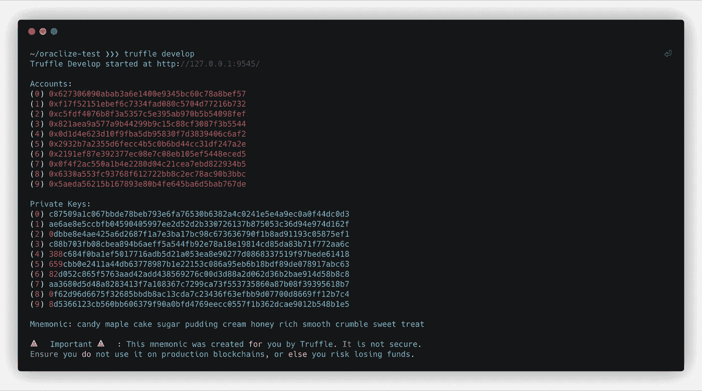
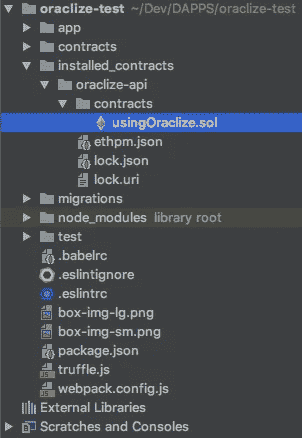
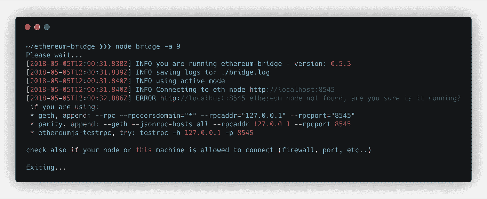
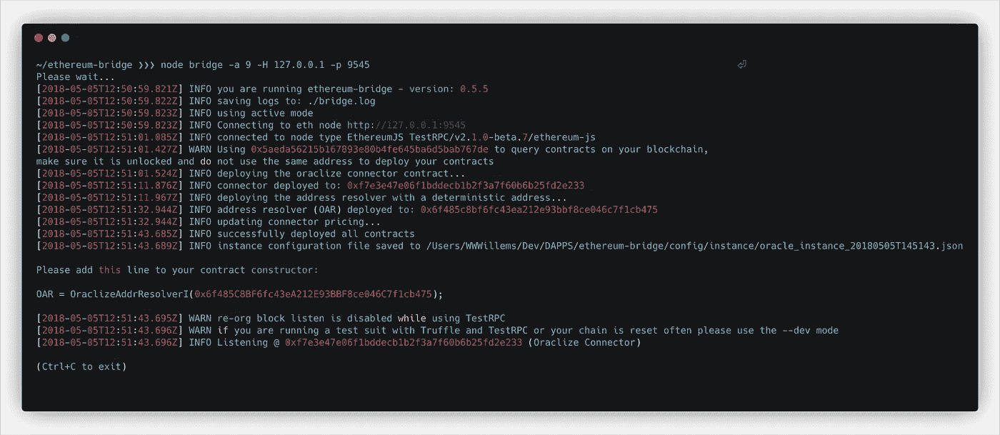
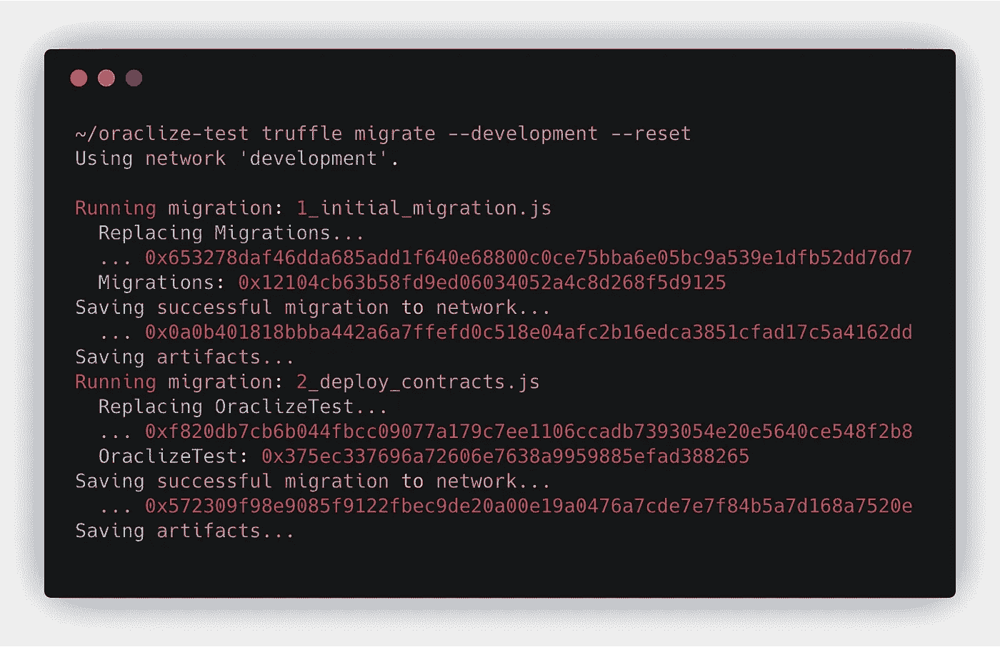
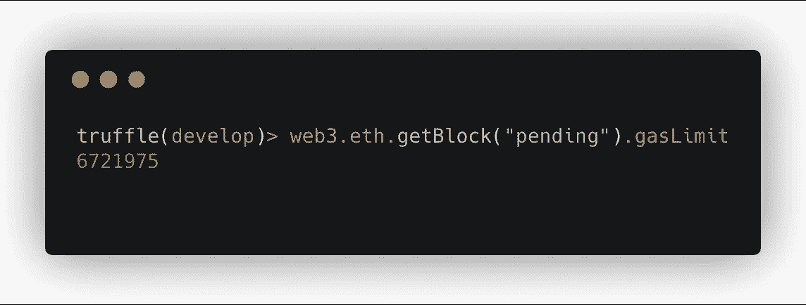
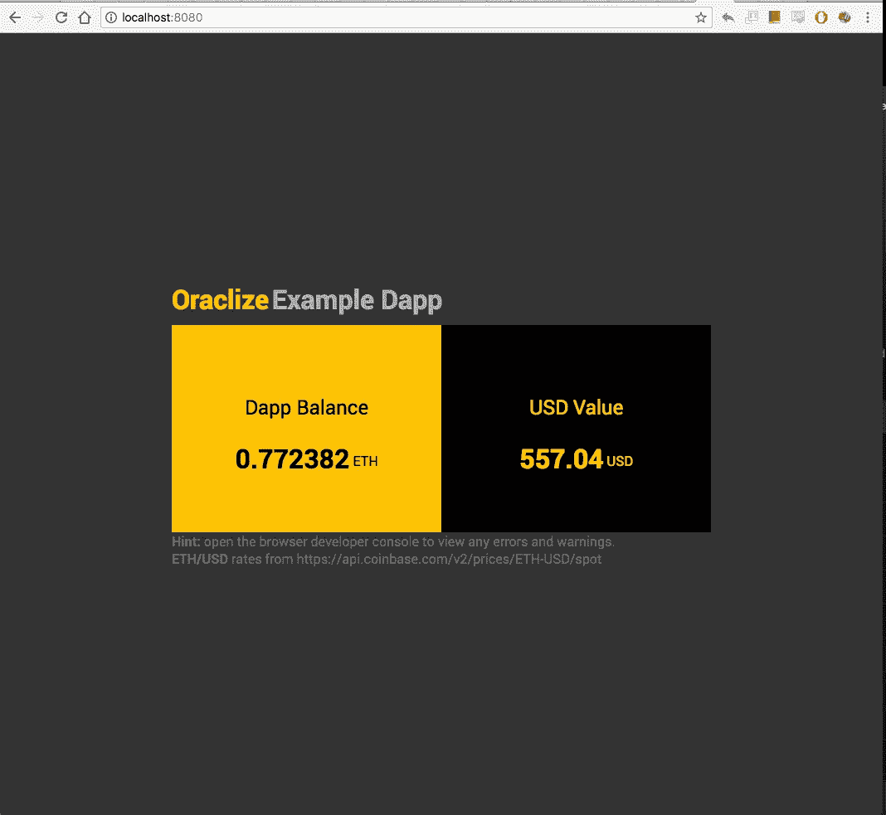

# 如何使用 Truffle、Oraclize、ethereum-bridge 和 Webpack 创建 DApp

> 原文：<https://medium.com/coinmonks/how-to-create-a-dapp-using-truffle-oraclize-ethereum-bridge-and-webpack-9cb84b8f6bcb?source=collection_archive---------2----------------------->

关于在智能合约前端使用外部 API 数据的简单指南

## 关于本教程

完成本教程后，您将拥有一个可工作的 DApp(分散式应用程序),对通过 [**可靠性**](https://github.com/ethereum/solidity) **智能契约**发出的**事件**做出反应，使用 **Oraclize** 从[**比特币基地**](https://api.coinbase.com/v2/prices/ETH-USD/spot) 获取**外部** **API 数据**。为了科学！

> [发现并回顾最佳区块链软件](https://coincodecap.com)

我们将:

*   编写和部署简单的**智能合同**
*   为 **Oracle 通信**设置本地`ethereum-bridge`
*   使用 Oracle 从**比特币基地 API** 获取外部数据
*   创建一个定制的**前端**来显示 API 数据
*   在本地开发环境中做这件事

> 注意:在文章的底部有一张我们将要做的东西的截图

## 关于我

嗨，我叫[着陆器](https://twitter.com/wwwillems)。我是来自比利时的数字顾问和产品设计师。当我不涉足 Solidity 时，我会开发一个 SaaS，帮助自由职业者和数字团队组织分享他们的数字内容。

# 开始

## 先决条件

1.  你可以克隆一个`git`库&通过`npm`安装它的依赖项
2.  你对 HTML、JavaScript、 [Webpack](https://webpack.js.org/) 、终端、…
3.  您希望了解更多关于使用**或** & **实体事件**的信息

## 我们会做什么？

我们将编写一个智能契约，使用本地运行的 Oracle 获取外部 API 数据。我们将通过使用`ethereum-bridge`模拟甲骨文来实现这一点。合约从 [**比特币基地 ETH-USD 现货价格 API**](https://api.coinbase.com/v2/prices/ETH-USD/spot) **中取当前**以太币** **USD** 价格。**

我们将创建一个简单的 **HTML** 页面，以 **ETH** 和 **USD 显示我们合同的总 ETH 余额。**您的合同的美元总值是使用比特币基地 API 计算的。这些值会自动更新，直到合同资金用完。

## 使用的工具

*   Git，npm
*   [松露](http://truffleframework.com/)，[松露网络包装盒](http://truffleframework.com/boxes/webpack)，oraclize-api
*   [以太坊桥](https://github.com/oraclize/ethereum-bridge)
*   Javascript， [Webpack](https://webpack.js.org/)

## 神谕是什么？

智能合约，就其本质而言，能够运行计算，存储和检索数据。因为每个节点运行每个计算，所以从以太坊契约发出任意网络请求是不实际的(目前也是不可能的)。Oracles 通过观察事件的区块链来填补这一空白，并通过将查询结果发布回契约来响应事件。通过这种方式，契约可以与外链世界进行交互。

> " Oracles 允许将外部数据(如非区块链数据)发送给合同."

Oracles 是将信息发送到 Smart Contract 的可信数据源，消除了 Smart Contract 直接访问其网络外部信息的需要，从而减轻了其工作负载。Oracles 通常由第三方提供，并由使用它们的公司授权。

oracle/oracle 网络负责将您连接到数据源。如果你想了解更多关于神谕的内容，请看这里。

# 我们走吧

## 安装松露

首先，让我们启动我们的终端，在全球安装[松露](http://truffleframework.com/):

```
$ npm install -g truffle
```

我们将使用 [Truffle](http://truffleframework.com/) 来迁移我们的合同，运行我们的开发测试网并安装 [Oraclize](https://oraclize.it) 。如果你认真对待可靠性开发，这是一个必不可少的工具。

## 创建一个新的松露项目

为我们的项目创建一个新文件夹，名为`oraclize-test` *:*

```
$ mkdir oraclize-test
```

导航到该文件夹并创建一个新的 Truffle 项目。
我们从[松露网络包装盒](http://truffleframework.com/boxes/webpack)开始，这将使我们更容易创建我们的 DApp 前端。

```
$ cd oraclize-test
$ truffle unbox webpack
```

之后，启动 Truffle testnet (testrpc):

```
$ truffle develop
```

您应该会看到类似这样的内容:



## 注意:

1.  第二行如何打印
    `Truffle Develop started at [http://127.0.0.1:9545](http://127.0.0.1:9545)` 写下这个 ***主机:端口*** 组合，你需要这个来启动`ethereum-bridge`。
2.  创建的账户数量(=10)

很好，您已经创建了一个引导块菌项目，并启动了块菌开发测试网。通过按(ctrl+c)关闭测试网，并通过将 Oraclize 添加到 Truffle 继续。

## 向松露中加入糖

添加 Oraclize 到 Truffle 并重启 Truffle 开发测试网

```
$ truffle install oraclize-api
$ truffle develop
```

注意，在安装了`oraclize-api`之后，一个新的文件夹被创建在我们的`oraclize-test`文件夹中:`installed_contracts`。在里面，你会发现名为`usingOraclize.sol`的 Oraclize 契约，我们的 Solidity 契约将继承它。

我们的`oraclize-test`文件夹现在看起来像这样



oraclize-test folder contents

保持 testnet 活动，打开一个新的终端窗口安装`ethereum-bridge`。

## 安装以太坊桥

创建一个名为`ethereum-bridge`
的新文件夹(在`oraclize-test`旁边)，克隆[以太坊桥库](https://github.com/oraclize/ethereum-bridge)，并安装其依赖项:

```
$ mkdir ethereum-bridge
$ git clone [https://github.com/oraclize/ethereum-bridge](https://github.com/oraclize/ethereum-bridge) ethereum-bridge
$ cd ethereum-bridge
$ npm install
```

> **注意** 我们正在`oraclize-test`旁边创建`ethereum-bridge`文件夹，因为我们可以在以后的项目中重用它。

可以运行`node bridge -a 9`启动`ethereum-bridge`。`-a 9`参数指示`ethereum-bridge`使用本地 Truffle Testnet 节点创建的最后一个帐户来部署 Oraclize 契约。该地址只能用于 Oraclize，其他合同不得使用。

Truffle Testnet 节点创建了 10 个帐户供您使用，因为它们的索引是从 0 开始的，我们使用的索引是 9。

来吧，试试看:

```
$ node bridge -a 9
```

呜呜:



如你所见，我们遇到了一个错误。
如果仔细阅读`ERROR`行，可以看到`ethereum-bridge`正在试图连接错误的 ***主机:端口*** 组合(http://***localhost:8545***)。

这个组合应该反映您在上一步中记下的组合。我的情况是`http://localhost:9545`。请务必仔细检查这一点，因为旧版本的 Truffle 曾使用端口 8545。

要解决这个问题，启动`ethereum-bridge`告诉它使用正确的主机( **-H** ) &端口( **-p** 参数)。注意这些标志，它们区分大小写！

```
$ node bridge -a 9 **-H *127.0.0.1* -p *9545*** --dev
```

结果应该是这样的:



查找类似于以下内容的行:

`OAR = OraclizeAddrResolverI(0x6f485C8BF6fc43eA212E93BBF8ce046C7f1cb475)`

> **注意**
> 如果你使用的助记符不同于标准的 Truffle 助记符，圆括号中显示的 ETH 地址将会不同。

确保您写下(复制粘贴)完整的`OAR`行，这样我们以后可以在我们的合同的构造函数中使用它。再次，让你的终端运行。

此时，您应该有两个活跃的终端窗口:

*   你的块菌发展测试网
*   你的`ethereum-bridge`

## 撰写可靠性智能合同

让我们从一个示例智能合同开始。在`oraclize-test`文件夹中找到`contracts`文件夹，添加一个新文件`OraclizeTest.sol`。这将成为智能契约，它向 Oracle 发送事务以获取 **API 数据**。将以下要点复制粘贴到文件中:

> **注意**
> 确保将`OAR = OraclizeAddrResolverI(**0x...**);`行替换为您在上一步中记下的行。

不要忘记在生产之前从你的构造函数中移除这个`OAR`变量，**这只是为了测试**，在生产中它会根据你运行的链自动获取 OAR，目前支持 Mainnet、Ropsten 和 browser-solidity VM 环境。

OraclizeTest.sol

在创建合同时，`OraclizeTest()`构造函数正在运行，它将所有者设置为部署合同的地址，并初始化 Oracle。之后，它调用一次`update()`函数，从比特币基地 API 获取当前的 ETH 价格。

`update()`函数检查合同是否有足够的资金来创建一个 URL 请求，如果有，就继续向 Oraclize 发出请求。

请求一完成，Oraclize 就调用`__callback()`函数，您可以使用`JSONPATH`来切分响应。这里见文献[。](https://docs.oraclize.it/#general-concepts-parsing-helpers)

> 我们可以使用`__callback()`函数中的第一个参数`id`来处理不同的请求。我们将跳过这一步，因为这只是一个基本的例子。

## 编译代码

在`oraclize-test`中找到`contracts`文件夹，删除`ConvertLib.sol`和`MetaCoin.sol`。这些是示例文件，我们不需要它们。

将上述合同代码复制粘贴到`OraclizeTest.sol`中，并使用

```
$ truffle compile
```

如果编译成功，您应该会在`oraclize-test`中看到一个名为`build`的新文件夹。此文件夹包含智能合同的编译版本。在其中，您会发现一些* JSON 文件，这些文件包含将由 **Truffle** 部署的字节码。

现在，让我们准备 Truffle 将我们的代码部署到我们的开发测试网。

## 更新 Truffle 配置

打开`oraclize-test`文件夹中的`truffle.js`并添加您的开发环境:

`truffle.js`

这里，我们定义了开发网络(=环境)，并设置了端口号。

## 更新块菌迁移

打开`oraclize-test/migrations/2_deploy_contracts.js`并编辑它，使其类似于以下代码片段:

`oraclize-test/migrations/2_deploy_contracts.js`

在这个要点中，我们导入了`OraclizeTest.sol`契约的编译版本，并指导 Truffle 迁移如何迁移契约。

如果我们不这样做，Truffle 就不知道要部署哪些文件。这是非常标准的东西，如果你感兴趣，可以看看[块菌迁移](http://truffleframework.com/docs/getting_started/migrations)。

我们正在为与**0.5 ETH**(*500000000000000 魏*)的 Smart 合同提供资金，以便我们能够与 **Oraclize** 对话。我们需要 ETH 能够在发送交易时支付汽油费用。

运行`truffle migrate --develop --reset`将您的合同部署到 testnet。您应该会看到类似这样的内容:



Successful Truffle development testnet migration

这将运行位于项目的`migrations`目录中的所有迁移。简单来说，迁移就是一组托管部署脚本。如果您的迁移先前已成功运行，`truffle migrate`将从上次运行的迁移开始执行，仅运行新创建的迁移。如果不存在新的迁移，`truffle migrate`将不会执行任何操作。您可以使用`--reset`选项从头开始运行所有的迁移。

截图中可以看到，Truffle 将合同部署到了这个地址:

```
0x572309f98e9085f9122fbec9de20a00e19a0476a7cde7e7f84b5a7d168a7520e
```

> **注意**
> 如果像我一样，在尝试运行块菌迁移时，您看到了与气体相关的错误，请尝试编辑迁移中提到的气体量。
> 
> 如果你想有一个更好的估计，到你的块菌开发测试网络终端，输入`eth.getBlock("pending").gasLimit`。
> 使用返回的号码解决问题。



Truffle development testnet Terminal estimating gasLimit

## 创建前端

打开`app`文件夹，编辑`index.html`，使其类似于下面的代码片段:

index.html

没有什么令人震惊的，我假设关于 HTML 文件的一切都很清楚。

将`javascripts/app.js`编辑成这样:

`javascripts/app.js`

我有意让 JavaScript 保持简单。这些评论应该足以让你对正在发生的事情有一个基本的了解。

并将`stylesheets/app.css`编辑成这样:

`stylesheets/app.css`

再说一遍，基本的东西。我想这已经很清楚了。

## 快到了…

如果你想看看你的 DApp，继续旋转前端:

```
$ truffle compile
$ truffle migrate --development --reset 
$ npm run dev
```

您的契约需要编译并部署到您的本地开发测试网。当您更改合同时，请确保重新编译并重新迁移。当检测到合同变更时，Truffle-webpack 将自动重新加载您的前端。整洁！

打开`[http://localhost:8080](http://localhost:8080,)`,您应该会看到显示智能合约余额的 HTML 文件，几秒钟后，它的值以美元表示。这些值将自动更新，直到智能合约耗尽资金。不要忘记，我们需要为我们的组织交流付费；).

如果一切顺利，您应该看到您的前端使用 Oraclize 和 Solidity 事件显示了以 ETH 和 USD 表示的 Smart 合约余额:



打开`[http://localhost:8080](http://localhost:8080,)`,您应该会看到显示 Oraclize 智能合约余额及其美元值的 HTML 文件。Oraclize 使用[比特币基地 API](https://api.coinbase.com/v2/prices/ETH-USD/spot) 获取当前的 ETH/USD 现货价格，并将其返回给合约。前端值会一直更新，直到智能合约资金用完。

## 参考项目

我已经上传了一个参考项目到 GitHub，以防你遇到麻烦

 [## WWWillems/medium-02-truffle-oraclize-API

### 这是我在 medium 上写的一篇关于使用 truffle、Oraclize & the…

github.com](https://github.com/WWWillems/medium-02-truffle-oraclize-api) 

## 有趣的链接

*   [理解神谕](https://blog.oraclize.it/understanding-oracles-99055c9c9f7b) ( *通过神谕*)
*   [在亚马逊的 AWS 上安装 Oracle 机器](https://bitcointalk.org/index.php?topic=301538.0)
*   [Oraclize 如何处理 TSLNotary secret？](https://ethereum.stackexchange.com/questions/201/how-does-oraclize-handle-the-tlsnotary-secret)

## 工具

*   [以太坊-桥接库](https://github.com/oraclize/ethereum-bridge)
*   [块菌文件](http://truffleframework.com/docs)
*   [组织文档](https://docs.oraclize.it/)
*   [坚固性文件](https://solidity.readthedocs.io/en/v0.4.23/)
*   [碳代码片段](https://github.com/dawnlabs/carbon)
*   [加纳切](http://truffleframework.com/ganache/)
*   [Oraclize Remix IDE](https://dapps.oraclize.it/browser-solidity/)

# 感谢阅读！

我很想收到你的来信，了解你对我的文章的看法。如果你觉得丢了什么东西，请告诉我。

如果你想保持联系，请回复下面的帖子， [**在 Twitter 上关注我**](https://twitter.com/WWWillems) 或者使用下面的表格注册我的时事通讯。