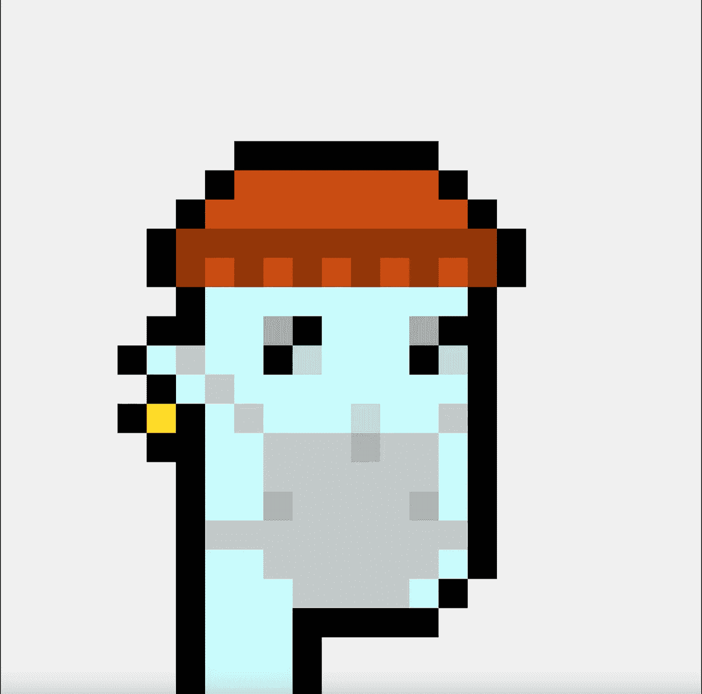
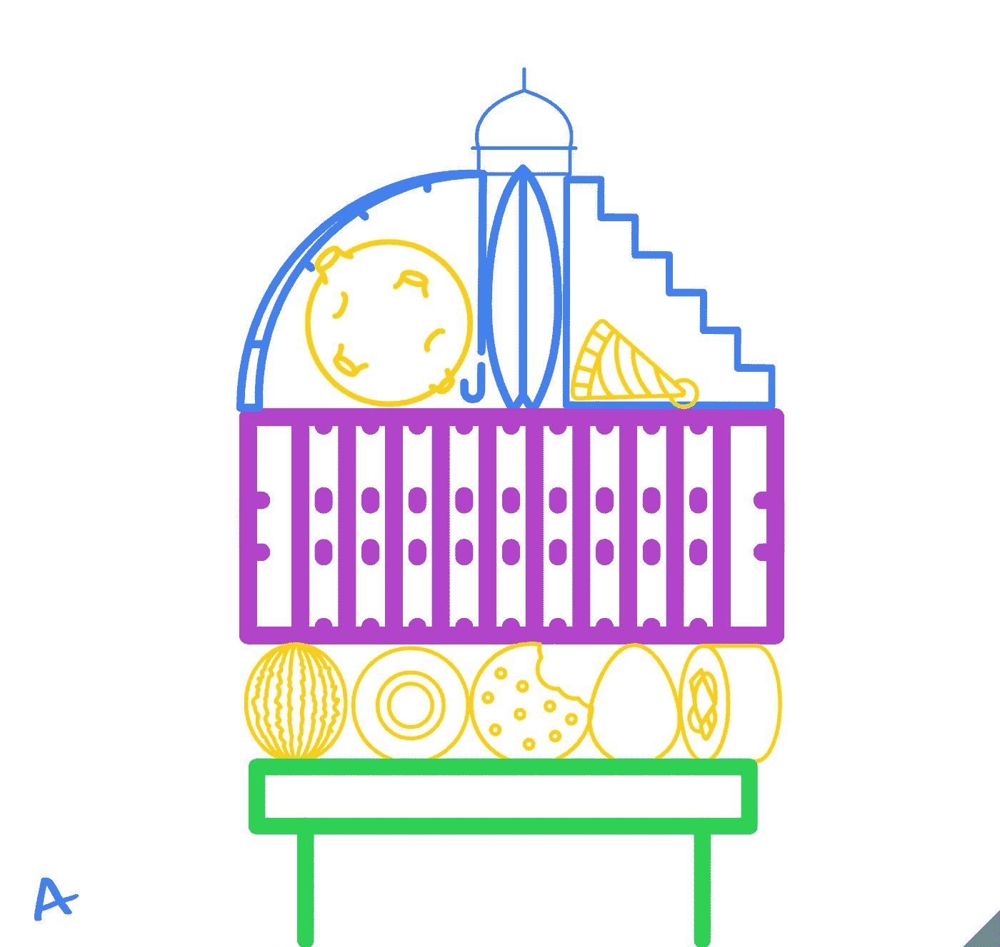
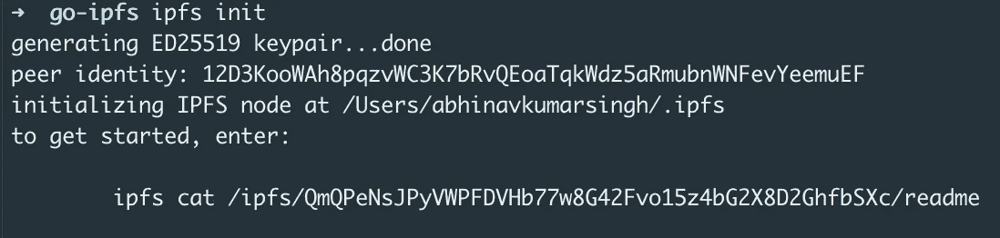
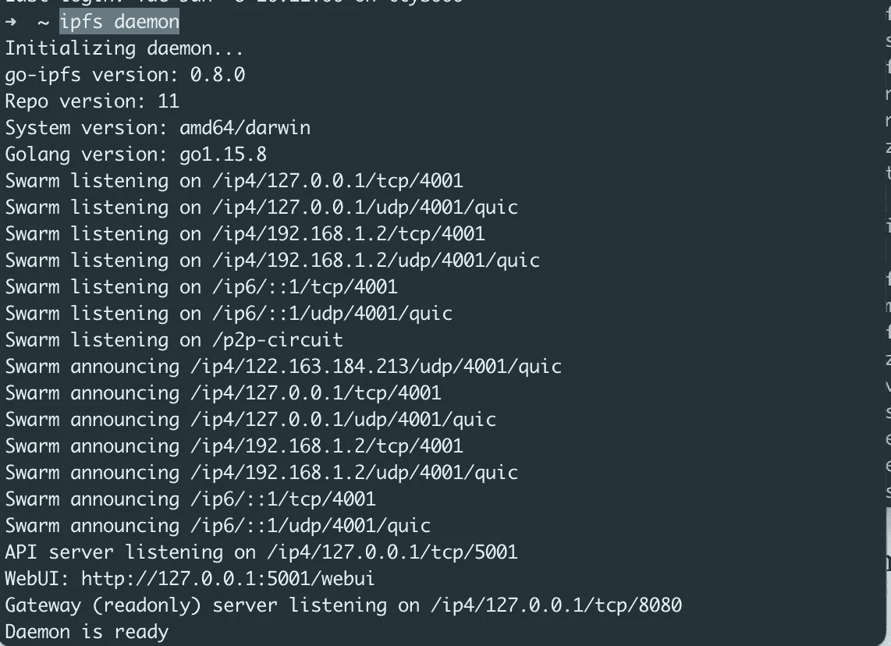
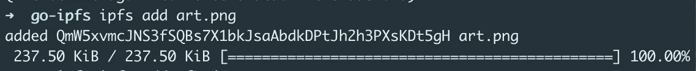
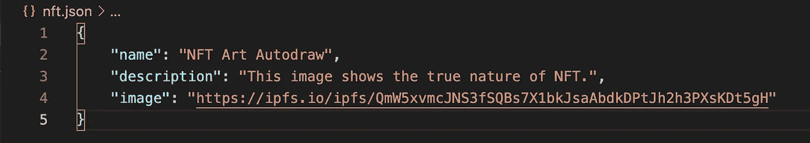
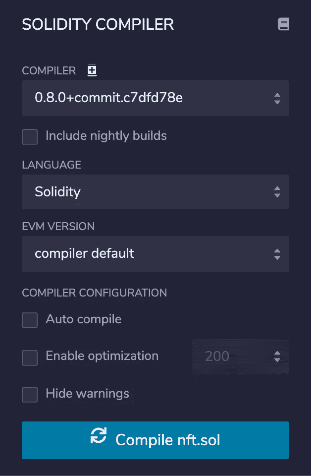
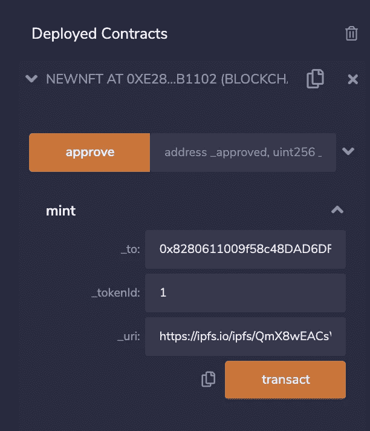
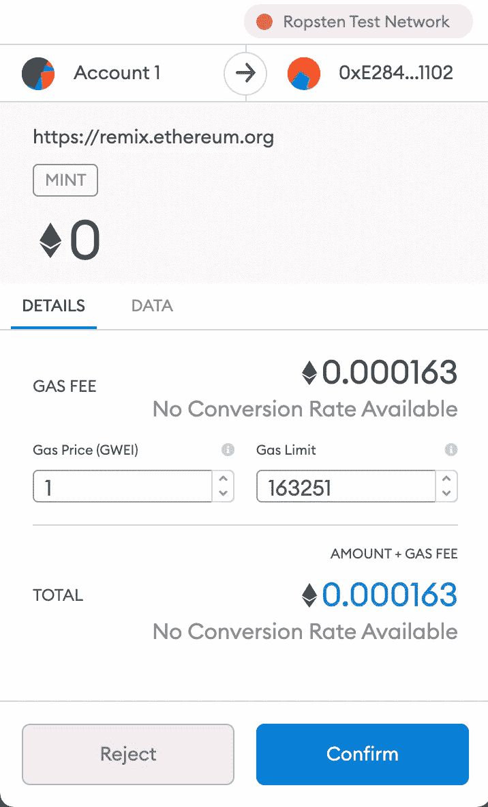
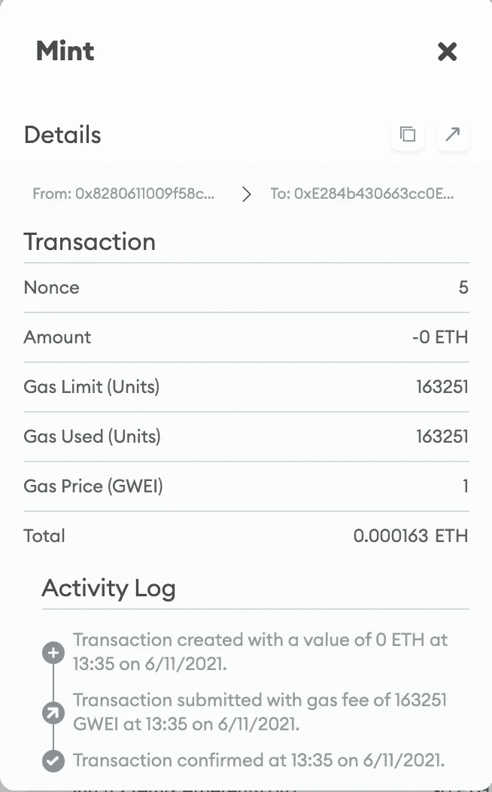

# 如何为你的数字作品创建一个不可替换的标记(NFT)

> 原文：<https://medium.com/coinmonks/how-to-create-a-non-fungible-token-nft-of-your-digital-artwork-a25d5ab741f1?source=collection_archive---------3----------------------->

NFT 的观点是区块链提出的一长串讨论观点中最新的一个。名为**不可替代令牌，**它基本上意味着它是数字资产的唯一令牌。更清楚地说，你可以用一个比特币换另一个比特币，这不会有什么不同，因为它们不是唯一的(可替代的)，然而，NFT 的情况并非如此。

## **我是如何进入的**

随着幼虫实验室制作的外星密码朋克 10000 像素化艺术系列的一部分“密码朋克#7523”以超过 700 万美元的价格售出，推特上爆发了巨大的不同意见💵。这让我很好奇，从懒人椅上站起来，研究了一下这个问题。

CryptoPunk #7523

## 先决条件

要为你的数字艺术品创作一个 NFT，你首先需要一个你可以称之为艺术品的东西。鉴于我不是现代梵高，我只是去了[*Google Autodraw*](https://www.autodraw.com/)*把几条朦胧的线条转换成了“艺术”。这是我想到的(在这里插入我自己也是一个艺术家) :*

**

*How did I had the Audacity to sign this*

*现在我们有了可疑的“艺术品”，我们都准备好了。我发现制作一个数字艺术品的 NFT 平均需要价值 100 美元的加密货币，所以我决定使用 [*Ropsten 的 Testnet 网络*](https://faucet.ropsten.be/) 来获得一些虚拟的以太币。现在你还需要一个支持这个网络的加密钱包。为此，您可以使用 [*元掩码*](https://metamask.io/) 。你还需要 [*以太混合物*](https://remix.ethereum.org/) 来创建你的稳固契约。*

## *设置文件网络*

*P2P 文件共享:你需要一个文件托管和共享平台来存放你的数字作品。IPFS(星际文件系统)是伟大的。这是一个 P2P 文件存储和共享分布式系统。您可以使用此处 *给出的 [*步骤安装 IPFS CLI。*](https://docs.ipfs.io/install/command-line/)**

> *安装后，您可以使用 ipfs-version 检查 IPFS 版本*

1.  *将目录更改为 go-ipfs。*

> *cd go-ipfs*

*2.初始化 IPFS 回购。*

> *ipfs 初始化*

**

*3.打开一个单独的终端来启动 IPFS 守护进程。*

> *ipfs 守护程序*

**

*4.将您的作品添加到 IPFS。*

> *指规数增加 art.png*

**

*5.复制散列(从“Qm”开始)并添加前缀“[https://ipfs.io/ipfs/](https://ipfs.io/ipfs/)”。*

> *[https://ipfs.io/ipfs/](https://ipfs.io/ipfs/)QM w5 xvmcjns 3 fsqbs 7 x1 bkjsaabdkdptjh 2h 3 pxskdt 5 GH art.png*

*6.创建一个新的 json 文件(nft.json ),并添加名称、描述和图像散列 url。*

**

*7.现在添加 json 文件来获得文件散列。添加相同的前缀以获得文件的散列 url*

## *创建您的可靠性合同*

*我用了 Solidity 的 [*ERC-721*](https://github.com/0xcert/ethereum-erc721) 作为参考。您可以创建一个类似的合同。我创建的合同可以在这里 *找到 [*。*将您的合同添加到 Etherium Remix IDE。](https://github.com/abinator-1308/nft-art/blob/main/nft.sol)**

**

*My compiling configuration*

*一旦您的合同被创建，您可以通过注入 Web3 并选择“Solidity”作为语言和您的合同作为文件来部署您的合同。*

*部署后，您可以在“部署的合同”选项卡中找到您的执行。选择**造币**选项。添加您的钱包地址(可以从 Metamask 复制)、令牌 id(可以是任何整数值)和图稿的 json 文件的散列 url。单击 transact 完成交易，并将其添加到您的 Etherium 网络中。*

**

*Transacting the NFT*

*您将在 Metamask 中看到一个批准交易的选项，选择该选项以完成交易*

**

*Approving the transaction*

*现在你知道了！你的 NFT 现在在你的以太网上！确保在 Metamask 中检查您的事务以验证操作。该事务应该看起来像这样。*

**

*Transaction details*

*恭喜你坚持到最后！在 [*Twitter*](https://twitter.com/bot_pragmatic) ， [Github](https://github.com/abinator-1308/abinator-1308) ， [*Medium*](/@abhinav.as1308) ， [*LinkedIn*](https://www.linkedin.com/in/abinator-1308/) 或 [*Instagram*](https://www.instagram.com/abinator_1308/) 上随意谈论科技或任何很酷的项目。*

****感谢阅读！！****

> *加入 [Coinmonks 电报频道](https://t.me/coincodecap)，了解加密交易和投资*

## *另外，阅读*

*   *[我的加密副本交易经历](/coinmonks/my-experience-with-crypto-copy-trading-d6feb2ce3ac5) | [AAX 交易所评论](/coinmonks/aax-exchange-review-2021-67c5ea09330c)*
*   *[创造并出售你的第一个 NFT](https://blog.coincodecap.com/create-nft) | [本地比特币评论](/coinmonks/localbitcoins-review-6cc001c6ed56) | [Prokey 评论](/coinmonks/prokey-review-26611173c13c)*
*   *[加密保证金交易交易所](/coinmonks/crypto-margin-trading-exchanges-428b1f7ad108) | [赚取比特币](/coinmonks/earn-bitcoin-6e8bd3c592d9) | [Mudrex 投资](https://blog.coincodecap.com/mudrex-invest-review-the-best-way-to-invest-in-crypto)*
*   *[WazirX vs CoinDCX vs bit bns](/coinmonks/wazirx-vs-coindcx-vs-bitbns-149f4f19a2f1)|[block fi vs coin loan vs Nexo](/coinmonks/blockfi-vs-coinloan-vs-nexo-cb624635230d)*
*   *[在美国如何使用 BitMEX？](https://blog.coincodecap.com/use-bitmex-in-usa) | [BitMEX 评论](https://blog.coincodecap.com/bitmex-review) | [期货交易机器人](/coinmonks/futures-trading-bots-5a282ccee3f5)*
*   *[最佳加密交易信号电报](/coinmonks/best-crypto-signals-telegram-5785cdbc4b2b) | [MoonXBT 评论](/coinmonks/moonxbt-review-6e4ab26d037)*