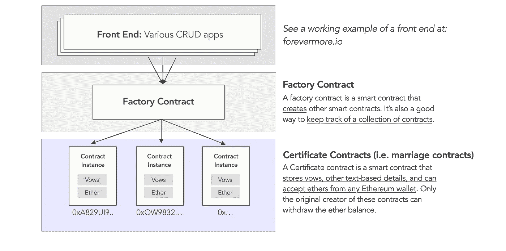

# 如何在区块链以太坊创建公证人—第 2 部分

> 原文：<https://medium.com/coinmonks/how-to-create-a-notary-on-the-ethereum-blockchain-part-2-1808a458c360?source=collection_archive---------1----------------------->

## 在本教程中，您将构建一个将官方证书部署到以太坊的分散式应用程序

[在第 1 部分](/coinmonks/how-to-create-certificates-on-the-ethereum-blockchain-part-1-45564fd29595)中，我们创建了一个智能契约来表示证书。

让我们完成负责部署和管理您的证书合同的工厂合同。最后，我们将使用 [Next.js](https://nextjs.org/) 包装一个简单的前端，使任何人都可以通过表单 UI 在您的 DApp 上创建证书:


View a live demo of the final product at [https://www.forevermore.io/](https://www.forevermore.io/)

**让我们开始吧！这是我们将要做的事情的图示。**



*See* [*Part 1*](/coinmonks/how-to-create-certificates-on-the-ethereum-blockchain-part-1-45564fd29595) *on how to make the Certificate contracts.*

# 步骤 1—创建工厂合同

1.  在与证书协定相同的 Marriage.sol 文件中，创建一个 marriage natory(或 MarriageFactory)协定:

```
pragma solidity ^0.4.19;contract MarriageNotary {
    // TODO
}contract Marriage {...}
```

具体而言，本工厂合同将:

*   创建新的证书智能合同
*   跟踪以前创建的证书列表

2.让我们将以前创建的合同列表存储在一个地址数组中。*这个数组变量应该是任何人都可以公开查看的，即一个前端包装器，它将呈现以前的证书。*

```
address [] public registeredMarriages;
```

**最佳实践技巧**:

*   数组适用于索引查找。在这种情况下，对于我们的*简单的*用例来说就足够了。
*   如果你需要**遍历**你的记录，数组是昂贵的，并且不是最佳实践。如果你需要一个标准的键值对查找，用 [**映射**](http://solidity.readthedocs.io/en/v0.4.21/types.html) 替换你的数组。
*   最后，在 Solidity 中，您不能获得 *array.length.* 所以如果您需要计算用户创建的证书总数，您应该创建一个新的全局存储 uint 变量来跟踪数组的长度。

3.接下来，声明一个函数来**创建**未来的结婚证。用户将自己调用这个功能，并提供像夫妇姓名和誓言这样的详细信息。

```
function createMarriage(string _leftName, string _leftVows, string _rightName, string _rightVows, uint _date) public {}
```

4.实例化您的新婚姻契约，并保存新生成的智能契约的地址。请记住将地址推送到您的已注册邮件数组中。

```
function createMarriage(...) public { address newMarriage = new Marriage(msg.sender, _leftName, _leftVows, _rightName, _rightVows, _date);

    // saving the address so a front-end client can find it
    registeredMarriages.push(newMarriage);}
```

让我们在这里思考一下前端交互。创建新的婚姻合同时，需要一段时间才能将新的证书合同写入区块链。

> **注意** : createMarriage 是一个发送给区块链的函数，它“承诺”根据交易的成功返回 true 或 false。它不会向前端客户端返回任何值，比如新的合同地址。因此，在发送 createMarriage 请求后，您的 web 客户端不会立即知道地址。
> 
> 由于我们希望将用户重定向到这个新创建的合同(通过它的地址)，**一旦这个“承诺”得到解决，我们将需要某种(廉价的)方式让工厂合同与您的客户进行沟通**。

5.让我们让这个契约**发出一个事件**来传递这个消息。

```
event ContractCreated(address contractAddress);function createMarriage(...) public {
    ...
    emit ContractCreated(newMarriage);
    ...
}
```

**最佳实践提示:**

*   使用事件作为一种“廉价”的存储方式。这在以太坊很有帮助，那里的存储成本很高。
*   使用事件来跟踪用户历史或值得注意的时刻，比如投标的结果，或者区块链上某个记录被*更改*的情况。
*   事件记录在网络上，可由前端自由查看。*亦即参见* [*这一永恒的事件*](https://etherscan.io/address/0x4EE5e5d9006aD0A88ad53526eA9D0fa408C61E42#events) *在那里有人敲响了我的婚礼钟声。*
*   尽管契约发出事件，但事件在契约内部是不可读的。这是给外部客户的。

6.最后，提供一个 helper 函数，这样您的 web 客户端就可以轻松地检索该工厂创建的所有证书。

```
function getDeployedMarriages() public view returns (address[]) {
 return registeredMarriages;
}
```

**通知**:

*   Solidity 免费为您提供静态数据类型的视图功能。这就是为什么您可以在没有 getUint() getter 函数的情况下查看全局 uint。
*   这不适用于数组。在这种情况下，你必须声明你自己的检索函数。这也应该引起注意，对于将呈指数增长的数组，getArrays()可能不是最佳实践。

你已经完成了本教程的智能合约编程部分！干得好。

# 步骤 2 —在 Remix 中测试和部署您的合同

Remix *是一个在线 IDE，可以免费编译、测试和部署你的合同到测试网。*


1.  将代码复制并粘贴到 IDE 中。
2.  切换到**编译**选项卡并解决任何编译错误。Remix 在指出问题和教你如何解决这两方面都很棒。*如果此时您不确定您的代码，请参考此* [*备忘单*](https://github.com/nczhu/forevermore/blob/master/ethereum/contracts/Marriage.sol) *。*
3.  切换到**运行**表，确保环境设置为 Javascript VM。这会将您的合同部署到浏览器中的虚拟机上，而不是主网络或测试网络上(这需要更长的时间和金钱)。
4.  从下拉列表中选择婚姻目录。单击部署。*记住你是依靠工厂来创建证书，而不是手工创建！*
5.  观察部署成功:)
6.  查看 MarriageNotary 下所有可用的方法，包括创建新证书的功能。

你的公证人现在在虚拟区块链上！让它通过在 createMarriage 函数中键入以下内容来创建证书:

```
"Rick", "Get shwiftayyy", "Morty", "Nobody exists on purpose", 1532706206
```

**通知**:

*   日期用 uint 存储，所以使用一个[纪元转换器](https://www.epochconverter.com/)
*   不要忘记字符串文本输入，Remix 对此要求严格


1.  在控制台中找到 contractAddress，这是您在 MarriageNotary 的事件中方便地发出的
2.  从下拉列表中选择**婚姻**
3.  粘贴合同地址并在地址处点击**以检索您新创建的婚姻合同的**实例****
4.  下拉以查看婚姻契约中可用功能和数据的列表
5.  点击左誓言现在应该给你“得到 shwiftayyy”

**您的公证人已经将证书部署到虚拟区块链！**

# 步骤 3-将您的 DApp 部署到以太坊


Next UI release for Forevermore.io — [any contributors](https://github.com/nczhu/forevermore)?

如果你想在没有 UI 的情况下将合同部署到以太坊，你可以使用 Remix。这是快速的纯合同部署的建议。只需将您的环境更改为 **Injected Web3** 并确保您的元掩码帐户有足够的以太网来完成部署事务。

**要部署您与附带网站的合同，**有几个选项:

1.  使用[松露](http://truffleframework.com/):推荐用于完全 DApp 部署，不需要太多配置
2.  **使用** [**永久代码库**](https://github.com/nczhu/forevermore) :如果你想进一步定制这个 DApp，让它成为你自己的，推荐使用。它包含一个定制的[编译脚本](https://github.com/nczhu/forevermore/blob/master/ethereum/compile.js)和部署自述文件。

**注:**

Forevermore 在 Next.js 上，这是一个处理服务器端渲染的 React 框架。Next.js 被认为与事实上的以太坊 JavaScript API web 3 高度兼容。

设置完整 DApp 依赖项的完整说明在本[自述文件](https://github.com/nczhu/forevermore)中。请自由分叉它，并在此向其开源贡献者[提交任何问题。](https://github.com/nczhu/forevermore/issues)

# 想要更多吗？

*   接下来我们将开始一系列讲授以太坊安全和最佳设计原则的课程。关注我们，敬请关注。

## **学分**

*   点击这里查看最终的[应用](https://forevermore.io/) &点击这里查看完整的开源[项目。](https://github.com/nczhu/forevermore)
*   **演职员表** : [丹尼尔](https://github.com/onggunhao)(编码对)[斯蒂芬](https://github.com/StephenGrider/EthereumCasts)(教程)

> [直接在您的收件箱中获得最佳软件交易](https://coincodecap.com/?utm_source=coinmonks)

[](https://coincodecap.com/?utm_source=coinmonks)