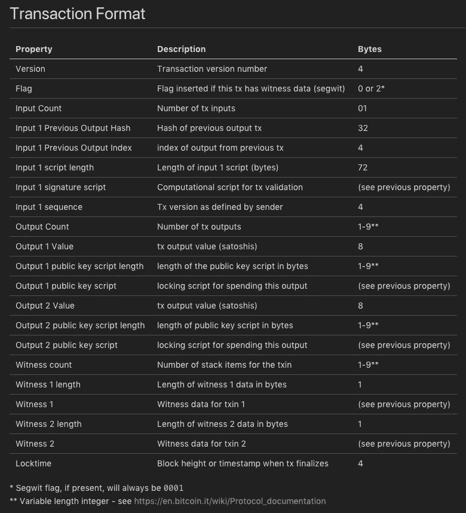

# 如何一步一步地创建原始比特币交易

> 原文：<https://medium.com/coinmonks/how-to-create-a-raw-bitcoin-transaction-step-by-step-239b888e87f2?source=collection_archive---------0----------------------->


bitcoinchaser.com

# 介绍

什么构成了[比特币](https://blog.coincodecap.com/a-candid-explanation-of-bitcoin/)交易？嗯，比特币交易不止一种，因此，比特币可以发送到多种类型的地址(同一个人的密钥对)。

比特币核心上当前的默认地址类型是一个`P2SH-P2WPKH`，它是一个包裹在付费脚本哈希中的付费见证公钥哈希。欲了解更多信息，请参阅之前的文章:[如何生成比特币地址——一步一步来](/coinmonks/how-to-generate-a-bitcoin-address-step-by-step-9d7fcbf1ad0b)。

> 了解更多信息，并加入我的课程，学习如何[成为一名比特币+区块链程序员](https://www.udemy.com/course/create-your-own-blockchain/)。

> [发现和评论最好的比特币产品](https://coincodecap.com)

# 交易格式

让我们来看一个来自我的私人比特币网络的交易:

```
0200000000010111b6e0460bb810b05744f8d38262f95fbab02b168b070598a6f31fad438fced4000000001716001427c106013c0042da165c082b3870c31fb3ab4683feffffff0200ca9a3b0000000017a914d8b6fcc85a383261df05423ddf068a8987bf0287873067a3fa0100000017a914d5df0b9ca6c0e1ba60a9ff29359d2600d9c6659d870247304402203b85cb05b43cc68df72e2e54c6cb508aa324a5de0c53f1bbfe997cbd7509774d022041e1b1823bdaddcd6581d7cde6e6a4c4dbef483e42e59e04dbacbaf537c3e3e8012103fbbdb3b3fc3abbbd983b20a557445fb041d6f21cc5977d2121971cb1ce5298978c000000
```

这是显而易见的，明白了吗？

如果你还在疑惑，我们来分解一下(从左到右):

```
**Version**: 02000000
**Flag:** 0001 (if present, indicates segwit) **Input Count:** 01
**Input 1 Previous Output Hash**: 11b6e0460bb810b05744f8d38262f95fbab02b168b070598a6f31fad438fced4
**Input 1 Previous Output Index**: 00000000
**Input 1 script length**: 0x17 (23 bytes)
**Input 1 signature script**: 16001427c106013c0042da165c082b3870c31fb3ab4683
**Input 1 sequence**: feffffff
**Output Count:** 02
**Output 1 Value:** 00ca9a3b00000000 (1B satoshis / 10 BTC)
**Output 1 public key script length:** 0x17 (23 bytes)
**Output 1 public key script**: a914d8b6fcc85a383261df05423ddf068a8987bf028787
**Output 2 Value**: 3067a3fa01000000 (8499980080 sats / 84.9998008 BTC)
**Output 2 public key script length**: 0x17 (23 bytes)
**Output 2 public key script**: a914d5df0b9ca6c0e1ba60a9ff29359d2600d9c6659d87
**Witness Count:** 02
**Witness 1 length:** 0x47 (71 bytes)
**Witness 1:** 304402203b85cb05b43cc68df72e2e54c6cb508aa324a5de0c53f1bbfe997cbd7509774d022041e1b1823bdaddcd6581d7cde6e6a4c4dbef483e42e59e04dbacbaf537c3e3e801
**Witness 2 length:** 0x21 (33 bytes) **Witness 2:** 03fbbdb3b3fc3abbbd983b20a557445fb041d6f21cc5977d2121971cb1ce529897
**Locktime:** 8c000000 (block 140)
```

**注:**所有数值均为[小端](https://en.wikipedia.org/wiki/Endianness#Little-endian)。以下是所有字段的描述:



Transaction Properties

# 创建原始交易

让我们从头开始创建一个事务！让我们使用上述交易的**输出 1** :

```
$ bitcoin-cli -regtest listunspent
[
  {
    "txid": "375e1622b2690e395df21b33192bad06d2706c139692d43ea84d38df3d183313",
    "vout": 0,
    "address": "2ND179ug8wYvtH5GENkcMEUyXnqhNh7BgkB",
    "account": "test",
    "redeemScript": "0014b93f973eb2bf0b614bddc0f47286788c98c535b4",
    "scriptPubKey": "a914d8b6fcc85a383261df05423ddf068a8987bf028787",
    "amount": 10.00000000,
    "confirmations": 1,
    "spendable": true,
    "solvable": true,
    "safe": true
  },
...
```

## ScriptSig

注意`scriptPubkey`的格式是一个`P2SH`:

`OP_HASH160 0x14 <script hash> OP_EQUAL`

为了使用这个输出，我们必须提供散列到`<script hash>`中的值的脚本，以便`OP_EQUAL`成功。我们的 scriptSig 需要采用以下形式:

`<0 0x14 <20-byte-key-hash>>`

但是，由于这是一个见证事务，事务的见证部分还包括:`<signature> <pubkey>`，将使用`<signature> <pubkey> CHECKSIG`对其进行评估。

为了得到`20-byte-key-hash`,我们需要知道我们的公钥。因为我拥有这个地址，所以我可以获得我的地址的公钥:

```
$ bitcoin-cli -regtest validateaddress 2ND179ug8wYvtH5GENkcMEUyXnqhNh7BgkB
{
  ...
    "pubkey": "0223bec70d670d29a30d9bcee197910e37cf2a10f0dc3c5ac44d865aec0d7052fb",
    ..."embedded": {
    ...
    "witness_program": "b93f973eb2bf0b614bddc0f47286788c98c535b4"
    ...
}Or you can calculate it manually using openssl$ printf "0223bec70d670d29a30d9bcee197910e37cf2a10f0dc3c5ac44d865aec0d7052fb" | xxd -r -p | openssl sha256
(stdin)= cb84d0fe1066b24f7af055867a5e910577511ce03ebe9bf3b42d4810f437da03$ printf "cb84d0fe1066b24f7af055867a5e910577511ce03ebe9bf3b42d4810f437da03" | xxd -r -p | openssl ripemd160
(stdin)= b93f973eb2bf0b614bddc0f47286788c98c535b4
```

**备注:**

1.  `<ef>`和`<0>`表示 testnet 和一个压缩的 key，所以去掉了。

请注意，最终的密钥哈希与上面输出中的 redeemScript 相匹配。我们脚本签名变成:

```
0014b93f973eb2bf0b614bddc0f47286788c98c535b4
```

## 输出

让我们发送 1 BTC 到地址:

```
2N8bXfrWTzqZoV89dosge2JxvE38VnHurqD
```

`1 BTC = 100,000,000 satoshi`所以**输出 1 值** : `00e1f50500000000`(记住，小端)。

我们可以通过解码并删除 testnet 前缀`0xc4`从地址中获得脚本散列:

```
$ printf "2N8bXfrWTzqZoV89dosge2JxvE38VnHurqD" | base58 -dc | xxd -p
c4a860f76561c85551594c18eecceffaee8c4822d7
```

记住脚本是`OP_HASH160 0x14 <script hash> OP_EQUAL`，而`c4` 只是我们需要去掉的一个地址前缀，那么我们的**输出 1 公钥脚本**就变成:`a914a860f76561c85551594c18eecceffaee8c4822d787`。

我们将对输出 2 做同样的事情，它代表我们的`9 BTC`变化(回到原始地址)减去`0.0001 BTC`交易费。**输出 2 值:**`F0C1A43500000000`(89990000 Satoshi)。**输出 2 公钥脚本**为`a914d8b6fcc85a383261df05423ddf068a8987bf028787`。

## 签名和证人

现在是我们的签名和公钥。我们已经有了以前的公钥:

```
0223bec70d670d29a30d9bcee197910e37cf2a10f0dc3c5ac44d865aec0d7052fb
```

为了签名，我们首先将其序列化，但是没有了**标志**，并且 **scriptSig** 变成了`00`:

```
**Version**: 02000000
**Flag:
Input Count:** 01
**Input 1 Previous Output Hash**: 1333183ddf384da83ed49296136c70d206ad2b19331bf25d390e69b222165e37
**Input 1 Previous Output Index**: 00000000
**Input 1 script length**: 00 (empty for now)
**Input 1 scriptSig**: 
**Input 1 sequence**: feffffff
**Output Count:** 02
**Output 1 Value:** 00e1f50500000000 (100M satoshis / 1 BTC)
**Output 1 public key script length:** 0x17 (23 bytes)
**Output 1 public key script**: a914a860f76561c85551594c18eecceffaee8c4822d787
**Output 2 Value**: F0C1A43500000000 (899990000 sats / 8.9999 BTC)
**Output 2 public key script length**: 0x17 (23 bytes)
**Output 2 public key script**: a914d8b6fcc85a383261df05423ddf068a8987bf028787
**Witness Count:**
**Witness 1 length:**
**Witness 1:** 
**Witness 2 length:
Witness 2:** 
**Locktime:** 8c000000 (block 140)
```

序列化后，这将成为:

```
02000000011333183ddf384da83ed49296136c70d206ad2b19331bf25d390e69b222165e370000000000feffffff0200e1f5050000000017a914a860f76561c85551594c18eecceffaee8c4822d787f0c1a4350000000017a914d8b6fcc85a383261df05423ddf068a8987bf02878700000000
```

为了签名，我们将使用比特币核心 RPC 调用`signrawtransaction`，它将为我们的输入创建 **scriptSig** 以及**见证**并填充**标志**。

```
$ bitcoin-cli -regtest signrawtransaction 02000000011333183ddf384da83ed49296136c70d206ad2b19331bf25d390e69b222165e370000000000feffffff0200e1f5050000000017a914a860f76561c85551594c18eecceffaee8c4822d787F0C1A4350000000017a914d8b6fcc85a383261df05423ddf068a8987bf0287878c000000{
  "hex": "020000000001011333183ddf384da83ed49296136c70d206ad2b19331bf25d390e69b222165e370000000017160014b93f973eb2bf0b614bddc0f47286788c98c535b4feffffff0200e1f5050000000017a914a860f76561c85551594c18eecceffaee8c4822d787f0c1a4350000000017a914d8b6fcc85a383261df05423ddf068a8987bf028787024730440220434caf5bb442cb6a251e8bce0ec493f9a1a9c4423bcfc029e542b0e8a89d1b3f022011090d4e98f79c62b188245a4aa4eb77e912bfd57e0a9b9a1c5e65f2b39f3ab401210223bec70d670d29a30d9bcee197910e37cf2a10f0dc3c5ac44d865aec0d7052fb8c000000",
  "complete": true
}
```

最后，我们签署的事务看起来像这样:

```
**Version**: 02000000
**Flag:** 0001 (indicates segwit) **Input Count:** 01
**Input 1 Previous Output Hash**: 1333183ddf384da83ed49296136c70d206ad2b19331bf25d390e69b222165e37
**Input 1 Previous Output Index**: 00000000
**Input 1 script length**: 0x17 (23 bytes)
**Input 1 scriptSig**: 160014b93f973eb2bf0b614bddc0f47286788c98c535b4
**Input 1 sequence**: feffffff
**Output Count:** 02
**Output 1 Value:** 00e1f50500000000 (100M satoshis / 1 BTC)
**Output 1 public key script length:** 0x17 (23 bytes)
**Output 1 public key script**: a914a860f76561c85551594c18eecceffaee8c4822d787
**Output 2 Value**: F0C1A43500000000 (899990000 sats / 8.9999 BTC)
**Output 2 public key script length**: 0x17 (23 bytes)
**Output 2 public key script**: a914d8b6fcc85a383261df05423ddf068a8987bf028787
**Witness Count:** 02
**Witness 1 length:** 0x47 (71 bytes)
**Witness 1:** 30440220434caf5bb442cb6a251e8bce0ec493f9a1a9c4423bcfc029e542b0e8a89d1b3f022011090d4e98f79c62b188245a4aa4eb77e912bfd57e0a9b9a1c5e65f2b39f3ab401
**Witness 2 length:** 0x21 (33 bytes) **Witness 2:** 0223bec70d670d29a30d9bcee197910e37cf2a10f0dc3c5ac44d865aec0d7052fb
**Locktime:** 8c000000 (block 140)
```

如果你喜欢这篇文章，可以看看我关于如何[成为比特币+区块链程序员](https://www.udemy.com/course/create-your-own-blockchain/)的课程。

> 加入 Coinmonks [电报频道](https://t.me/coincodecap)和 [Youtube 频道](https://www.youtube.com/c/coinmonks/videos)获取每日[加密新闻](http://coincodecap.com/)

## 另外，阅读

*   [复制交易](/coinmonks/top-10-crypto-copy-trading-platforms-for-beginners-d0c37c7d698c) | [加密税务软件](/coinmonks/crypto-tax-software-ed4b4810e338)
*   [电网交易](https://coincodecap.com/grid-trading) | [加密硬件钱包](/coinmonks/the-best-cryptocurrency-hardware-wallets-of-2020-e28b1c124069)
*   [最佳加密交易所](/coinmonks/crypto-exchange-dd2f9d6f3769) | [印度最佳加密交易所](/coinmonks/bitcoin-exchange-in-india-7f1fe79715c9)
*   [面向开发人员的最佳加密 API](/coinmonks/best-crypto-apis-for-developers-5efe3a597a9f)
*   [密码电报信号](http://Top 4 Telegram Channels for Crypto Traders) | [密码交易机器人](/coinmonks/crypto-trading-bot-c2ffce8acb2a)
*   最佳[密码借贷平台](/coinmonks/top-5-crypto-lending-platforms-in-2020-that-you-need-to-know-a1b675cec3fa)
*   杠杆代币的终极指南
*   [加密交易的最佳 VPN](https://coincodecap.com/best-vpns-for-crypto-trading)
*   [火币的加密交易信号](https://coincodecap.com/huobi-crypto-trading-signals) | [HitBTC 审查](/coinmonks/hitbtc-review-c5143c5d53c2)
*   [TraderWagon 回顾](https://coincodecap.com/traderwagon-review) | [北海巨妖 vs 双子座 vs BitYard](https://coincodecap.com/kraken-vs-gemini-vs-bityard)
*   [如何在 FTX 交易所交易期货](https://coincodecap.com/ftx-futures-trading)
*   [OKEx vs KuCoin](https://coincodecap.com/okex-kucoin) | [摄氏替代品](https://coincodecap.com/celsius-alternatives) | [如何购买 VeChain](https://coincodecap.com/buy-vechain)
*   [3 commas vs . Pionex vs . crypto hopper](https://coincodecap.com/3commas-vs-pionex-vs-cryptohopper)
*   [如何使用 Cornix 交易机器人](https://coincodecap.com/cornix-trading-bot)
*   [Bitget 回顾](https://coincodecap.com/bitget-review) | [双子座 vs BlockFi](https://coincodecap.com/gemini-vs-blockfi) cmd| [OKEx 期货交易](https://coincodecap.com/okex-futures-trading)
*   [用信用卡购买密码的 10 个最佳地点](https://coincodecap.com/buy-crypto-with-credit-card)