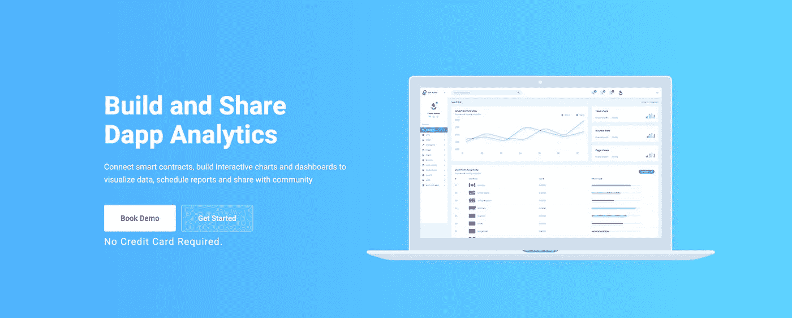
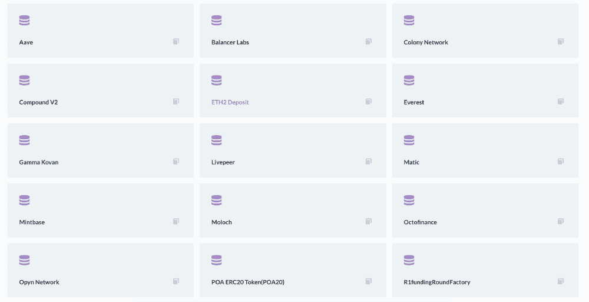
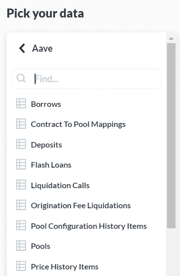
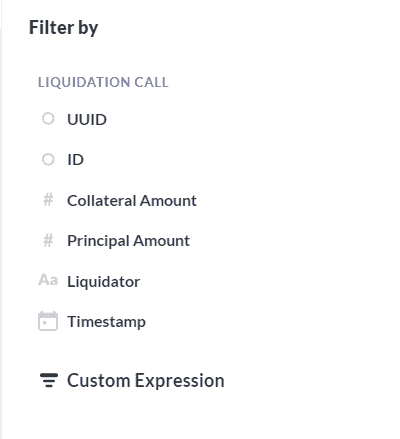
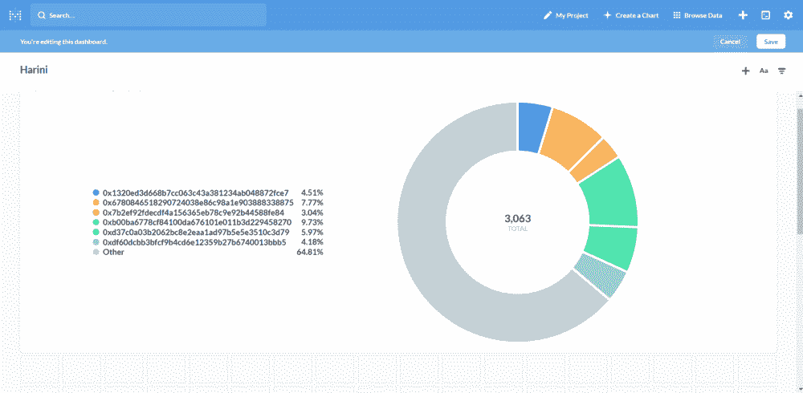

# 在 10 分钟内创建智能合同分析仪表板

> 原文：<https://medium.com/coinmonks/how-to-create-a-smart-contract-analytics-dashboard-in-10mins-227d96c382f4?source=collection_archive---------1----------------------->

[https://dappquery.com/](https://dappquery.com/)

[Dappquery](https://dappquery.com/) 是区块链分析的一步解决方案，您可以连接智能合同，构建交互式图表和仪表盘以可视化数据，安排报告并与社区共享。

您可以使用拖放可视化 SQL 进行高级分析。Dappquery 还通过各种集成，如令牌定价、ENS、IPFS 等，为数据增加了更多智能

# 让我们开始吧…

## **第一步:注册**💂🏻

[通过提供电子邮件和密码注册](https://dappquery.com/signup?ref=analyzer)到 Dappquery [网站](https://dappquery.com/signup?ref=analyzer)。

## **第二步:创建你的图表**

注册后，您将被重定向到[分析仪](http://analytics.dappquery.com/)。点击右上角的 c [创建图表链接](https://analytics.dappquery.com/question/new)。您将看到创建图表有三种方式:简单图表、自定义图表和本地查询。选择简单图表选项后:

**1。选择您想要分析的 Dapp:**

在您选择简单图表选项后，您需要选择一些您希望可视化的数据，只需选择我们项目中的一个数据库，您将看到其中的数据列表。

**2。从**中选择您想要使用的表格或数据集

## **第三步:图表的可视化**

**1。如果需要，添加过滤器:**

为了创建图表，我们通常会进行一些过滤。当你在网上找东西的时候，你可能已经熟悉了过滤。

**2。添加总结:**

在 Analyzer 中，您还可以根据需要汇总您的数据。

**3。选择图表:**

完成过滤过程后，您可以通过单击 analyzer 窗口下方的 visualization 来可视化您的图表，在这里您可以选择要可视化的不同类型的图表。

**步骤 4** : **保存你的图表并创建一个仪表板**

您可以查看我们的简单图表，并将其添加到您的仪表板中。您可以向仪表板添加更多图表。

## 找不到自己喜欢的 Dapp？？在此注册 Dapp。

Dappquery 目前支持以太坊，xDAI，POA 区块链。您可以通过提供智能合同地址或子图来注册 Dapp。[点击这里](https://dappquery.com/dashboard)。

欲了解更多详情，请联系我们:

【网址:】 **邮箱**:support@dappquery.com
**推特**:[https://twitter.com/teamdappquery](https://twitter.com/teamdappquery)
**不和**:[https://discord.com/invite/wTAf85T](https://discord.com/invite/wTAf85T)

***文献资料:【https://docs.dappquery.com/】***

## 另外，阅读

*   最好的[密码交易机器人](/coinmonks/crypto-trading-bot-c2ffce8acb2a)
*   [Deribit 审查](/coinmonks/deribit-review-options-fees-apis-and-testnet-2ca16c4bbdb2) |选项、费用、API 和 Testnet
*   [FTX 密码交易所评论](/coinmonks/ftx-crypto-exchange-review-53664ac1198f)
*   [Bybit 交换审查](/coinmonks/bybit-exchange-review-dbd570019b71)
*   最好的比特币[硬件钱包](/coinmonks/the-best-cryptocurrency-hardware-wallets-of-2020-e28b1c124069?source=friends_link&sk=324dd9ff8556ab578d71e7ad7658ad7c)
*   [密码本交易平台](/coinmonks/top-10-crypto-copy-trading-platforms-for-beginners-d0c37c7d698c)
*   最好的[加密税务软件](/coinmonks/best-crypto-tax-tool-for-my-money-72d4b430816b)
*   [最佳加密交易平台](/coinmonks/the-best-crypto-trading-platforms-in-2020-the-definitive-guide-updated-c72f8b874555)
*   最佳[加密贷款平台](/coinmonks/top-5-crypto-lending-platforms-in-2020-that-you-need-to-know-a1b675cec3fa)
*   [莱杰纳米 S vs 特雷佐 one vs 特雷佐 T vs 莱杰纳米 X](https://blog.coincodecap.com/ledger-nano-s-vs-trezor-one-ledger-nano-x-trezor-t)
*   [block fi vs Celsius](/coinmonks/blockfi-vs-celsius-vs-hodlnaut-8a1cc8c26630)vs Hodlnaut
*   Bitsgap 评论——一个轻松赚钱的加密交易机器人
*   为专业人士设计的加密交易机器人
*   [PrimeXBT 审查](/coinmonks/primexbt-review-88e0815be858) |杠杆交易、费用和交易
*   [享受九折优惠](/coinmonks/haasonline-review-d8d1a3400419)
*   Bitmex 的[保证金交易指南](/coinmonks/the-idiots-guide-to-margin-trading-on-bitmex-dbbd7742c6fc?source=friends_link&sk=7bfa99d2a181142510c8442c8ddb0786)
*   [eToro 评论](/coinmonks/etoro-review-78807ddeb33c) |交易股票、密码、交易所交易基金、差价合约和商品
*   [BlockFi 评论](/coinmonks/blockfi-review-53096053c097) |从您的密码中赚取高达 8.6%的利息
*   [面向开发人员的最佳加密 API](/coinmonks/best-crypto-apis-for-developers-5efe3a597a9f)
*   [最佳区块链分析工具](https://bitquery.io/blog/best-blockchain-analysis-tools-and-software)
*   [加密套利](/coinmonks/crypto-arbitrage-guide-how-to-make-money-as-a-beginner-62bfe5c868f6)指南:新手如何赚钱
*   顶级[比特币节点](https://blog.coincodecap.com/bitcoin-node-solutions)提供商
*   最佳加密制图工具
*   了解比特币的[最佳书籍有哪些？](/coinmonks/what-are-the-best-books-to-learn-bitcoin-409aeb9aff4b)

> [直接在您的收件箱中获得最佳软件交易](/coinmonks/newsletters/coinmonks)

