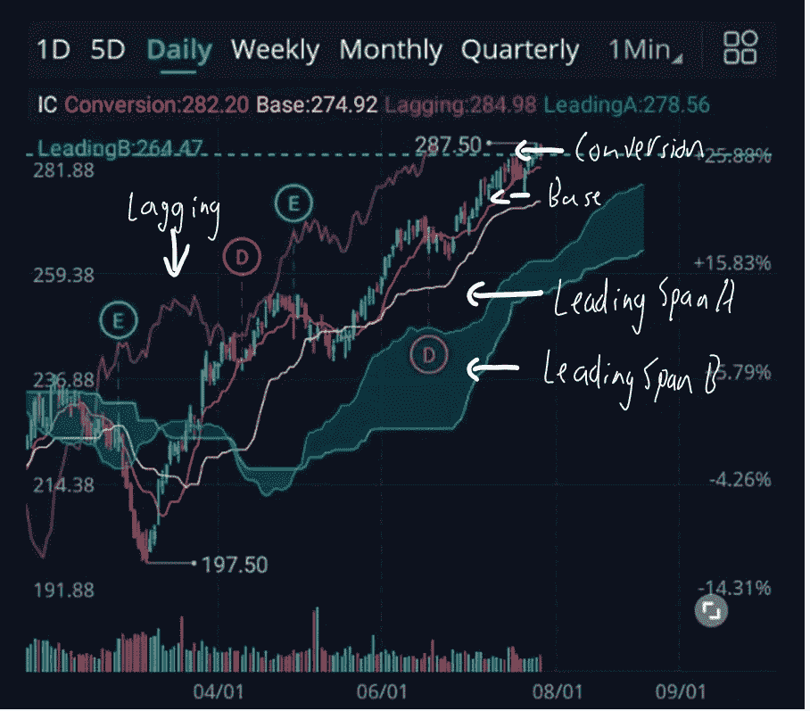
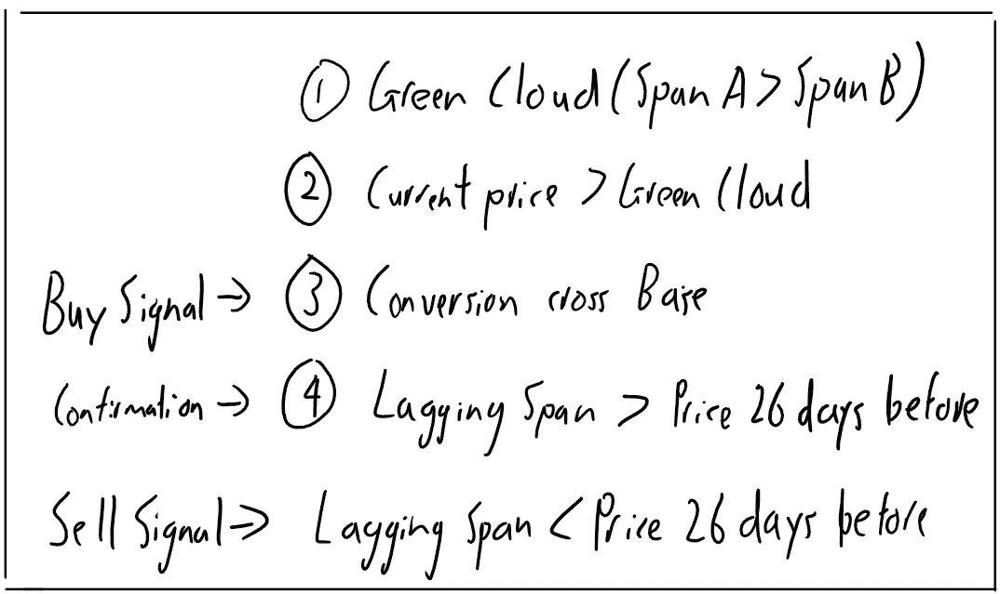

# 如何使用 python 创建 Ichimoku 交易机器人(第 1 部分:策略)

> 原文：<https://medium.com/coinmonks/how-to-create-an-ichimoku-trading-bot-on-python-part-1-the-strategy-b144f79960f8?source=collection_archive---------1----------------------->

Photo by [M. B. M.](https://unsplash.com/@m_b_m?utm_source=medium&utm_medium=referral) on [Unsplash](https://unsplash.com?utm_source=medium&utm_medium=referral)

今年年初，我有了一个很棒的想法，想做一个 swing 交易机器人。在学习了一学期的 python 之后，我决定测试一下我的 python 技能。让我们看看进展如何！

首先，我必须选择一个交易策略，这个策略简单到可以作为我的第一个机器人，但是有效。经过研究，我决定采用 Ichimoku 云策略。

## 什么是 Ichimoku 云战略？

红线为 **Tenkan-Sen** (转换线)**短期**指标[(9 期高+ 9 期低)/2]

黄线为 **Kijun-sen** (基准线):中期指标[(26 期高+ 26 期低)/2]。

绿线为**森口跨度 A** (领先跨度 A)**中短期**指标[(转换线+基线)/2]。(另请注意，该值是在未来 26 个周期内绘制的。)

蓝线为**森口跨度 B** (领先跨度 B)**长期**指标[(52 期高+ 52 期低)/2]。(类似地，该值被绘制成未来 26 个周期。)

紫色线是**池口跨度**(滞后跨度)**确认**指标【只是当前的近期价格，回溯 26 个周期。]

它是如何工作的:

当跨度 A 高于跨度 B 时，它形成一个“绿云”,这也表明了长期的上升趋势。

当价格高于未来 26 天绘制的“云”时，它显示价格力量。而“云”中的价格显示出波动和不确定性。

接下来，我们也寻找转换和基础在云之上，买入信号将是转换线穿过基础线。这显示了中期内短期势头的增强，并进一步加强了我们的上升趋势。

最后，滞后跨度必须高于价格，这是对当前价格高于 26 天前价格的确认。

总结规则:

现在让我们开始用 python 构建机器人吧！

## 另外，阅读

 [## 使用 Python Flask、TradingView 和 CoinDCX APIs 构建一个简单的加密交易机器人

### 我们的交易应用程序的功能可以总结如下

medium.com](/coinmonks/building-a-simple-crypto-trading-bot-using-python-flask-tradingview-and-coindcx-apis-54592b89caee)  [## 加密交易机器人——最佳免费加密交易机器人

### 2021 年币安、比特币基地、库币和其他密码交易所的最佳密码交易机器人。四进制，位间隙…

medium.com](/coinmonks/crypto-trading-bot-c2ffce8acb2a)