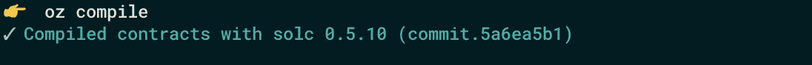
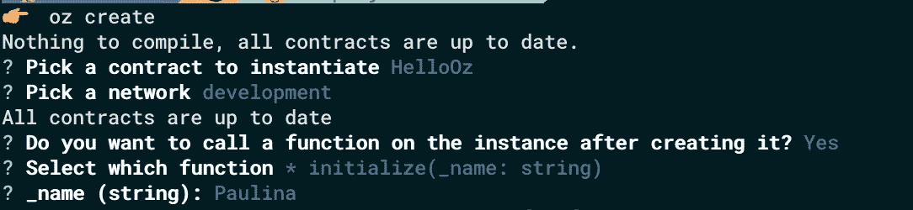
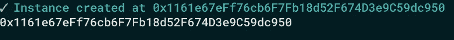
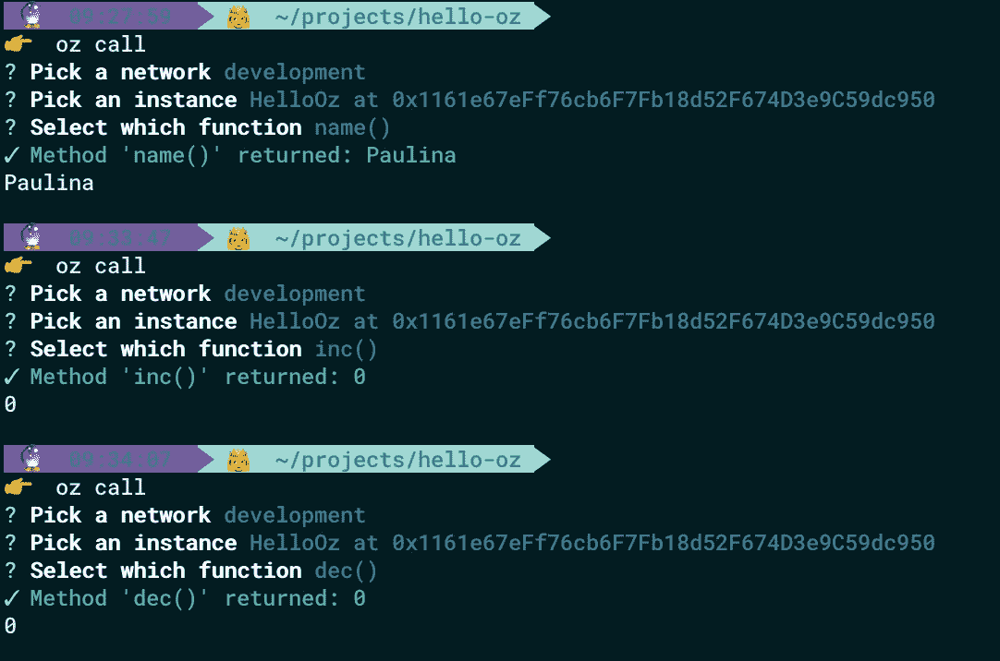
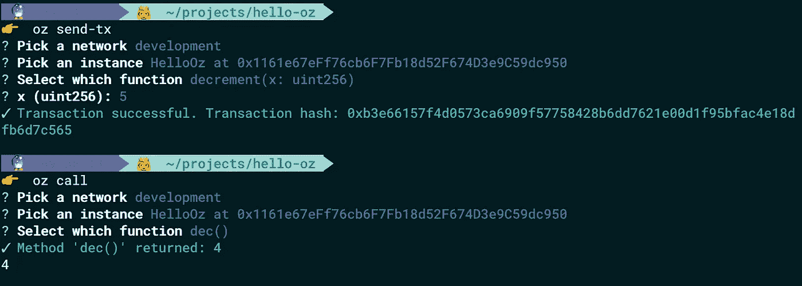
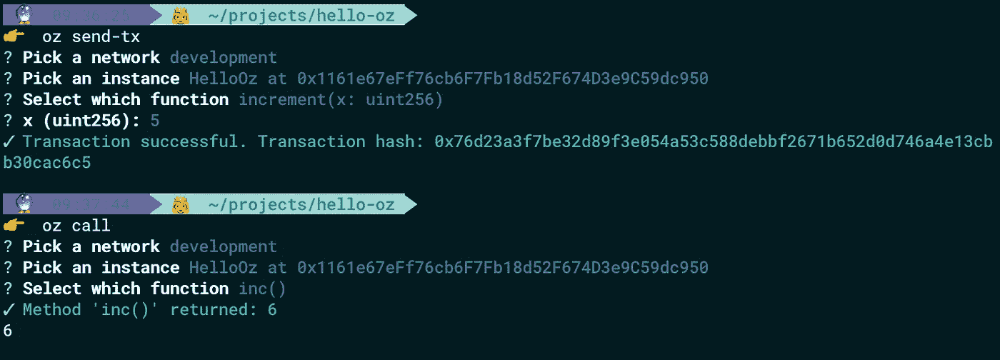
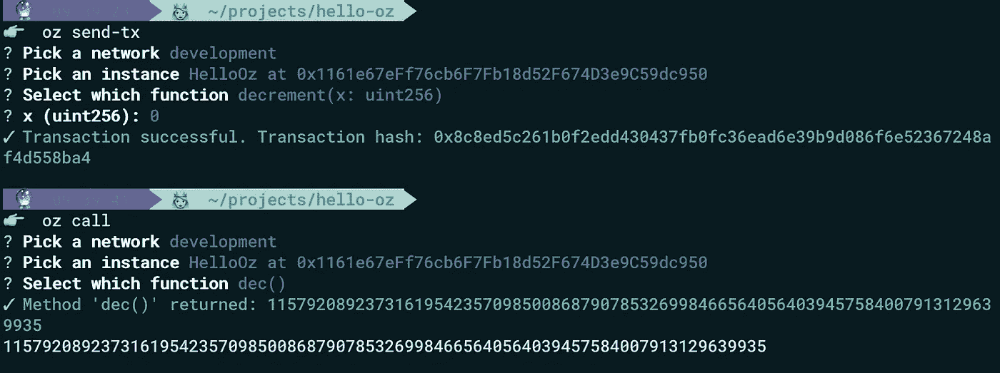
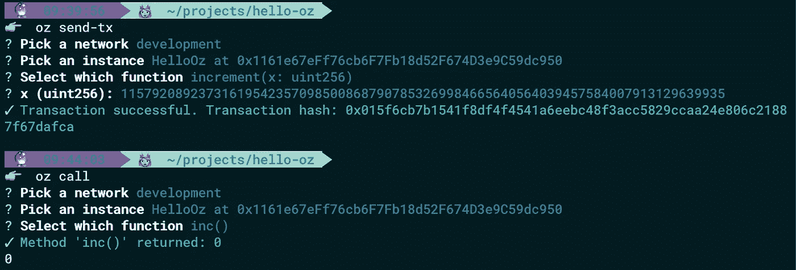
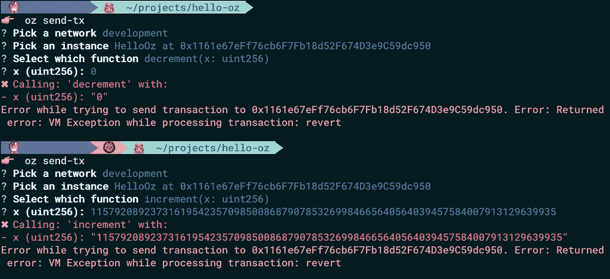

# 如何使用 OpenZeppelin SDK 创建可升级的智能合约

> 原文：<https://medium.com/coinmonks/how-to-create-an-upgradeable-smart-contract-using-openzeppelin-sdk-example-of-fixing-smart-260dfbfd5bae?source=collection_archive---------1----------------------->

## 修复易受下溢/溢出攻击的智能合约的示例

在本教程中，我们将使用 OpenZeppelin SDK 来修复易受下溢/溢出攻击的智能合约。首先，我们将准备我们的环境，创建带有一些错误的可升级智能合同，并对其进行测试。然后，我们将更新代码，升级智能合同，最后，我们将检查它是否安全。


# 智能合约中的可升级性

原则上，智能合约是不可变的。一旦部署到网络上，就无法更改。不幸的是，在智能合同中，就像在所有软件中一样，错误经常发生。有时它们可能会花费数百万美元…但是不要担心！现在我们有了 OpenZeppelin SDK(前 ZeppelinOS)——升级我们的智能合同和修复错误的强大工具。 *OpenZeppelin SDK 是一个开发、部署和运营以太坊和所有其他 EVM 和 eWASM 驱动的区块链*上的智能合同项目的平台，正如其[文档](https://docs.openzeppelin.com/sdk/2.5/)所说。其最重要的功能之一是智能合约的可升级性。

# 环境准备

您需要安装用于创建和升级智能合同的基本软件。你可以在我的[上一篇文章](/@paulina.blaszk/how-to-write-and-deploy-first-smart-contract-in-solidity-0-5-x-and-truffle-5-x-x-3054ec5328ad)中找到安装 Node.js 和 NPM、Ganache 的说明。

# OpenZeppelin SDK 安装

为了全局安装 OpenZeppelin SDK，我们运行一个命令:

```
npm install -g @openzeppelin/cli
```

要检查您是否已经安装了 OpenZeppelin SDK 或确保安装过程成功，您可以验证您的软件版本:

```
oz --version
```

在所有 OpenZeppelin SDK 命令中，我都使用了从`openzeppelin`简写而来的`oz`。

我目前使用的是 OpenZeppelin SDK v2.5.1。

# 项目设置

我们必须为我们的项目创建一个新目录，然后导航到它:

```
mkdir hello-oz
cd hello-oz
```

# 项目启动

首先，我们需要创建“package.json”文件:

```
npm init -y
```

我们运行这个带有`-y`标志的命令来生成 package.json，而不让它问任何问题——它将采用默认值。当然，如果你想个性化它，你可以只使用`npm init`和回答给定的问题。

接下来，我们终于可以初始化我们的第一个 OpenZeppelin SDK 项目了:

```
oz init
```

我们将被要求输入项目名称和版本——我们可以使用 *hello-oz* 名称，选择版本 1.0.0 并按 enter 键接受。

一个命令`oz init` 在`.openzepplin`目录下创建文件`project.json`。它存储了我们项目的一般配置(清单版本、初始化项目的名称、它的版本以及关于我们项目包含的合同的信息)。

# 创建智能合同示例

当我们在代码中发现一个 bug 时，智能合约不变性的问题可能会特别突出。如果没有可升级性，我们对这样一个智能合同就无能为力，它可能成为黑客攻击的一个很大的目标。对于我们的示例，我们将创建易受下溢/上溢攻击的智能契约(您可以在这里[阅读更多信息](https://consensys.github.io/smart-contract-best-practices/known_attacks/#integer-overflow-and-underflow)

在`project.json`文件中，我们可以看到存储我们的合同的对象是空的，所以是时候创建我们的智能合同了。首先，我们在*合同*目录中添加新文件。我们可以称之为`HelloOz.sol`。我们的智能合同将包含:

*   字符串状态变量*名称*(仅用于测试)
*   uint256 状态变量 *inc*
*   uint256 状态变量 *dec*
*   功能*减量*(从所选数字中减去 1)
*   功能*增加*(将所选数字加 1)

```
pragma solidity ^0.5.0;contract HelloOz {
  string public name;
  uint256 public dec;
  uint256 public inc; function decrement(uint256 x) public returns (uint256) {
      return dec = x - 1;
  } function increment(uint256 x) public returns (uint256) {
      return inc = x + 1;
  }
}
```

在可升级的智能合约中，我们使用 *init* 函数，而不是*构造函数*。为什么？部署智能合约实例时，执行*构造函数*。在基于代理的可升级性系统中，这种情况永远不会发生。这就是为什么我们使用*初始化器*。为此，在 HelloOz.sol 开始时，就在`pragma`之后，我们必须从 OpenZeppelin Upgrades 导入合同`Initializable.sol`:

```
import "@openzeppelin/upgrades/contracts/Initializable.sol"
```

当然，要使用 OpenZeppelin 升级(以前的 ZeppelinOS 库`zos-lib`)我们必须将它安装在我们的项目目录中，所以我们必须运行一个命令:

```
npm install [@openzeppelin/upgrades](http://twitter.com/openzeppelin/upgrades) --save
```

现在我们可以将我们的智能契约定义为*可初始化的*并添加 *init* 函数。

整个合同代码是:

```
pragma solidity ^0.5.0;
import "@openzeppelin/upgrades/contracts/Initializable.sol";contract HelloOz is Initializable {
    string public name;
    uint256 public dec;
    uint256 public inc; function initialize(string memory _name) initializer public {
        name = _name;
    } function decrement(uint256 x) public returns (uint256) {
        return dec = x - 1;
    } function increment(uint256 x) public returns (uint256) {
        return inc = x + 1;
    }
}
```

我们可以检查我们的智能合约是否正确编译

```
oz compile
```



现在是享受最大乐趣的时候了——让我们将智能合约部署到网络上，测试它并修复错误！

# 创建智能合同的可升级实例

我们必须运行我们的开发网络(Ganache)。现在，我们可以通过以下方式部署智能合约的可升级实例:

```
oz create
```

运行此命令后，我们必须选择我们的合同名称和网络。问题*的答案创建实例后，是否希望在实例上调用函数？*为`y`，我们可以选择`initialize`功能并输入参数。结果是:



你的 HelloOz 代理的“地址”是我们可以在控制台中看到的白色地址，稍后我们将与它进行交互。



我们也可以在`.openzepplin`目录下的`dev-<number>.json`底部找到我们的智能合约

```
"proxies": {
    "hello-oz/HelloOz": [
      {
        "address": "0x1161e67eFf76cb6F7Fb18d52F674D3e9C59dc950",
        "version": "1.0.0",
        "implementation": "0x64786cCD5C1C2572CEe97B09ed1F12fa0857a561",
        "admin": "0x1aA7817c55ACee80426e10eAB66320F686539880",
        "kind": "Upgradeable"
      }
    ]
  }
```

“实施”是当前智能合同版本的地址，当我们升级我们的智能合同时，它会发生变化。

# 与我们的智能合同互动

现在我们可以测试我们的智能合约是如何工作的。为了与它通信，我们将使用`openzeppelin send-tx`和`openzeppelin call`。运行这些命令后，我们必须选择网络、实例、功能和(需要时)。

开始时，我们可以检查状态变量的值:

```
oz call
```



我们可以看到*名称*被正确初始化，并且 *dec 和* ind 返回 0。

现在，我们可以通过运行以下命令，用一个简单的数字(例如 5)来检查我们的*减量*函数:

```
oz send-tx
```



我们可以用*增量*做同样的事情



从表面上看，我们的结果看起来不错。

现在是时候将*功能递减*为 0:



和*用`115792089237316195423570985008687907853269984665640564039457584007913129639935`增加*(这是你能通过的最大 uint256 实度——2^256–1):



结果不正确！

现在我们知道我们的智能合约有一个缺陷，容易受到攻击。那怎么办呢？不要担心，我们使用 ZeppelinOS，所以我们可以通过几个简单的步骤升级我们的代码。

# 升级合同

怎么才能修好？我们应该在所有算术运算的智能契约中使用 SafeMath 库。

我们将使用 OpenZeppelin 合同:

```
import "@openzeppelin/contracts-ethereum-package/contracts/math/SafeMath.sol";
```

要使用它，我们必须将 EVM 包链接到我们的项目:

```
oz link @openzeppelin/contracts-ethereum-package
```

请注意，我们通常导入`openzeppelin/contracts-ethereum-package`而不是`openzeppelin-solidity`。有什么区别？`contracts-ethereum-package`是 EVM 包的库，它们已经被部署到区块链(你可以在本文的[中阅读更多关于`contracts-ethereum-package`和`openzeppelin-solidity`的区别)。](https://blog.openzeppelin.com/open-source-collaboration-in-the-blockchain-era-evm-packages/)

我们的`project.json`文件被更新并包含一个具有依赖关系的新对象:

```
"dependencies": {
  "@openzeppelin/contracts-ethereum-package": "^2.2.0"
},
```

现在我们必须更新我们的`HelloOz`智能合同的代码。我们需要更改 SafeMath 函数的加减字符。

```
function decrement(uint256 x) public returns (uint256) {     
  return dec = x.sub(1);
}
function increment(uint256 x) public returns (uint256) {
  return inc = x.add(1);   
}
```

我们还必须在状态变量下添加下面的语句:

```
using SafeMath for uint256;
```

我们的代码全更新了`HelloOz` *:*

```
pragma solidity ^0.5.0;
import "@openzeppelin/upgrades/contracts/Initializable.sol";
import "@openzeppelin/contracts-ethereum-package/contracts/math/SafeMath.sol";contract HelloOz is Initializable {
    string public name;
    uint256 public dec;
    uint256 public inc; using SafeMath for uint256; function initialize(string memory _name) initializer public {
        name = _name;
    }function decrement(uint256 x) public returns (uint256) {
        return dec = x.sub(1);
    }function increment(uint256 x) public returns (uint256) {
        return dec = x.add(1);
    }
}
```

**重要！**

升级智能合同时，我们**无法**:

-改变现有变量的类型，

-更改变量声明的顺序，

-删除现有变量，

-在现有变量之前引入一个新变量。

你可以在 ZeppelinOS 文档中阅读更多关于升级模式的信息。

我们可以使用以下命令更新我们的项目:

```
oz upgrade
```

现在，我们可以用`openzeppelin send-tx` ( *用 0 递减*，用`115792089237316195423570985008687907853269984665640564039457584007913129639935`递增)再次测试我们的智能合约



两个交易都恢复了！

**多亏了 OpenZeppelin SDK，我们已经更新了智能合约的代码，并防止了溢出/下溢攻击！**

如果您有任何问题，请随时发表评论。

> [直接在您的收件箱中获得最佳软件交易](https://coincodecap.com/?utm_source=coinmonks)

[](https://coincodecap.com/?utm_source=coinmonks)