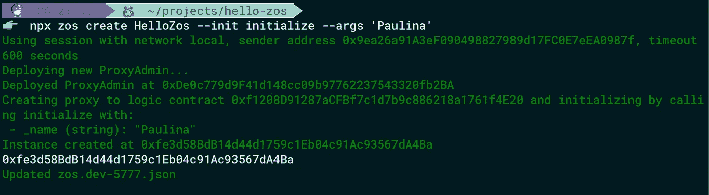

# 如何使用 ZeppelinOS 创建可升级的智能合约—修复易受下溢/上溢攻击的智能合约的示例

> 原文：<https://medium.com/coinmonks/how-to-create-an-upgradeable-smart-contract-using-zeppelinos-example-of-fixing-smart-contract-6f6612ed8df4?source=collection_archive---------0----------------------->

在本教程中，我们将使用 ZeppelinOS 来修复易受下溢/溢出攻击的智能契约。首先，我们将准备我们的环境，创建带有一些错误的可升级智能合同，并对其进行测试。然后，我们将更新代码，升级智能合同，最后，我们将检查它是否安全。

[你可以访问这篇文章的更新版本——OpenZeppelin SDK v . 2 . 5 . 2](/@paulina.blaszk/how-to-create-an-upgradeable-smart-contract-using-openzeppelin-sdk-example-of-fixing-smart-260dfbfd5bae?sk=9d4785ea4f3db9d278df99eb1edc28f8)


# 智能合约中的可升级性

原则上，智能合约是不可变的。一旦部署到网络上，就无法更改。不幸的是，在智能合同中，就像在所有软件中一样，错误经常发生。有时它们可能会花费数百万美元…但是不要担心！现在我们有了 ZeppelinOS——升级智能合同和修复错误的强大工具。正如 ZeppelinOS 的[文档](https://docs.zeppelinos.org/docs/start.html)所述，ZeppelinOS 是一个在以太坊和其他所有 EVM 和 eWASM 驱动的区块链上开发、部署和运营智能合同项目的平台。其最重要的功能之一是智能合约的可升级性。

# 环境准备

您需要安装用于创建和升级智能合同的基本软件。你可以在我的[上一篇](/@paulina.blaszk/how-to-write-and-deploy-first-smart-contract-in-solidity-0-5-x-and-truffle-5-x-x-3054ec5328ad)中找到安装 Node.js 和 NPM、松露、Ganache 的说明。

# 齐柏林诺斯装置

为了全局安装 ZeppelinOS，我们运行一个命令:

```
npm install -g zos
```

要检查您是否已经安装了 ZeppelinOs 或确保安装过程成功，您可以验证您的软件版本:

```
zos --version
```

我目前使用的是 zos v2.2.3

# 项目设置

我们必须为我们的项目创建一个新目录，然后导航到它:

```
mkdir hello-zos
cd hello-zos
```

# 项目启动

开始时，我们需要创建 package.json 文件:

```
npm init -y
```

我们运行这个带有`-y`标志的命令来生成 package.json，而不让它问任何问题——它将采用默认值。当然，如果你想个性化它，你可以只使用`npm init`和回答给定的问题。

接下来，我们终于可以开始我们的第一个 ZeppelinOs 项目了:

```
npx zos init hello-zos
```

如果它向我们询问版本，我们可以按 enter 键接受 1.0.0。一个命令`zos init`在我们的目录中创建文件`zos.json`。它存储了我们的 zos 项目的一般配置(ZeppelinOS 版本、初始化项目的名称、它的版本以及我们的项目包含的关于我们的合同的信息)。

更重要的是，`zos init`还初始化了松露。这意味着 truffle 项目的标准结构已经在我们的`hello-zos`目录中创建了。现在有两个新的目录(*契约*和*迁移*)和 *truffle-config.js* 文件。记得检查 *truffle-config.js* 是否与你的 Ganache 配置兼容。

# 创建智能合同示例

当我们在代码中发现一个 bug 时，智能合约不变性的问题可能会特别突出。如果没有可升级性，我们对这样一个智能合同就无能为力，它可能成为黑客攻击的一个很大的目标。对于我们的例子，我们将创建易受下溢/上溢攻击的智能契约(你可以在这里阅读更多关于它的信息)

在`zos.json`文件中，我们可以看到存储我们合同的对象是空的，所以是时候创建我们的智能合同了。首先，我们在*合同*目录中添加新文件。我们可以称之为`HelloZos.sol`。我们的智能合同将包含:

*   字符串状态变量*名称*
*   uint256 状态变量 *MaxNumber*
*   uint256 状态变量 *inc*
*   uint256 状态变量 *dec*
*   功能*减量*(从所选数字中减去 1)
*   功能*增加*(将所选数字加 1)

```
pragma solidity ^0.5.0;contract HelloZos { string public name;
    uint256 public maxNumber;
    uint256 public dec;
    uint256 public inc; function decrement(uint256 x) public returns (uint256) {
        return dec = x - 1;
    } function increment(uint256 x) public returns (uint256) {
        return inc = x + 1;
    }}
```

在可升级的智能合约中，我们使用 *init* 函数，而不是*构造函数*。为什么？部署智能合约实例时，执行*构造器*。在基于代理的可升级性系统中，这种情况永远不会发生。这就是为什么我们使用*初始化器*。为此，在 HelloZos.sol 的开头，就在`pragma`之后，我们必须从 ZeppelinOS 库导入契约`Initializable.sol`:

```
import "zos-lib/contracts/Initializable.sol"
```

当然，要使用 ZeppelinOS 库，我们必须将它安装在我们的项目目录中，因此我们必须运行一个命令:

```
npm install zos-lib --save
```

现在我们可以将我们的智能契约定义为*可初始化的*并添加 *init* 函数。

*由于一个媒体问题 github 代码没有在 Safari 中显示。使用不同的浏览器查看所有内容*

整个合同代码是:

现在是享受最大乐趣的时候了——让我们将智能合约部署到网络上，测试它并修复错误！

# 在 zos 项目中注册智能合同

首先，我们必须在我们的 ZeppelinOS 项目中注册智能合同。为此，我们运行一个命令:

```
npx zos add HelloZos
```


如果我们有多个智能合同，我们可以一次添加它们的所有名称(用空格分隔)或使用`--all`标志。

现在我们的智能合约(两者: *HelloZos* 和 *Initializable* )被编译(它们的工件被写入`build/contracts`目录)。并且我们可以在我们`zos.json`的*合同*下找到 *HelloZos* 合同

```
{
  “zosversion”: “2.2”,
  “name”: “hello-zos”,
  “version”: “1.0.0”,
  “contracts”: { 
    “HelloZos”: “HelloZos” 
  }
}
```

# 将智能合同部署到网络

然后，我们将智能合约部署到指定的网络。在我们的例子中，它是 *Ganache* 本地网络(确保它正在运行),并使用一个命令:

```
npx zos session --network local --from 0x9ea26a91A3eF090498827989d17FC0E7eEA0987f --expires 3600
```


记住用您的一个 Ganache 帐户替换`--from`标志后的地址**，但不要使用第一个帐户(account[0])。我一般选择第二种(accounts[1])或者最后一种(accounts[9])。你也应该使用你的 *truffle-config.js* 中指定的网络(在我们的例子中是 *local* )。**

完成这些准备工作后，我们可以通过运行以下命令将 *HelloZos* 智能合同推送到我们的本地网络:

```
npx zos push
```


它创建文件*zos . dev-<your-network-number>。json*

# 创建智能合同的可升级实例

我们刚刚将 *HelloZos* contract 部署到网络中，但是它只实现了逻辑。如果我们希望与智能合约进行交互，我们必须通过以下方式创建其可升级实例:

```
npx zos create HelloZos --init initialize --args 'Paulina'
```

在“create”之后，我们添加智能契约的名称，然后我们调用 initialize 函数，并在- args 标志之后传递参数(如果有多个参数，应该用逗号分隔，不要用空格)

结果是:



我们还可以在 zos.dev- <number>的底部找到我们的智能合约。json</number>

```
"proxies": {
    "hello-zos/HelloZos": [
      {
        "address": "0xfe3d58BdB14d44d1759c1Eb04c91Ac93567dA4Ba",     
        "version": "1.0.0",
        "implementation": "0xf1208D91287aCFBf7c1d7b9c886218a1761f4E20"
      }
    ]
}
```

你的 HelloZos 代理的地址是我们可以在控制台中看到的白色地址，我们稍后将与它进行交互。“实施”是当前智能合同版本的地址，当我们升级我们的智能合同时，它会发生变化。

# 与我们的智能合同互动

现在我们可以测试我们的智能合约是如何工作的。为了与它交流，我们将使用松露控制台。我们用命令打开它:

```
npx truffle console --network local
```

一开始，我们将把 *HelloZos* 契约的实例保存在`myContract`变量中:

```
let abi = require("./build/contracts/HelloZos.json").abilet myContract = new web3.eth.Contract(abi, "0xd6e0095002f3B287A468203B87D6408f172e1CbF")
```

记住**用你的 *HelloZos* 代理的地址替换上面的**地址！

现在我们可以检查状态变量的值:

```
myContract.methods.name().call()let max = await myContract.methods.maxNumber().call()max
```


现在我们可以用一个简单的数字来检查我们的函数:

```
myContract.methods.decrement(5).call()myContract.methods.increment(5).call()
```

从表面上看，一切都很好:


然后，我们用 0 和最大值调用我们的函数，并检查结果:

```
myContract.methods.decrement(0).call()myContract.methods.increment(max).call()
```


现在我们知道我们的智能合约有一个缺陷，容易受到攻击。那怎么办呢？不要担心，我们使用 ZeppelinOS，所以我们可以通过几个简单的步骤升级我们的代码。

# 升级合同

怎么才能修好？我们应该在所有算术运算的智能契约中使用 SafeMath 库。

我们将使用 OpenZeppelin 合同:

```
import "openzeppelin-eth/contracts/math/SafeMath.sol";
```

请注意，我们像往常一样导入`openzeppelin-eth`而不是`openzeppelin-solidity`。有什么区别？`Openzeppelin-eth`是 EVM 包的库，已经被部署到区块链(你可以在[这篇文章](https://blog.zeppelin.solutions/getting-started-with-openzeppelin-eth-a-new-stable-and-upgradeable-evm-package-576fb37297d0)中读到更多关于`openzeppelin-eth`和`openzeppelin-solidity`的区别)。

要使用它，我们必须将 EVM 包链接到我们的项目:

```
npx zos link openzeppelin-eth
```

我们的`zos.json`文件被更新并包含一个具有依赖关系的新对象:

```
“dependencies”: {
    “openzeppelin-eth”: “2.1.3”
}
```

现在我们必须更新我们的 *HelloZos* 智能契约的代码。我们需要更改 SafeMath 函数的加减字符。

```
function decrement(uint256 x) public returns (uint256) {     
    return dec = x.sub(1);
}function increment(uint256 x) public returns (uint256) {
    return inc = x.add(1);   
}
```

我们还必须在状态变量下添加下面的语句:

```
using SafeMath for uint256
```

*由于介质问题，github 代码无法在 Safari 中显示。使用不同的浏览器查看所有内容*

我们的代码全更新了 *HelloZos:*

**重要！**

升级智能合同时，我们**无法**:

-改变现有变量的类型，

-更改变量声明的顺序，

-删除现有变量，

-在现有变量之前引入一个新变量。

你可以在的 ZeppelinOS 文档中阅读更多关于升级模式的信息。

但是让我们回到我们全新的 *HelloZos* 。现在我们可以运行命令:

```
npx zos push --deploy-dependencies
```

我们使用 *- deploy-dependencies* 将 EVM 包部署到我们的本地网络(当我们使用 mainnet、ropsten、rinkeby 或 kovan 时，我们不必这样做，因为这些包已经部署好了)。

最后，我们可以使用以下命令更新我们的项目:

```
npx zos update HelloZos
```

现在，我们可以在 truffle 控制台中再次测试我们的智能合约。

```
npx truffle console --network locallet abi = require("./build/contracts/HelloZos.json").abilet myContract = new web3.eth.Contract(abi, "0xd6e0095002f3B287A468203B87D6408f172e1CbF")
```

记得用你的代理人的地址替换上面的地址！

现在我们可以检查状态变量的值:

```
let max = await myContract.methods.maxNumber().call()myContract.methods.decrement(0).call()myContract.methods.increment(max).call()
```

当我们试图溢出/下溢时，我们会看到

```
Error: Returned error: VM Exception while processing transaction: revert
```

多亏了 ZeppelinOS，我们已经更新了智能合约的代码，并保护我们免受上溢/下溢攻击！

## 你可以在我的 [GitHub](https://github.com/paulinablaszk/hello-zos) 上找到整个项目。

> [在您的收件箱中直接获得最佳软件交易](https://coincodecap.com/?utm_source=coinmonks)

[](https://coincodecap.com/?utm_source=coinmonks)