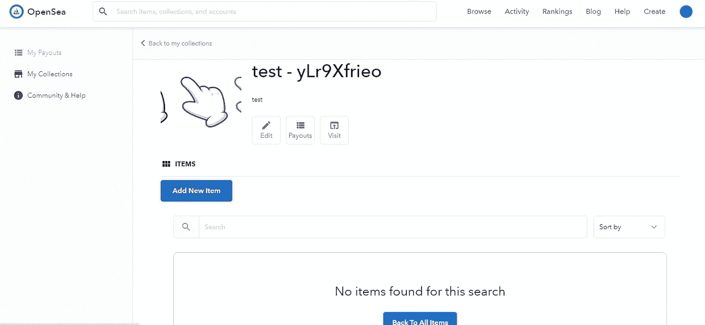
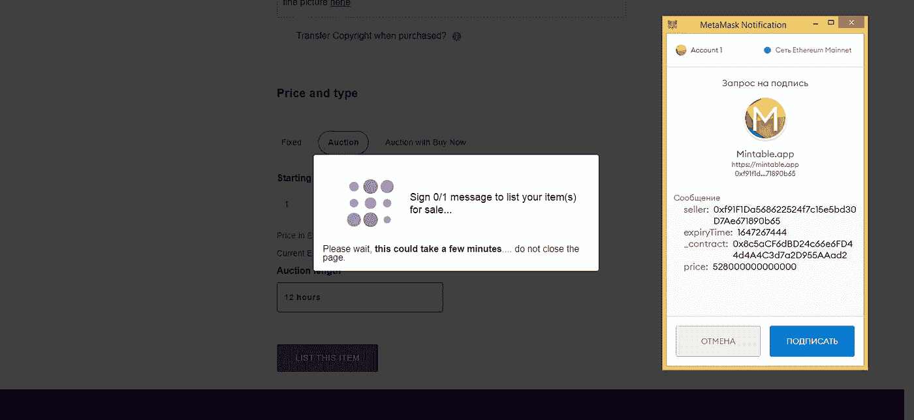

# 如何免费创建和铸造您的第一个 NFT(不可替换的令牌)

> 原文：<https://medium.com/coinmonks/how-to-create-and-mint-your-first-nft-non-fungible-token-for-free-e99e375ffe86?source=collection_archive---------1----------------------->

How to create NFT (Non-Fungible Tokens) for free at top NFT platforms (OpenSea, Rarible, etc)

# 介绍

在这篇文章中，我想[继续](/coinmonks/the-ultimate-guide-to-nft-marketing-and-promotion-b13c9b02aa3d)NFTs 的主题，这是目前越来越多的炒作。

甚至大众媒体现在都在谈论 NFT，像林赛·罗韩这样的著名艺术家也在跟风，班克斯的作品正在被符号化。购买 NFT 很容易，但是如何创造它们呢？

这被认为是相当复杂和昂贵的，但让我向你保证，现在创造你自己的个人 NFT 是相当负担得起的，甚至是免费的。是的，不需要编码。让我在几分钟内带你了解一下你可以用来创造和销售你独特的 NFT 的领先平台。

# OpenSea

[OpenSea](https://opensea.io) 绝对是你可以创建你的 NFT 的平台中的领导者。

相当用户友好的创建体验，让您快速高效地创建免费令牌。不过，你需要做好准备，你将被要求支付费用在瑞士联邦理工学院出售你的 NFT。创作是免费的，但销售却不是。尽管如此，OpenSea 仍然是一个不错的选择，因为它非常受欢迎，吸引了很多买家。该平台还有一些有趣的高级特性。例如，OpenSea 提供了一个将你的 NFT 与其他卖家的 NFT 捆绑销售的机会。这是非常独特的，可以真正有益的，因为这个选项扩大了听觉。

# 如何在 OpenSea 上创建你的 NFT？

首先访问平台网站:【https://opensea.io/ 

确保您使用正确的地址访问网站。

How to create NFT on OpenSea

点击**创建**。

将弹出一个窗口，要求您通过 Metamask wallet 进入。你可以使用其他钱包，但我鼓励你使用 Metamask。按照流程操作，连接钱包就可以了。

Connect MetaMask wallet with OpenSea NFT marketplace

要添加令牌，需要创建一个集合:点击“**创建**”。点击后，您将被要求同意服务条款。为此，您需要用元掩码签署确认。这是免费的，所以只需在即将出现的 Metamask 弹出窗口中签名即可。

Create your NFT Collections on OpenSea

现在您需要添加集合标志、集合名称和描述。

Minting NFT on OpenSea

集合已创建！您可以添加想要标记的项目:单击“**添加新项目**”并在元掩码弹出窗口中签署该操作。

Add your media to mint NFT

添加要链接到令牌的媒体文件。它可以是图片、视频、3D 模型或声音。可接受的格式有 *JPG、PNG、GIF、SVG、MP4、WEBM、MP3、WAV、OGG、GLB、GLTF* 。大小可能高达 100 MB。您还需要添加令牌的名称。

Create new NFT

接下来，您可以向令牌添加各种特征。您还可以添加只能由买方(此令牌的所有者)看到的被阻止的内容。此外，您还需要定义令牌的发行份数。默认份数为 1。一切设置正确后，点击“**创建**”。

OpenSea NFT creation

令牌已创建！这几天它正在被验证(真实性检查)。那你愿意就卖吧。为此，点击**出售**。

在 Opensea，销售通常以拍卖形式进行。出售过程值得额外的文章，因为有相当多的选项和设置。你可以在下面的截图里查看一下。你可以设定任何你想要的价格，也可以选择销售方式。设置好一切后，点击“**发布你的列表**”。

OpenSea NFT dashboard

# 稀有的

Rarible 与 OpenSea 互联，是它的大商店。所以 NFT 的创建过程与 OpenSea 非常相似。

Rarible 的功能比 OpenSea 稍弱，例如，你标记的艺术品的大小限制是它的三分之一，格式的数量也是有限的。不过，Rarible 有很好的流量，允许你在出售之前铸造代币，而 OpenSea 在代币实际出售时处理代币的铸造。

# 如何在 Rarible 上创建你的 NFT？

确保您访问正确的网站:[https://rarible.com/](https://rarible.com)并按下“**创建**按钮。

How to create/mint NFT on Rarible

然后你需要选择你是想要创建一个单独的 NFT 还是多个(如果你有一系列的艺术品需要标记的话就用它)。我们选择单身作为一个简单的例子。

Mint your NFT on Rarible

接下来，您将进入实际的创建页面。

设置与 OpenSea 非常相似，所以你基本上是以 *PNG、GIF、WEBP、MP4 或 MP3 格式上传你的作品*。如你所见，格式的范围比 OpenSea 更有限。同样的大小，你的作品重量应该少于 30mb。

也是在这个阶段，你设定 NFT 将被立即出售的价格(*别忘了你要向 Rarible* 支付 2.5%的费用)。如果不设置此选项，NFT 的价格将在拍卖机制中形成。

**您还可以添加秘密内容，只有在购买 NFT 后才能兑现。这可能是一个链接，代码或数字键。**在这一步，您还需要选择收集类型，可以是自定义 ERC-721 或 RARI(默认设置)。如果您想创建自定义收藏，只需点击它并填写详细信息。

Create NFT collectible

在同一个页面上，你需要为你的 NFT、描述、版税(明智地计算，谁知道你的艺术作品的未来)和属性(这是可选的，但对某些类型的艺术作品非常有用)设置一个名称。

准备好后，点击“**创建**按钮。Rarible 将要求您连接钱包，这与我们在 OpenSea 经历的过程相同。我推荐使用 Metamask。连接钱包并就条款&达成一致后，您就可以开始创建您的 NFT 了。再次推动**创造**。

Upload your NFT

现在，您需要批准令牌创建并支付费用。获得批准后，您将继续代币铸造，这是非常简单的。恭喜你，你刚刚铸造了你的 NFT！

一旦你准备好出售你的 NFT，就在卖单上签字。

# 可铸造的

[Mintable](https://mintable.app) 是另一个铸造和销售 NFT 的平台。如果你想测试 NFT 的创建过程，这可能是最便宜的平台，因为你可以创建并列出你的令牌出售，几乎没有费用。这是这个平台的竞争优势之一。

Mintable 甚至有一个专门的免费 NFT 市场。因此，不需要投资就可以开始出售你的艺术品。尽管如此，该平台没有 OpenSea 受欢迎，因此流量较低。此外，注册是必需的，这与 OpenSea 和 Rarible 相比可能有点烦人，因为登录是通过 Metamask 进行的。

总而言之，这个平台比 OpenSea 和 Rarible 稍逊一筹，但它确实允许用户免费创建 NFT，包括销售过程。

# 如何在 Mintable 上创建你的 NFT？

首先去 https://mintable.app/[看看，确保地址是正确的。你需要注册。只需按照 Mintable 提供的程序。注册后，只需登录并点击“**创建一个项目**”。](https://mintable.app)

How to mint NFT on Mintable

当弹出窗口出现时，选择“**新建一个项目**”。

下一个弹出窗口将提供您选择简单或先进的方式来制造 NFT。在本指南中，我将向你展示简单的方法，这也是完全免费的。如果你想这样做，不要改变不倒翁的位置，点击进一步。你会被要求连接你的钱包。这一步没有什么新东西，一如既往，我建议使用 Metamask。

Create new NFT

接下来，您将被要求填写 NFT 的详细信息。那很简单。您还需要上传正在标记的项目。类型的范围相当多样，从音频和图像到文档，甚至 ZIP 文件。

在同一个页面上，你需要上传你的项目预览图像，填写描述，选择版权是否随购买转移，并选择你想出售的方式。像往常一样，它可以是固定价格，拍卖或拍卖与立即购买。后者意味着一种拍卖类型，买家可以立即以特定价格购买资产，避免竞争。

Mint your NFT for free

设置完毕后，点击“**列出此项**”。您将被要求使用 Metamask 签署此交易。完全免费。在你签字后，你的 NFT 将在可铸造的无气商店出售。如果你想的话，你可以看看 NFT 的网页来提高销量。

Sell your NFT

***可喜可贺！审核通过后，就可以开始你的销售了！现在你是 NFT 艺术家:)***

# 如何出售你的 NFT 艺术品

嗯，这是一个相当大的问题，其中一部分在我以前的文章“[营销和推广的最终指南](https://hackernoon.com/the-ultimate-guide-to-nft-marketing-and-promotion-2jl33ky?ref=hackernoon.com)中有所涉及，在那里我描述了我们使用的大多数方法，[与我们的客户合作](https://x10.agency)——不同的 crypto、DeFi 和 NFT 项目。

此外，我将写更多关于如何销售和推广 NFT 代币的文章，随着市场的发展，越来越多有趣的服务出现，你可以几乎免费地推广自己(例如 [NFT 猎人](https://nfthunters.com))。敬请关注。

*与此同时，如果您想了解密码和 NFT 行业的最新动态，并参与不同的竞赛和活动，请在 Twitter *关注我。**

*如果你是 NFT / DeFi / crypto 项目，想知道更多如何推广你的项目，你可以随时通过* [*电报*](https://t.me/baloyan) *(@baloyan)* 联系我

# 查看我以前的文章:

*   [**NFT 营销推广终极指南**](/coinmonks/the-ultimate-guide-to-nft-marketing-and-promotion-b13c9b02aa3d)
*   [**营销 DeFi 项目的终极清单**](https://hackernoon.com/the-ultimate-checklist-for-marketing-defi-projects-f71a3wod?ref=hackernoon.com)
*   [**如何发行不可替代代币(NFT)**](https://hackernoon.com/issuing-non-fungible-tokens-nfts-a-how-to-guide-ckj3wz2?ref=hackernoon.com)
*   [**如何在 UniSwap 上列出你的 DeFi 令牌**](https://hackernoon.com/how-to-list-your-defi-token-on-uniswap-d4s3w7s?ref=hackernoon.com)
*   [**中国新国家加密货币如何改变一切**](https://hackernoon.com/how-chinas-new-national-cryptocurrency-changes-everything-sc4032eq?ref=hackernoon.com)
*   [**2021 年密码产业 6 大预测**](https://hackernoon.com/6-predictions-for-crypto-industry-in-2021-without-trading-5f2b3z8c?ref=hackernoon.com)