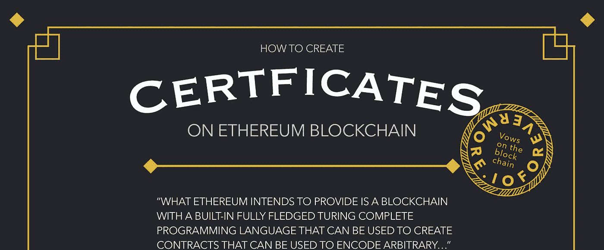
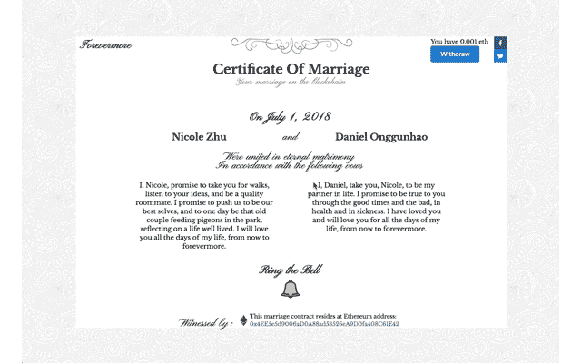
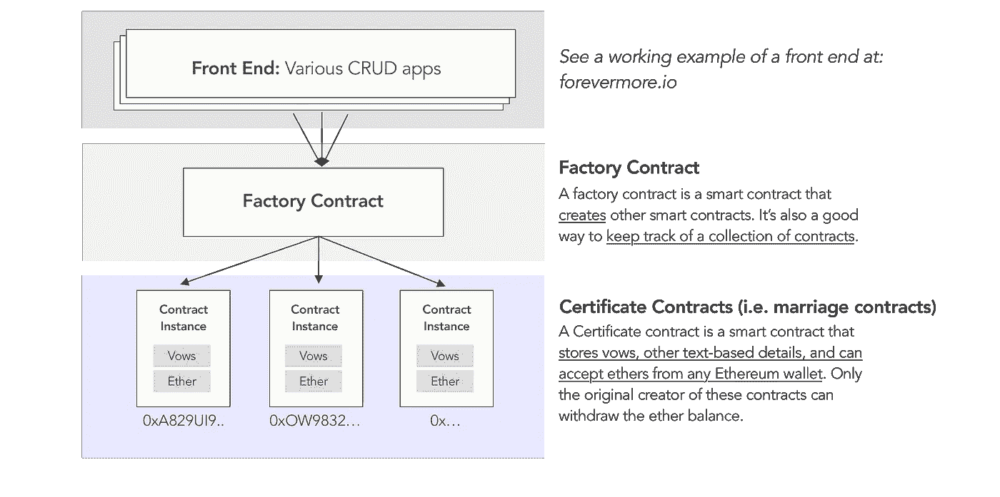
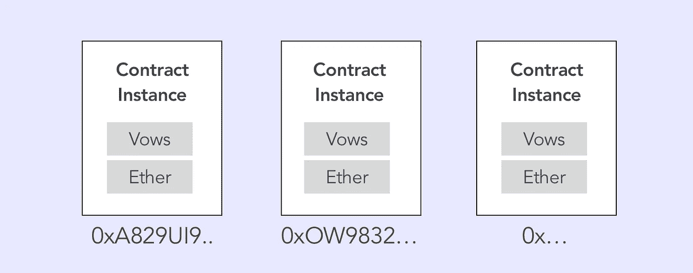

# 如何在以太坊区块链上创建证书—第 1 部分

> 原文：<https://medium.com/coinmonks/how-to-create-certificates-on-the-ethereum-blockchain-part-1-45564fd29595?source=collection_archive---------0----------------------->



## 在本教程中，您将构建一个分散式应用程序，让用户创建智能证书。

把你的话写在区块链上[会让它变得不可改变](https://www.verypossible.com/blog/blockchain-explained-how-does-immutability-work)。你不会依赖任何政府或机构来保存你的记录。相反，我们将依靠遍布世界各地的 16，000 多个节点来保障网络安全，这些节点属于像你我这样的人。

我们将以结婚证书为例。我们还会赋予这些证书契约一些特殊的能力，比如可以接受礼物的婚姻登记处。

> [发现并回顾最佳区块链软件](https://coincodecap.com)



Fig: A working example of an Ethereum marriage certificate at [forevermore.io](https://forevermore.io/).

**注意**:你可以很容易地改编这个教程来处理其他主题。例如，让你的用户创建毕业证书，甚至认证他们自己的作品——没有限制！

> **在本教程**结束时，您将知道如何创建简单的智能合约，如何与之交互，以及如何将其部署到以太坊区块链。

# **环境设置**

1.  [下载元掩码](https://metamask.io/):在线钱包处理程序【5 分钟】。不要担心购买真正的以太网，因为您可以先部署到测试网。
2.  [访问混音](http://remix.ethereum.org/#optimize=false&version=soljson-v0.4.24+commit.e67f0147.js):使用在线 Solidity IDE [1 分钟]

# DApp 整体建筑

这是我们将要做的事情的图示。我们将使用一个工厂模式来创建一个工厂契约，这将依次生成我们的证书契约。

在本教程的第 1 部分，我们将只关注证书契约。



**这个栈类比看起来眼熟吗？**

*   在高层次上，您可以将区块链视为传统后端和服务器的替代方案。因此，当我们构建这些契约时，我们实际上是在设计应用程序的数据结构和数据关系。
*   我们推荐[工厂模式](https://refactoring.guru/design-patterns/factory-method)。**它使您更容易创建和跟踪特定类别的合同**。在第 2 部分中会有更多的介绍。

# 第 1 部分—构建婚姻契约



## 在本教程中，您的婚姻契约需要:

*   存储合同所有者/创建者的详细信息
*   存储夫妇的名字和结婚誓言
*   让公众观众“敲响婚礼的钟声”，这给智能合同带来了礼物醚
*   让合同所有者将赠送的乙醚收回到自己的钱包中

**我们开始吧**。在 [Remix](http://remix.ethereum.org/) 中，用下面的代码创建一个名为 **Marriage.sol** 的文件:

```
// This specifies the Solidity compiler version that generates 
// opcodes and ABI to be stored on the blockchainpragma solidity ^0.4.19;contract Marriage {
    // You will declare your global vars here constructor() public {
        // You will instantiate your contract here
    }
}
```

**注意事项**:

*   “public”是一个函数修饰符，允许任何人创建您的婚姻契约的新实例
*   确保您使用的是最新的稳定编译器版本。

## 存储婚姻契约的所有者

以太坊中所有的钱包和智能合约都有地址，作为主要的标识符。

在您的 DApp 中，您希望能够存储创建的每个婚姻契约的所有者。这允许你授予拥有者特殊的能力——稍后会详细介绍。

1.  在`contract Marriage {`内部，定义一个全局变量来存储所有者的地址。

```
// Set owner public var, so anyone can see who owns the contractaddress public owner;
```

**注意**:‘地址’是一种实数据类型。地址可以识别智能合同或个人钱包。

2.接下来，每次实例化新的证书契约时保存地址。修改您的构造函数，如下所示:

```
constructor(address _owner) public {
    owner = _owner;
}
```

**注意事项**:

*   我们将依靠未来的工厂契约来调用这个构造函数并传入 _owner 的地址。
*   如果我们不使用工厂合同，您可以将 owner 设置为“ **msg.sender** ”，这是试图创建此合同的地址。

## 存储夫妇的名字和结婚誓言

*在这里，您可以尽情发挥您的创造力，更改您的智能合同以代表不同类型的法律合同或证书！*

1.  添加以下全局变量:

```
contract Marriage {// Owner address
    address public owner;// Marriage contract details
    string public leftName;
    string public leftVows;
    string public rightName;
    string public rightVows;
    uint public marriageDate;        constructor(address _owner, string _leftName, string _leftVows, string _rightName, string _rightVows, uint _date) public {
        owner = _owner;
        leftName = _leftName;
        leftVows = _leftVows;
        rightName = _rightName;
        rightVows = _rightVows;
        marriageDate = _date; 
    }
}
```

**注意**:除了“地址”，Solidity 还有其他静态数据类型，比如“字符串”和“uint”。这里有一个关于以太坊如何存储数据的更深入的研究。

恭喜你！你已经创建了一个婚姻类对象。这个智能合同将成为在区块链实例化未来婚姻合同的模板。

一个静态的、只显示文本的婚姻契约一点都不好玩。让我们编码一些逻辑和自动化。

> 如果你的结婚契约也可以是婚礼登记处，那岂不是很酷？

## 让人们在合同上签字

前面我们提到过，智能合约可以存储货币和处理交易。让我们好好利用这一点。你想让任何公开查看你的婚姻契约的人来赠与它。我们姑且称这个功能为“敲响婚礼的钟声”。

1.  创建一个名为 ringBell()的函数。以太坊提供了一个特殊的' **payable** '类型的功能来处理此类货币交易:

```
// ringBell is a payable function that allows people to celebrate the couple's marriage by sending Ethers to the marriage contractfunction ringBell() public payable {...}
```

在幕后，Solidity functions 接收重要变量:

*   **msg.value:** 包含发送方指定的金额。“应付”类型的功能会自动将此消息值存储在其自己的分类帐中。
*   **msg.sender** :是给你寄钱的人的地址。

2.让我们变得贪婪，用我们对 **msg.value** 的了解来强加一个最低礼物价值。最低 0.0001 乙醚(约 5 美分)的礼物怎么样？

```
// ringBell is a payable function that allows people to celebrate the couple's marriage by sending Ethers to the marriage contractfunction ringBell() public payable {
    require(msg.value > .0001 ether);
}
```

**注意事项**:

*   **require()** 用于验证用户输入和其他可能经常失败的条件检查。
*   如果不满足条件，用户的事务会立即停止。
*   这很好，因为如果发送者的请求失败，所有剩余的汽油(即交易费)将立即退还给发送者。

## **让合同业主收回他们的钱**

1.  声明一个 collect()函数，将乙醚从智能合约转移到用户的钱包中。

```
function collect() {
    owner.transfer(address(this).balance);
}
```

**注意:**

*   **‘本’**指合同本身。因此“owner.transfer(…)”将合同的全部余额转移到所有者的钱包中。

**让我们花点时间考虑一下安全性。**您希望确保只有合同的所有者可以撤销。

一种处理方法是“require(owner == msg.sender)”。但是您可能必须经常执行这个“需要所有者”检查——因为您想为所有者添加更多的特性。解决办法？

## 将条件检查重构为函数修饰符

将 require()检查重构到它们自己的修饰符函数中被认为是[最佳实践](http://solidity.readthedocs.io/en/v0.4.24/common-patterns.html)。

1.  创建一个名为" **onlyOwner** "的函数修饰符:

```
// Reusable modifier functionmodifier onlyOwner() {
    require(msg.sender == owner);
    _;
}// To use a modifier, append it to the end of the function namefunction collect() external onlyOwner {
    owner.transfer(address(this).balance);
}
```

**通知**:

*   **“_”是一个占位符**，代表您正在使用 onlyOwner()修改的特性功能的内容。
*   我们使用**外部**函数修饰符[为所有者节省一些交易费用](https://ethereum.stackexchange.com/questions/19380/external-vs-public-best-practices)。

## 最后，为我们的前端创建一个助手函数:

1.  创建一个函数，只让合同的所有者检查他的合同包含多少乙醚:

```
// Allow only owners the check the balance of the contractfunction getBalance() public view onlyOwner returns (uint) {
    return address(this).balance;
}
```

## **就这样**！您已经构建了第一个智能合约类。

现在，您可以使用 Remix 在区块链上实例化智能婚姻契约。剩下的工作就是创建工厂契约和一个简单的 UI。

# 后续步骤

*   [**继续第二部分**](/coinmonks/how-to-create-a-notary-on-the-ethereum-blockchain-part-2-1808a458c360)**——**接下来我们将致力于工厂合同，把你的智能合同变成一个真正的去中心化应用。
*   **想提前跳过**？点击这里查看最终的[应用](https://forevermore.io/) &点击这里查看完整的开源[项目](https://github.com/nczhu/forevermore)。
*   **演职员表** : [丹尼尔](https://github.com/onggunhao)(编码对)[斯蒂芬](https://github.com/StephenGrider/EthereumCasts)(教程)