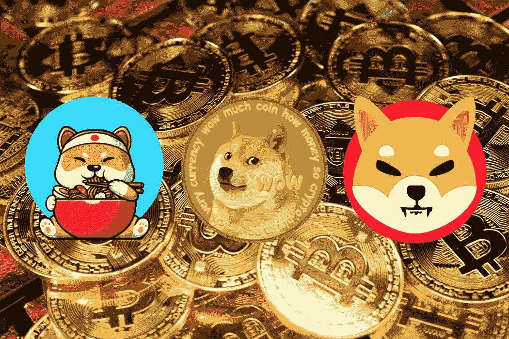

# 如何创建类似 DogeCoin 的加密货币(加密令牌)

> 原文：<https://medium.com/coinmonks/how-to-create-cryptocurrency-crypto-token-like-dogecoin-daabc45398f3?source=collection_archive---------3----------------------->

由于 Vitalik Butterin 的出现，任何人都可以创建自己的加密货币。如今，成千上万种加密货币的热情让加密领域变得炙手可热。
在本文中，我将根据我的经验解释创建您自己的加密货币(加密令牌)的开发步骤。

# **前言:加密货币的种类**

通常，许多人认为所有的加密货币都是同一种货币。
在讲正题之前，我先澄清一下加密货币的种类。我们可以将加密货币分为两种。
**①加密币** 币都有自己的原生区块链，比如像比特币。以太(ETH)有[以太坊区块链](https://academy.binance.com/en/articles/what-is-ethereum)。你可以在这里找到更多硬币清单。
和[这里的](https://www.datadriveninvestor.com/how-to-create-your-own-cryptocurrency/)解释了如何创建硬币的步骤。
**②加密令牌** 令牌建立在预先存在的区块链上。它们可能有一些类似于硬币的作用，但是代币主要在它们自己的项目中有用处。柴犬·INU(SHIB)就是例子。它们只是部署到现有区块链的智能合约。柴犬部署在以太坊，DogeCoin 部署在币安智能链。

在本文中，我将根据我的经验解释创建第二种加密货币(加密令牌)的步骤。这篇文章关注的是你在每一步中的责任。整个过程可以分为 7 个步骤:创意、白皮书、团队、顾问、令牌开发、营销和发布。

# 1.想法

你对你的加密货币有自己的创意，具体和独特的想法。在这一步，你应该澄清以下两个问题的答案:
**◾** 用户可以用这个令牌做什么？
**◾** 这个代币针对的是哪个行业？众所周知，创意在这个项目中是最重要的。

# 2.白皮书

在这里，您应该为您的令牌完成白皮书。
一份好的白皮书应该包括以下几个部分:
-项目大纲
-解决方案
-关于令牌发布和市场考虑的详细说明
-整个团队的概述
详细说明请看这个[链接](https://www.devteam.space/blog/how-to-write-a-good-white-paper-for-an-ico/)。

要做一份好的白皮书，你应该做以下几件事:
◾向专家咨询你的想法
◾自己或在他人的帮助下起草白皮书
◾聘请一位作家完成白皮书(如果你能自己完成，可以选择)

# 3.构建团队

建立一个组织良好的团队是你成功的关键。
此步骤应与步骤 2 同时进行。因为你在白皮书中解释了整个团队。
◾您应该为您的令牌指定所有成员，包括首席执行官、首席技术官、首席营销官&开发团队。
◾，最好和所有成员开个会。

> 在此，建议选择通过 KYC 验证或 Doxing 认证的首席执行官。此外，这些成员在 LinkedIn、Twitter、Instagram 和脸书等社交网站上的历史也是重要的组成部分。因为用户首先希望了解新令牌发布的团队成员。

# 4.查找顾问

顾问是成功的关键之一。
在这里，你应该做以下事情:
◾为你的 token 寻找最好的顾问
顾问应该是 token 目标行业的权威或专家。◾联系顾问并获得支持

> 有许多顾问成功的例子。在这里，我用娱乐令牌解释一个。这个团队的 CEO 通过打电话联系了一位著名的女演员。在理解了解释之后，她同意支持他们的代币。在社交网站上，她只用一句话就赢得了众多支持者，并获得了成功。

# 5.创建令牌

这是主要的开发步骤。你应该在这一步开发所有的东西，包括网站，智能合同和标志。这一步应该由开发人员来完成。
以下为必填部分:
◾智能合约
◾网站
◾ Logo 图片

> 在此步骤之后的营销步骤中，智能合同应该通过审核。一般来说，审计大约需要 7 ~ 10 天。并且在某些情况下需要修复。审计必须在启动步骤(最后一步)之前完成。因此，最好在开发后立即请求智能合同审计。

# 6.营销

所有的步骤都很重要，但这一步更重要。因为成败取决于营销。
在这一步，你负责:
◾开始营销
◾收集关于你的令牌的意见。
◾根据需要进行更新(不建议在此步骤中更新)

> 建议聘请营销机构。
> 以下是加密货币的强制营销方式:
> **-社交渠道**
> 社交渠道是一般营销的首选方式。脸书、推特、Youtube、Instagram、Reddit、BitTorrent 和 Telegram 都是不错的选择。
> **-硬币平台**
> Coinhunt 和 CoinSnipper 是新加密货币的其他去处。
> **——广告**
> 通过广告和影响者进行营销也是推荐的方式。

# 7.发射。

最后，在这一步中启动令牌。换句话说，您将智能合约部署到现有的连锁店，如以太坊、币安等。部署可以由开发人员完成，也可以由您自己完成。
在这一步骤中，选择最佳的硬币发布和智能合约部署时间非常重要。

> 一个技巧是在发布前 2 天宣布令牌，并在发布前 30 分钟部署智能合约。
> 这是为了防止骗子。
> 如果您在发布前几天宣布，一些骗子会克隆您的网站(使用类似的 URL &设计)。
> 此外，任何部署在链上的智能合约都可以被还原成真实代码。这可以在几个小时内完成。因此，如果您在推出之前过早部署智能合约，骗子就会克隆您的智能合约。
> 利用克隆的网站&智能合约，骗子会与您同时启动他们的令牌。许多用户错误地访问这些诈骗网站，并相信这些代币是来自你的营销。因为类似的网站设计&同样的令牌逻辑。你会失去你所有的营销努力。

# 结论

在本文中，我解释了创建加密令牌的简单概念。你可以随时听到更多的细节。创建令牌并不容易。有了好的想法，你就能遇到一个强大的团队随时支持你。
谢谢。

联系方式:
电报:@itstar89
不和谐:alxex8909#0874

亚历克斯。

> 加入 Coinmonks [电报频道](https://t.me/coincodecap)和 [Youtube 频道](https://www.youtube.com/c/coinmonks/videos)了解加密交易和投资

## 也阅读

 [## 杠杆代币[多头代币]终极指南

### 杠杆化令牌是具有杠杆化风险敞口的 ERC20 令牌，不考虑保证金、要求、管理…

medium.com](/coinmonks/leveraged-token-3f5257808b22)  [## 最佳加密交易所| 2021 年十大加密货币交易所

### 加密货币交易所的加密交易需要了解市场，这可以帮助你获得利润。之前…

blog.coincodecap.com](https://blog.coincodecap.com/crypto-exchange)  [## 2021 年最佳加密借贷平台| 6 大比特币借贷平台

### 获得比特币和其他加密货币的最佳贷款利率

medium.com](/coinmonks/top-5-crypto-lending-platforms-in-2020-that-you-need-to-know-a1b675cec3fa)  [## 2021 年最佳免费加密交易机器人

### 2021 年币安、比特币基地、库币和其他密码交易所的最佳密码交易机器人。四进制，位间隙…

medium.com](/coinmonks/crypto-trading-bot-c2ffce8acb2a)