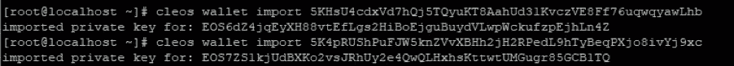

# 如何创建 EOS 令牌

> 原文：<https://medium.com/coinmonks/how-to-create-eos-token-212696fe1aba?source=collection_archive---------0----------------------->

## 使用 eosio.token 契约创建 Eos 令牌


在 EOS 中，只需使用 eosio.token 契约就可以发布令牌。eosio.token 合同在安装 EOS 时存储在合同目录中。不同功能的令牌合约也可以参考 eosio.token 单独配置。

在本帖中，我们将使用 eosio.token 契约发布一个令牌。

# **创建用户账户**

发布前创建一个用户帐户。用户将使用 usersc、user1、user2 我将跳过创建用户帐户的部分(但是我发现自己在写的时候无论如何都要描述它……)。

首先，按照开发人员 eosio 的顺序，创建一个 eosio.token 帐户。


```
#cleos create key
```

生成两个密钥。



```
#cleos wallet import [Private Key]
```

将密钥保存到主钱包中。


```
#cleos create account eosio eosio.token [Public Key]
```

使用生成的密钥创建 eosio.token 帐户。


```
#cleos set contract eosio.token ~/eos/build/contract/eosio.token -p eosio.token
```

部署 eosio 令牌合同，这是创建、颁发和传输令牌的主要合同。eosio 令牌契约位于[EOS source]/build/contracts/EOS io . token 目录中。

# **令牌生成**

现在我们已经准备好了，让我们生成一个令牌。


```
#cleos push action eosio.token create ‘[“eosio”,”1000000000000.000 SYS”]’ -p eosio.token
```

使用 eosio.token 协定的 Create 操作创建一个“SYS”标记。传输给动作的第一个数据是发行者，在本例中是系统拥有的帐户 eosio。第二个数据是可以提供的最大数量，在本例中设置为一万亿。

将生成的令牌颁发给用户。在本帖中，100.0000 SYS 发布给了 user1。


```
#cleos push action eosio.token issue ‘[“user1”,”100.0000 SYS”,”memo”]’ -p eosio
```

发布时，您必须使用 eosio 帐户权限执行。否则，您将收到一条消息，提示您没有相应的权限，如上所述。此外，如果仔细观察输出，一个问题由一个包含多个操作的事务组成。


```
#cleos get currency balance eosio.token user1
```

用一个简单的命令检查 user1 的余额。


```
#cleos push action eosio.token transfer ‘{“from”:”user1”,”to”:”user2”,”quantity”:”10.0000 SYS”,”memo”:”memo”}’ -p user1
```

用户 1 现在将 10.0000 SYS 传递给用户 2。当然，这需要使用 user1 的帐户来完成。


```
#cleos get currency balance eosio.token [username]
```

检查每个余额。

到目前为止，这是一个基本的 eosio 令牌合同示例。现在，我们将测试更多关于 eosio 令牌契约如何工作的内容。

# **操作测试**

首先是 eosio.token 契约是否能够控制除“SYS”之外的其他令牌的问题。


```
#cleos push action eosio.token create ‘[“eosio”,”10000000000000.0000 TST”]’ -p eosio.token
```

这可能行不通，但让我们尝试创建一个名为“TST”的新令牌。


```
#cleos push action eosio.token issue ‘[“user1”,”1000.0000 TST”,”memo”]’ -p eosio
```

向用户 1 发放 1000.0000 TST。


现在，用户 1 有两种类型的令牌。

第二，我们已经知道，eosio token 契约是编译源代码的结果。那么接下来的问题是，是否有可能用另一个账户运行 eosio token 合约？


```
#cleos set contract usersc ~/eos/build/contracts/eosio.token -p usersc
```

将 eosio 令牌合同部署到 usersc 帐户。成功了。


```
#cleos push action usersc create ‘[“eosio”,”1000000000000.0000 TSA”]’ -p usersc
```


```
#cleos push action usersc issue ‘[“user1”,”1000.0000 TSA”,”memo”]’ -p eosio
```

生成令牌 TSA 并将其发布给用户 1。和往常一样，如果您要发布令牌，您需要 nodeos 的系统帐户。


您可以查看所有余额，方法是参考 usersc 合同帐户来检查余额。

第三，如果你在上面的情况下覆盖了 usersc 上的另一个契约会怎么样？


```
#cleos set contract usersc ~/sc/helloworld/ -p usersc
```

部署一个简单的 helloworld 协定。


有趣的是，契约本身没有了，但是如果您搜索表来查看余额是否仍然存在，则搜索会失败。当删除现有表时，余额信息也会消失。

但是，如果您重新部署 usersc eosio.token 契约并查找余额


```
#cleos set contract usersc ~/eos/build/contracts/eosio.token -p usersc#cleos get currency balance usersc user1
```

现有的平衡被恢复。事实上，与其说它被恢复了，不如说 usersc 使用的表被保持原样，但是关于引用该表的契约的信息已经随着契约的改变而丢失了。

如果您对 eos 令牌契约进行这样的测试，您将开始更多地理解契约和表之间的交互。这篇文章描述了在运行令牌生成示例后，如何以各种方式测试契约的行为，让您知道有一个不同的方向，而不是以解释令牌系统如何在 eos 中工作的方式开始分析源代码。

## ITAM 游戏是一个透明的游戏生态系统的区块链平台

订阅 ITAM 游戏并接收最新信息。

访问 ITAM 游戏电讯，就 ITAM 游戏和区块链进行交流。点击下面的链接加入！👫

网址:**[https://itam . games](https://itam.games)电报:[https://t.me/itamgames](https://t.me/itamgames)**