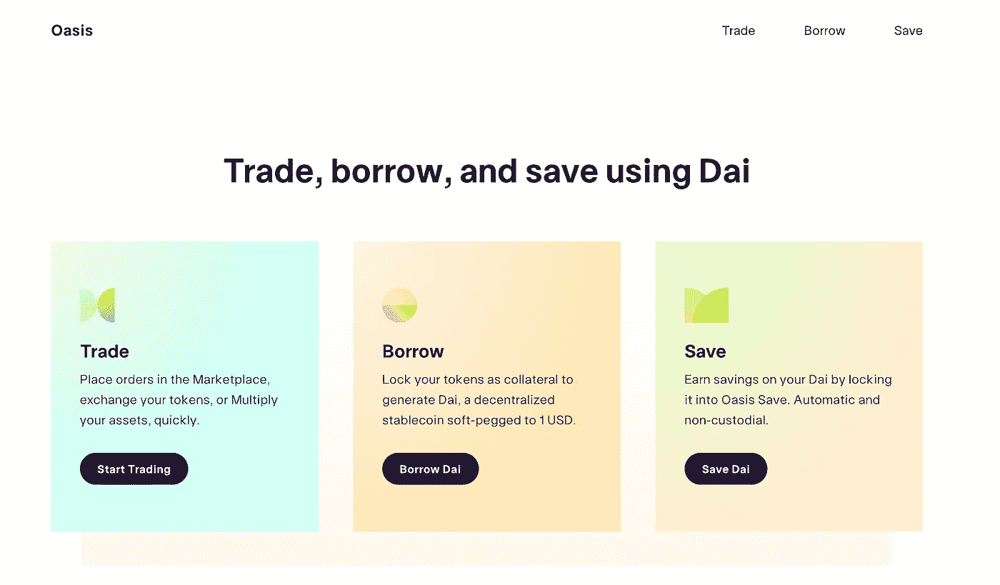

# 如何从债务中创造货币

> 原文：<https://medium.com/coinmonks/how-to-create-money-from-debt-98bd5e0ad0e4?source=collection_archive---------0----------------------->

Image by [Myriam Zilles](https://pixabay.com/users/Myriams-Fotos-1627417/?utm_source=link-attribution&utm_medium=referral&utm_campaign=image&utm_content=2383496) from [Pixabay](https://pixabay.com/?utm_source=link-attribution&utm_medium=referral&utm_campaign=image&utm_content=2383496)

## 浅谈如何利用马克道的戴

与美元等传统货币相比，比特币等加密货币有着价格波动的历史。一些加密货币用户发现在某些情况下需要交易更稳定的期权，例如规避风险。

为了应对加密货币的价格波动，与美元相比价格稳定的数字货币已经被创造出来。按市值计算，最受欢迎的是 USDT 的 Tether 公司。

对 Tether 的一个担忧是 USDT 是由一个集中的平台铸造的。一些透明度的问题，如果系绳真的有美元的抵押品，使他们的价格稳定。

为了应对可能缺乏透明度的集中式稳定硬币供应，MakerDAO 创建了一种稳定硬币，其供应以透明和分散的方式进行。

# 从债务中获得的钱

抵押品是一种有价值的东西，在借款人无法偿还贷款的情况下提供给贷款人。如果你要买房子，你抵押贷款的抵押品就是房子。如果你无法偿还抵押贷款，你的贷款人，大多数情况下是银行，可以收回你的房子。

马可道的稳币戴是押品锁死的时候印的。锁定资产可以兑换成价值接近其以美元计价的 DAI。这使得一戴的价格与一美元挂钩。

但戴是欠债的。

要创建 DAI，必须锁定担保品。要解除这种担保，必须偿还戴。这样，被创造的戴就是一笔必须偿还的贷款。

对于被认为是安全的抵押品，产生 DAI 的资产的价值必须大于 DAI 的货币价值。戴一定是超额抵押了。

如果基础资产的价格下跌，所创造的 DAI 可能会被抵押不足。如果戴被抵押，那种抵押品就被认为是不安全的。

一旦印刷 DAI 的抵押品不安全，抵押品就会被清算，并通过拍卖提供给任何人。抵押品可以通过这种方式折价购买。

这种在某些情况下可以溢价和折价赎回资产的制度使得戴的价格为 1 美元。这些钱是通过借贷创造的。

戴的担保品最初是 ETH，但现在包括包装好的、和。

# 债务杠杆头寸

为什么有人会首先制造这种债务？原因是你可以通过利用债务作为杠杆多头头寸来赚取价值。

多头意味着如果资产价格上涨，你在用借来的钱赚更多的钱。例如，如果你做多比特币，如果比特币价格上涨，你通过渴望比持有该资产赚得更多。

你如何利用 Maker 做到这一点，首先要拥有你想做多的资产。目前，Maker 支持 ETH、WBTC、USDT 和 USDC。但对于想做多的人来说，选择是 WBTC(比特币)、瑞士联邦理工学院和英美烟草。

首先进入 [Oasis.app](https://oasis.app/) 。

[Oasis.app](https://oasis.app/) allows you to trade, borrow, or earn interest.

从那里，去“借”这是你能创造戴的地方。

Maker’s collateralized debt position portal.

要创建戴，请按“开始”应该会打开一个页面，询问您想用什么资产作为抵押来创建 DAI。

For this example, I’ll select ETH.

接下来，我们可以选择锁定多少资产，以及创建多少 DAI。DAI 在资产中的比例越低，如果资产价格下跌，资产就越不会被清算。

You can select how much of an asset to lock up. The amount of DAI to be created is up to a limit.

一旦戴被创建，你就可以用它做你想做的事情了。

如果你想做多你作为抵押品的资产，就用 DAI 来交易。如果该资产的价格上涨，你可以卖掉它来换取你需要偿还的债务，这样你就能获得额外的收益。

> [在您的收件箱中直接获得最佳软件交易](https://coincodecap.com/?utm_source=coinmonks)

