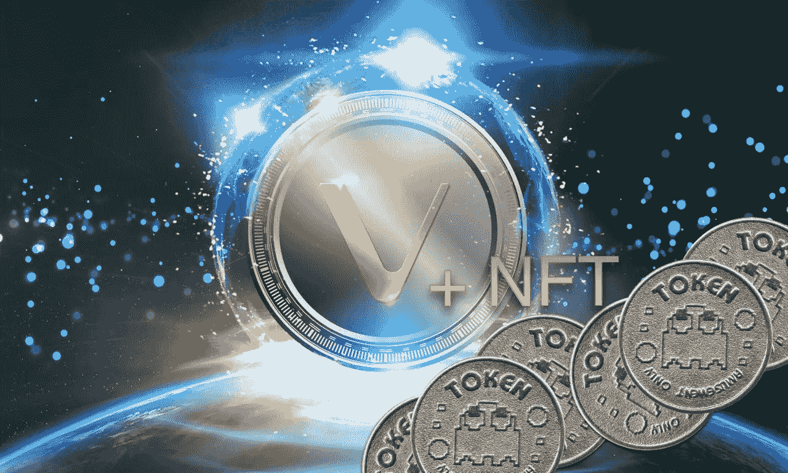

# 如何在 VeChain 上创建 NFT 合同(快速)

> 原文：<https://medium.com/coinmonks/how-to-create-nft-contracts-on-vechain-quick-e9fd0003a4a4?source=collection_archive---------1----------------------->

# 什么是 NFT？

不可替换令牌(NFT)是一种可以与其他人交换的唯一令牌。它就像一件带有序列号的独一无二的物品，可以送给任何人，而且不可复制。

用于 VeChain 的 NFT 于 2018 年年底与 [VIP-181 一起推出，以其经济和 X 节点的使用而闻名。它基本上是一个标准化的…](https://github.com/vechain/VIPs/blob/master/vips/VIP-181.md)