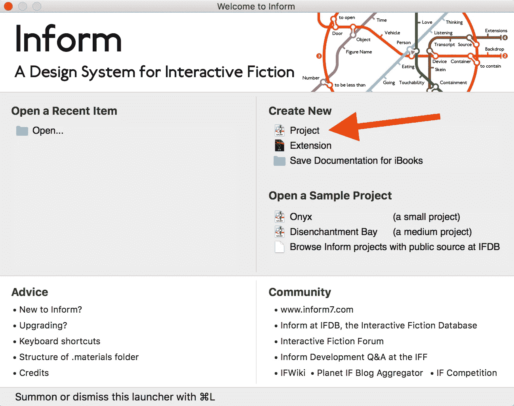
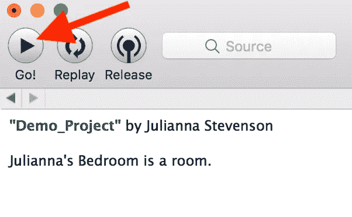
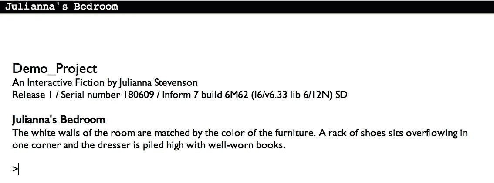
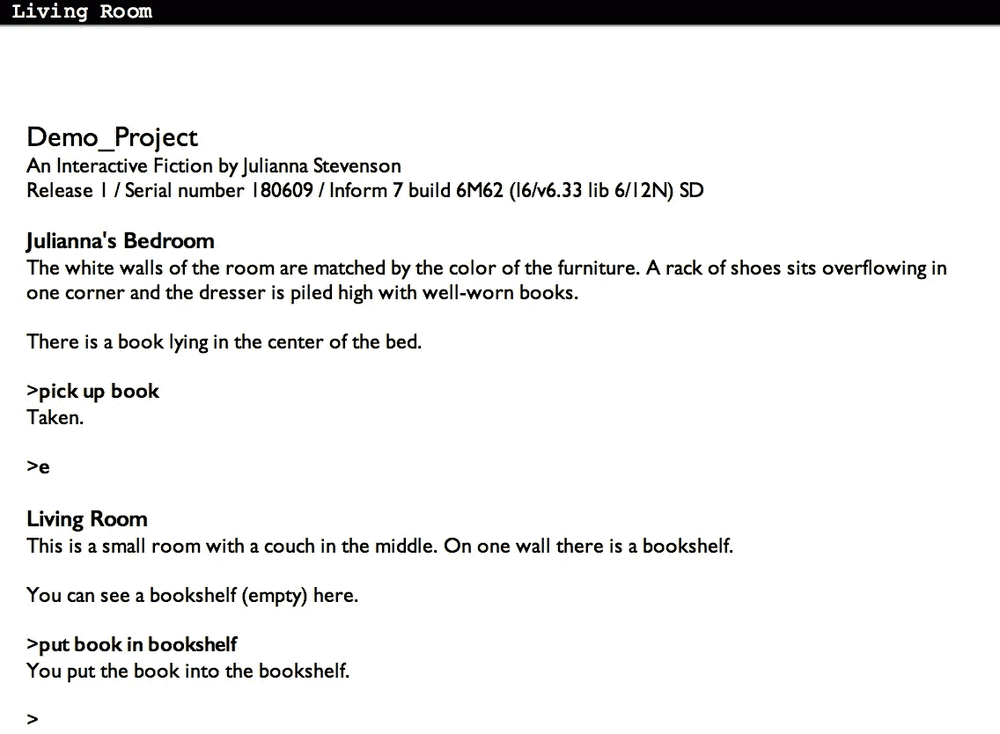
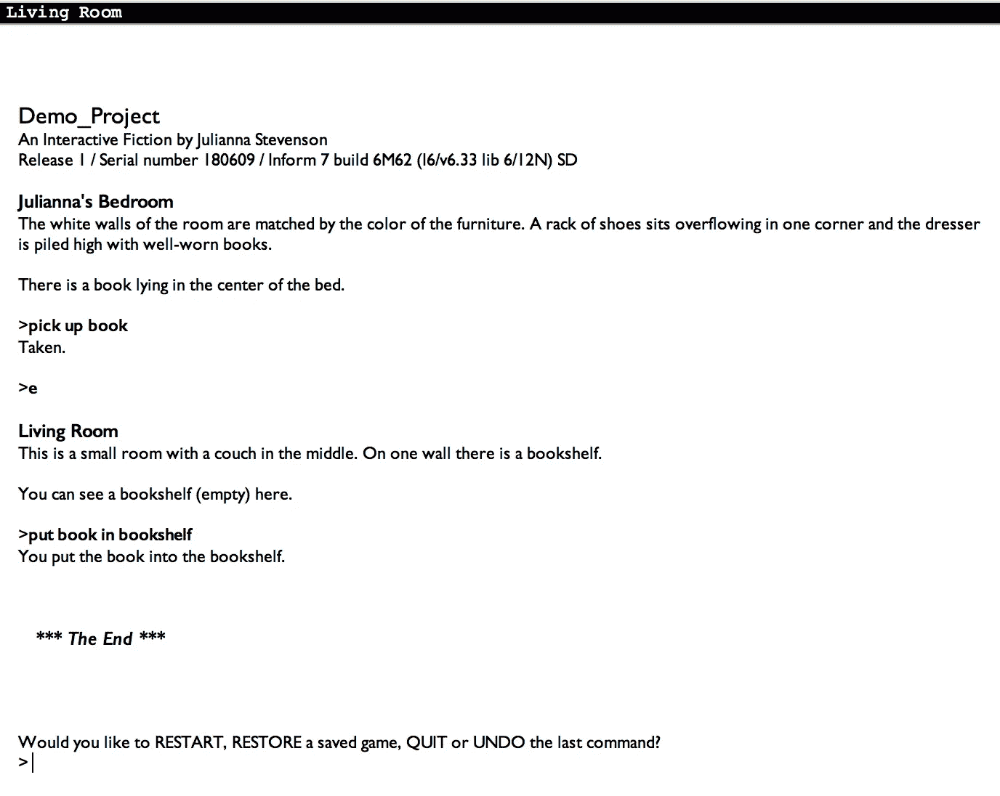

# 如何创建自己的文本冒险

> 原文：<https://medium.com/coinmonks/how-to-create-your-own-text-adventure-12df36411b7f?source=collection_archive---------0----------------------->

与大多数同龄人不同，我不是在玩电子游戏中长大的；我从小玩文字冒险，或者[互动小说](https://en.wikipedia.org/wiki/Interactive_fiction)长大。

在探索了[佐克](https://en.wikipedia.org/wiki/Zork)的地牢后，12 岁的我只想学习如何创建自己的游戏。九年后，我终于实现了这个目标！

文字冒险是一种有趣的、创造性的讲述互动故事的方式，而且比你想象的要简单！

# **第一步:**下载通知

Inform 是一种专门用于创建文本冒险的编程语言。

它让任何人都可以轻松地创建自己的程序，不管你是否知道如何编程。与其他编程语言不同，它主要是由现有的英语单词和语法组成的！

[将正确版本的软件下载到您的电脑上！](http://inform7.com/downloads/)

[](/coinmonks/crypto-exchange-dd2f9d6f3769) [## 最佳加密交易所| 2021 年十大加密货币交易所

### 哪一个是最好的加密交换？在本文中，我们将根据多种加密货币列出 10 大加密货币交易所

medium.com](/coinmonks/crypto-exchange-dd2f9d6f3769) 

# **第二步:**打开通知并创建一个新项目

当您打开 Inform 时，您会看到一个欢迎屏幕，如下所示。点击“新建”下的“项目”开始你的文字冒险。给它起个好名字！



Inform Welcome Menu

# **步骤 3:** 创建一个房间

在 Inform 中编写文本冒险的大部分依赖于三个想法:对象、描述和关系。

文本冒险中的每个房间、物品和人都被定义为代码中的一个对象。你通过提供对它们的描述，让它们通过行动形成关系，从而使这些物体变得栩栩如生。

Inform 会给你一些代码，包括你的第一个房间的定义。它使用这行代码将“示例位置”定义为一个房间:

```
Example Location is a room.
```

然而，“示例位置”是一个非常无聊的房间名称，所以我打算把它作为我的卧室。

```
Julianna's Bedroom is a room.
```

# **步骤 4** :运行你的代码

你可能已经猜到了，但是要运行你的代码，你需要做的就是按下左上角的大按钮 go！



Go button in Inform

按下 run 后，您的代码将编译并运行。它应该是这样的:


Running game

因为 Inform 是为创建文本冒险而设计的，它已经内置了很多经典的文本冒险命令！查看这个[站点](http://www.mrbillsadventureland.com/howto/intfiction/textplay.htm)，了解一些命令的想法。

当您键入命令并按 enter 键时，软件将根据您的代码生成响应。

你，玩家，是游戏中的一个对象。因为你是卧室里唯一的东西，你现在能成功做的就是和自己互动(试着“检查我”、“吻我”和“抚摸我”)😜).

# **第五步:**添加房间描述

一个人呆在空房间里并不好玩，所以下一步是创造你的环境。回到你的代码，给你的房间添加一个描述。这就是房间将如何向玩家描述。

例如，下面是我如何定义我房间的描述:

```
Julianna's Bedroom is a room. The description is "The white walls of the room are matched by the color of the furniture. A rack of shoes sits neatly in one corner and the dresser and bedside table are clear of dust.".
```

描述可以是简短的，也可以是冗长的。

如果你再次运行你的代码，你可以看到你的房间的描述！



# 步骤 6:添加一个对象

现在玩家可以看到房间里的东西，但他们仍然不能与任何东西互动！

因此，我们将添加一个玩家可以与之交互的对象。默认情况下，玩家可以拿起和放下你放入房间的任何物体。

因为这是我的卧室，我喜欢阅读，所以我打算在我的床中间放一本书。要创建一个对象，你只需要提到它叫什么，在哪个房间。您还可以添加关于将包含在文件室描述中的对象的简介。

所以，现在我的代码是

```
Julianna's Bedroom is a room. The description is "The white walls of the room are matched by the color of the furniture. A rack of shoes sits neatly in one corner and the dresser and bedside table are clear of dust.".A book is in Julianna's Bedroom. "There is a book lying in the center of the bed."
```

除了使用特定房间的名称，您还可以只使用“这里”来指代最近定义的房间。

请尝试再次运行您的代码。现在，你可以拿起和放下你的物体！

# 第 7 步:添加另一个房间

一些文字冒险将在一个房间里进行，但大多数都有多个房间供玩家穿行和探索！您可以像创建第一个房间一样创建另一个房间—定义它并添加描述。

由于我的第一个房间是卧室，所以我打算增加一个客厅。为了让玩家从一个房间移动到另一个房间，你必须使用基本方向来定义这两个房间的位置。

```
The Living Room is a room. The description is "This is a small room with a couch in the middle. On one wall there is a bookshelf.".The Living Room is east of Julianna's Bedroom.
```

如果我在卧室里运行我的代码并使用命令" east ",我将进入客厅，如果我在客厅里使用" west ",我将返回卧室。

自己试试吧！

# 第八步:制作容器

因为我有一本书和一个书架，所以我希望能够把我的书放在书架上。我们可以通过创建一个作为容器的书架对象来实现这一点。

容器是一种特殊类型的对象，您可以将其他对象放入其中。

我们可以用“是容器”这个短语把一个对象变成一个容器

```
A bookshelf is a container in the Living Room.
```

这行代码在客厅中创建了一个书架对象，并允许将东西放入其中。

当你在卧室时，运行代码并输入“拿起书”来尝试一下。然后，移动到客厅，使用“将书放入书架”命令将书放在书架上。



# 第九步:结束状态

没有结局的游戏是不完整的。

为了创建一个结尾，我们将使用一个条件语句来检查书是否在书架上。如果是的话，我们就结束游戏。

我们希望每次都检查这种情况。这可以通过下面一行代码来完成:

```
Every turn: if the book is in the bookshelf, end the story.
```

一旦有了结束条件，就可以跑着玩完整局了！默认情况下，游戏结束后，玩家可以选择重启、恢复已保存的游戏、退出或撤销。



# 第十步:继续添加！

这仅仅是您使用 Inform 所能完成的事情的开始！你可以用上面步骤中的想法创建一个完整的文本冒险，或者你可以更深入地研究你能用 Inform 做什么！

查看 [Inform 的书](http://inform7.com/learn/man/WI_1_1.html)以获得灵感和更多的例子，或者查看[互动小说数据库](http://ifdb.tads.org/)以获得大量你可以玩的文本冒险！

冒险快乐！👏

完整代码:

```
"Demo_Project" by Julianna StevensonJulianna's Bedroom is a room. The description is "The white walls of the room are matched by the color of the furniture. A rack of shoes sits neatly in one corner and the dresser and bedside table are clear of dust.".A book is in Julianna's Bedroom. "There is a book lying in the center of the bed."The Living Room is a room. The description is "This is a small room with a couch in the middle. On one wall there is a bookshelf.".The Living Room is east of Julianna's Bedroom.A bookshelf is a container in the Living Room.Every turn: if the book is in the bookshelf, end the story.
```

> 加入 Coinmonks [电报频道](https://t.me/coincodecap)和 [Youtube 频道](https://www.youtube.com/c/coinmonks/videos)获取每日[加密新闻](http://coincodecap.com/)

## 另外，阅读

*   [密码电报信号](http://Top 4 Telegram Channels for Crypto Traders) | [密码交易机器人](/coinmonks/crypto-trading-bot-c2ffce8acb2a)
*   [复制交易](/coinmonks/top-10-crypto-copy-trading-platforms-for-beginners-d0c37c7d698c) | [加密税务软件](/coinmonks/crypto-tax-software-ed4b4810e338)
*   [网格交易](https://coincodecap.com/grid-trading) | [加密硬件钱包](/coinmonks/the-best-cryptocurrency-hardware-wallets-of-2020-e28b1c124069)
*   [加密交换](/coinmonks/crypto-exchange-dd2f9d6f3769) | [印度的加密应用](/coinmonks/buy-bitcoin-in-india-feb50ddfef94)
*   开发人员的最佳加密 API
*   最佳[加密贷款平台](/coinmonks/top-5-crypto-lending-platforms-in-2020-that-you-need-to-know-a1b675cec3fa)
*   [杠杆代币](/coinmonks/leveraged-token-3f5257808b22)终极指南
*   [ko only Review](https://coincodecap.com/koinly-review)|[Binaryx Review](https://coincodecap.com/binaryx-review)|[Hodlnaut vs CakeDefi](https://coincodecap.com/hodlnaut-vs-cakedefi-vs-celsius)
*   [40 个最佳电报频道](https://coincodecap.com/best-telegram-channels) | [1xBit 回顾](https://coincodecap.com/1xbit-review) | [Keevo 钱包回顾](https://coincodecap.com/keevo-wallet-review)
*   [如何在印度购买以太坊？](https://coincodecap.com/buy-ethereum-in-india) | [如何在币安购买比特币](https://coincodecap.com/buy-bitcoin-binance)
*   [在美国如何使用 BitMEX？](https://coincodecap.com/use-bitmex-in-usa) | [BitMEX 回顾](https://coincodecap.com/bitmex-review) | [买入索拉纳](https://coincodecap.com/buy-solana)