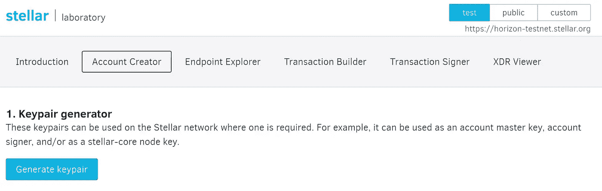
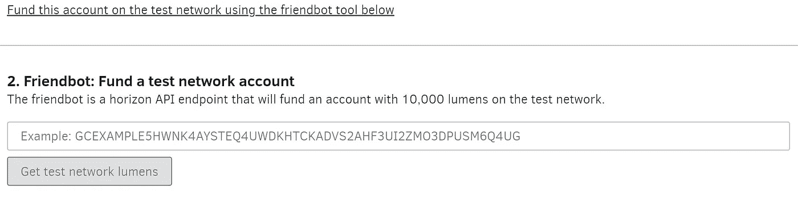
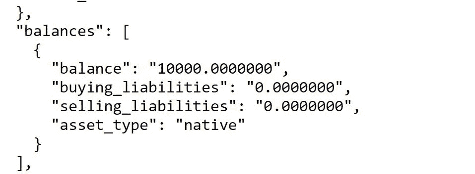
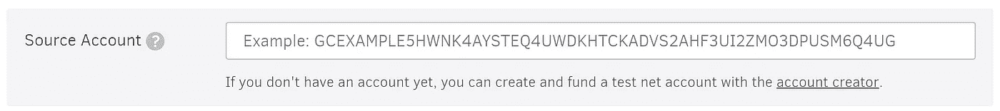
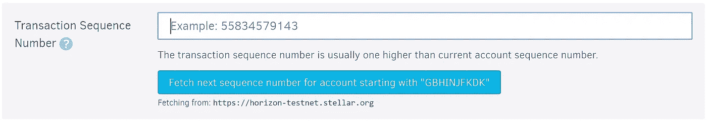
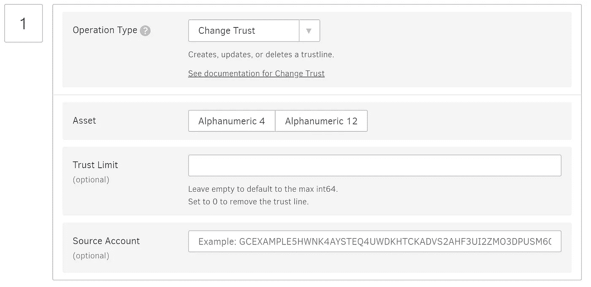
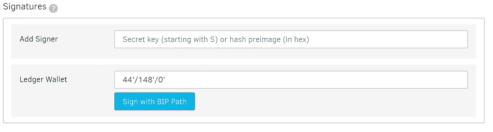
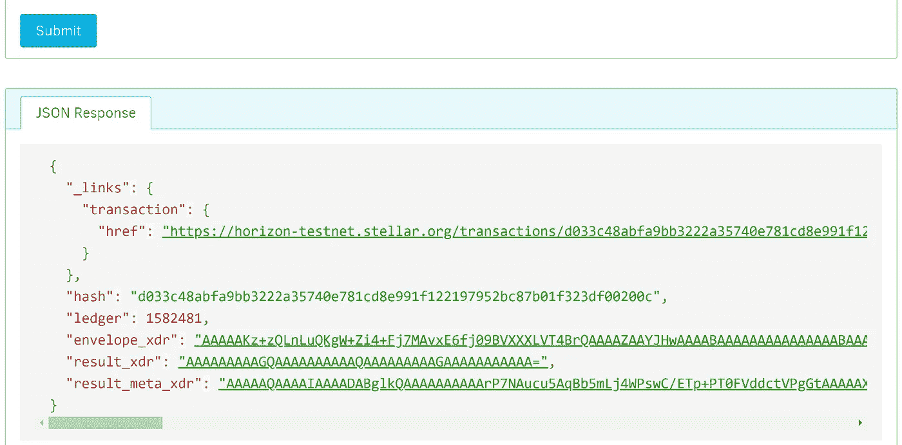
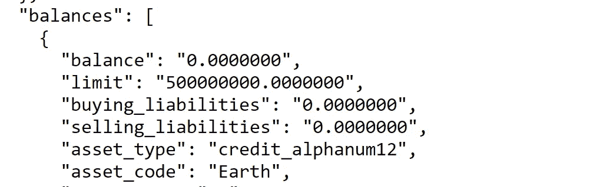

# 如何通过 5 个简单的步骤在 Stellar 上创建自己的令牌

> 原文：<https://medium.com/coinmonks/how-to-create-your-own-token-on-stellar-in-5-easy-steps-6d0956e3fede?source=collection_archive---------1----------------------->

Photo by [Tyler van der Hoeven](https://unsplash.com/@tyvdh?utm_source=medium&utm_medium=referral) on [Unsplash](https://unsplash.com?utm_source=medium&utm_medium=referral)

我想我会尝试拓宽我的视野，创造一个新的标志。我以前在以太坊上这样做过，并且想挑战自己去了解更多关于其他区块链协议的信息，所以我决定选择 Stellar。

在我开始这个项目之前，我对 Stellar 知之甚少，考虑到它在市值上排名前十，我认为我应该对自己进行更深入的挖掘。

今天我们要创造一种新的代币来拯救世界，叫做地球代币。我们可以在许多方面使用这种新代币，例如，快速发送代币，无需第三方帮助救灾，以及奖励做好事的人，如步行上班，而不是开车或帮助当地慈善机构。

# **什么是恒星？**

Stellar 于 2014 年由 Stellar Foundation 和 Jed Mcaleb 创立，他们也是 Ripple 的创始人。然而，Stellar 不再是一个简单的 Ripple 分支，从那时起，他们完全重新设计了他们的代码库，使用 Stellar Consensus 协议。Stellar 背后的一个主要概念是以低费用促进非常快速的支付，因此 Stellar 的确认时间在 2-5 秒之间，每秒钟可以支持数千笔交易。这对于我们正在创建的新令牌来说是完美的，因为它允许我们快速而廉价地向我们的用户进行微支付。这只是对 Stellar 的一个非常简要的介绍，关于 Stellar 的技术细节有大量的资源，他们的网站是从 stellar.org[开始的一个很好的地方](https://www.stellar.org)

事实证明，一旦你知道相关的步骤，在 Stellar 上设置你自己的令牌是非常简单的，不需要像在其他平台上那样有编程经验，所以跟着做，在 Stellar 上创建你自己的令牌。

# 创建令牌

**第一步:创建一个发卡账户。**

在 Stellar 上创建新令牌的第一步是创建一个发行帐户。发行帐户用于向分发帐户(我们将在下一步创建)发行令牌供应。我们这样做是为了在生成令牌后锁定发行帐户，并向用户证明我们将来不会增加令牌供应。

前往 [Steller Laboratory](https://www.stellar.org/laboratory/#account-creator?network=test) 并确保选择了“测试”,然后点击“生成密钥对”,并在安全的地方保存公钥和私钥的记录。

Create an issuing account.

**第二步:为发行账户提供资金**

接下来，点击“使用下面的 friendbot 工具在测试网络上为该帐户提供资金”。这将把您的公钥复制到文本框中，然后点击“获取测试网络流明”

一旦完成，你会看到一个绿色的酒吧，确认成功资助你的新帐户与测试流明。

**步骤 3:创建分销账户并为其提供资金**

按照上面的第 1 步和第 2 步创建并资助另一个帐户，并记下公钥和私钥。

一旦你这样做了，你就可以检查以确保两个账户都有余额，方法是将每个公钥单独附加到这个 URL 的末尾:【https://horizon-testnet.stellar.org/accounts/】T2 你的公钥

Stellar testnet balance returned as a JSON object

这个页面将返回一个 JSON 对象，往下走一部分，您会注意到有 10，000 个 testnet 流明的余额

**第四步:在发行和分销账户之间建立信用额度**

接下来，我们需要创建一个信任线，表明分发帐户信任发行帐户。为此，转到[交易生成器页面](https://www.stellar.org/laboratory/#txbuilder?network=test)，在源账户字段中输入分配账户的公钥。

接下来，单击按钮“获取帐户的下一个序列号，开始于..”

我们可以留下接下来的三个字段；基本费用、备忘录和时间界限，向下移动到操作类型，并将其设置为“更改信任”

然后根据您想要使用的字符数将“资产”设置为字母数字 4 或 12，并输入您选择的资产代码。使用我们的令牌，我们将拯救世界，因此我们将创建“地球”令牌，因此选择字母数字 12 并在资产代码字段中输入地球

将“发卡行帐户 ID”字段设置为您的发卡行帐户公钥。

在“信任字段”字段中，输入您要生成的令牌数量，我们正在创建 500，000，000 个令牌，因为有大量工作要做，如果我们要修复此事，需要大量令牌。

要完成交易，请单击页面底部的“登录交易签名人”按钮。在下一页，滚动到底部的签名部分。对于这个例子，我们将在“添加签名者”字段**中添加我们的**分发帐户密钥**。**实际上，如果我们真的这样做，我们会使用分类账来签署该交易，但这只是为了好玩，我们将如上所述粘贴密钥。

粘贴密钥后，滚动到底部并单击“提交到交易端点”。

然后，您将被定向到端点浏览器页面，滚动到该页面的底部，并单击“提交”按钮。一旦成功，您将在提交按钮下收到一个 JSON 响应。

Tokens Successfully Issued

**第五步:锁定发卡账户**

我们的最后一步是锁定发行帐户，这样就不会为我们的新令牌生成更多的令牌。

再次转到交易构建器页面，在“source account”字段中输入发行账户的公钥，并获取下一个序列号，就像我们之前所做的那样。

接下来向下滚动，将“操作类型”设置为“设置选项”，将“主权重”设置为 0，然后单击页面底部的“在签名者中签署交易”。

然后在“添加签名人”字段中添加您的**发行账户密钥**,并点击“提交至发布交易端点”,然后点击“提交”以完成交易。

就这样，你做到了！您在惊人的 Stellar 网络上创建了您的第一个令牌，现在请将您的分发帐户添加到以下 url，在 testnet 上查看您的新令牌:

[https://horizon-testnet . stellar . org/accounts/YOURDISTRIBUTIONPUBLICKEY](https://horizon-testnet.stellar.org/accounts/YOURDISTRIBUTIONPUBLICKEY)

你可以从上面的限制中看到，我们现在有 5 亿个地球代币来拯救地球。

感谢你阅读这篇文章，如果你有任何问题，请在下面留言。

> 加入 Coinmonks [电报频道](https://t.me/coincodecap)和 [Youtube 频道](https://www.youtube.com/c/coinmonks/videos)获取每日[加密新闻](http://coincodecap.com/)

## 另外，阅读

*   [复制交易](/coinmonks/top-10-crypto-copy-trading-platforms-for-beginners-d0c37c7d698c) | [加密税务软件](/coinmonks/crypto-tax-software-ed4b4810e338)
*   [网格交易](https://coincodecap.com/grid-trading) | [加密硬件钱包](/coinmonks/the-best-cryptocurrency-hardware-wallets-of-2020-e28b1c124069)
*   [密码电报信号](/coinmonks/top-3-telegram-channels-for-crypto-traders-in-2021-8385f4411ff4) | [密码交易机器人](/coinmonks/crypto-trading-bot-c2ffce8acb2a)
*   [最佳加密交易所](/coinmonks/crypto-exchange-dd2f9d6f3769) | [印度最佳加密交易所](/coinmonks/bitcoin-exchange-in-india-7f1fe79715c9)
*   开发人员的最佳加密 API
*   最佳[密码借贷平台](/coinmonks/top-5-crypto-lending-platforms-in-2020-that-you-need-to-know-a1b675cec3fa)
*   [免费加密信号](/coinmonks/free-crypto-signals-48b25e61a8da) | [加密交易机器人](/coinmonks/crypto-trading-bot-c2ffce8acb2a)
*   杠杆代币的终极指南