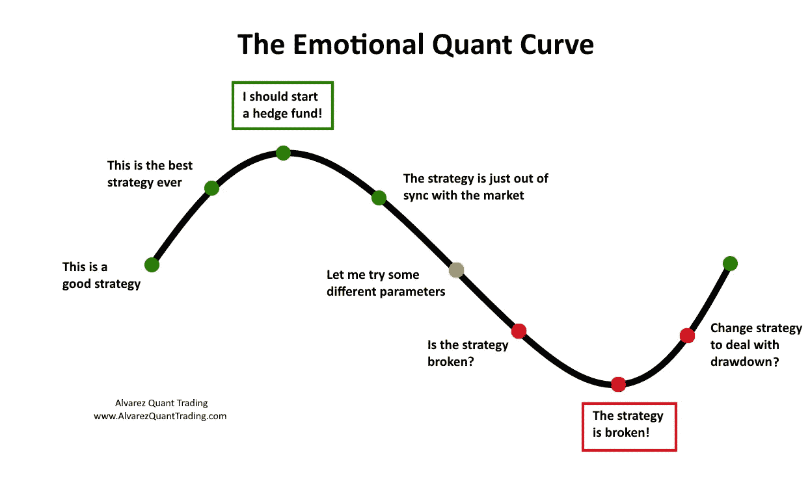
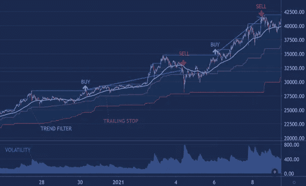

# 如何创建自己的交易机器人？

> 原文：<https://medium.com/coinmonks/how-to-create-your-own-trading-bot-4e625f60be41?source=collection_archive---------5----------------------->

## 第一部分。关于算法交易

算法交易(Algotrading，自动交易)是一种精确形式化的交易开始和结束机制。交易是在机器人的帮助下执行的，机器人是一种程序，它根据预先编写的算法自动执行所有的交易操作。

Algotrading 允许自动执行交易者的日常操作，减少分析和交易的时间，还可以避免在市场交易时过度情绪化。使用自动交易机器人是过去几十年的趋势，它在许多方面改变了市场。任何自动化系统都可以在速度、生产率、耐力和准确性方面轻松超越人类。

> 例如，一名交易员不想错过股票趋势的开始，他编写了一个机器人程序，该程序将自动购买价格超过当月高点的股票。这样他就不必每天跟着报价走，即使他不在电脑旁，也不怕错过有利可图的交易。

# **算法交易的主要类型**

## 更多专业人士(对冲基金和投资银行):

1. **HFT** (高频交易)——高速交易，有些交易在几秒钟内执行。大型算法基金将服务器放在交易所旁边，以减少交易时的响应时间。HFT 机器人是市场上的流动性提供者，大约 50%的交易都是通过它们完成的。普通交易者不可能在速度上与专业的 HFT 机器人竞争。迈克尔·刘易斯在他的书《闪光男孩:华尔街的反抗》中对高频交易做了很好的描述。

2.**量化交易**(量化投资)是一种交易类型，数学家、程序员和经济学家根据随机分析、概率论和计量经济学建立市场交易策略。最大的基金 Bridgewater Associates 由著名金融家雷伊·达里奥创立，借助量化投资管理资产。欧内斯特·陈(Ernest Chan)的著作《量化交易》是这方面最好的作品之一。

## 更多针对普通交易者和投资者的信息:

**3。** **基于技术指标和模式**的交易机器人 **。这些策略是基于在市场中发现模式和市场无效性。它们更多地基于技术指标、交易量和模式。这是交易者中最受欢迎的算法机器人。**

我们将最详细地考虑交易机器人。

# **算法策略开发**

用于金融市场算法交易的机器人是特殊的计算机程序。他们的发展始于他们将要执行的所有任务的详细计划，从主要任务——战略开始。

策略可以分为两种类型:

**趋势跟踪策略** —这种类型的策略捕捉大趋势。最常见的是，这种策略的盈利交易比例很小，但每笔交易的平均利润很高。一年几笔交易就能赚到几乎全部的利润，错过这样的动向对最后的结果伤害极大。这些策略在强劲的市场波动时很有效，在多向波动时就不好了。

**持平策略**——这里的工作逻辑是从价格回归平均值中获利。当资产超买时卖出，当严重低估时买入。这种策略也被称为逆势策略。

制定一个工作策略是最复杂的部分，因为你必须提出一个算法，这个算法将是有利可图的，并且在运行中是稳定的。一切都是从一个想法开始的，这个想法可以在交易和技术分析的书籍中找到，可以在专门的论坛上找到，也可以从自己的交易经历中找到。

## 想法可能大不相同，但所有的想法都必须回答以下问题:

*   ***机器人什么时候进入位置？*** 可以是均线的交叉，可以是最大值或最小值水平的突破，也可以是上升/下降蜡烛线序列等。这完全取决于你的喜好。
*   ***bot 什么时候退出一个位置？*** 按目标价，按跟踪止损，按反转信号？
*   ***佣金如何影响结果？你多久能做一次交易？*** 佣金和滑点会把策略的有效性降低到零。

An example of the AlgonautBot trading strategy

由于市场是多变的，开发人员不断忙于寻找重复的模式，并计算它们在未来发生的概率。因此，从技术角度来看，algotrading 归结为识别开仓和平仓交易的算法，以及选择交易机器人来执行这些算法。

**在创建了进入和退出交易的算法后，有必要了解它的工作情况。为了做到这一点，大多数开发人员根据历史测试算法(回溯测试)。**

下一次我们将讨论回测算法和优化它的参数。

 [## 最佳免费加密交易机器人——前 16 名比特币交易机器人[2021]

### 2021 年币安、比特币基地、库币和其他密码交易所的最佳密码交易机器人。四进制，位间隙…

medium.com](/coinmonks/crypto-trading-bot-c2ffce8acb2a)