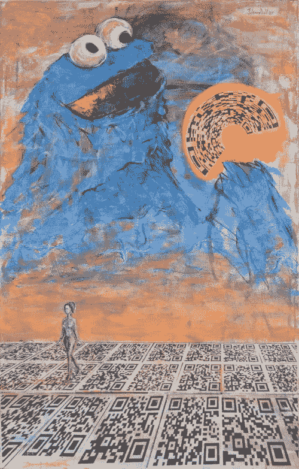
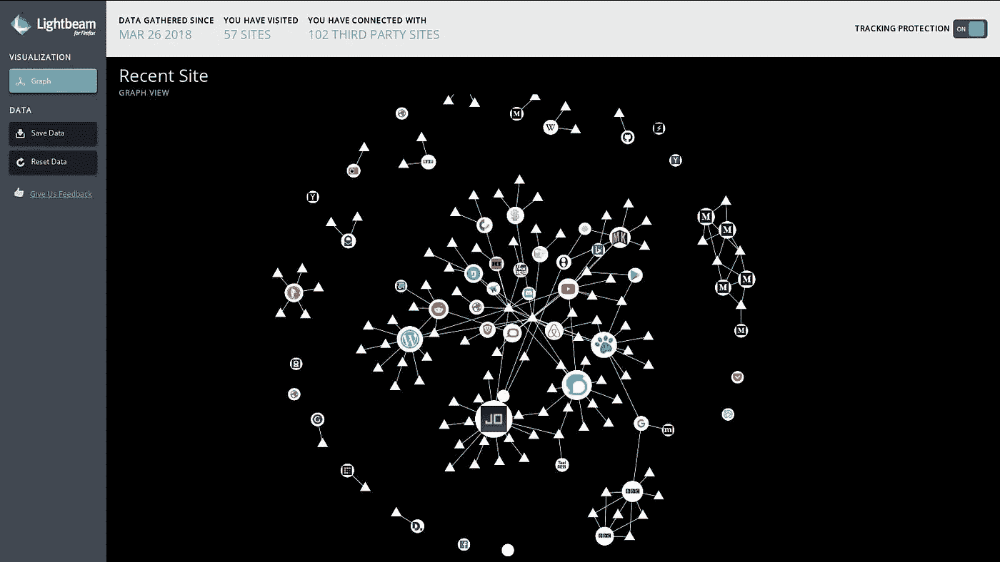

# 如何弄碎饼干，或互联网隐私的第一步

> 原文：<https://medium.com/coinmonks/how-to-crumble-a-cookie-or-the-first-steps-to-internet-privacy-2da6b783b483?source=collection_archive---------2----------------------->

> *“给我看看你的饼干，我就能知道你是谁”*
> ——文森特·图比亚纳和文森特·弗多

在我之前的文章[寻求隐私，](/@cypherpunk/on-the-quest-for-privacy-f7d778234fa7)中，我谈到了改变我的习惯来保护自己免受监视。您可以使用一些工具，例如开源软件以及浏览器扩展和插件，以防止跟踪 cookies 和任何其他未经授权的监视。

“Show Me Your Cookies” painting by JohnnyDollar

收回个人数据主权的第一步，是认识到你被跟踪了多少，被谁跟踪了多少。

让我们从基本的 http cookie 开始。Cookies 是从网站发送的小块数据，在用户浏览时由用户的网络浏览器存储在用户的计算机上。有各种类型的 cookies 可用于购物车、身份验证、让你在一页一页地浏览时保持登录，以及许多其他使互联网更有用的功能。

cookie 服务于许多合法的目的，并允许许多网站更好的功能，但有许多跟踪 cookie 来自各种各样的第三方网站，你从来没有访问过，有些给用户的机器增加了严重的漏洞，更不用说用户的隐私了。

甚至来自被访问可信站点的合法 cookie 也可能设置临时会话 cookie，这些 cookie 会持续跟踪大量时间，有时长达 20 年或 50 年。显然，并不像名字那样短暂。

[**Lightbeam**](https://addons.mozilla.org/en-US/firefox/addon/lightbeam/) ，一个漂亮的扩展，可以从你访问过的网站建立 cookies 的可视化日志，让第三方追踪者大吃一惊。由 Mozilla 开发者 Atul Varma 构建，由 Emily Carr 艺术与设计大学的学生设计

visualization of cookies from sites tracking me after about 2 hours of browsing

几年前我第一次看到这个，作为一个视觉人，这真的帮助我掌握了 cookies 以及有多少网站在跟踪我。

— — — — — — — — — — — — — — -

这里列出了 5 个桌面工具，如果你想更好地控制你的隐私，你可以考虑由谁来获取你的轨迹以及获取多长时间。

[**1: Mozilla Firefox 浏览器:**](https://www.mozilla.org/en-US/) 开源并针对安全漏洞和 bug 不断更新。

**2:** [**Cookie 自动删除:**](https://addons.mozilla.org/en-US/firefox/addon/cookie-autodelete/) 关闭标签页后自动删除 Cookie 的 Firefox 附加组件。允许将您信任的网站列入白名单。*这是我最喜欢的工具之一。*

**3:** [**隐私獾:**](https://www.eff.org/privacybadger) Firefox 和 Chrome 浏览器插件试图找出谁在监视你，并阻止这些广告和隐形追踪器

**4:** [**断开**](https://disconnect.me/disconnect) **:** 拦截器，帮助您可视化谁在跟踪您

**5:**[**uBlock origin**](https://github.com/gorhill/uBlock):针对火狐和 Chrome 的高效拦截器，“快而精”

— — — — — — — — — — — — — —

对于移动设备，我推荐 [**Firefox Focus**](https://www.mozilla.org/en-US/firefox/mobile/) ，一款面向隐私的移动浏览器

荣誉奖授予由 javascript 发明者 Brendan Eich 创建的 [**Brave 浏览器、**](https://www.brave.com/) 开源软件，该软件阻止第三方 cookies 和追踪器，还包括一个使用加密货币的小额支付系统。它仍然是新的，正在获得更多的扩展和附加功能，这些功能很快就会上线，所以我希望 Brave Software 能做得非常好。

***免责声明*** *:*

*   虽然我不使用 Chrome 进行大多数浏览，但它可能对它的应用程序有用，特别是在加密货币方面。(即。元掩码、Myetherwallet.com、硬件钱包接口等……)
*   使用上面提到的一些工具可能会带来一些不便，比如不得不重新登录你之前访问过的网站，因为 cookies 存储了你的登录信息。

— — — — -

谦卑地你的

约翰尼$

联系我 Johnny dollar @ protonmail.com

— — — — — — — — — — — — — — — — — — — — — — — — — -

*此处的信息经过简化，如果您想了解更多技术信息，请参考下面的链接开始使用*

**参考文献**:

给我看你的饼干，我会告诉你你是谁。Vincent Toubiana 和 Vincent Verdot 的论文

[维基百科上的 cookie](https://en.wikipedia.org/wiki/HTTP_cookie)

> [在您的收件箱中直接获得最佳软件交易](https://coincodecap.com/?utm_source=coinmonks)

