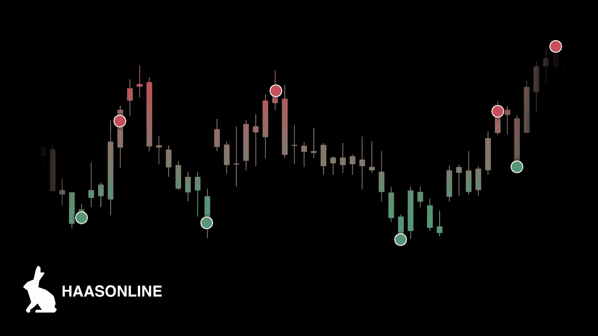

# 如何进行加密货币日交易:新手的最佳策略

> 原文：<https://medium.com/coinmonks/how-to-day-trade-cryptocurrency-the-best-strategies-for-beginners-1c864fc64b11?source=collection_archive---------1----------------------->

How to day trade cryptocurrency while using automated trade software like HaasOnline

# 你如何开始日交易加密？

这是加密货币行业令人兴奋的增长时期，因为比特币、以太坊和其他加密货币日益被证明不仅仅是一种短暂的时尚，像 [JP 摩根](https://www.jpmorgan.com/global/news/digital-coin-payments)这样的主要金融机构也认识到了区块链技术的重要性。然而，加密领域最活跃的活动仍然是在地面上，在比特币首次出现以来的几年里，早期采用者和精明的投资者已经赚了很多钱。自然，一些有兴趣参与其中的人想知道:你能交易比特币和其他加密货币吗？嗯，答案是肯定的，而且比以往任何时候都容易，尽管需要一些基础知识和不断的研究。

众所周知，加密货币在过去几年经历了波动的价格波动，仅比特币一项就从 2017 年 9 月 12 日的 2900 美元飙升至 2017 年 12 月 17 日的 19783 美元，然后在此后的大部分时间里逐渐跌至个位数的几千美元。这种价格波动使得日间交易加密货币成为一项潜在的有利可图的工作。然而，上涨也伴随着风险，所以在开始之前，至少了解平台和日交易策略的基本知识是很重要的。

> 也请阅读我们的[哈森在线评论](/coinmonks/haasonline-review-d8d1a3400419)

# 什么是日内交易？

顾名思义，日内交易包括全天买卖金融资产，以寻求获利机会。这可能涉及在一天内多次交易相同的证券，并需要一系列不同于更传统的长期买入并持有投资的策略。

随着互联网经纪人的出现，日间交易变得越来越重要，并在很大程度上成为大多数人的可能，否则只有那些为大型金融机构工作的人才能执行交易。作为高流动性的数字资产，加密货币特别适合日间交易。

只要你知道如何开始，开始日内交易加密货币也很简单。为此，我们希望本指南能够让完全的初学者掌握加密货币领域常用的平台和策略知识。

> 另请阅读:[最佳加密交易机器人](/coinmonks/whats-the-best-crypto-trading-bot-in-2020-top-8-bitcoin-trading-bot-c16adeb13317)

# 技术分析与基本面分析

在概述一些主要的日内交易者之前，先讨论一下技术分析和基本面分析的区别是有帮助的。

技术分析指根据分析过往市场数据所产生之价格预测买卖资产。在基于不同信号的技术分析的旗帜下，有各种各样的策略被追求，这些不同的信号被用于指导交易者购买或出售给定的资产，其中的一些将在本指南中详细描述。

与此同时，基础分析涉及密切审查财务报表，以构建价格比率并确定适当的企业估值。运用基本面分析的交易员通常会综合考虑已付股息、现金流、利润和当前股价。

日内交易者自然更倾向于技术分析，因为技术分析更倾向于形成用于预测当日价格波动并采取行动的叙事。因此，本指南中的大部分讨论基本上都属于技术分析这一大类。然而，对于日内交易者来说，在适当的时候同时使用技术和基础分析是很常见的。例如，基于某一特定加密货币背后团队的投资就属于基本面分析。另一方面，基于过去的价格走势选择加密货币进行日常交易是技术分析的一个例子。

先简单回顾一下技术和基本面分析，我们再来看看当今加密货币市场上最常见的日内交易者。

# 日内交易者类型

虽然每一天交易者都是独一无二，但加密货币的当日交易基本上可以分为两类:技术型交易者和投机者。

## 技术交易员

虽然可以交易公开上市加密货币公司的股票，但基本面分析不适用于当日交易单个加密货币。相反，基于技术指标的日间交易在加密货币市场随处可见。技术交易员利用上述技术分析，快速进入和退出选定的加密货币头寸。

可遵循的技术指标范围实际上是无限的，只受可获得的数据和交易员想象力的限制。交易员几乎整天都在进行某种技术分析，因为买入或卖出某项资产的动机需要某种信号来帮助决定是买入还是卖出。

## 投机者

与他们在大众媒体上的负面名声相反，日内交易者主要从事可以被认为是投机的交易，他们在市场中发挥着重要的作用。投机者对可能预示着特定加密货币在市场上是更受欢迎还是不受欢迎的消息保持警惕，试图走在人群的前面，利用预期的价格波动。在预测正确的情况下，投机者会因为将硬币的价格移近其正确的市场价值而获得利润。另一方面，一个不正确的预测会导致亏损，给其他交易者提供了一个有价值的信号。

投机者与技术交易者的区别在于，至少从纯粹投机者的角度来看，他们只关注意料之外的消息会如何立即影响加密货币的价格。对于纯粹的投机者来说，只有当前基线的下一个价格变动才是重要的，而不是历史数据或复杂的图表模式。当然，许多技术交易者也可以从事投机，反之亦然，但投机通常被视为不同于技术或基本面分析的游戏。

# 如何进行加密货币的日交易

有了这些初步的定义之后，现在让我们进入一个初学者在寻找日间交易加密货币时应该考虑的问题。

## 1.选择加密货币和交易所

现有的加密货币远远超过 1000 种，因此缩小您想要交易的加密货币的范围非常重要。 [CoinMarketCap](https://coinmarketcap.com/) 是一个很好的资源，可以找到关于最高价格、市值、24 小时交易量和每日价格变化的加密货币的最新信息。

接下来，初露头角的加密日交易者将需要确定哪家交易所最适合交易他们选择的加密货币。加密货币交易所在加密货币产品和费用结构方面各不相同，因此在这个过程的早期花时间仔细研究是值得的。还应该注意的是，没有必要局限于一个交易所，因为人们可以使用自动化交易机器人，如建立我们的[加密套利机器人](https://www.haasonline.com/trade-bots/internal-arbitrage-bot/)来跨多个交易所交易加密货币。

## 2.计划和执行交易策略

这一步是最成功的日内交易者与众不同的地方。日内交易加密的策略太多了，无法一一列举，但在本文后面，我们提供了一些最佳策略的概述，供新手在刚开始时尝试。然而，找到一个能带来持续利润的好策略需要大量专门的研究时间。但是，嘿，如果太简单了，每个人都会这么做，对吗？

由于日内交易涉及在短时间内连续买卖相同的资产，因此[加密套利](https://www.haasonline.com/crypto-arbitrage-strategy/)自然对加密货币日内交易者有吸引力。套利通常包括识别市场中的价格差异，并快速连续地买入和卖出，以利用这些差异。然而，套利交易受到可用机会的限制，并且每次交易的利润非常小，这使得它只是许多潜在的日间交易策略之一。

## 3.…利润(？)

尽管日内交易可能有许多复杂的技术和策略，低买高卖，中饱私囊(或再投资)，区别在于游戏的名称。最好的策略会带来利润，但没有一种策略能避免亏损的可能性。每个日内交易者选择如何处理他们的收益取决于他们，是再投资于更多的交易机会，还是从市场中取出一些钱用于有形物品的消费。

随着对加密日交易的广泛了解，现在让我们来看看加密日交易者使用的一些具体策略。

# 最佳加密日交易策略

## 寻找倒票机会

刷单指的是频繁买卖资产，从微小的价格变化中获利。虽然任何特定的交易只会产生很少的利润，但理想情况下，一天中所有交易的总和将是巨大的。过去几十年来，超级计算机的出现，已使高频交易成为传统证券市场规模扩大的一个常见例子。

在处理加密货币交易时，黄牛试图通过在某个价格买入并尽快在某个更高的价格卖出来获利，即使只是勉强如此。因为刷单依赖于一天中获得许多小利润，所以避免大的损失是非常重要的，因为一次损失可以轻易地抹去几个小时甚至几天的利润。从事黄牛交易的一种安全方式是使用像我们的[黄牛机器人](https://www.haasonline.com/trade-bots/scalper-bot/)这样的自动化机器人，它可以被编程为在机会出现时快速交易少量的加密和账面利润。

## 追求模式交易

也称为转换交易或反转，模式交易利用技术指标产生买入或卖出信号。当然，这些信号并不保证购买或出售考虑中的加密货币是一个好主意，只是保证交易策略中指定的条件已经达到。

作为历史悠久的技术分析的一部分，价格模式有许多不同的形状和大小。在基本水平上，“上升趋势”表明价格在一段时间内一直在上涨，而“下降趋势”则表明相反的情况。当资产价格在两条平行趋势线之间来回波动时，就出现了“横盘”行情。其他模式以“三角形”、“三角旗”、“旗帜”、“楔形”等形状出现在价格图表中。这些年来，已经有太多不同的技术指标和价格模式被识别和发展出来，无法一一列举，所以那些感兴趣的人应该对不同的模式做一些研究，并找到一个来尝试。HaasOnline 交易平台的特点是与许多可用于加密货币日交易的[技术指标](https://www.haasonline.com/features/)进行了原生集成。

## 设置止损和限价销售订单

经常被认为是对日内交易者最重要的建议之一，使用止损单确保一旦资产价格达到一定水平就退出交易。这可以在价格大幅下跌的情况下防止灾难性的损失。例如，如果你在 BTC 买入 5000 美元，可以将止损设置在 4000 美元，这意味着如果 BTC 的价值低于 4000 美元，就会卖出。

限价卖单可以与止损相结合，但目的是在资产达到高于购买价格的某个价格时激活。然后，限价卖出指令开始生效，卖出资产并记录利润。与前面的例子相反，假设再次购买价值 4000 美元的 BTC，但在 5000 美元下了限价卖单。如果购买的 BTC 的价值达到 5000 美元，李米卖单将启动，并以 1000 美元的利润出售 BTC。

止损和限价卖单在各大交易所经常有，比如[比特币基地](https://blog.coinbase.com/introducing-stop-orders-on-coinbase-exchange-29755634d674)和[币安](https://www.binance.vision/tutorials/what-is-a-stop-limit-order)。此外，HaasOnline 交易平台的特点是[专有安全措施](https://www.haasonline.com/features/)，一旦发生预定义的市场波动，这些安全措施就会激活，其中止损和限价卖单可以轻松构建。

# 让交易机器人来做这项工作

在决定交易哪些加密货币和遵循哪些交易策略后，剩下要做的就是进入市场并将这些策略付诸实施。然而，手动观察市场信号和执行交易指令是很麻烦的，即使对于相对简单的日内交易策略来说，也可能证明太过笨拙。这就是自动交易机器人的用武之地。

[算法加密货币交易](https://www.haasonline.com/algorithmic-cryptocurrency-trading-how-it-works/)根据预先定义的程序，利用计算机执行交易。这样，这些“交易机器人”就可以按照交易策略运行，而不需要持续的人工干预。HaasOnline 交易平台的特点是有许多这样的[交易机器人](https://www.haasonline.com/trade-bots/)，所有这些机器人都允许加密货币日交易者将技术指标、安全性和保险叠加起来，以创建个性化的自动化交易策略。虽然自动化交易机器人的算法交易对任何有兴趣买卖加密货币的人都很有用，但它们对日间交易者尤其有用。

我们来看几个例子。首先，[趋势线机器人](https://www.haasonline.com/trade-bots/trendline/)允许交易员设定买卖线，当这些线被突破时，机器人将使用这些线执行交易。初学日交易者可能会从使用标准交易机器人中受益匪浅，该机器人提供了一个直观的界面，通过它可以使用各种指标和安全性来编制策略。最后，[做市商机器人](https://www.haasonline.com/trade-bots/market-making-bot/)可以为给定的加密货币创建两个限价单，偏离当前价格一定的百分比。

算法交易机器人是加密货币日交易者手中的强大工具。然而，重要的是要记住，机器人只会做它们被编程要做的事情。需要仔细的研究和编程来为机器人建立一个策略，以避免重大损失并利用出现的盈利机会。

# 日间交易的风险

虽然日内交易看起来是一种获得稳定收入的诱人方式，但它的风险是必须承认的。正如一个人可以从价格变动中获利一样，当价格以无法预料的方式变动时，他也可能遭受损失。虽然风险永远无法消除，但某些策略可以限制下跌的可能性。

通过保证金操作的加密货币日间交易者特别容易受到价格波动的影响，因为[保证金交易](https://www.haasonline.com/everything-you-need-to-know-about-margin-trading-cryptocurrency/)涉及从经纪人或交易所借入资金，以放大给定头寸的总量。虽然保证金交易可以创造相对于固定资本水平的超额收益，但如果市场朝着相反的方向发展，也会增加亏损的可能性。

# 日交易加密货币税

对于一个新手来说，知道如何为加密货币缴税似乎令人望而生畏，因为加密货币的税务处理通常不清楚，并且因司法管辖区而异。

在美国，比特币和其他加密货币被视为财产，就像股票和房地产一样。因此，加密货币像任何其他投资工具一样需要缴纳资本利得税。您需要支付的金额取决于您持有应税资产的时间，因为超过一年的长期投资与短期投资适用不同的资本利得税率。

长期资本利得税率通常低于适用于短期交易的税率，但确切的差异将取决于每个人的情况。因此，日内交易者通常比长期买入并持有的投资者面临更高的税率。

我们强烈建议加密货币日交易者保留详细记录，并在报税时咨询税务专业人士。这使得另一双可信的眼睛可以检查是否所有的东西都被正确地记录下来，并且在防止将来 IRS 出现任何重大问题方面走得很远。使用 HaasOnline 的[加密货币交易软件](https://www.haasonline.com/)的加密货币日交易者将能够找到每笔交易的收益和损失记录，这在纳税季期间可能证明是非常宝贵的。

# 加密货币日交易提示

以下是开始加密货币日交易时需要记住的一些提示。

*   限制损失，练习，练习，练习

日内交易没有确定的赌注，但是用正确的策略限制损失是可能的，比如前面提到的止损单。一旦你有了一个基本的策略，没有什么可以替代深思熟虑的修补和持续的练习。

*   关注基本面

通常最好先缩小加密货币、交易所和策略的选择范围。然后，有了合适的工作策略，逐步扩展比一开始就一头扎进去更容易。

*   保持对心理学的了解

听说过 FOMO 吗？害怕错过价格大反弹会导致恐慌，偏离可靠的交易策略。在动荡的市场环境中控制情绪是资深交易者的标志特征。

# 常见问题(FAQ)

**什么是当日交易的最佳加密货币？**

出于各种原因，加密货币可能特别适合日间交易。

首先，以市场规模和交易量为代表的流动性对日内交易者来说非常重要，因此比特币核心(BTC)和以太坊(ETH)等最受欢迎的加密货币自然是有吸引力的目标，此外还有 Ripple (XRP)、比特币现金(BCH)和莱特币(LTC)。
其次，对于计划在某一天内多次进出某种加密货币头寸的日内交易者来说，费用也很重要。如前所述，费用因交易所而异，在决定使用哪家交易所进行日交易加密货币之前，需要进行一些初步研究。

最后，加密货币日交易者应该了解加密货币的历史，以及推动硬币发展的一些因素。每种加密货币都有自己独特的起源故事，了解谁在幕后工作以及他们的动机可能有助于日间交易者确定哪些硬币可能在特定时间经历特定的价格波动。

**新手最好的策略是什么？**

虽然对于任何一种日内交易来说，都没有单一的最佳策略，但是对于新手来说，好的策略很容易构建和执行，只需要很少的现场决策。熟悉交易软件和磨练自己的交易本能需要时间，所以制定一个下跌可能性最小的自动化策略会更令人欣慰。

**日交易比特币、以太坊、altcoins 有什么区别吗？**

日交易比特币与以太坊或其他替代币的主要区别在于不同的市场结构。虽然比特币和以太坊等主要加密货币的日交易量很大，但由于价格波动巨大的可能性，小型替代币可能看起来很有吸引力，但实际上在市场疲软的情况下很难出售。日内交易替代硬币肯定是有利可图的，但流动性的相对缺乏和“抽送”计划的可能性在一个已经动荡的市场中增加了额外的风险。

# 什么是有效的简单策略？

交易策略往往在特定的市场环境下，特定的时间起作用。尽管如此，使用自动化交易机器人在加密货币交易所寻找套利机会可能是一种高风险低回报的策略。此外，通过 HaasOnline [黄牛机器人](https://www.haasonline.com/trade-bots/scalper-bot/)实施的自动化黄牛策略可以轻松进入加密货币日交易的世界。另外，有各种各样的基于技术指标的模式交易策略，对于新手来说，用标准的交易机器人来实现这些策略是很简单的。

# 最后的想法

在本指南中，我们试图提供初学者在进入加密货币日交易世界之前应该知道的基本而详细的概述。

那些寻找简化方式进行加密货币日间交易的人可能会发现哈森在线[加密货币交易平台](https://www.haasonline.com)很有吸引力。有许多[的关键特性](https://www.haasonline.com/features/)，例如自动交易机器人、与主要交易所的集成、对许多技术指标的本地支持以及专有的安全措施，这些都使得该领域的新手和老手的日间交易更加容易。根据你需要多少功能，HaasOnline 有三种不同的计划,即使是初级计划也可以在所有支持的交易所提供无限制的交易，通过平台进行的交易活动不收取任何费用。

我们希望这个指南是有用的，并希望我们可以帮助您实现您的目标，在日间交易加密货币。

*原载于 2020 年 1 月 24 日 https://www.haasonline.com**的* [*。*](https://www.haasonline.com/how-to-day-trade-cryptocurrency)

> [直接在您的收件箱中获得最佳软件交易](https://coincodecap.com/?utm_source=coinmonks)

