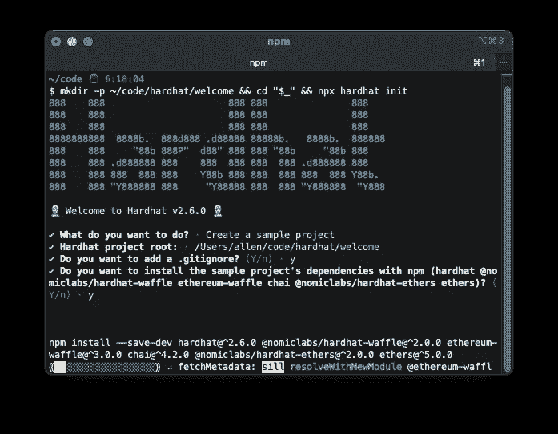

# 如何在 Webstorm + Hardhat 中调试 Solidity 契约

> 原文：<https://medium.com/coinmonks/how-to-debug-solidity-contracts-in-webstorm-hardhat-2ea0d3c4d582?source=collection_archive---------2----------------------->


Debug Solidity contracts in Webstorm and Hardhat

*这是我从* [*用 Truffle 调试可靠性合同中学到的知识的延续。*](https://allendefibank.medium.com/how-to-debug-solidity-contracts-with-webstorm-truffle-34cb7a10f98a) *如果您正在为本地开发环境使用 Truffle，您可能希望从那里开始。*

现在，Hardhat 是我进行局部可靠性开发的首选工具。虽然没有漂亮的 GUI，但是 CLI 足以支持严肃的 Solidity 开发。它只是工作。你可以开发和测试的速度真的是无与伦比的(从我所看到的)。最重要的是，有许多不同用例的开源插件。

好的，如果这是你第一次戴头盔，你需要准备一些东西。抓取最新安装的 NodeJS LTS 版本(我用 v.14.17.5 测试过)，然后打开一个终端。


Installing NodeJS with NVM

打开终端后，让我们调用第一个 Hardhat 任务来开始我们的简单项目。移动到一个新的干净目录，然后运行以下命令。

```
mkdir -p ~/code/hardhat/welcome && cd "$_" && npx hardhat init
```

运行之后，NPM 会用提供的参数下载、安装并运行 Hardhat。反过来，你应该会看到一个安全帽欢迎屏幕。



Hardhat welcome screen. All journeys start somewhere.

从这个欢迎屏幕，Hardhat 开始项目调查。用下面的答案回答(按 4 次回车应该就够了)。回答完最后一个问题后，Hardhat 将在指定的根文件路径下创建您的项目，其中包含一些示例文件，然后安装依赖项。这部分可能需要几分钟，取决于你的网速+ CPU。

```
✔ What do you want to do? · Create a sample project
✔ Hardhat project root: · hardhat-sample
✔ Do you want to add a .gitignore? (Y/n) · y
✔ Do you want to install the sample project's dependencies with npm (hardhat [@nomiclabs/hardhat-waffle](http://twitter.com/nomiclabs/hardhat-waffle) ethereum-waffle chai [@nomiclabs/hardhat-ethers](http://twitter.com/nomiclabs/hardhat-ethers) ethers)? (Y/n) · y
```


Hardhat welcome project

现在，让我们将终端指向新项目，看一看。如果一切看起来都像这样，我们可以继续。

```
~/code/hardhat/welcome ⌚ 6:22:38
$ ls
contracts         node_modules      package.json      test
hardhat.config.js package-lock.json scripts
```

从这里，我们需要切换到网络风暴。在 Webstorm 中打开这个新项目。然后，打开`package.json`文件。让 Webstorm build 运行/调试配置唯一缺少的是`scripts`字段。让我们添加一个新的 NPM 运行脚本来执行我们的安全帽测试。你的`package.json`应该是这样的。

```
{
  "name": "hardhat-project",
  "scripts": {
    "test": "hardhat test"
  },
  "devDependencies": {
    "@nomiclabs/hardhat-ethers": "2.0.2",
    "@nomiclabs/hardhat-waffle": "2.0.1",
    "chai": "4.3.4",
    "ethereum-waffle": "3.4.0",
    "ethers": "5.4.4",
    "hardhat": "2.6.0"
  }
}
```

如果一切按计划进行，保存文件后，Webstorm 应该会自动识别新的配置，并在编辑器窗格的左侧显示一个整洁的 play 图标。让我们点击它，然后在弹出菜单中点击`Debug "test"`。


Click the play icon on the scripts field in the package.json to automatically create a run configuration.

一旦你这样做了，Webstorm 就会负责启动 NodeJS 调试器进程，并且你可以开始在你的测试脚本中设置断点。如果你打开`sample-test.js`文件并开始设置断点来试试看。


Breakpoint set within JavaScript to test Solidity contract.

从这里开始，您可以测试大量令人惊叹的东西。这个设置可以让你在 Solidity 开发中走得更远。我知道这不是一个真正的坚固调试。我仍然在寻找一个插件，以帮助直接从 Webstorm 调试 Solidity 代码。Remix IDE 似乎是 AFAIK 唯一的选择。但是，我留待以后再说。—艾伦