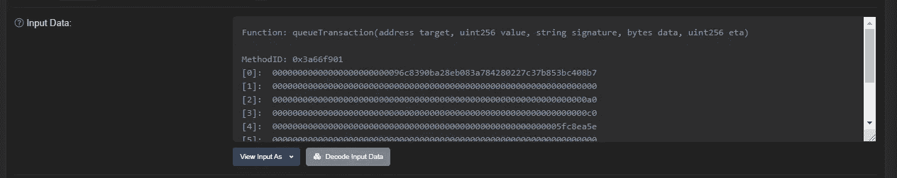
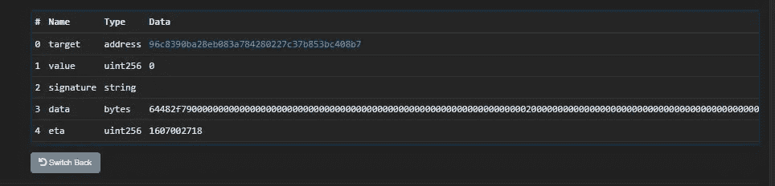
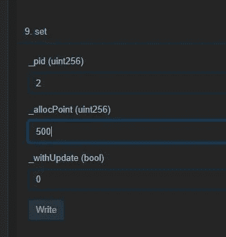
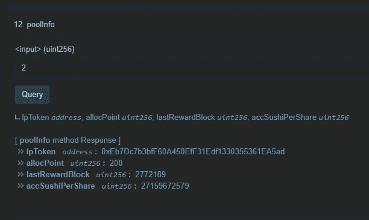

# 如何解码时间锁

> 原文：<https://medium.com/coinmonks/how-to-decode-timelock-738b3e5eec4c?source=collection_archive---------1----------------------->

自从我们开始在[Acryptos.com 时间锁](https://getunrekt.medium.com/acs-timelock-transaction-log-d084a735c95a)上发布和保存日志已经有几个星期了。许多人仍然对我们的解析器和底层智能契约如何解码这种事务感到困惑。

为了响应各种请求，这里有一个详细的“如何”来解码各种 EVM 兼容链(例如以太坊、币安智能链)内的大多数 timelock 交易

*我们以这个样本交易为例:*

 [## 币安事务哈希(Txhash)详细信息| BscScan

### 0x3f 6462 edd 7249 DD 0 CBF 4b 155 aa 3d BF 5a 7 fc 18 a 084 b 368 b 05 c 6357 CFB 37d 8 a 1 ee 3 小时 22 分钟前(2020 年 12 月 3 日 07:37:50 AM +UTC)…

bscscan.com](https://bscscan.com/tx/0x3f6462edd7249dd0cbf4b155aa3dbf5a7fc18a084b368b05c6357cfb37d8a1ee) 

# 时间锁交易的类型

这是两种常见的交易:

*   队列事务()
*   执行事务()

由于 executeTransaction()操作先前排队的请求，我们只对 **queueTransaction()** 感兴趣。

sample queueTransaction().

# 解码 queueTransaction()

解码后的 queueTransaction()将*输入数据*拆分为以下内容:

我们对以下领域感兴趣:

**目标**:[96c 8390 ba 28 EB 083 a 784280227 c 37 b 853 BC 408 b 7](https://bscscan.com/address/0x96c8390ba28eb083a784280227c37b853bc408b7)

(这是 ACSI 农场合同)

**数据**:64482 f 7900000000000000000000000000000000000000000000000000000200000000000000000000000000000000000000000005

# 解码数据字段

1.  **识别函数调用**

取数据的前 8 个十六进制数，在 4bytes.directory 这样的查找数据库中查找，它覆盖了 95%的函数签名。(对于那些古怪、复杂的球，我有自己的方法)

[https://www.4byte.directory/signatures/?bytes4_signature=64482f79](https://www.4byte.directory/signatures/?bytes4_signature=64482f79)

该查找将函数解码为:

**set(uint256，uint256，bool)**

它需要 3 个输入。

**2。分割输入**

将数据拆分为以下内容:

64482 f79
0000000000000000000000000000000000000000000000000000000000000000000000000000000000000000000000000000000000000000000000000000000000000000000000000000000000000000000000

也就是说

输入 1:000000000000000000000000000000000000000000000000000002。

输入 2:

0000000000000000000000000000000000000000000000000000000001 F4

输入 3:

0000000000000000000000000000000000000000000000000000000000000000

**3。将输入从十六进制转换为十进制**

[https://www.binaryhexconverter.com/hex-to-decimal-converter](https://www.binaryhexconverter.com/hex-to-decimal-converter)

输入 1: 2

输入 2: 500

输入 3: 0

**4。解释功能**

set 函数现在读作

**设定(2，500，0)**

从 ACSI Farm 合同中我们了解到，此操作涉及设置池权重为 **pid=2，分配点为**500

*(500 分意味着 500/100 = 5x)*

[https://bscscan . com/address/0x 96 c 8390 ba 28 EB 083 a 784280227 c 37 b 853 BC 408 b 7 # WRITE contract](https://bscscan.com/address/0x96c8390ba28eb083a784280227c37b853bc408b7#writeContract)(不要点击写！！)

**5。识别池 id 2**

使用 [ACSI 农场合同](https://bscscan.com/address/0x96c8390ba28eb083a784280227c37b853bc408b7#readContract)(阅读合同)，使用项目 *12。poolinfo* 来查询池 id 2。

从那里我们发现了 pool 2 =***0 xeb 7 DC 7 B3 BFF 60 a 450 eff 31 EDF 1330355361 ea ad***

哪个是 **ACS4VAI**

**6。已解码**

我们已经破译了时间锁

**设置(ACS4VAI 池，5x，0)**

其确定 timelock 动作是将池 ACS4VAI 改变为农场奖励的 5x 乘数。

# 例外

有一些例外可能会阻碍您的解码过程:

*   新功能尚未填充到 4 字节目录中
*   4 字节目录中的函数名冲突，意味着只记录第一个函数名

例如:

**set(uint256，uint256，bool) vs**

**设置(uint256，uint256，uint256)**

## 另外，阅读

*   [了解以太坊和网络 3](https://blog.coincodecap.com/go/learn)
*   [密码交易机器人](/coinmonks/crypto-trading-bot-c2ffce8acb2a)
*   [3 商业评论](/coinmonks/3commas-review-an-excellent-crypto-trading-bot-2020-1313a58bec92)
*   [AAX 交易所评论](/coinmonks/aax-exchange-review-2021-67c5ea09330c) |推荐代码、交易费用、利弊
*   [Deribit 审查](/coinmonks/deribit-review-options-fees-apis-and-testnet-2ca16c4bbdb2) |选项、费用、API 和 Testnet
*   [FTX 密码交易所评论](/coinmonks/ftx-crypto-exchange-review-53664ac1198f)
*   [n 零审核](/coinmonks/ngrave-zero-review-c465cf8307fc)
*   [Bybit 交换审查](/coinmonks/bybit-exchange-review-dbd570019b71)
*   [3Commas vs Cryptohopper](/coinmonks/cryptohopper-vs-3commas-vs-shrimpy-a2c16095b8fe)
*   最好的比特币[硬件钱包](/coinmonks/the-best-cryptocurrency-hardware-wallets-of-2020-e28b1c124069?source=friends_link&sk=324dd9ff8556ab578d71e7ad7658ad7c)
*   [密码本交易平台](/coinmonks/top-10-crypto-copy-trading-platforms-for-beginners-d0c37c7d698c)
*   最佳 [monero 钱包](https://blog.coincodecap.com/best-monero-wallets)
*   [莱杰 nano s vs x](https://blog.coincodecap.com/ledger-nano-s-vs-x)
*   [bits gap vs 3 commas vs quad ency](https://blog.coincodecap.com/bitsgap-3commas-quadency)
*   最好的[加密税务软件](/coinmonks/best-crypto-tax-tool-for-my-money-72d4b430816b)
*   [最佳加密交易平台](/coinmonks/the-best-crypto-trading-platforms-in-2020-the-definitive-guide-updated-c72f8b874555)
*   最佳[加密借贷平台](/coinmonks/top-5-crypto-lending-platforms-in-2020-that-you-need-to-know-a1b675cec3fa)
*   [莱杰纳米 S vs 特雷佐 one vs 特雷佐 T vs 莱杰纳米 X](https://blog.coincodecap.com/ledger-nano-s-vs-trezor-one-ledger-nano-x-trezor-t)
*   [block fi vs Celsius](/coinmonks/blockfi-vs-celsius-vs-hodlnaut-8a1cc8c26630)vs Hodlnaut
*   Bitsgap 评论——一个轻松赚钱的加密交易机器人
*   为专业人士设计的加密交易机器人
*   [PrimeXBT 审查](/coinmonks/primexbt-review-88e0815be858) |杠杆交易、费用和交易
*   [Altrady 审查](https://blog.coincodecap.com/altrady-reivew)
*   [埃利帕尔泰坦评论](/coinmonks/ellipal-titan-review-85e9071dd029)
*   [SecuX Stone 评论](https://blog.coincodecap.com/secux-stone-hardware-wallet-review)
*   [BlockFi 评论](/coinmonks/blockfi-review-53096053c097) |从您的密码中赚取高达 8.6%的利息
*   [共同规则审查](https://blog.coincodecap.com/coinrule-review-a-perfect-trading-bot)
*   [最佳区块链分析工具](https://bitquery.io/blog/best-blockchain-analysis-tools-and-software)
*   [加密套利](/coinmonks/crypto-arbitrage-guide-how-to-make-money-as-a-beginner-62bfe5c868f6)指南:新手如何赚钱
*   最佳[加密制图工具](/coinmonks/what-are-the-best-charting-platforms-for-cryptocurrency-trading-85aade584d80)
*   了解比特币的[最佳书籍有哪些？](/coinmonks/what-are-the-best-books-to-learn-bitcoin-409aeb9aff4b)

> [直接在您的收件箱中获得最佳软件交易](/coinmonks/newsletters/coinmonks)

