# 如何定义？逐步指南

> 原文：<https://medium.com/coinmonks/how-to-defi-step-by-step-guide-simply-explained-b768e8b0f8e7?source=collection_archive---------3----------------------->

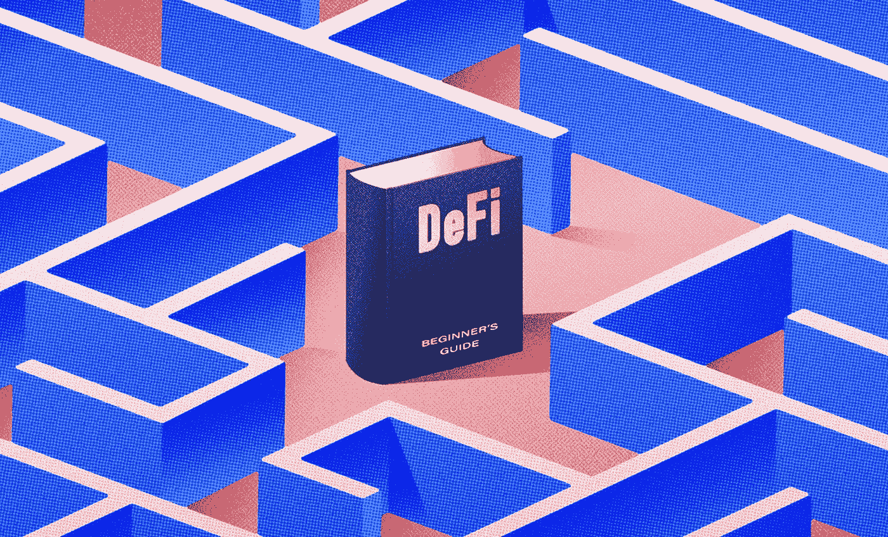

Source: crypto.com

## 背景

我们将介绍如何安全地利用分散融资(DeFi ),以及如何在自己家中舒适地利用 DeFi 产生收益。但是，您必须首先了解与 DeFi 相关的风险，以及如何尽可能将其降至最低。

## 风险

DeFi 是一项相对较新的突破性技术。因此，任何新技术都会随着时间的推移而发展、适应和改进。智能合约在过去几年中取得了巨大的安全进步，我们确信在未来，DeFi 和智能合约将更加安全，成为所有金融流程的基础。

除此之外，当你接触到 DeFi 时，你必须意识到它的危害。这些是:

*技术风险*

这些通常是高昂的网络交易费用、失败的交易和清算问题。在某些情况下，极端的网络拥塞导致 DeFi 应用程序完全停止运行。

*网络安全*

尽管智能合约的安全性自 2016 年以来有了显著改善，但最近仍有几家主要公司遭遇了网络安全攻击。

*出境骗局*

DeFi rug pulls 是一种新形式的退出骗局，开发商放弃一个项目，带着用户的资金离开。

*黑客*

黑客能够进入您的数字钱包并窃取您的资金。

我们强烈建议任何考虑 DeFi 的人了解更多的危险，并自己决定是否适合他们。目前，我们将讨论如何 a)使用 DeFi 和 b)降低风险。

## 逐步指南

## 第一步:

购买一台仅用于 DeFi 应用程序的新电脑。如果可能的话，使用热点代替 Wi-Fi。不要使用公共 Wi-Fi 或任何您怀疑不安全的 Wi-Fi。

## 第二步:

购买一个冷钱包，如账本或 Trezor。确保你直接从制造商那里购买，而不是通过亚马逊等第三方网站。在你的新笔记本电脑上，创建一个冷钱包。当你拿到“钥匙”(随机短语的集合)时，你可以用它来“签署”交易，把它们写在一张纸上，放在安全的地方，最好是保险箱。不要把你的钥匙写在你的电脑或手机上。

***警告:在你的笔记本电脑上记下密钥是黑客获取你的钱包并转移你的资金的一种方式。***

## 第三步:

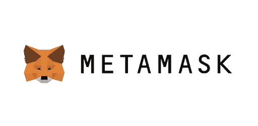

Source: metamask.io

获取 MetaMask 数字钱包。请确保您直接从 MetaMask 网站完成此操作，不要使用任何第三方链接或任何其他东西。确保网站是 [www.metamask.io.](http://www.metamask.io.)

下载硬件钱包后，将其连接到 MetaMask。见下文:

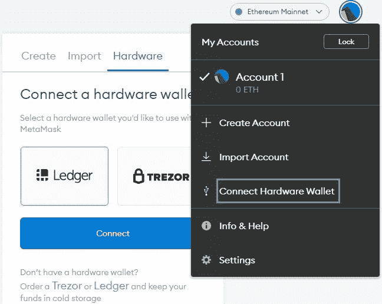

## 第四步:

决定使用哪种区块链网络进行 DeFi。有各种各样的网络可用，包括以太坊，币安，雪崩，等等。与交易相关的费用因网络而异。目前，以太坊的交易费用很高。对于 DeFi，只使用区块链少校。

每个网络的 DeFi 生态系统都需要本地令牌来与之通信。ERC-20 代表以太坊，BNB 或 BUSD 代表币安，索尔代表索拉纳，以此类推。

如果你发送一个 ERC-20 令牌到币安智能链，你会赔钱。检查您是否将正确的令牌标准发送到正确的链。

对于这个例子，我们将使用币安智能链。

注意:确保您的 cold wallet 现在已连接到 MetaMask。

## 第五步:

因为我们正在利用币安智能链，我们需要先将 MetaMask 链接到它。在 Metamask 的设置中单击“添加网络”。关于该网络的详细信息，如其名称、链 ID、符号等，可以在该网络的官方网站上找到。

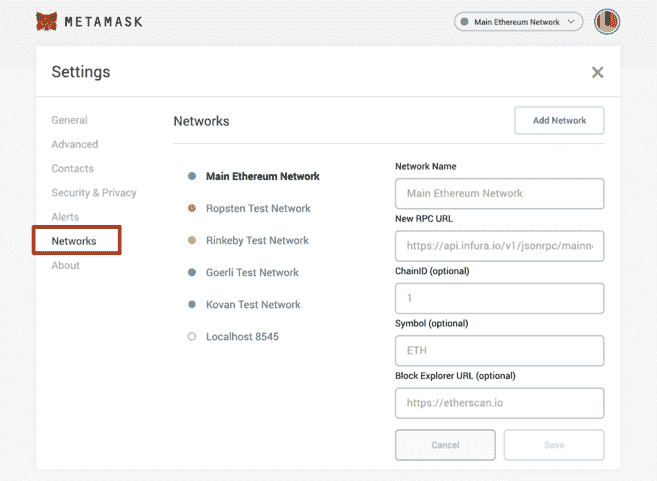

完成这些步骤后，就该把资金存入你的账户了。

## 第六步:

通过安全、受监管的交易所购买 BNB，并将其转移到您的 MetaMask 帐户(地址在顶部)。

***警告:确保为正确的链发送正确的令牌。在这种情况下，BNB (BEP-20)被送往币安智能链。***

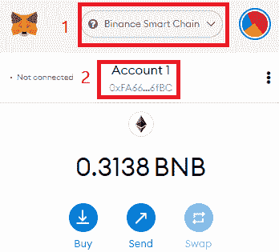

一旦 BNB 出现在你的帐户中，是时候与 DeFi 应用程序进行交互了。检查您是否连接到币安网络，而不是以太坊网络。

## 第七步:

我们必须首先决定使用哪种 DeFi 应用。如前所述，并非所有的 DeFi 应用程序都是平等的，有些风险太大。要了解如何选择 DeFi 协议的更多信息，请访问 www.defillama.com[。](http://www.defillama.com.)

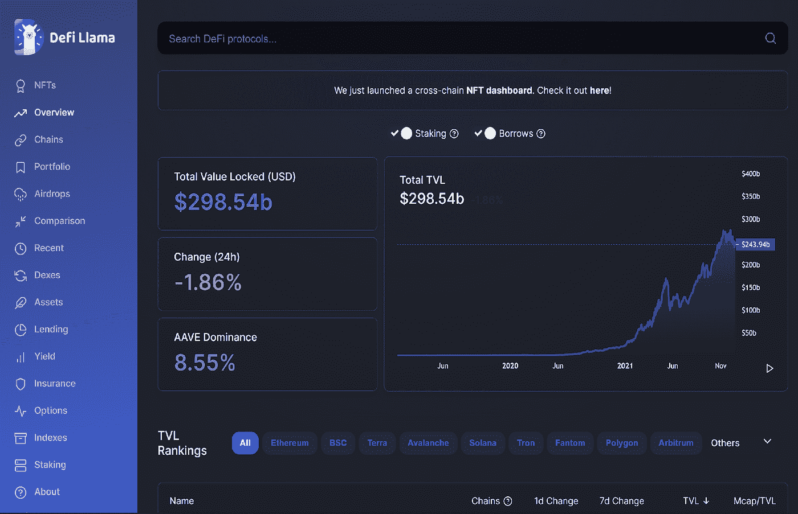

Source: defillama.com

点击 TVL 排名部分(币安智能连锁)下的“BSC”。DeFi 应用列表如下。你可以看到每个协议在 TVL 下有多少价值。

我们强烈建议使用以下协议

1)高 TVL，理想的是 10 亿美元或更多。

2)业绩记录——他们必须已经经营了很长时间，并且经受了时间和市场周期的考验。

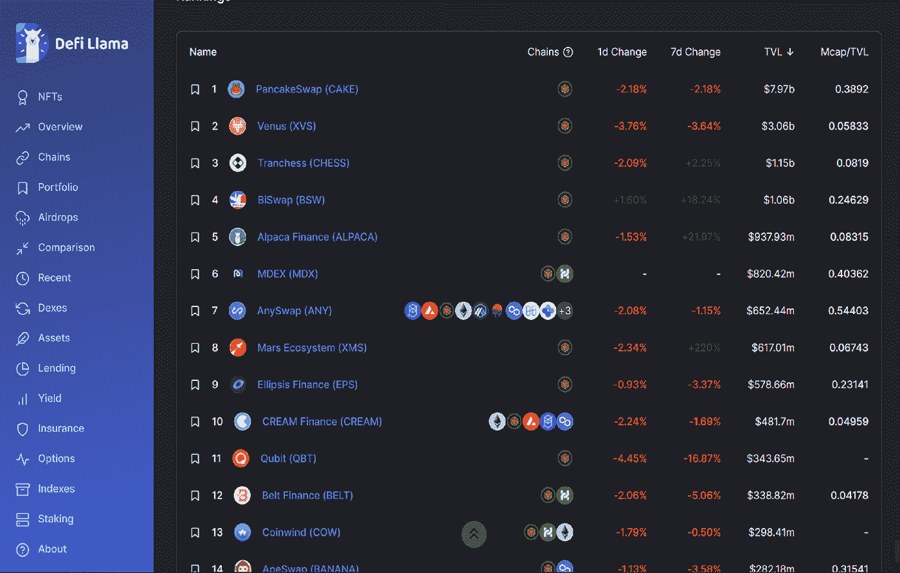

Source: defillama.com

当你点击一个协议时，你会得到关于它的额外信息，包括社交媒体账户、网站地址，以及它是否被“审核”看一看以下内容:

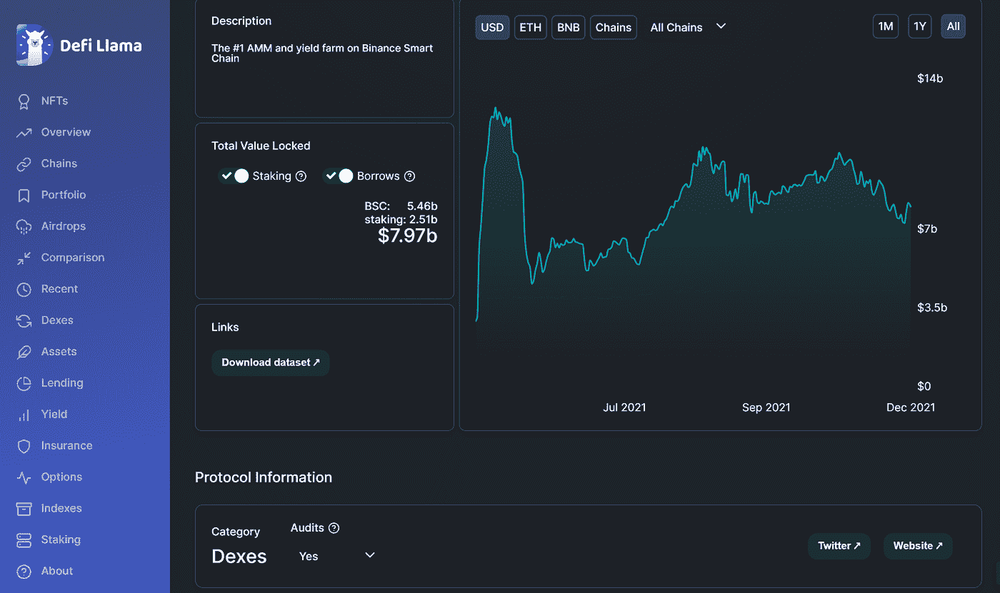

Source: defillama.com

请注意，审计意味着 DeFi 智能合约已经由具有顶级开发经验的组织审计，并确保这些对普通投资者是安全的。一家这样的审计公司是 Solidproof。

***警告:请注意审计，仍然不能保证完全安全。这是一种减轻风险的方法，但风险仍然存在。***

## 第八步:

打开一个协议，在本例中为 PancakeSwap。

***警告:检查您使用的 URL 是否正确，您正在与真正的协议网站进行交互，而不是假冒的钓鱼网站。确保在从头到尾与协议交互时关闭所有其他窗口。***

找到“连接钱包”。连接钱包后，点击“赚”，点击“农场”，然后按“流动性”排序。请参见下面的示例:

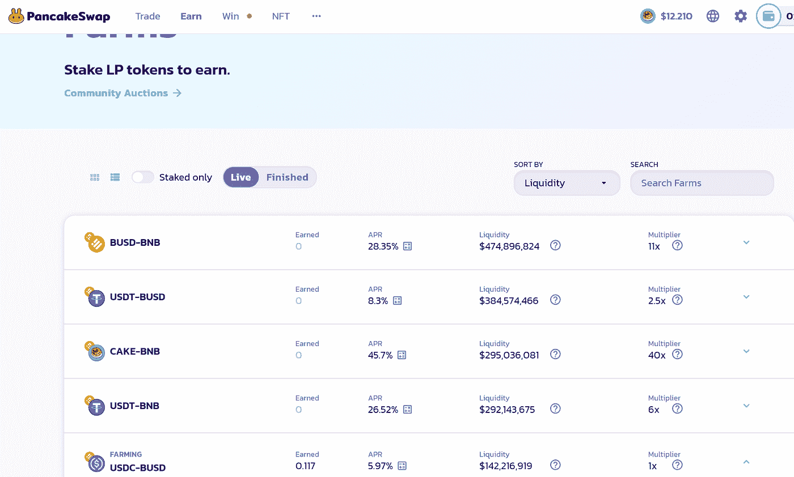

Source: pancakeswap.finance

不要使用低流动性农场。

现在，您将看到两种类型的流动性农场:

1)稳定的硬币对，如 USDT-BUSD，USDC-BUSD——这些不会有非永久性的损失。

2)其他配对，如 BUSD-BNB、瑞士联邦理工学院-BNB、BTCB 联邦理工学院-非永久性损失风险。

这里的关键区别是短暂的损失。这就是当你向流动性池提供流动性时发生损失的地方，与你存入资产时相比，你存入资产的价格发生了变化。这种改变越大，你就越容易受到无常的损失。

不要和任何你没听说过的加密货币或者低市值的加密货币互动；尽管有高收益(三位数或更多)的诱惑，这些都是极其危险的。

## 第九步:

一旦决定使用哪种类型的流动性农场，点击那个农场，例如，USDC-BUSD，它将为你的任何存款金额提供 5.97%的年利率。这些收益率不是固定的，而是根据算法的供给和需求而变化。

继续并点击“获取 USDC-BUSD 唱片公司”。这意味着将 USDC 和 BUSD 换成流动性提供者的代币。

点击后，您将进入以下页面“添加流动性”。见下文:

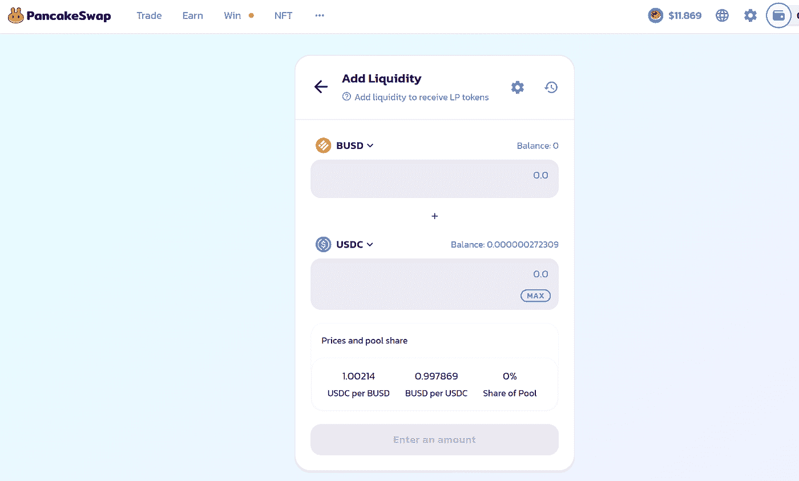

Source: pancakeswap.finance

它会显示每项资产的“余额:0”。你将需要这些达到你所需要的平衡。例如，如果你想存入价值 100 美元的资产，你需要 50 美元的 USDC LP 代币和 50 美元的 BUSD LP 代币。

## 第十步:

返回 Metamask，选择币安智能链，然后单击“交换”。一个新窗口将会打开，您可以在这里将 BNB 币兑换成 BUSD 和 USDC 币。

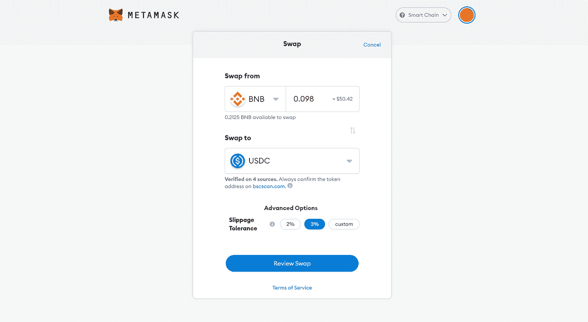

比方说，你想提供 100 美元的流动性。你把价值 50 美元的 BNB 换成 USDC，一旦被处决，再把价值 50 美元的 BNB 换成 BUSD。

在这个阶段，你冰冷的钱包会提示你“签署”一项交易。

请注意，对于每一个单一的操作，你将不得不签署一项交易。每笔交易都需要支付少量的网络费用——在这个例子中是 BNB。请确保您在 MetaMask 帐户上有足够的 BNB 来执行订单。在币安，这种费用通常很低。

## 第十一步:

一旦你有价值 50 美元的 USDC 和价值 50 美元的 BUSD，你可以返回到“添加流动性”部分，点击每个(或最大)的余额。然后点击“供应”和“确认供应”——使用 cold wallet 签署交易，并在币安区块链上等待确认消息。

## 第十二步:

确认后，返回“农场”，点击“USDC-BUSD”池，点击“USDC-BUSD LP 赌注”上的“加号”图标，然后按“最大”或您想要存入的金额。确认。用冷钱包签交易。等待确认。

一旦这样做了，你现在正式屈服于 DeFi。您的收益将在“收获”下累积，您可以随时提取您的“收获”。

要移除资金或“解散”，只需点击“移除流动性”并将 LP 令牌兑换回 USDC 和 BUSD。您可以将它们交换回 BNB，或者从 MetaMask 直接发送到您的交易所。

请注意，您将在该协议的本地令牌中获得支付，即在 PancakeSwap 情况下的蛋糕令牌。每个协议都有自己的本地令牌。

一旦你“收获”，转到“交易”，然后“交换”和“交换”收获的蛋糕到任何其他你想要的加密货币，包括任何稳定的硬币，如 USDC 或 BUSD。

## 第十三步:

完成后，确保点击右上角的三个垂直点，然后点击“连接的网站”。

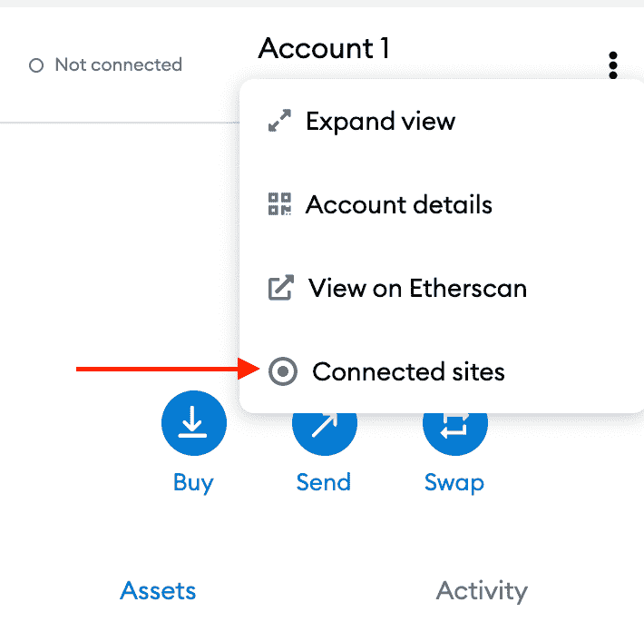

然后点击“Bin”图标，并按下断开。完成后，点击右上角的圆形图标，然后点击“锁定”。

## 第十四步:

为了分散风险，在了解将资产存入流动性池以从 DeFi 上的数字资产中产生收入的前提后，您应该开发一个由多个已建立的高 TVL DeFi dapp 组成的投资组合，如 PancakeSwap。

在 MetaMask 上，您最好为每个协议建立一个单独的子帐户。为此，请转到 MetaMask 并单击右上角的圆形按钮，然后“+创建帐户”

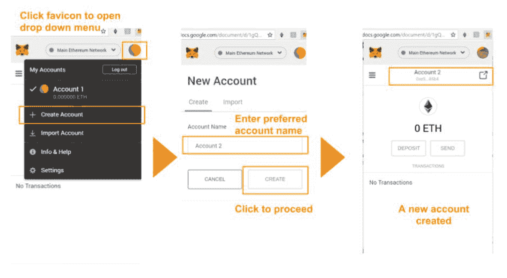

不要使用您当前的 MetaMask 帐户与任何可疑的新 DeFi 应用程序或您从未听说过的应用程序进行交互。

## 支出限额权限

每次你同意与 DeFi 申请合同，你应该限制花费。参见下面的例子。

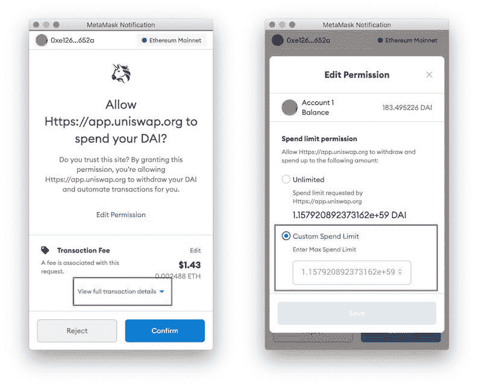

始终对您想要与之交互的任何协议执行您自己的研究，并且永远不要暴露您的私钥。记住，不是你的钥匙，不是你的密码。

*免责声明:本文包含的信息仅用于教育目的，并不构成 Wheatstones 的任何形式的建议或推荐，用户在做出(或避免做出)任何投资决定时也不打算依赖这些信息。*

> 加入 Coinmonks [电报频道](https://t.me/coincodecap)和 [Youtube 频道](https://www.youtube.com/c/coinmonks/videos)了解加密交易和投资

## 也阅读

 [## 杠杆代币[多头代币]终极指南

### 杠杆化令牌是具有杠杆化风险敞口的 ERC20 令牌，不考虑保证金、要求、管理…

medium.com](/coinmonks/leveraged-token-3f5257808b22)  [## 最佳加密交易所| 2021 年十大加密货币交易所

### 加密货币交易所的加密交易需要了解市场，这可以帮助你获得利润。之前…

blog.coincodecap.com](https://blog.coincodecap.com/crypto-exchange)  [## 2021 年最佳加密交换平台| CoinCodeCap

### 如果我们看看今天的场景，许多加密货币交换平台提供了广泛的功能和深度…

blog.coincodecap.com](https://blog.coincodecap.com/best-swap-platforms)  [## 2021 年最佳加密借贷平台| 6 大比特币借贷平台

### 获得比特币和其他加密货币的最佳贷款利率

medium.com](/coinmonks/top-5-crypto-lending-platforms-in-2020-that-you-need-to-know-a1b675cec3fa)  [## 2021 年 6 大最佳硬件钱包|顶级加密硬件钱包[更新]

### 最好的加密货币硬件钱包是绝对必要的。我们将在 NGRAVE、Ledger Nano X 和…

medium.com](/coinmonks/the-best-cryptocurrency-hardware-wallets-of-2020-e28b1c124069)  [## 2021 年最佳免费加密交易机器人

### 2021 年币安、比特币基地、库币和其他密码交易所的最佳密码交易机器人。四进制，位间隙…

medium.com](/coinmonks/crypto-trading-bot-c2ffce8acb2a)  [## 最佳 4 个加密交易信号电报通道

### 这是乏味的找到正确的加密交易信号提供商。因此，在本文中，我们将讨论最好的…

medium.com](/coinmonks/best-crypto-signals-telegram-5785cdbc4b2b)  [## 获取信号、交易机器人和套利

### 编辑描述

blog.coincodecap.com](https://blog.coincodecap.com/bitsgap-review)