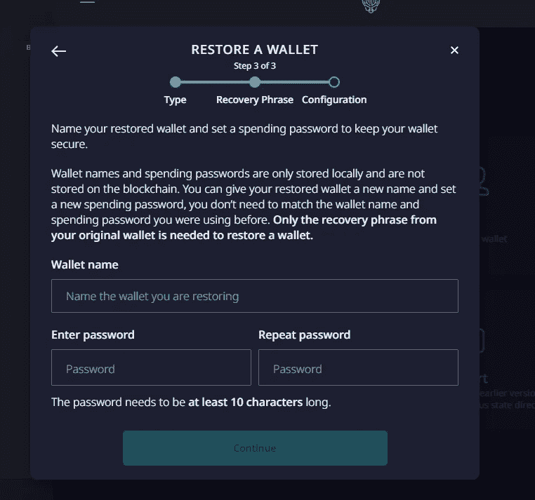
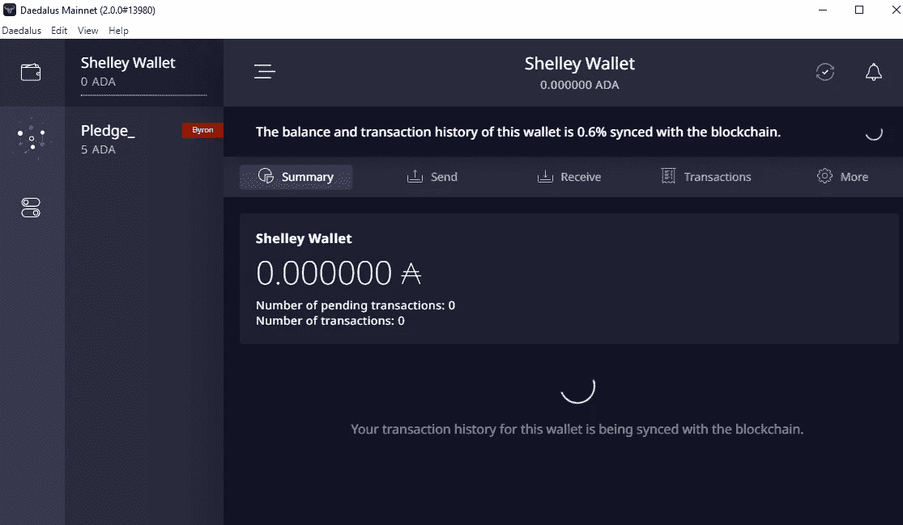
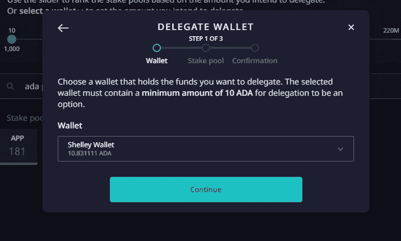

# 如何授权，把你的助理检察官押在卡达诺·雪莱身上？

> 原文：<https://medium.com/coinmonks/how-to-delegate-stake-your-ada-on-cardano-shelley-7fff9a9cdc1e?source=collection_archive---------0----------------------->

您现在可以委托您的 ADA。代达罗斯官方钱包于 2020 年 7 月 29 日发布。

委托是将 ADA 委托给一个堆栈池的过程。赌注池实际上形成了卡尔达诺网络，因为它们产生“交易”(区块)。如果持有 ADA 的人不具备经营赌注池的技术技能或意愿，他们仍然可以根据分配给赌注池的 ADA 金额按比例获得奖励。

注 1: **Ledger Nano S/X/Trezor 用户**可以直接用硬件设备下注。
- [点击这里查看我们的 AdaLite 教程。](/@adapointpool/how-to-delegate-stake-your-ada-on-shelley-with-ledger-nano-s-x-e6363a9c9050)
- [看我们的 Yoroi 教程——点这里。如果您有 Ledger Nano S/X/Trezor 设备，这是最安全和推荐的选项。](/@adapointpool/how-to-delegate-stake-your-ada-on-shelley-with-ledger-nano-s-x-with-yoroi-wallet-c0ebc9377065)

注 2: **代达罗斯硬件钱包支持现已上线**。我们将写一个教程矮子。与此同时，你仍然可以使用 Note 1 将你的资金委托给你的硬件钱包。如果在其他客户端使用硬件钱包，您也可以在代达罗斯使用它。

警告:使用本教程风险自担。它没有任何保证。

最重要的是**保护好你的代达罗斯恢复短语/单词(除了你，没人会看到这个短语/单词)**。此外，请确保不要丢失短语/单词，因为如果您的计算机出现故障，您将无法访问您的 ADA。

转到[卡尔达诺代达罗斯页面](https://daedaluswallet.io/)。根据您的操作系统，向下滚动并下载代达罗斯钱包。

根据您的操作系统，双击您下载的文件并安装程序。

如果您对安装有任何问题或不清楚的地方，请在此处查看完整的[安装流程文档(https://iohk . zendesk . com/HC/en-us/articles/900000694463-代达罗斯-1-0-0-安装)](https://iohk.zendesk.com/hc/en-us/articles/900000694463-Daedalus-1-0-0-Installation)。

在 Windows 上，你应该得到一个桌面快捷方式和开始菜单中的快捷方式。打开“代达罗斯维护网”。

你的钱包应该开始同步。如果代达罗斯同步被卡住，请按照屏幕上的说明进行操作。通常你必须同步/设置操作系统时钟。

如果钱包同步有其他问题，首先尝试在线搜索解决方案。如果您仍然找不到答案或遇到错误或问题，请点击代达罗斯钱包中的"*帮助- >支持请求"*。支持团队真的很有帮助，反应也很快。

委托、标桩过程非常直观和简单。如果你迷路了或者有什么不清楚的地方，我们还有一次演练。

> 另请阅读:[最佳硬件钱包](/coinmonks/the-best-cryptocurrency-hardware-wallets-of-2020-e28b1c124069)

# 恢复以前的代达罗斯，纸或 Yoroi 钱包

1.  这是在顶部/左侧菜单的钱包图标下。点击“恢复”。

2.你会看到一个“恢复钱包”对话框。

在这里你可以还原 T2 的遗产代达罗斯 T3 或 T4 与代达罗斯一起创作的纸钱包 T5。本指南将介绍如何修复代达罗斯钱包。对于纸质钱包，请参见官方演示。

如果你在 Yoroi 钱包上有资金，你可以等几天，等待 Yoroi 钱包的更新。如果你很着急，你可以直接在代达罗斯恢复 Yoroi 钱包。

如果您有一个 Ledger Nano S/X，您可能不想恢复一个**硬件钱包**，因为您已经可以直接从设备[委托资金(使用 AdaLite)。参见委托分类帐](/@adapointpool/how-to-delegate-stake-your-ada-on-shelley-with-ledger-nano-s-x-e6363a9c9050)的演练。

3.键入您的恢复短语，然后单击“检查恢复短语”

4.您可以在“钱包名称”栏中写下任何您想要的名称。

最后，输入将用于此钱包的新密码。

点击“继续”。

经过一段时间的同步，你应该得到一个“拜伦”时代的钱包。

# 将 ADA 移动到 Mainnet Shelley 钱包

1.  因为这是一个老式的(拜伦牌)钱包，你不能直接用它打赌。因此，我们必须将资金转移到一个新的钱包中。返回钱包屏幕，点击“创建”。

2.为您的钱包选择一个名称。在这里我选择了“雪莱钱包”。输入消费密码，点击“创建雪莱钱包”。

3.阅读说明！然后点击复选框，倒计时后点击“继续”。

4.你的工作是写下这个短语并安全地保存它。点击“是的，我已经写下了我的钱包恢复短语”。

注意:我们审查了我们的单词(短语)

5.之后你会来到一个屏幕，在那里你必须重复你写下的单词。一次填一个单词。你可以按“回车”从下拉列表中选择，以加快这个过程。

之后点击“确认”

6.阅读完说明后，单击两个复选框，然后单击“确认”

7.您刚刚添加的钱包将开始同步。大概需要半个小时。

# 将旧的(Byron) wallet 资金移至新创建的(Shelley) wallet

1.  拥有两个钱包后，单击 Byron 钱包，然后单击“将 ada 移动到现有的钱包中”。

2.如果您按照指南进行操作，应该已经预先选择了正确的钱包。否则，选择您恢复的钱包和新创建的 Shelley 兼容的钱包。点击“继续”。

3.输入您在“恢复”旧钱包时选择的钱包消费密码。点击“转账”。这需要几秒钟的时间。

4.现在，您应该可以在新创建的(Shelley)钱包中看到所有的 ADA。

恭喜你，你现在有一个 Shelley 钱包，支持代表团和其他一些很酷的功能。

# 委托您的 ADA

1.  创建钱夹后，单击左侧菜单中的中间图标，转到“授权中心”，然后单击“赌注池”

2.您将获得当前活动池的列表。在这里，您必须选择您将委托/下注 ADA 的池。

首先要注意几件事:

如果您想委托给多个赌注池，您需要创建多个(Shelley wallets)并分割余额。然后给每个钱包做委托。

没有失去你的资金的危险，因为你的资金永远不会离开你的钱包。你只是告诉网络，你是委托你的股份，以选定的池，而不是砂池任何你的 ADA。

委托给一个池的成本大约是 2 ADA。

有一些参数需要考虑:

每历元成本:这是一个固定数额的 ADA，池经营者将获得，并将从池创造的所有奖励中扣除。

利润率:是池的可变奖励，将进入池运营商的奖励总额的百分比。

要摆弄这个参数，你可以查看 [**官方奖励计算器【https://test nets . cardano . org/en/cardano/tools/staking-calculator/】**](https://testnets.cardano.org/en/cardano/tools/staking-calculator/)。

你也可以查看任何泳池的网站。

如果你想考虑我们；我们的泳池是【https://adapointpool.com】ADA Point 泳池，ticker APP。APP 费用只是 2%。我们会尽力帮助 Cardano 用户。我们将获得的任何 ADA，如果不是用于服务器维护，将会用于开发 [Yoroi](https://yoroi-wallet.com/) wallet 和其他一些定制的 Cardano 工具。

注意:目前每个钱包只能委托给一个池。(*对于高级用户)*因此，如果你想委托给多个池，你必须创建更多的钱包。

接下来选择您要委派到的池，单击该框。

单击“委托给此池”。

3.您应该会看到一个弹出窗口，您可以在其中选择钱包。点击“继续”。

4.从下拉列表中选择新创建的钱包，然后单击“继续”。

5.应该已经设置了赌注池选择。仔细检查股票行情，然后点击“继续”。

6.输入您在创建新的 Shelley 钱包时分配的消费密码。之后，你将不得不等待大约 10 秒钟的动作完成。

7.恭喜你。现在，您已经将 ADA 委托给了一个赌注库。如果您的赌注池是可操作的，您现在将在每个纪元(5 天)获得稳定的 ADA 奖励。

注:随着时间的推移，卡尔达诺分权将逐渐增加。这意味着在开始的时候，奖励会更少，因为供应链仍然是分散的。

# 查看您的赌注账户

1.  点击左侧菜单中的中间图标，进入“代表团中心”。你应该看看你的代理助理检察官。如果您将鼠标悬停在“Shelley wallet”上，您会看到一个按钮，上面写着“重新授权”。如果您想更改赌注池，请使用此选项。

# 检查您的奖励

1.  点击左侧菜单中的中间图标，进入“代表团中心”。点击“奖励”。当然，这只会在一些时代过去后显示奖励，而不是马上。

# 常见问题解答

*   我什么时候能拿到第一笔奖励？
    需要当前纪元的剩余时间+ 3 个纪元，直到你获得第一笔奖励。所以在这最初的延迟之后，你将会在每个时期得到奖励。简而言之，在初始延迟 15-20 天后(1 个时期为 5 天)。
*   **如果我下注，我需要打开我的代达罗斯钱包吗？**
    不行，你可以合上钱包/关闭电脑，你还在下注，还在拿奖励。
*   是否有已知问题的列表？
    是的。见[此处列表](https://iohk.zendesk.com/hc/en-us/articles/360038741393)。
*   **哪些交易所和第三方支持雪莱？**
    你可以在这里查看[完整名单。](https://iohk.zendesk.com/hc/en-us/articles/900001924566-Shelley-readiness-of-third-parties)
*   **如果我遇到错误或问题，而您无法在线找到解决方案，我该怎么办？**
    点击*帮助- >支持请求*。这是首选方式。支持团队真的很有帮助，反应也很快。
    如果你没有可用的钱包或者请求与其他 Cardano 项目有关，你可以[在这里](https://iohk.zendesk.com/hc/en-us/requests/new)创建一个官方支持票。

扩展常见问题:[金卡达诺常见问题](/@adapointpool/the-golden-cardano-staking-faq-1e6aafc0c26b)

# 放弃

这篇文章没有任何保证。请自行判断使用。

# 我们是谁？

*   网址:[https://adapointpool.com](https://adapointpool.com/)
*   股票代码: **APP**
*   游泳池费用:2%
*   推特:[https://twitter.com/Ada_Point_Pool](https://twitter.com/Ada_Point_Pool)
*   数据块:3，000 多个数据块，授权:60 亿多 ADA 一段时间内授权，分配:250 万 ADA
*   [关于我们泳池架构的文章](/@adapointpool/cardano-stake-pool-arhitecture-8b0f644fc8f2)
*   [卡尔达诺项目可视化](https://www.youtube.com/channel/UCq3oCrg2-R2HAuf9XLF_XcA)，[池地理定位浏览器的创建者](https://adapointearth.com/)
*   [https://ada pools . org/pool/1 CB 5d 0 e 006 c 33 ace 982 a 527d 4140 BC 086 f 99 f 7d 35 c 27 C5 ab 29600 a 74](https://adapools.org/pool/1cb5d0e006c33ace982a527d4140bc086f99f7d35c27c5ab29600a74)

> **为机构和个人提供安全的赌注奖励。委托&忘记。**

如果你发现任何错误，请告诉我们。

快乐的赌注，

AdaPointPool
https://adapointpool.com[info@adapointpool.com](https://adapointpool.com/)

## 另外，阅读

*   最好的[密码交易机器人](/coinmonks/crypto-trading-bot-c2ffce8acb2a)
*   [密码本交易平台](/coinmonks/top-10-crypto-copy-trading-platforms-for-beginners-d0c37c7d698c)
*   最好的[加密税务软件](/coinmonks/best-crypto-tax-tool-for-my-money-72d4b430816b)
*   [最佳加密交易平台](/coinmonks/the-best-crypto-trading-platforms-in-2020-the-definitive-guide-updated-c72f8b874555)
*   最佳[加密贷款平台](/coinmonks/top-5-crypto-lending-platforms-in-2020-that-you-need-to-know-a1b675cec3fa)
*   [最佳区块链分析工具](https://bitquery.io/blog/best-blockchain-analysis-tools-and-software)
*   [加密套利](/coinmonks/crypto-arbitrage-guide-how-to-make-money-as-a-beginner-62bfe5c868f6)指南:新手如何赚钱
*   最佳[加密制图工具](/coinmonks/what-are-the-best-charting-platforms-for-cryptocurrency-trading-85aade584d80)
*   [莱杰 vs 特雷佐](/coinmonks/ledger-vs-trezor-best-hardware-wallet-to-secure-cryptocurrency-22c7a3fd391e)
*   了解比特币最好的[书籍有哪些？](/coinmonks/what-are-the-best-books-to-learn-bitcoin-409aeb9aff4b)
*   [3 商业评论](/coinmonks/3commas-review-an-excellent-crypto-trading-bot-2020-1313a58bec92)
*   [AAX 交易所评论](/coinmonks/aax-exchange-review-2021-67c5ea09330c) |推荐代码、交易费用、利弊
*   [德里比特评论](/coinmonks/deribit-review-options-fees-apis-and-testnet-2ca16c4bbdb2) |选项、费用、API 和 Testnet
*   [FTX 密码交易所评论](/coinmonks/ftx-crypto-exchange-review-53664ac1198f)
*   [n 零审核](/coinmonks/ngrave-zero-review-c465cf8307fc)
*   [Bybit 交换审查](/coinmonks/bybit-exchange-review-dbd570019b71)
*   [3Commas vs Cryptohopper](/coinmonks/cryptohopper-vs-3commas-vs-shrimpy-a2c16095b8fe)
*   最好的比特币[硬件钱包](/coinmonks/the-best-cryptocurrency-hardware-wallets-of-2020-e28b1c124069?source=friends_link&sk=324dd9ff8556ab578d71e7ad7658ad7c)
*   最佳 [monero 钱包](https://blog.coincodecap.com/best-monero-wallets)
*   [莱杰 nano s vs x](https://blog.coincodecap.com/ledger-nano-s-vs-x)
*   [bits gap vs 3 commas vs quad ency](https://blog.coincodecap.com/bitsgap-3commas-quadency)
*   [莱杰纳米 S vs 特雷佐 one vs 特雷佐 T vs 莱杰纳米 X](https://blog.coincodecap.com/ledger-nano-s-vs-trezor-one-ledger-nano-x-trezor-t)
*   [block fi vs Celsius](/coinmonks/blockfi-vs-celsius-vs-hodlnaut-8a1cc8c26630)vs Hodlnaut
*   Bitsgap 评论——一个轻松赚钱的加密交易机器人
*   为专业人士设计的加密交易机器人
*   [PrimeXBT 审查](/coinmonks/primexbt-review-88e0815be858) |杠杆交易、费用和交易
*   [埃利帕尔泰坦评论](/coinmonks/ellipal-titan-review-85e9071dd029)
*   [SecuX Stone 评论](https://blog.coincodecap.com/secux-stone-hardware-wallet-review)
*   [BlockFi 评论](/coinmonks/blockfi-review-53096053c097) |从您的密码中赚取高达 8.6%的利息