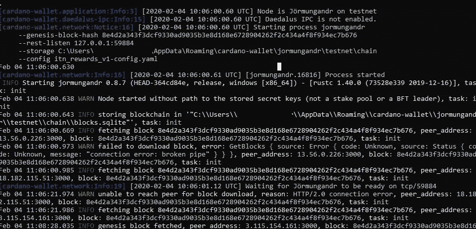
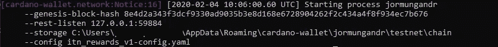
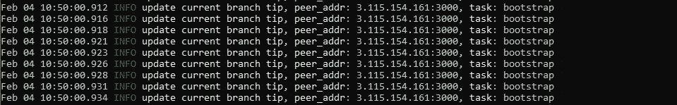
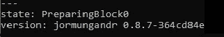
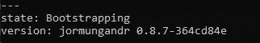
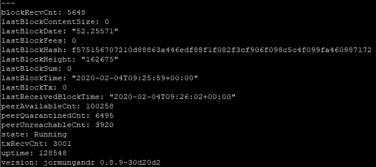

# 如何在没有代达罗斯(专业版)的情况下委托您的股份

> 原文：<https://medium.com/coinmonks/how-to-delegate-your-stakes-without-daedalus-pro-variant-920678eaef55?source=collection_archive---------0----------------------->

代达罗斯有很多连接问题，许多授权者无法将他们的股份转移到其他池。

我们想给你一个替代的方法，这提供了一点点更多的工作，但应该立即发挥作用，你可以了解一些如何运行一个池的过程是如何工作的。

首先。这种方法需要具备以下条件才能实现委托。

如果你不确定，请不要冒险。你可以问你是否需要更多的信息或帮助，但千万不要发送你的

*   [适用于您操作系统的 Cardano-Wallet 应用程序](https://github.com/input-output-hk/cardano-wallet/releases/tag/v2020-01-27)
*   [配置文件](https://hydra.iohk.io/build/1579767/download/1/index.html)和 Genesis Hash(ITN _ rewards _ v1 的
*   **您的 Cardano ITN 钱包密码(15 字种子)**
*   **[委托脚本](https://raw.githubusercontent.com/rdlrt/Alternate-Jormungandr-Testnet/master/scripts/jormu-helper-scripts/delegate-acct.sh)和 [env](https://raw.githubusercontent.com/rdlrt/Alternate-Jormungandr-Testnet/master/scripts/jormu-helper-scripts/env)**
*   **大家注意了！**
*   **可选:[CLI 命令列表](https://github.com/input-output-hk/cardano-wallet/wiki/Wallet-command-line-interface/bf3d5939829dbe980864617e85ab906453cd9ebf)**

**(此示例在 windows 机器上完成了所有步骤，但是可以适用于任何其他操作系统)**

## **步骤 1:下载文件**

**下载卡达诺钱包并提取文件。
下载 config.file，genesis 文件，复制 Genesis Hash。**

**将配置文件放在一个文件夹中，这个文件夹就是 cardano-wallet 应用程序所在的位置。**

**打开命令行/bash，进入 cardano-wallet 文件夹。**

**执行以下命令 **>cardano-wallet.exe 版****

**2020.1.27 (git 修订版:a6df 56 ed 91132 e 344925 df 9736 ffaba 6922 b256 f)**

**应该从 CLI 返回。**

## **步骤 2:用 cardano-wallet 启动被动节点**

**为了能够检查您的帐户余额和委托您的股份，您需要启动您的节点。这是同样的过程，代达罗斯在后台做，但没有一个易于使用的图形用户界面。**

**要启动被动节点，请使用以下命令。**

*****参考消息:*** *如果您想将区块链保存在本地存储上，您可以将-* state-dir *<文件夹路径>附加到命令中。否则，每次将存储在内存中时，都需要下载区块链。***

****>cardano-wallet launch-genesis-block-hash 8e 4d 2 a 343 F3 DCF 9330 ad 9035 B3 E8 d 168 e 6728904262 f2c 434 a 4 f 8 f 934 ec7b 676-config ITN _ rewards _ v1-config . YAML****

**(可选:如果你想使用最新的 jormungandr/jcli 版本，也就是节点本身，你可以在这里用来自[的最新版本替换 jormungandr 和 jcli 文件。)但它应该也能与 0.8.7 一起工作。](https://github.com/input-output-hk/jormungandr/releases)**

**如果您的节点正在启动，它应该看起来像这样。**

****

**Shows the process after launching the cardano-wallet application**

**要使用 JCLI，您必须使用正确的端口，这可以在启动进程日志中找到。例如下图所示。 **59884** 。但是您也可以在 cardano-wallet 启动命令中附加一个自定义的- rest-listen XXXX 参数。**

****

**Shows the configuration which the node is using**

**当它启动时，它看起来像这样。**

****

**要使用 JCLI，您必须使用正确的端口。**

**要检查您的节点是否成功引导，请打开另一个命令行/shell(如果您没有在后台启动它),并使用带有以下命令的 jcli 应用程序。**

****jcli rest v 0 node stats get-h " http://127 . 0 . 0 . 1:59884/API "****

**现在你需要等待，直到准备和引导完成。**

****

**Node is preparing and is downloading the blockchain**

****

**Node is still bootstrapping**

****

**Successful running node (it takes a little bit 5–10 minutes)**

**如果您的节点成功引导，您可以继续下一步。过一段时间后，你应该得到一些块 rec vent。那么您的节点运行良好。**

*****参考消息:*** *如果您的引导花费了很长时间，您可以打开您的“itn_rewards_v1-config ”,并从*[*ADAPOOLS peer list*](https://adapools.org/peers)*中用一些工作的 peer 替换 trusted _ peers。多亏了他们！***

**您也可以使用 cardano-wallet 检查网络状态。**

****>卡达诺钱包网信息****

**你应该会得到 OK 和一些信息。**

**恭喜你。您的节点正在运行并已连接。现在，您可以检查帐户余额，并委托给池。**

## **步骤 3:从您的通行短语(种子)中提取公钥/私钥**

**为了委托你的赌注，你需要你的私人钥匙。有了 cardano 钱包，你就可以取出钱包了。**

**随着**

****cardano-wallet.exe 钱包排行榜****

**好的。
[]**

**您可以查看当前可用的钱包。**

**可选:**

**要从 daedalus 恢复/创建现有的 wallet，请使用以下命令。**

****>cardano-wallet.exe 钱包创建“my wallet name”****

**在你被询问后，输入你的 15 个单词助记种子。**

**为了将您的 ADA 委派给另一个池，您需要的是您的密钥。**

**请不要将以下提取的密钥发送给任何人。**

****>cardano-wallet.exe 助记奖励凭证****

**在你输入你的钱包助记种子后，你会得到一个这样的密钥。**

****ed 25519 e _ sk 1 wz x2 m 0 e 5 yz 8 cclyakgz 4 xvjy 86 crxt 7 qxff J2 yeljstkdluta 49 aa 55 gwld 3d 8 cv 3 hzv 7 mpdah 57 jsnslcj 2248 zu 6a fa 090 yrzuqpsqhh 2m 9****

**这是你的私人钥匙，你需要委派。**

****第四步:委派到新的人才库****

**使用委托脚本，您可以将您的 ada 委托给一个池。你只需要打开你的脚本，把它的端口改成 cardano 钱包的 rest-listen 端口，这是你在开始时得到的。如 **59884。****

**您需要这个端口来访问 jormungandr 的 rest api。**

**下一步是从您的私钥中提取您的公有地址。请打开 windows PowerShell，否则使用 bash。**

**键入以下命令:**

**1.**

****>$ SECRET _ KEY = " ed 25519 e _ sk 1 wz x2 m 0 e 5 yz 8 cclyakgz 4 xvjy 86 crxt 7 qxff J2 yeljstkdluta 49 aa 55 gwld 3d 8 cv 3 hzv 7 mpdah 57 jsnslcj 2248 zu 6a fa 090 yrzuqpsk hh 2m 9 "****

**2.**

****$ PUBLIC _ KEY = echo $ SECRET _ KEY |。/jcli 公开密钥****

**3.**

****> $ACCOUNT_ADDRESS=。/jcli address account $ PUBLIC _ KEY****

**在 **$ACCOUNT_ADDRESS** 中，您有了自己的地址，现在可以用它来查看您的余额，例如**

****。/jcli rest v 0 ACCOUNT get $ ACCOUNT _ ADDRESS-h " http://127 . 0 . 0 . 1:59884/API****

**结果应该告诉你关于你当前的赌注池和它的当前帐户余额的信息。**

**如果您使用的是 windows，您需要通过创建证书和交易来发送您的委托，如下所示。**

**但是首先你需要你想要的赌注池 ID，在那里你想要委托给例如# **Monky 池 ID:
b 3146 f 94 b 9 DBF 51 f 2838056538 ebec 0 cc 9d 84 AEC E3 be 4c 885 de 954 DD 7 b 392 b 74****

**要获得所有 id 的列表，您可以查看 adapools.org、pooltool.io 或直接拨打电话**

****cardano-wallet.exe>赌局列表****

**这将返回所有池的列表。复制你想要的池的 id。**

## ****派遣代表团(Thx to******)******

******针对 Linux /Mac 用户******

****如果你使用的是 linux/mac，你可以使用(来自 [rdlrt](https://github.com/rdlrt/Alternate-Jormungandr-Testnet/tree/master/scripts/jormu-helper-scripts) 的委托脚本)(delegate-acct.sh 和 env)。您需要设置正确的 rest-listen 端口来使它们工作。****

****要派遣您的代表团，只需打电话****

****。/delegate-acct . sh <account_sk><stake_pool_ids>ACCOUNT _ SK 是你的秘钥。
STAKE_POOL_ID 是池的 ID。</stake_pool_ids></account_sk>****

****在一个块被创建后，你的事务被发送，你的 adas 应该被标桩。****

****你可以再次查看你的帐户，看看赌注池。****

******针对 Windows 用户(仍为 PowerShell)******

****为了让你更容易理解，我们将 linux 脚本翻译成 powershell 并在我们的帖子上更新。如果你足够健康并且愿意，你也可以尝试在 PowerShell 上执行 bash 脚本。有一个教程告诉你怎么做。****

****但是现在你必须创建你的代理人，自己发送一个新的交易到 ITN 区块链。****

1.  ******创建委托证书******

****> ./jcli certificate new stake-delegation $ SECRET _ KEY<*输入赌注池 ID*>-o account _ delegation _ certificate****

******2。为账户地址"**创建离线委托交易****

****> ./jcli 事务新建-暂存 staging_file.out****

******3。将输入账户添加到交易中(710，000 LOVELACES 费用)"******

****> ./jcli 事务添加-ACCOUNT " $ ACCOUNT _ ADDRESS " " 710000 "-staging " staging _ file . out "****

******4。将证书添加到交易中"******

****>交易新增-证书<*账户内容 _ 委托 _ 证书* > -暂存暂存 _ 文件.输出****

******5。完成交易******

****> ./jcli 事务完成-暂存 staging_file.out****

****> $TRANSACTION_ID=。/jcli 见证事务数据暂存 staging_file.out****

******6。创建见证人******

******echo $ SECRET _ KEY>witness _ SECRET******

****> ./jcli TRANSACTION make-witness $ { TRANSACTION _ ID }-genesis-block-hash 8e 4d 2 a 343 F3 DCF 9330 ad 9035 B3 E8 d 168 e 6728904262 f2c 434 a 4 f 8 f 934 EC 7 b 676-type " account "-account-expendation-counter " 1 " witness _ output witness _ secret****

******7。为交易添加见证人******

****> ./jcli 事务添加-见证 witness _ output-staging " staging _ file . out "****

****8。显示交易信息"****

****> ./jcli 交易信息-费用-常数 200000 -费用-系数 100000 -费用-证书 10000 - staging "staging_file.out "****

****9。完成交易并将其发送至区块链****

****> ./jcli 交易封存-暂存" staging_file.out "****

****> ./jcli transaction auth-k＄SECRET _ KEY-staging " staging _ file . out****

****> ./jcli transaction to-message-staging " staging _ file . out " |。/jcli rest v0 消息 post-h " http://127 . 0 . 0 . 1:59884/API****

****10。检查账户的委托状态****

****现在您必须等待，直到一个新的块被创建，它包含您的事务。****

****> ./jcli rest v 0 ACCOUNT get $ ACCOUNT _ ADDRESS-h " http://127 . 0 . 0 . 1:59884/API****

****恭喜你，你的赌注被转移到另一个池。🎉****

****如果你需要更多的帮助或者有什么事情对你不起作用，请告诉我们。****

****如果你能帮助我们，在我们的游泳池里放些 ADA，我们将不胜感激。****

****通过使用上面的 shell 脚本，您还可以在多个池中下注。****

****快乐的赌注****

****#猴子****

> ****想赌上你的硬币吗？检查这些定位服务提供商****
> 
> ****[在您的收件箱中直接获得最佳软件交易](https://coincodecap.com/?utm_source=coinmonks)****

****************