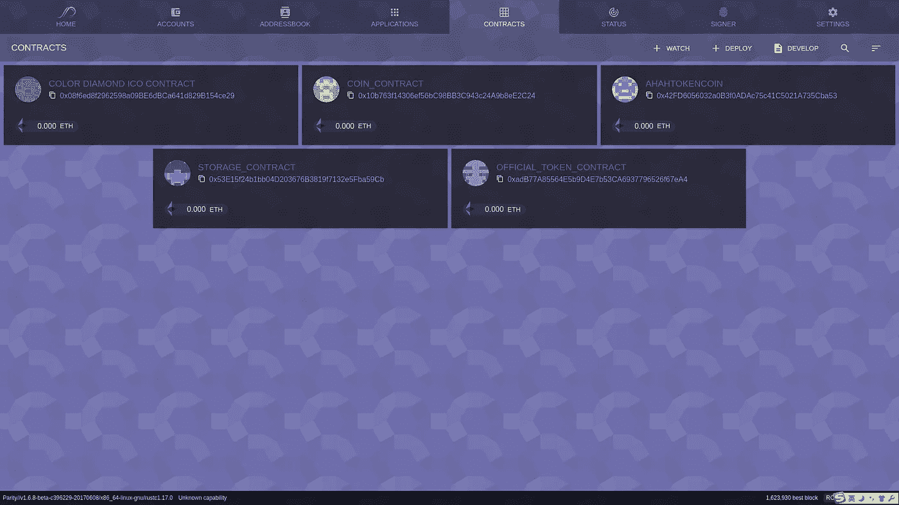
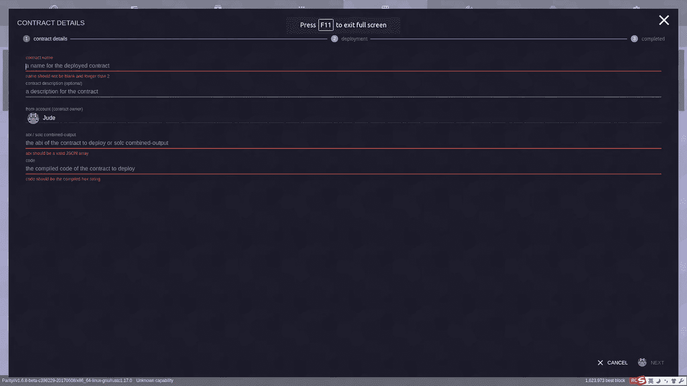
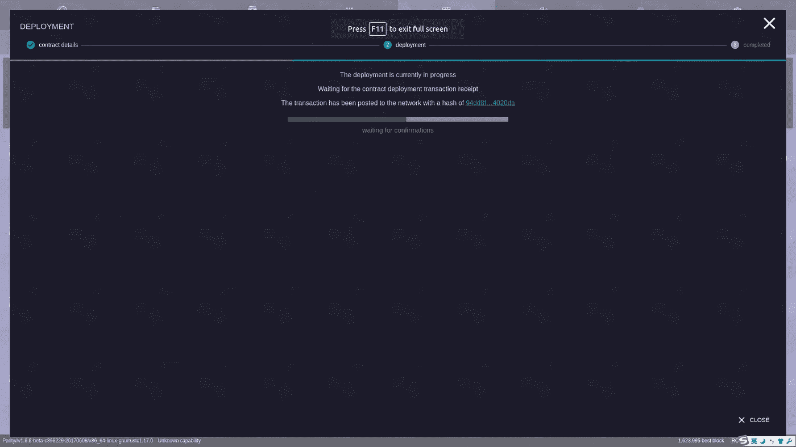

# 如何在以太坊 testnet 上部署智能合约？

> 原文：<https://medium.com/coinmonks/how-to-deploy-a-smart-contract-to-ethereum-testnet-e34fa5b10dd6?source=collection_archive---------0----------------------->

这是一个循序渐进的教程，适合那些想学习如何将合同部署到以太坊测试网的人。现在越来越多的人对以太坊上的智能合约开发感兴趣。当我开始学习 solidity 时，我想做的第一件事是部署一个合约，看看智能合约可以在区块链上做什么。因此，我决定写一篇博客来分享我如何在以太坊测试网上部署合同的经验。

> 交易新手？试试[加密交易机器人](/coinmonks/crypto-trading-bot-c2ffce8acb2a)或者[复制交易](/coinmonks/top-10-crypto-copy-trading-platforms-for-beginners-d0c37c7d698c)

1.写合同。在这种情况下，我们使用来自 [solidity 官方文件](http://solidity.readthedocs.io/en/develop/solidity-by-example.html)的最简单的合同。

```
**pragma** solidity **^**0.4.0;

**contract** SimpleStorage {
    **uint** storedData;

    **function** set(**uint** x) {
        storedData **=** x;
    }

    **function** get() **constant** **returns** (**uint**) {
        **return** storedData;
    }
}
```

2.我在这里使用的 testnet 是 [Roptsen](https://ropsten.etherscan.io/) 。你可以在这个龙头网站:[http://faucet.ropsten.be:3001/](http://faucet.ropsten.be:3001/)获得一些部署合同的免费乙醚。

3.使用钱包部署合同。我自己用的是平价。市场上还有许多其他选择。应该很像。要启动奇偶校验以连接 Ropsten testnet，您可以使用以下命令:

```
$ parity — chain ropsten — bootnodes “enode://20c9ad97c081d63397d7b685a412227a40e23c8bdc6688c6f37e97cfbc22d2b4d1db1510d8f61e6a8866ad7f0e17c02b14182d37ea7c3c8b9c2683aeb6b733a1@52.169.14.227:30303,enode://6ce05930c72abc632c58e2e4324f7c7ea478cec0ed4fa2528982cf34483094e9cbc9216e7aa349691242576d552a2a56aaeae426c5303ded677ce455ba1acd9d@13.84.180.240:30303”
```

在 localhost:8080 打开您的浏览器，您可以看到奇偶校验 web UI:



4.打开*合同*标签，点击*部署*按钮，您可以填写表格将您的合同提交到测试网。



5.要完成表单，您需要获得合同的 abi / solc 组合输出。您可以将合同保存在 *storage.sol* 文件中。使用以下命令编译该文件以获得输出(您可能需要首先安装 solc):

```
$ solc --combined-json abi,bin storage.sol
```

输出是:

```
{"contracts":{"storage.sol:SimpleStorage":{"abi":"[{\"constant\":false,\"inputs\":[{\"name\":\"x\",\"type\":\"uint256\"}],\"name\":\"set\",\"outputs\":[],\"payable\":false,\"stateMutability\":\"nonpayable\",\"type\":\"function\"},{\"constant\":true,\"inputs\":[],\"name\":\"get\",\"outputs\":[{\"name\":\"\",\"type\":\"uint256\"}],\"payable\":false,\"stateMutability\":\"view\",\"type\":\"function\"}]","bin":"6060604052341561000f57600080fd5b5b60ce8061001e6000396000f30060606040526000357c0100000000000000000000000000000000000000000000000000000000900463ffffffff16806360fe47b11460475780636d4ce63c146067575b600080fd5b3415605157600080fd5b60656004808035906020019091905050608d565b005b3415607157600080fd5b60776098565b6040518082815260200191505060405180910390f35b806000819055505b50565b6000805490505b905600a165627a7a72305820fbe58fb47842b138c5fd44d533bd6dd9324435d415c78395941197f0e01d69950029"}},"version":"0.4.16+commit.d7661dd9.Linux.g++"}
```

6.在您完成了用于部署契约的表单之后，您可以提交部署请求以将其部署到 testnet。



7.现在可以在 testnet blockchian 上看到部署的契约:[https://ropsten . ethers can . io/address/0x 18 a 0 fa 8 e 30 f 419 c 26744 dbdc 149 c 7 de 0 fcea 92d 0](https://ropsten.etherscan.io/address/0x18A0fa8e30f419c26744dBDC149c7de0fCea92D0)

部署智能合同很有趣。在区块链与他们互动更有趣。手脏了一般会学的更多更快。如果你还有其他问题，请在评论中留下你的问题。谢谢！

> 加入 Coinmonks [电报频道](https://t.me/coincodecap)和 [Youtube 频道](https://www.youtube.com/c/coinmonks/videos)获取每日[加密新闻](http://coincodecap.com/)

## 另外，阅读

*   [复制交易](/coinmonks/top-10-crypto-copy-trading-platforms-for-beginners-d0c37c7d698c) | [加密税务软件](/coinmonks/crypto-tax-software-ed4b4810e338)
*   [网格交易](https://coincodecap.com/grid-trading) | [加密硬件钱包](/coinmonks/the-best-cryptocurrency-hardware-wallets-of-2020-e28b1c124069)
*   [密码电报信号](http://Top 4 Telegram Channels for Crypto Traders) | [密码交易机器人](/coinmonks/crypto-trading-bot-c2ffce8acb2a)
*   [Pionex 双投](https://coincodecap.com/pionex-dual-investment) | [AdvCash 审核](https://coincodecap.com/advcash-review) | [光宗耀祖审核](https://coincodecap.com/uphold-review)
*   [面向开发者的 8 个最佳加密货币 API](https://coincodecap.com/best-cryptocurrency-apis)
*   [支持卡审核](https://coincodecap.com/uphold-card-review) | [信任钱包 vs 元掩码](https://coincodecap.com/trust-wallet-vs-metamask)
*   [赢取注册奖金——10 大最佳加密平台](https://coincodecap.com/earn-sign-up-bonus)
*   [最佳加密交易所](/coinmonks/crypto-exchange-dd2f9d6f3769) | [印度最佳加密交易所](/coinmonks/bitcoin-exchange-in-india-7f1fe79715c9)
*   [面向开发人员的最佳加密 API](/coinmonks/best-crypto-apis-for-developers-5efe3a597a9f)
*   最佳[密码借贷平台](/coinmonks/top-5-crypto-lending-platforms-in-2020-that-you-need-to-know-a1b675cec3fa)
*   [杠杆代币](/coinmonks/leveraged-token-3f5257808b22)终极指南