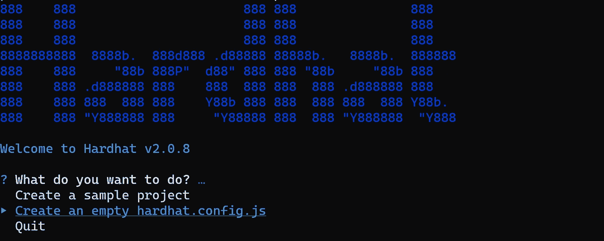

# 如何使用 Hardhat 和 Kovan testnet 将智能合约部署到 Etherscan.io

> 原文：<https://medium.com/coinmonks/how-to-deploy-a-smart-contract-to-etherscan-io-using-hardhat-and-kovan-testnet-a561ff563258?source=collection_archive---------2----------------------->



使用 Hardhat 部署您的智能合约很容易，因为它具有很大的灵活性，可以轻松修改您的项目。Hardhat 是一个 Ethereuem 开发环境，可以在几分钟内编译和部署一个智能契约。它支持三个以上的开发网络，如 Kovan、Ropsten、Goerli 和 Rinkeby，并且它有插件可以帮助将 solhint、web3、waffle、ganache、truffle5、etherscan、ether 集成到您的项目中。

**以太扫描**是一个分析平台和以太坊区块浏览器，帮助您查看任何未决或已确认的以太坊区块链交易的数据。由于以太坊是一个公共的、开放的区块链，无论何时任何人与它交互，这个动作都会被记录到交易历史中，任何人都可以看到。

在本教程中，您将使用 **alchemyapi.io** 这是一个区块链超级节点来创建您的 Kovan 网络。

**按照以下步骤部署您的第一份智能合同**

第一步是安装安全帽

**第一步:**

`npm install --save-dev hardhat`

**第二步:**

要创建您的 Hardhat 项目，请在您的项目文件夹中运行`npx hardhat`

**第三步:**

用自己的代码修改“ **contract** ”文件夹中的 solidity 代码，修改 **hardhat 配置文件:**

```
module.exports = {defaultNetwork: "kovan",networks: {hardhat: {},kovan: {url: "**kovan url https**",accounts: ["**Kovan** **metamask private key**"]}},etherscan: {// Your API key for Etherscan// Obtain one at https://etherscan.io/apiKey: "**etherscan apikey**"},solidity: "0.8.4",};
```

此外，更改**示例脚本:**

```
// We get the contract to deployconst Ecommerce = await ethers.getContractFactory("**name of your contract**");const myEcommerce = await Ecommerce.deploy();await myEcommerce.deployed();console.log("MyFirstContract deployed to:", myEcommerce.address);
```

> 注意:确保合同名称与 getContractFactory = ethers . getContractFactory(" ecommerce ")中的名称相同

**第四步:**

使用命令`npm install --save-dev @nomiclabs/hardhat-etherscan`安装 Hardhat etherscan

并将以下语句添加到您的`hardhat.config.js`中:

```
require("@nomiclabs/hardhat-etherscan");
```

**第五步:**

运行以下命令:

```
npx hardhat compile
```

**第六步:**

运行以下命令

```
npx hardhat run scripts/sample-script.js
```

sample-script 位于 scripts 文件夹中，因此将名称更改为您想要的名称，并使用新名称运行它。

例如:您将脚本名称更改为“Escript.js”，您的命令应该如下所示:

```
npx hardhat run scripts/Escript.js
```

键入上面的命令后，您应该会得到以下信息

MyFirstContract 部署到:0 xc 91 e 8 def dee 5952 BD 51 ad 500 a6 a82a 49821 b 83 BC

然后去[https://kovan.etherscan.io/](https://kovan.etherscan.io/)查地址

**第七步:**

使用以下命令验证地址

```
npx hardhat verify --network kovan  (address)npx hardhat verify --network kovan  0x9ee0a566f83*******
```

然后，您将获得以下信息

用 0.8.4
编译 1 个文件成功提交合同
contracts/ecommerce . sol:ecommerce at 0x c 91 e 8 def dee 5952 BD 51 ad 500 a6 a 82 a 49821 b 83 BC
的源代码，以便在 Etherscan 上验证。正在等待验证结果…

在 Etherscan 上成功验证了合同电子商务。
[https://kovan . ethers can . io/address/0x c 91 e 8 def dee 5952 BD 51 ad 500 a6 a82a 49821 b 83 BC # code](https://kovan.etherscan.io/address/0xc91e8DeFdEe5952BD51Ad500a6A82a49821b83Bc#code)

**第八步:**

为了能够在 etherscan 上与您的智能合约进行交互，您需要一些乙醚，要获得免费的乙醚进行测试，请使用以下链接:

为科万、[https://faucets.chain.link/](https://faucets.chain.link/)获得一个免费水龙头

或者观看我关于如何获得免费乙醚的视频[https://www.youtube.com/watch?v=5TsCD0cTlQI](https://www.youtube.com/watch?v=5TsCD0cTlQI)

> **注意:**您将使用您的 Kovan testnet 地址获取免费以太网。

然后去[https://kovan.etherscan.io/](https://kovan.etherscan.io/)测试

**第九步:**

为了能够在 etherscan 上编写合同，您需要将其连接到“元掩码”

**结论**

Hardhat 使得使用 Kovan、Ropsten、Gorlie 和 Rinkeby testnet 将您的智能合约部署到 etherscan 变得非常容易。

完整项目:[https://github.com/wise4rmgod/Ecommerce](https://github.com/wise4rmgod/Ecommerce)

下面我们连线
推特:[https://twitter.com/Joklinztech](https://twitter.com/Joklinztech)LinkedIn:[https://www.linkedin.com/in/wisdom-nwokocha-76212a77/](https://www.linkedin.com/in/wisdom-nwokocha-76212a77/)Youtube 频道:[https://www.youtube.com/channel/UCGh4vu4cVz72cvgFG2QHnWQ](https://www.youtube.com/channel/UCGh4vu4cVz72cvgFG2QHnWQ)

> 加入 Coinmonks [电报频道](https://t.me/coincodecap)和 [Youtube 频道](https://www.youtube.com/c/coinmonks/videos)了解加密交易和投资

## 也阅读

[](/coinmonks/leveraged-token-3f5257808b22) [## 杠杆代币[多头代币]终极指南

### 杠杆化令牌是具有杠杆化风险敞口的 ERC20 令牌，不考虑保证金、要求、管理…

medium.com](/coinmonks/leveraged-token-3f5257808b22) [](https://blog.coincodecap.com/crypto-exchange) [## 最佳加密交易所| 2021 年十大加密货币交易所

### 加密货币交易所的加密交易需要了解市场，这可以帮助你获得利润。之前…

blog.coincodecap.com](https://blog.coincodecap.com/crypto-exchange) [](https://blog.coincodecap.com/best-swap-platforms) [## 2021 年最佳加密交换平台| CoinCodeCap

### 编辑描述

blog.coincodecap.com](https://blog.coincodecap.com/best-swap-platforms)  [## 10 大最佳网上赌场[2021] |赢取免费 BTC | CoinCodeCap

### 编辑描述

blog.coincodecap.com](https://blog.coincodecap.com/best-online-casinos) [](/coinmonks/top-5-crypto-lending-platforms-in-2020-that-you-need-to-know-a1b675cec3fa) [## 2021 年最佳加密借贷平台| 6 大比特币借贷平台

### 获得比特币和其他加密货币的最佳贷款利率

medium.com](/coinmonks/top-5-crypto-lending-platforms-in-2020-that-you-need-to-know-a1b675cec3fa) [](/coinmonks/the-best-cryptocurrency-hardware-wallets-of-2020-e28b1c124069) [## 2021 年 6 大最佳硬件钱包|顶级加密硬件钱包[更新]

### 最好的加密货币硬件钱包是绝对必要的。我们将在 NGRAVE、Ledger Nano X 和…

medium.com](/coinmonks/the-best-cryptocurrency-hardware-wallets-of-2020-e28b1c124069) [](/coinmonks/crypto-trading-bot-c2ffce8acb2a) [## 2021 年最佳免费加密交易机器人

### 2021 年币安、比特币基地、库币和其他密码交易所的最佳密码交易机器人。四进制，位间隙…

medium.com](/coinmonks/crypto-trading-bot-c2ffce8acb2a) [](/coinmonks/best-crypto-signals-telegram-5785cdbc4b2b) [## 最佳 4 个加密交易信号电报通道

### 这是乏味的找到正确的加密交易信号提供商。因此，在本文中，我们将讨论最好的…

medium.com](/coinmonks/best-crypto-signals-telegram-5785cdbc4b2b)