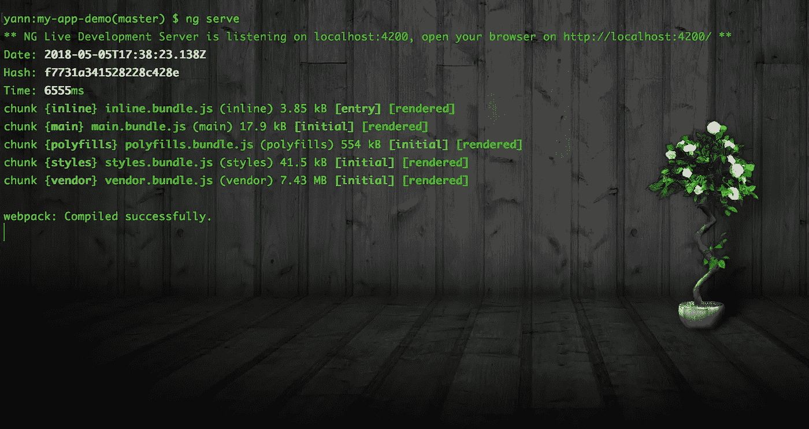
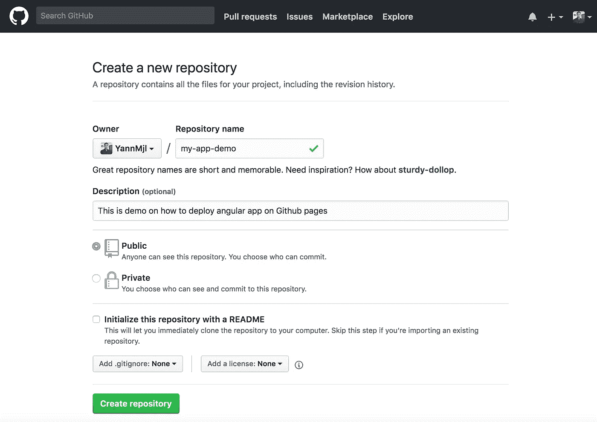
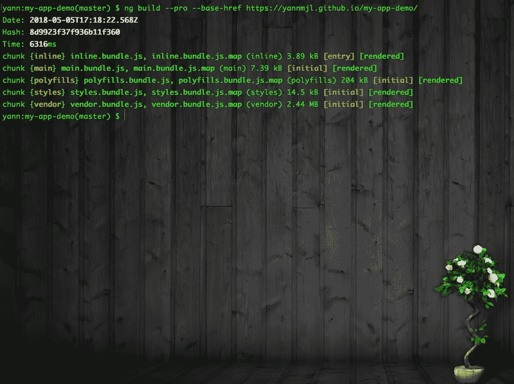
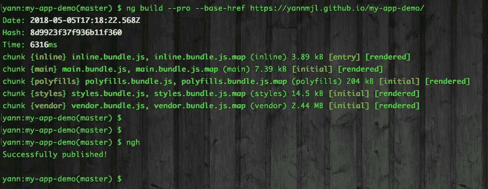
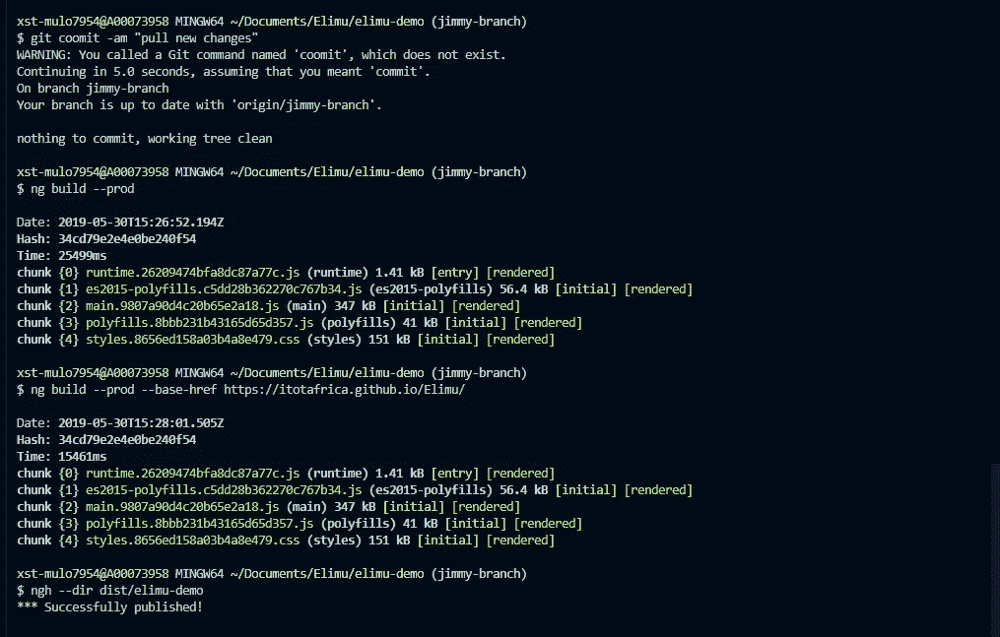
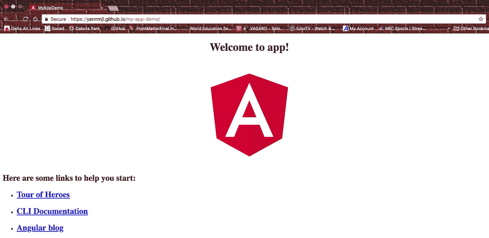

# 如何部署 Angular App

> 原文：<https://medium.com/coinmonks/how-to-deploy-an-angular-app-8db1af39f8c1?source=collection_archive---------0----------------------->

> **前端:角度& GitHub**


我最近在做一个有趣的个人项目，创建一个基于网络的客户端管理工具，并用 angular 构建我的前端应用程序。现在，如果你和我一样是 angular 的新手，你会感到非常困惑，而且没有多少关于如何让你的应用程序供其他人使用的指令(将 Angular 应用程序从开发环境带到用户可以访问和使用的真实环境)。

因此，出于本文的目的，我们将探索如何在 [***GitHub 页面***](https://pages.github.com/) ***上部署或发布 Angular app。***

我假设你已经创建了一个 angular 应用程序或者正在开发一个，并且熟悉 angular CLI、Git 和 Github。[***Angular CLI***](https://github.com/angular/angular-cli)可以轻松创建开箱即用的应用程序。它已经遵循了我们的最佳实践。如果你还没有安装，我强烈建议你安装。

*   ***棱角分明的 CLI 安装***

```
npm install -g @angular/cli
```

如果您没有要部署的 angular 项目，您可以简单地创建一个演示项目，然后运行命令" *ng new"* "，后跟您的应用程序名称。我决定将我的命名为“我的应用程序演示”，你的将有一个不同的名称，或者你可以命名为任何你想要的:

```
ng new my-app-demo
```

创建后，将工作目录更改为您的应用程序目录，并运行它以确保一切正常工作:

```
cd my-app-demo
ng serve --open
```

ng“serve”后跟“ *— open* ”标志将自动启动并打开网络浏览器。如果你只是简单地输入“ *ng serve* ”，一旦你的应用启动并运行，访问页面 [http://localhost:4200](http://localhost:4200/) 以确保一切正常。我的应用程序演示如下所示:



screenshot of terminal — mac

下一步是确保你的电脑上安装了 [***ghpages 包***](https://github.com/angular-schule/angular-cli-ghpages) 。ghpages 包用于将您的构建文件部署到 GitHub 页面。运行以下命令进行全局安装:

```
npm install -g angular-cli-ghpages
```

*   ***创建 GitHub 库***



*   ***推送内容到你的 GitHub 库***

遵循下面的快速设置步骤。设置远程存储库时，请确保将路径替换为远程存储库的正确路径:

```
echo "# my-app-demo" >> README.md
git init
git add .
git commit -m "first commit"
git remote add origin https://github.com/githubusername/reponame.git
git push -u origin master
```

现在，运行“ng build”创建一个分发文件夹，其中包含您的项目在生产环境或服务器主机中运行所需的所有文件。

```
ng build --prod
```

将生产标志“prod”添加到 *ng build* 中可以显著减小包文件的大小。如果你的应用程序没有集成任何类型的后端，你可以简单地把你的 dist 文件夹的内容通过 FTP 上传到服务器，你的应用程序就可以正常工作了。

您还可以使用以下命令指定构建文件的基引用:

```
ng build --prod --base-href //urlOfYourSubfolderDomain
```

# ***将您的应用部署到 Github 页面***

为了部署到 Github 页面，我们需要运行带有 *base-href* 标志的" *ng build* "，如下所示:

```
ng build --prod --base-href [https://yourGithub-username.github.io/reponame/](https://yannmjl.github.io/cloudRepo-report/)
```

确保将您的 Github 用户名和您与 angular 应用程序的本地存储库相关联的远程存储库的名称放在一起。我的看起来像这样:



Screenshot of terminal — mac

*在路径末尾的存储库名称后添加斜线“/”非常重要，否则它将不起作用。*

现在，一旦完成，就可以运行 ***ngh*** 来调用我们之前安装的 hgpage 命令行接口工具。

> **原来 Angular 6 把** `**angular.json**` **的** `**"outputPath": "dist/"**` **改成了** `**"outputPath": "dist/[PROJECTNAME]"**` **，把 dist 文件夹里的东西都放在一个子文件夹里，这就打破了 ngh 的功能性。**

```
ngh
```

如果您使用的是 Agular 6 和更高版本，请运行:

```
ngh --dir dist/[PROJECTNAME]
```

这是我在破坏了我的项目演示的 ng 版本后运行 ngh 的截图:



下面是我在最近用 Angular 6 版本构建的项目上运行 ngh 时的截图:



成功发布后，只需继续访问您在 base-href 标志上指定的那个 ***URL*** ，查看您的部署和发布 angular 应用程序的运行情况。以下是我的截图:



所以，就这样了！现在，您可以继续对您的应用程序进行更改，只要您想与组织中的其他人共享或只是想发布它，只需重复构建和部署过程。

> *如果你喜欢这篇文章，你可能也会喜欢“* [**如何构建物联网双向应用/用 Python 聊天**](/coinmonks/how-to-built-a-bidirectional-app-for-internet-of-thing-chat-with-python-fc926e605b0f)*”*

> 干杯！！！
> 
> 加入 Coinmonks [电报频道](https://t.me/coincodecap)和 [Youtube 频道](https://www.youtube.com/c/coinmonks/videos)获取每日[加密新闻](http://coincodecap.com/)

## 另外，阅读

*   [密码电报信号](http://Top 4 Telegram Channels for Crypto Traders) | [密码交易机器人](/coinmonks/crypto-trading-bot-c2ffce8acb2a)
*   [复制交易](/coinmonks/top-10-crypto-copy-trading-platforms-for-beginners-d0c37c7d698c) | [加密税务软件](/coinmonks/crypto-tax-software-ed4b4810e338)
*   [网格交易](https://coincodecap.com/grid-trading) | [加密硬件钱包](/coinmonks/the-best-cryptocurrency-hardware-wallets-of-2020-e28b1c124069)
*   [印度的加密交易所](/coinmonks/crypto-exchange-dd2f9d6f3769) | [印度的加密应用](/coinmonks/buy-bitcoin-in-india-feb50ddfef94)
*   开发人员的最佳加密 API
*   最佳[加密贷款平台](/coinmonks/top-5-crypto-lending-platforms-in-2020-that-you-need-to-know-a1b675cec3fa)
*   杠杆代币的终极指南
*   [n 零复习](/coinmonks/ngrave-zero-review-c465cf8307fc) | [Phemex 复习](/coinmonks/phemex-review-4cfba0b49e28) | [PrimeXBT 复习](/coinmonks/primexbt-review-88e0815be858)
*   最佳[区块链分析](https://bitquery.io/blog/best-blockchain-analysis-tools-and-software)工具| [赚比特币](/coinmonks/earn-bitcoin-6e8bd3c592d9)
*   [Cloudbet 赌场评论](https://coincodecap.com/cloudbet-casino-review) | [点火赌场评论](https://coincodecap.com/ignition-casino-review)
*   [加密套利](/coinmonks/crypto-arbitrage-guide-how-to-make-money-as-a-beginner-62bfe5c868f6)指南| [如何做空比特币](/coinmonks/how-to-short-bitcoin-568a2d0b4ae5)
*   [如何在加拿大购买加密货币？](https://coincodecap.com/how-to-buy-cryptocurrency-in-canada)