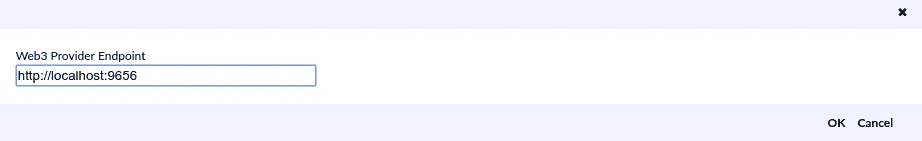

# 如何在 Expanse 区块链上部署智能合约？

> 原文：<https://medium.com/coinmonks/how-to-deploy-smart-contracts-on-expanse-blockchain-f3d68b4c0523?source=collection_archive---------6----------------------->


**什么叫广阔？**
现在，Expanse 平台已经有了两年持续增长和稳定的历史。开始时很小，但有很大的想法，团队在不断壮大，其他项目现在也在加入进来，以帮助实现梦想——只受到世界各地参与旅程的所有不同人的想象力和才华的限制。

**无垠和以太坊有什么区别？expense 的交易费用较低，tech 设立了一个 100 万美元的发展基金，为在 expense 及其周边地区建设的创新项目提供资金支持。奖励从 **$5，000** 到 **$50，000** 不等，没有任何附加条件:你继续拥有你的知识产权，可以按照你的意愿自由发表，并且可以在没有任何限制或义务的情况下使用资助资金，除非所有项目都必须以某种方式使用 expense 网络。**

## 设置 Expanse 智能合同需要什么？

你需要安装 Gexp 和任何网络浏览器。

*   下载最新的 [Gexp 版本](https://github.com/expanse-org/go-expanse/releases)
*   构建 gexp 需要安装 **Go** 和 **C** 编译器:

```
sudo apt-get install -y build-essential golang
```

*   最后，使用下面的命令构建 gexp 程序。
*   运行它！

```
cd go-expanse-master
make gexpgexp --rpc --rpccorsdomain "[https://remix.ethereum.org/](https://remix.ethereum.org/)" console
```

这个命令允许 **remix** 连接到你的节点(我们稍后会谈到 **remix** )。
输出应该是这样的:

```
Welcome to the Gexp JavaScript console!instance: Gexp/v1.7.2-stable/linux-amd64/go1.9.2
coinbase: <your_address>
at block: 1173495 (Tue, 22 May 2018 20:35:48 EEST)
 datadir: /home/<your_user>/.expanse
 modules: admin:1.0 debug:1.0 eth:1.0 exp:1.0 miner:1.0 net:1.0 personal:1.0 rpc:1.0 txpool:1.0 web3:1.0>
```

你的`coinbase`一定有些经验。如果您想在 Testnet(推荐用于测试)上部署契约，请确保运行测试网络并在其上挖掘一些经验。您可以使用以下命令连接到 testnetwork:

```
gexp --testnet --fast --cache=512 console
```

如果这是您第一次启动 Gexp，或者您已经有一段时间没有启动它了，区块链可能需要一段时间才能同步。您可以使用 eth.syncing 检查同步进度。如果同步完成，这将返回 false，否则您必须等待，直到 currentBlock 与 highestBlock 匹配。通常 gexp 会在不到一个小时内完全同步。

# 撰写您的第一份智能合同

这是我们的智能契约令牌示例。这是一个简单的令牌(不是 ERC20 令牌),只有一个构造函数、两个函数和一些字段。将这段代码复制到一个纯文本文件中并保存。

```
pragma solidity ^0.4.21;contract Coin { 
   // The keyword “public” makes those variables 
   // readable from outside. 
   address public owner; 
   string public name; 
   uint256 public totalSupply; 
   mapping (address => uint) public balances;               
   event Sent(address from, address to, uint amount);

   // contructor run only when the contract is created.
   function Coin() public { 
      totalSupply = 10000; 
      name = ‘dincCoin’; 
      owner = msg.sender; 
      balances[owner] = totalSupply; 
   } 
   function send(address receiver, uint amount) public { 
      if (balances[msg.sender] < amount) return;
      balances[msg.sender] -= amount; 
      balances[receiver] += amount; 
      emit Sent(msg.sender, receiver, amount); 
   }
}
```

# 使用 Remix 编译和部署您的合同

现在我们需要将我们的可靠性代码编译成一个接口(abi)和字节码(bin ),它们可以部署到区块链上。

## 1.打开 [remix](https://remix.ethereum.org/) ，粘贴你的代码。


## 2.解锁您的帐户。

```
personal.unlockAccount('0xD5a1a07d033169CFedA8AB7482D7006C5ea5e72A', "123")
```

## 4.打开“运行”选项卡，将环境从默认的“注入的 Web3”更改为“Web3 提供商”，然后单击“确定”。

这将在 remix 和您的本地节点之间创建一个连接。

## 5.设置 Expanse Web3 提供者端点—'[http://localhost:9656 '](http://localhost:9656')并单击“确定”



## 6.选择带有一些 Exp 的地址并单击部署，它将创建一个新的事务，所以等到它被挖掘。


混音将被要求在发射前保存 **ABI** ，所以做吧！
在您的 Gexp 控制台中，您会看到类似这样的内容:

```
> INFO [05-22|22:21:56] Submitted contract creation              fullhash=0x11179f830360611c86e007dce2ae40b635228e5bfb3b397d6651abf1e5bfbe7c contract=0xE6C6ad0dCCf94D18e9D47d47961e3852cc296973
```

就是这样，现在您可以与您的智能合同进行交互。

# 与您的合同互动

等待大约一分钟，让你的合同在 Expanse 网络上被挖掘，然后输入你可以调用一些函数，甚至将这个令牌发送到另一个地址。


**干得好**
恭喜！您已经成功地将您的第一个智能合同部署到了**expense**网络上，这是 expense 区块链开发世界中的重要一步。

现在你可以深入到 solidity 文档中，了解一下[ERC 20](https://en.wikipedia.org/wiki/ERC20)standard，释放你的令牌，甚至是 [ICO](https://en.wikipedia.org/wiki/Initial_coin_offering) 。还有一些工具可以大大加快这个过程。我个人使用 Truffle 来部署我的大部分合同(他们将部署过程称为“迁移”)，一旦部署完毕，我就将它们添加到 Expanse wallet 中与它们进行交互。您甚至可以直接从 Mist 部署契约，或者编写一个 Python 脚本来为您完成繁重的工作。正如您所看到的，有很多方法可以部署智能合约并与之交互，只需要做一些实验就可以确定哪种方法最适合您的工作流。

希望你喜欢这篇文章，如果你有任何问题，请在下面发表评论。

## 连接

[不和谐](https://discord.me/expanse) [电报](https://t.me/ExpanseTech) [俄罗斯电报](https://t.me/RussianExpanse)

了解更多关于广阔无垠的知识

[扩展授权](https://expanse.tech/expgrants/)