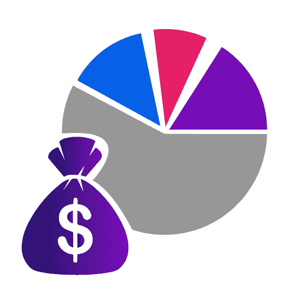

# 如何设计机器学习交易机器人——第 6 部分:风险管理

> 原文：<https://medium.com/coinmonks/how-to-design-a-machine-learning-trading-bot-part-6-risk-management-886cf0cb2704?source=collection_archive---------4----------------------->

## 通过阅读这篇文章，你将有机会节省至少 59 美元。

**《如何设计机器学习交易机器人》前情提要**

我们已经从[开始收集数据](https://25mordad.medium.com/how-to-design-a-machine-learning-trading-bot-part1-data-collection-b63e36a7e606):

我们发现了什么是 OHLCV 数据，我们了解了为什么我们需要历史数据和在线数据。

然后我们继续进行[数据分析](https://25mordad.medium.com/how-to-design-a-machine-learning-trading-bot-part2-data-analysis-f42a669dcd4c)

我们已经看到了清理包括特征工程在内的数据是多么重要。我们了解到，为了建立一个稳定的机器学习模型，我们需要以正确的方式准备数据，最后，我们发现了可视化数据如何帮助我们实现目标。

然后我们继续[寻找一个模式](https://25mordad.medium.com/how-to-design-a-machine-learning-trading-bot-part3-pattern-recognition-e7736a5b558)，我们注意到你可以像天文学家一样被困在数据中寻找一个模式，并且总是遵循科学的方法，扮演一个天文学家。然后我们找到了一个非常简单的模式“SMA20”，我们讨论了如何将它们标记为[0，1]。

然后，我们[建立一个模型](https://25mordad.medium.com/how-to-design-a-machine-learning-trading-bot-part4-build-a-model-6db5f2aa0818)。我们解释过，在你做了一个 ML(机器学习)模型之后，你应该用回溯测试来评估它。而此时，你需要一个买卖策略。意思是，我们已经有开仓/空仓的信号了。

最后，我们展示了如何通过这些操作[运行自动化](https://25mordad.medium.com/how-to-design-a-machine-learning-trading-bot-part5-running-an-automation-e38bc1652e59):

*   定购
*   取回订单
*   取消订单
*   获取资产余额
*   获取在线价格

接下来是理解交易所、API 和现货交易的概念。

现在是时候处理我们已经建立的头寸，确保我们达到利润或尽可能减少损失。

**第六步:监控交易和风险管理**

首先，我们开始回答这个问题:

> 为什么我们需要监控交易和头寸？

回到几年前的经典交易，当你根据一个给定的信号建仓时，你需要的所有信息都已经由信号制造者给你了，这是很正常的。

**Risk Management**

下面的例子就是这种经典信号之一:

*   市场:随便；)
*   侧面:购买
*   订单类型:限额
*   开放位置:100
*   获利回吐 1: 110
*   获利回吐 2: 115
*   止损:90

正如你所看到的，你已经得到了所有你需要的信息，TP1，TP2 和 SL。假设我们是信号制造者，试着用我们的数据视觉去理解这个信号的含义。

信号制造者:根据我已经收集的数据，我已经决定了什么是对我最好的交易。而且我不在乎开仓后会发生什么，因为我太聪明了，我预测到了可能发生的事情，为此，我已经设置了止损和止盈。

你能看出这种预测和行动背后的问题吗？

修复这个错误会很容易。我们需要用来自市场的新数据来评估我们的交易，我们应该在头寸仍然开放时灵活地改变止损或获利。从这个角度来看，我们可以遵循三种方法:

1.  每分钟更新一次 SL 和 TP(最小时间范围)
2.  在每个[确定的]时期(不是你交易的时期)更新 SL 和 TP
3.  在你交易的时间范围内更新 SL 和 TP。

*那么，这意味着什么呢？*

让我们假设我们在 1H(1 小时)时间框架内交易。

> 在 1H 时间框架内交易意味着我们的买卖决定是基于 1H 的 OHLCV。

1-然后，每分钟更新 SL 和 TP(方法 1)意味着我们将决定在 1 分钟 OHLCV 改变 TP 和 SL。

2-方法 2:如果我们决定根据过去 15 分钟内的变化每 15 分钟更改一次 TP 或 SL(较低的时间范围)，或者如果我们每 2 小时更新一次 SL 或 TP(较高的时间范围)

3-按照第三种方法，你将通过查看最后一个小时的数据来决定每小时改变 SL 或 TP。

如果你从我们的[第一集](/coinmonks/how-to-design-a-machine-learning-trading-bot-part1-data-collection-b63e36a7e606)就开始关注我，你会发现我总是选择最简单的方式去设计，然后再去开发。这是我估计想法的诀窍。嗯，我敢打赌，你知道我们应该开始什么方法！

是的，没错。我们继续第三种方法，在交易的同时更新 SL 和 TP。

## **机器学习:**

它又回来了。你记得我们到目前为止做了什么吗？让我们回顾一下:

1.  [数据采集](/coinmonks/how-to-design-a-machine-learning-trading-bot-part1-data-collection-b63e36a7e606)
2.  [分析数据](https://25mordad.medium.com/how-to-design-a-machine-learning-trading-bot-part2-data-analysis-f42a669dcd4c)
3.  [模式识别](https://25mordad.medium.com/how-to-design-a-machine-learning-trading-bot-part3-pattern-recognition-e7736a5b558)
4.  [建立模型](https://25mordad.medium.com/how-to-design-a-machine-learning-trading-bot-part4-build-a-model-6db5f2aa0818)
5.  [运行自动化](https://25mordad.medium.com/how-to-design-a-machine-learning-trading-bot-part5-running-an-automation-e38bc1652e59)

所以，我有好消息和坏消息。坏消息是我们不得不重复所有这些步骤。好消息是，我们已经做过一次，然后很容易在小范围内再做一次。

首先，我们收集最后一个小时的数据(OHLCV)，从我们开仓到我们想要处理的时间。

然后，我们对其进行分析并找到合适的特征。此时和之前分析数据的一个区别是关于交易头寸。意味着我们在这一点上的关键特征是我们的贸易入口。

之后，我们需要找到一个模式，进行训练和测试，还有回溯测试。

然后，我们应该做一个模型。

最后，我们需要运行 bot 来更改交换机上的 SL 或 TP。例如，在这一步中，您可能需要在交易所取消旧的 SL，并为新的 SL 下一个新订单。

**结论:**

风险管理和头寸监控是与新输入和输出的交易分开的部分。为了达到积极的结果，你需要再次做从 1 到 5 的所有部分。在我们的开发季(从 2021 年 1 月开始)，当我们想要开发这部分时，我们会更深入地讨论它。

**我们现在要做什么？**

**大约 1DES**

1DES 是由机器学习驱动的交易解决方案。在 1DES，我们提供了一种利用机器学习技术进行交易的创新方法。

1Des 为所有用户提供“免费试用”计划。

此外，如果你想更专业地交易，还有其他计划，目前他们都有 50%的折扣。

此外，作为对本文读者的特别优惠，如果您在 2021 年 3 月 20 日之前选择 Avion 或 Rocket 计划之一，1DES 将退还第一个月的订阅费。

 [## 机器学习驱动的交易解决方案

### 在 1DES 上免费注册，您将在您的电子邮件中收到一个验证码，方法是点击您的注册链接…

1des.com](https://1des.com/?utm_source=medium&utm_medium=story&utm_campaign=how_design&utm_term=p_6&utm_content=risk_management) 

## 另外，阅读

*   [密码交易机器人](/coinmonks/crypto-trading-bot-c2ffce8acb2a)
*   [Uniswap API](https://bitquery.io/blog/uniswap-pool-api) —如何获取 Uniswap 数据？
*   [AAX 交易所评论](/coinmonks/aax-exchange-review-2021-67c5ea09330c) |推荐代码、交易费用、利弊
*   [Deribit 审查](/coinmonks/deribit-review-options-fees-apis-and-testnet-2ca16c4bbdb2) |选项、费用、API 和 Testnet
*   [FTX 密码交易所评论](/coinmonks/ftx-crypto-exchange-review-53664ac1198f)
*   [Bybit 交换审查](/coinmonks/bybit-exchange-review-dbd570019b71)
*   最好的比特币[硬件钱包](/coinmonks/the-best-cryptocurrency-hardware-wallets-of-2020-e28b1c124069?source=friends_link&sk=324dd9ff8556ab578d71e7ad7658ad7c)
*   [密码本交易平台](/coinmonks/top-10-crypto-copy-trading-platforms-for-beginners-d0c37c7d698c)
*   [Bitsgap vs 3 commas vs quad ency](https://blog.coincodecap.com/bitsgap-3commas-quadency)
*   最好的[加密税务软件](/coinmonks/best-crypto-tax-tool-for-my-money-72d4b430816b)
*   [最佳加密交易平台](/coinmonks/the-best-crypto-trading-platforms-in-2020-the-definitive-guide-updated-c72f8b874555)
*   最佳[加密贷款平台](/coinmonks/top-5-crypto-lending-platforms-in-2020-that-you-need-to-know-a1b675cec3fa)
*   [莱杰 Nano S vs 特雷佐 one vs 特雷佐 T vs 莱杰 Nano X](https://blog.coincodecap.com/ledger-nano-s-vs-trezor-one-ledger-nano-x-trezor-t)
*   [block fi vs Celsius](/coinmonks/blockfi-vs-celsius-vs-hodlnaut-8a1cc8c26630)vs Hodlnaut
*   [bits gap review](/coinmonks/bitsgap-review-a-crypto-trading-bot-that-makes-easy-money-a5d88a336df2)——一个轻松赚钱的加密交易机器人
*   为专业人士设计的加密交易机器人
*   [PrimeXBT 审查](/coinmonks/primexbt-review-88e0815be858) |杠杆交易、费用和交易
*   [Altrady 评论](https://blog.coincodecap.com/altrady-reivew)
*   [埃利帕尔泰坦评论](/coinmonks/ellipal-titan-review-85e9071dd029)
*   [赛克斯石评论](https://blog.coincodecap.com/secux-stone-hardware-wallet-review)
*   [BlockFi 评论](/coinmonks/blockfi-review-53096053c097) |赚取高达 8.6%的加密利息
*   开发人员的最佳加密 API
*   [最佳区块链分析工具](https://bitquery.io/blog/best-blockchain-analysis-tools-and-software)
*   [加密套利](/coinmonks/crypto-arbitrage-guide-how-to-make-money-as-a-beginner-62bfe5c868f6)指南:新手如何赚钱
*   顶级[比特币节点](https://blog.coincodecap.com/bitcoin-node-solutions)提供商
*   最佳[加密制图工具](/coinmonks/what-are-the-best-charting-platforms-for-cryptocurrency-trading-85aade584d80)
*   了解比特币的[最佳书籍有哪些？](/coinmonks/what-are-the-best-books-to-learn-bitcoin-409aeb9aff4b)

> [在您的收件箱中直接获得最佳软件交易](/coinmonks/newsletters/coinmonks)

