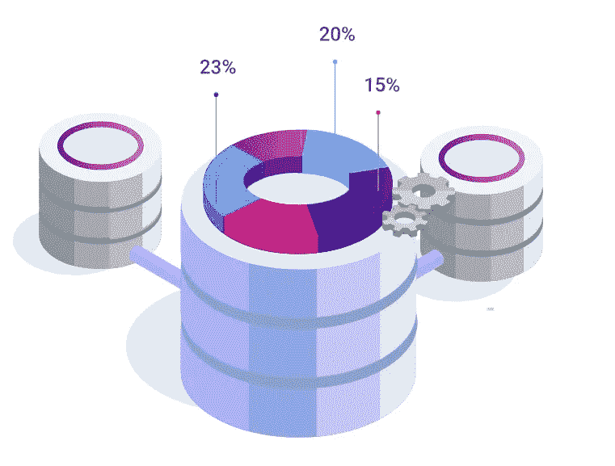

# 如何设计机器学习交易机器人——第一部分:数据收集

> 原文：<https://medium.com/coinmonks/how-to-design-a-machine-learning-trading-bot-part1-data-collection-b63e36a7e606?source=collection_archive---------2----------------------->

*   通过阅读这篇文章，你将有机会节省至少 59 美元。

How to design a machine learning trading bot

用机器学习方法交易刚刚开始，很多人想了解更多。在这一系列文章中，我将告诉你如何设计和开发智能自动化来进行市场交易。

本文是题为“如何设计一个机器学习交易机器人”的系列文章中的第一集

在本文中，我们将设计一个管道。我们目前没有开发交易程序。然而，当我们制定我们的计划时，在下个赛季我们将实施这个计划。

这是我们期望在未来文章中遵循的内容列表:
第一季第一集:收集数据(*我们在这里！* )
第一季第二集:[分析数据](https://25mordad.medium.com/how-to-design-a-machine-learning-trading-bot-part2-data-analysis-f42a669dcd4c)(2020 年 11 月第三周)

S1E3: [在分析数据中寻找模式](https://25mordad.medium.com/how-to-design-a-machine-learning-trading-bot-part3-pattern-recognition-e7736a5b558)(2020 年 11 月，第 4 周)

S1E4: [根据确定的模式建立模型](https://25mordad.medium.com/how-to-design-a-machine-learning-trading-bot-part4-build-a-model-6db5f2aa0818)(2020 年 12 月，第一周)

S1E5: [运行自动化](https://25mordad.medium.com/how-to-design-a-machine-learning-trading-bot-part5-running-an-automation-e38bc1652e59)(2020 年 12 月，第 2 周)
S1E6: [监控交易和风险管理](https://25mordad.medium.com/how-to-design-a-machine-learning-trading-bot-part-6-risk-management-886cf0cb2704)(2020 年 12 月，第 3 周)
S2: [开发](https://1des.com/blog/posts/how-to-develop-machine-learning-trading-bot-data-collection)(2021 年 7 月)

在你开始你的发展之前，你对你想做什么和你想实现什么有一个清晰的想法是非常重要的。

# **第一步:收集数据**

你想交易哪个市场？是加密市场还是外汇市场？也许是股市？在开始任何事情之前，你应该确保你手中有正确的数据。让我们以加密货币市场为例。

Collecting Data

在加密货币市场中，每个交易所都有不同的数据，但大多数交易所在大多数时间都遵循主要趋势。我建议选择一个在市场上最有效的主要交易所，那就是币安。然后，选择您想要处理的货币对，例如比特币/美元或比特币/欧元。在我们的示例中，我们选择币安的 BTC/USDT。

现在，我们需要两件东西:首先，我们应该开始收集币安的资料，我们还需要 BTC/USDT 在币安的历史资料。有很多网站和网络服务免费提供历史数据。
那么，我们为什么需要历史数据，为什么现在就要开始收集数据呢？

在下文中，我们将使用历史数据来分析它们，并在数据中找到一种模式。另外，我们需要开始收集数据，以便在我们的预测部分使用它们。预测部分是我们流程中“构建模型”的一部分。
在我们结束这篇文章之前，让我们更具体地谈谈我们对数据的期望。
我们需要的最小数值数据是 OHLCV 数据，我建议收集 1m(一分钟)的数据帧。

# OHLCV:

OHLCV 代表
O:开盘价
H:高价
L:低价
C:收盘价
V:成交量
在我们下一季(开发季)的文章中，我们将展示如何开发一个程序，从 BTC/USDT 收集 100 万 OHLCV。

# 我们现在要做什么？

**关于 1DES**

[1DES](https://1des.com/) 是由机器学习驱动的交易解决方案。在 1DES，我们提供了一种利用机器学习技术进行交易的创新方法。

 [## 机器学习驱动的交易解决方案

### 1 月 1 日免费注册

1des.com](https://1des.com/?utm_source=medium&utm_medium=story&utm_campaign=how_design&utm_term=p_1&utm_content=data_collection) 

1Des 为所有用户提供“免费试用”计划。

此外，如果你想更专业地交易，还有其他计划，目前他们都有 50%的折扣。

此外，作为对本文读者的特别优惠，如果您在 2021 年 3 月 20 日之前选择 Avion 或 Rocket 计划之一，1DES 将退还第一个月的订阅费。

## 另外，阅读

*   最好的[密码交易机器人](/coinmonks/crypto-trading-bot-c2ffce8acb2a)
*   [Uniswap API](https://bitquery.io/blog/uniswap-pool-api) —如何获取 Uniswap 数据？
*   [德里比特评论](/coinmonks/deribit-review-options-fees-apis-and-testnet-2ca16c4bbdb2) |选项、费用、API 和 Testnet
*   [FTX 密码交易所评论](/coinmonks/ftx-crypto-exchange-review-53664ac1198f)
*   [Bybit 交换审查](/coinmonks/bybit-exchange-review-dbd570019b71)
*   最好的比特币[硬件钱包](/coinmonks/the-best-cryptocurrency-hardware-wallets-of-2020-e28b1c124069?source=friends_link&sk=324dd9ff8556ab578d71e7ad7658ad7c)
*   [密码本交易平台](/coinmonks/top-10-crypto-copy-trading-platforms-for-beginners-d0c37c7d698c)
*   [bits gap vs 3 commas vs quad ency](https://blog.coincodecap.com/bitsgap-3commas-quadency)
*   最好的[加密税务软件](/coinmonks/best-crypto-tax-tool-for-my-money-72d4b430816b)
*   [最佳加密交易平台](/coinmonks/the-best-crypto-trading-platforms-in-2020-the-definitive-guide-updated-c72f8b874555)
*   最佳[密码借贷平台](/coinmonks/top-5-crypto-lending-platforms-in-2020-that-you-need-to-know-a1b675cec3fa)
*   [莱杰 Nano S vs 特雷佐 one vs 特雷佐 T vs 莱杰 Nano X](https://blog.coincodecap.com/ledger-nano-s-vs-trezor-one-ledger-nano-x-trezor-t)
*   [block fi vs Celsius](/coinmonks/blockfi-vs-celsius-vs-hodlnaut-8a1cc8c26630)vs Hodlnaut
*   [bits gap review](/coinmonks/bitsgap-review-a-crypto-trading-bot-that-makes-easy-money-a5d88a336df2)——一个轻松赚钱的加密交易机器人
*   为专业人士设计的加密交易机器人
*   [PrimeXBT 审查](/coinmonks/primexbt-review-88e0815be858) |杠杆交易、费用和交易
*   [其他准备审核](https://blog.coincodecap.com/altrady-reivew)
*   [埃利帕尔泰坦评论](/coinmonks/ellipal-titan-review-85e9071dd029)
*   [赛克斯·斯通评论](https://blog.coincodecap.com/secux-stone-hardware-wallet-review)
*   [BlockFi 评论](/coinmonks/blockfi-review-53096053c097) |赚取高达 8.6%的加密利息
*   开发人员的最佳加密 API
*   [最佳区块链分析工具](https://bitquery.io/blog/best-blockchain-analysis-tools-and-software)
*   [加密套利](/coinmonks/crypto-arbitrage-guide-how-to-make-money-as-a-beginner-62bfe5c868f6)指南:新手如何赚钱
*   顶级[比特币节点](https://blog.coincodecap.com/bitcoin-node-solutions)提供商
*   最佳[加密制图工具](/coinmonks/what-are-the-best-charting-platforms-for-cryptocurrency-trading-85aade584d80)
*   了解比特币最好的[书籍有哪些？](/coinmonks/what-are-the-best-books-to-learn-bitcoin-409aeb9aff4b)

> [直接在您的收件箱中获得最佳软件交易](/coinmonks/newsletters/coinmonks)

